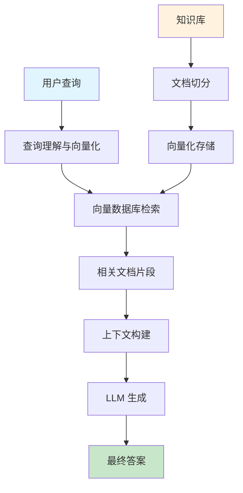
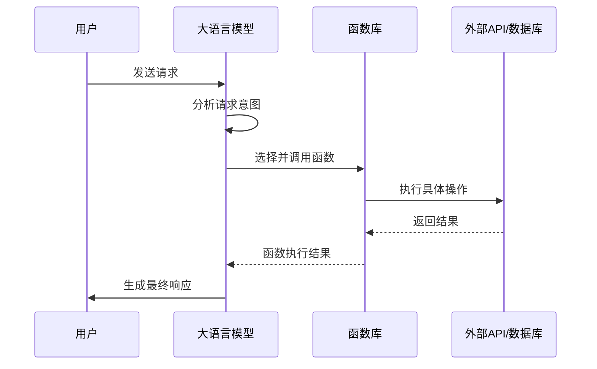
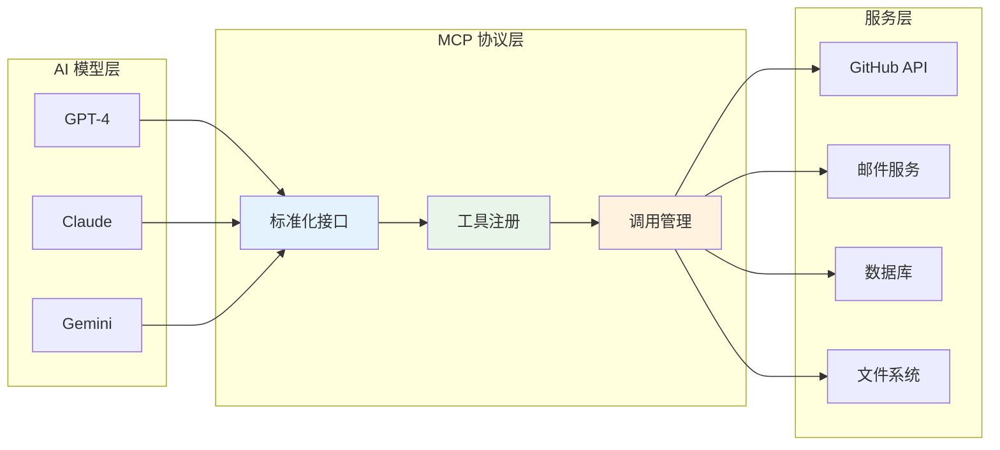
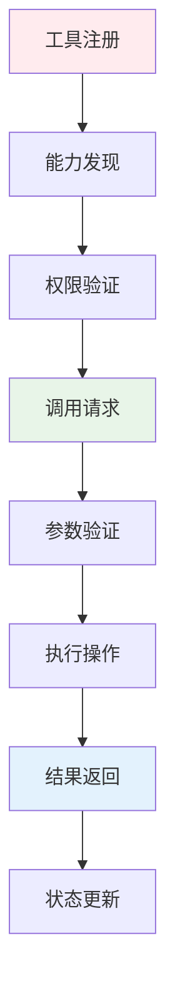
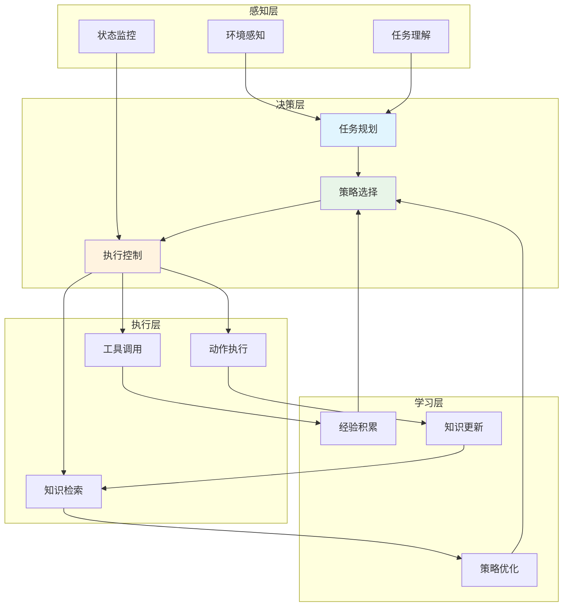
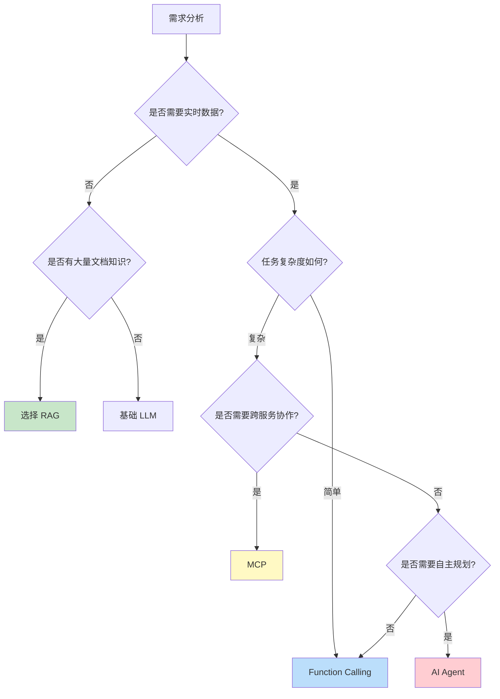
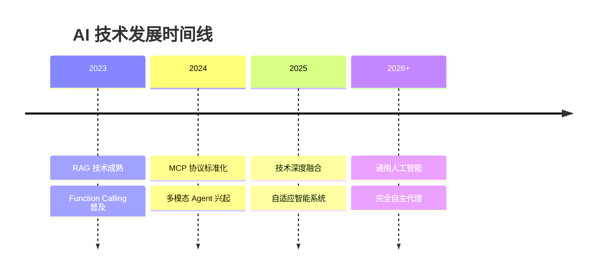

# AI 技术架构对比：RAG、Function Calling、MCP 与 AI Agent 深度解析

在人工智能快速发展的今天，各种技术架构层出不穷，每种技术都有其独特的应用场景和优势。本文将深入分析四种主流的 AI 技术架构：RAG（检索增强生成）、Function Calling（函数调用）、MCP（模型控制协议）和 AI Agent（智能代理），帮助开发者更好地理解和选择适合的技术方案。

## 概念对比一览

| 概念             | 本质               | 数据来源                | 适用场景                 | 典型应用                      |
| ---------------- | ------------------ | ----------------------- | ------------------------ | ----------------------------- |
| RAG              | 检索 + 生成        | 知识库 / 文档           | 专业问答、动态知识更新   | 企业知识库、客服机器人        |
| Function Calling | 调用外部函数       | API / 数据库            | 实时数据交互、自动化任务 | 天气查询、订单处理            |
| MCP              | 标准化工具调用协议 | 多平台服务（如 GitHub） | 跨模型、跨服务协作       | 智能工作流（如查天气+发邮件） |
| AI Agent         | 自主规划 + 执行    | 综合（RAG + 工具调用）  | 复杂任务自动化           | 个人助理                      |

## 1. RAG（检索增强生成）

### 核心原理

RAG 是一种将信息检索与文本生成相结合的技术架构。它通过检索相关文档片段来增强大语言模型的生成能力，解决了传统 LLM 知识更新滞后和幻觉问题。

### 技术架构

RAG 系统通常包含以下核心组件：

1. **文档预处理**：将原始文档切分成合适大小的块
2. **向量化存储**：使用 Embedding 模型将文档转换为向量
3. **检索系统**：基于相似度匹配找到相关文档
4. **生成模块**：结合检索结果生成最终答案

### 优势与局限

**优势：**

- 知识可实时更新，无需重新训练模型
- 减少模型幻觉，提高答案准确性
- 可追溯信息来源，增强可信度

**局限：**

- 依赖检索质量，可能遗漏重要信息
- 处理复杂推理任务能力有限
- 需要高质量的知识库维护

## 2. Function Calling（函数调用）

### Function Calling 核心原理

Function Calling 允许大语言模型在生成过程中调用预定义的外部函数，实现与外部系统的实时交互。这种技术使 AI 能够执行具体的操作，而不仅仅是生成文本。

### 实现机制

Function Calling 的实现通常包括：

1. **函数定义**：使用 JSON Schema 定义可调用函数
2. **意图识别**：模型判断何时需要调用函数
3. **参数提取**：从用户输入中提取函数参数
4. **结果整合**：将函数返回结果整合到最终回复中

### 典型应用场景

- **实时数据查询**：天气、股价、新闻等
- **系统操作**：文件管理、邮件发送、日程安排
- **业务流程**：订单处理、支付操作、库存管理

## 3. MCP（模型控制协议）

### 核心概念

MCP（Model Control Protocol）是一种标准化的工具调用协议，旨在实现不同 AI 模型与各种外部服务之间的无缝协作。它提供了统一的接口规范，使得工具调用更加标准化和可互操作。

### 协议特性

1. **标准化**：统一的工具描述和调用格式
2. **可扩展**：支持动态注册新工具和服务
3. **跨平台**：不同模型和服务间的互操作性
4. **安全性**：内置权限管理和安全控制

### 工作流程

## 4. AI Agent（智能代理）

### 架构设计

AI Agent 是最复杂的技术架构，它集成了 RAG、Function Calling 等多种技术，具备自主规划和执行复杂任务的能力。

### 核心能力

1. **自主规划**：将复杂任务分解为可执行的子任务
2. **动态调整**：根据执行结果调整策略
3. **多工具协作**：协调使用不同的工具和服务
4. **学习进化**：从执行经验中学习和改进

### 实现框架

常见的 AI Agent 框架包括：

- **ReAct**：推理-行动循环框架
- **AutoGPT**：自主任务执行系统
- **LangChain Agents**：工具链式代理
- **CrewAI**：多代理协作框架

## 技术选择指南

### 选择决策树

### 技术组合策略

在实际应用中，这些技术往往不是孤立使用的，而是根据具体需求进行组合：

1. **RAG + Function Calling**：知识问答 + 实时数据查询
2. **MCP + AI Agent**：标准化工具调用 + 智能任务规划
3. **全技术栈整合**：构建完整的智能助理系统

## 未来发展趋势

### 技术融合

### 发展方向

1. **更智能的检索**：语义理解能力持续提升
2. **更强的推理**：复杂任务规划和执行能力
3. **更好的协作**：多代理系统协同工作
4. **更高的效率**：资源优化和性能提升

## 总结

RAG、Function Calling、MCP 和 AI Agent 代表了当前 AI 技术发展的不同方向和层次。选择合适的技术架构需要综合考虑应用场景、技术复杂度、维护成本等多个因素。

随着技术的不断发展，我们可以预见这些技术将进一步融合，形成更加强大和智能的 AI 系统，为人类提供更好的智能服务体验。

---

_本文深入分析了四种主流 AI 技术架构，希望能为开发者在技术选型时提供有价值的参考。_
