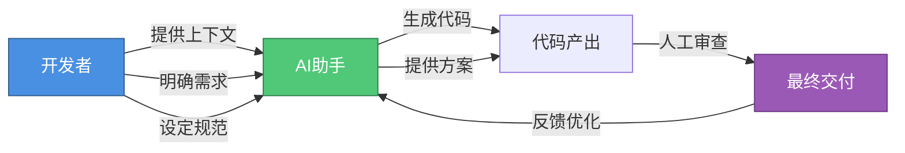
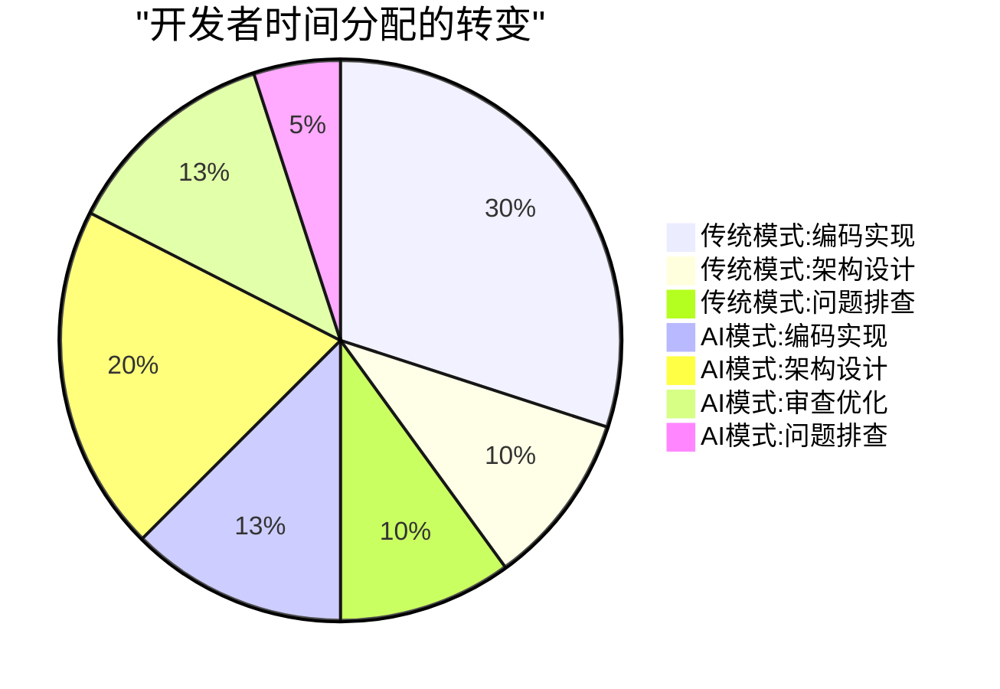
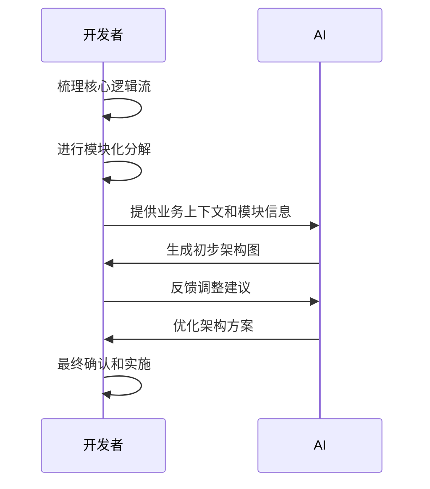
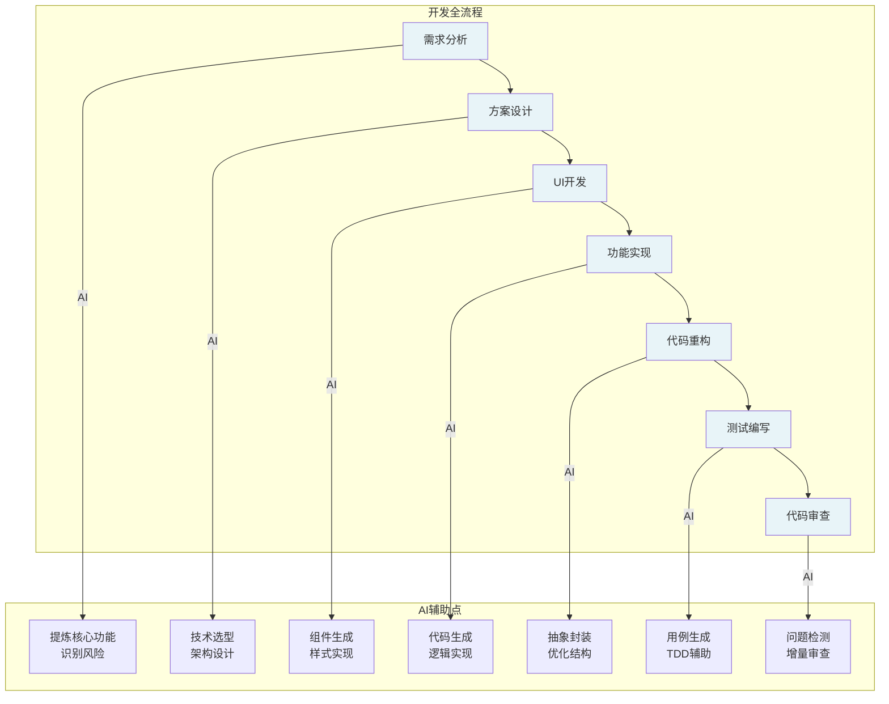
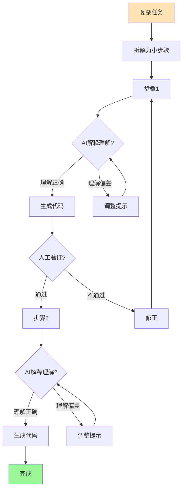
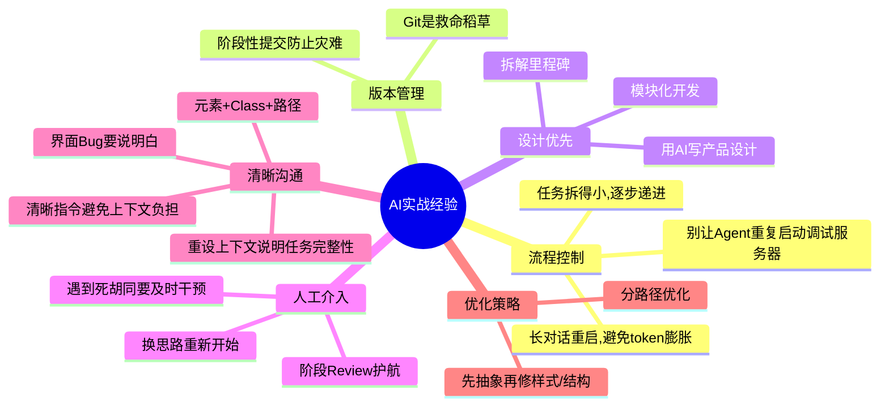

# AI 辅助编程实战指南:21%效率提升背后的方法论

## 引言

AI 技术的发展正在重塑软件开发领域,它不仅降低了对研发人员基础能力的要求门槛,更从另一个维度极大提升了研发人员的个人产能。在编码和问题排查方面表现尤为突出:借助 AI 可以快速生成基础代码框架,减少工作量和难度;在排查问题时,AI 能够提供诊断思路或直接指出潜在问题点。这让我们能将更多精力投入到更具创造性和复杂性的工作中,促进综合能力的整体提升。

本文将系统性地总结 AI 在实际项目中的应用经验,包括核心理念、实战技巧、协作策略以及未来展望。

## 核心理念:重新定义你与 AI 的关系

### 把 AI 当成"超级新人工程师"

最重要的心态转变是:**不要将 AI 视为万能的神,也不要当成无能的工具,而是把它看作一个能力极强但需要清晰指引的新人工程师。**



#### AI 需要"入职培训"

就像带新人一样,需要把项目的规范、代码风格、最佳实践等"领域知识"清晰地传达给它,它才能产出符合要求的代码。

#### AI 的最佳工作范围

标准化、重复性高、有明确规范的任务是其强项:

- 根据设计稿生成基础 UI 代码
- 编写重复的类型定义(TypeScript interfaces)
- 补全通用的无障碍(a11y)属性
- 生成模块的 API 文档和 Mock 数据
- 编写单元测试用例
- 代码重构与抽象

#### 人机协同的新开发模式



在 AI 时代,开发者的角色从"编码者"更多地转向"架构师"和"审查者",需要:

- 更好地定义需求和约束
- 更敏锐地识别和修正 AI 的偏差
- 更深入地思考系统的整体设计

## AI 在软件开发全流程的应用

### 1. 智能需求分析

**问题**: 传统方式阅读冗长的 PRD 文档耗时且易遗漏信息。

**解决方案**: 将文档输入 AI,让它快速提炼核心功能、识别潜在问题(如逻辑矛盾、实现风险等)。

**效果**: 将数小时的文档研读压缩到分钟级别。

**提示词参考**:

```text
当前功能如何运作,用户交互有哪些路径,具体数据流向是怎样的,请整理成 mermaid 时序图。
```

### 2. 辅助技术方案设计

**技术选型**: 让 AI 比较不同技术库的优劣(如社区活跃度、性能等),并提供选型建议。

**架构设计**: 采用迭代式流程:



**项目规范**: 设立 `.cursor/rules` 等目录存放技术栈说明、编码规范,确保 AI 生成的代码风格统一。

**提示词参考**:

```text
当前代码如何组织,核心模块有哪些,组件间如何通信,梳理组件关系图。

我们先探讨方案,在我让你写代码之前不要生成代码。
如果此处要加个 xxx 该怎么做,请先逐步分析需求。
在想明白后向我说明为什么要这么设计。
```

**协作工作流**:

在实际项目中,我们可以采用"规划阶段"和"行动阶段"分离的策略:


- **规划阶段(Ask 模式)**: 给出任务让 AI 反述,让 AI 给出多种方案及优劣,权衡并选择最佳方案拆解任务
- **行动阶段(Agent 模式)**: 使用@notepad 记录上下文,分步执行,分步验证
- **知识沉淀**: 将成功的方案和经验存储到 notepad 中,供后续使用

### 3. UI 开发自动化

**工作流**:

- 将页面拆解为原子化组件(如按钮、表单等)
- 逐个与 AI 对话实现(避免一次性生成整个页面)
- 迭代优化复杂组件

**技巧**:

- 提供结构化设计信息(如 Figma 导出的布局参数)
- 对于内部组件库,提供代码范例让 AI 参考

**注意**: AI 生成的代码必须经过人工审查。

### 4. 智能代码重构与抽象

**操作**: 选中重复代码,让 AI 将其封装为通用函数/组件。

**效果**: 以极低成本持续优化代码健康度。

### 5. 自动化测试用例编写

**一键生成**: 让 AI 用 Jest 等框架为代码生成单元测试。

**TDD 辅助**:

- 先让 AI 写测试用例(覆盖各种场景)
- 再让 AI 实现功能代码

**好处**: 避免 AI"幻觉"(生成错误逻辑),提升代码质量。

### 6. 代码质量与风险检测

**代码审查**: 让 AI 检查逻辑缺陷、性能瓶颈、体验问题等。

**增量审查**: 对比 Git 分支差异,审查变更中的潜在问题。

**提示词参考**:

```text
@git 逐个文件分析并总结改动点,评估是否引入了新的问题。

@git 基于代码变更输出自测用例清单。
```

**价值**: 解放开发者,让其更专注于业务逻辑和架构演进。



## 实战经验:对抗"AI 幻觉"的策略

AI 有时会"一本正经地胡说八道"(产生幻觉),这是最大风险。以下是经过验证的应对策略:

### 1. 拆解任务,步步为营

**不要把复杂任务一次性扔给 AI**。把它拆成多个清晰的、可验证的小步骤。

**关键步骤必须让 AI"说人话"**: 要求 AI 先解释"准备怎么做?理解了哪些要求?",确认无误后再让它执行代码生成。这能提前发现理解偏差。

**反向费曼学习法**:

采用反向提问的方式,确保 AI 真正理解你的需求:


1. 提出问题、目标
2. 请 AI 反述并提问疑问
3. AI 反述理解并提出疑问
4. 回答 AI 的问题,进一步明确需求
5. 循环迭代直到理解一致

这种方法能有效避免 AI 产生理解偏差,提高首次生成的准确率。



### 2. 优化你的"指令"(提示词工程)

**重要的事情说在前头**: AI 的注意力会衰减,把最核心的约束和要求(如"必须使用 React Hook"、"必须兼容 IE11")放在提示词的最前面。

**用例子代替抽象描述**: 说"请写得优雅一点"不如说"请参考 `src/utils/formatDate.ts` 里的代码风格"。

**提供具体的转换规则**:

在处理特定领域的代码转换时,提供详细的映射规则能大幅提升 AI 的准确性。例如,在将 XML 布局转换为 React 代码时:


这个示例展示了如何为 AI 提供清晰的标签映射规则:

- FrameLayout → div 标签
- LinearLayout → div 标签(根据 orientation 确定 flex-direction)
- TextView → div 标签(将 text 属性值作为 children)
- ImageView 等 → img 标签

通过这种方式,AI 能够精确理解转换规则,大幅减少错误率。

**喂给它"小块知识"**: 如果要把一篇很长的文档(如项目规范)交给 AI 处理,最好把它切成几个部分分批处理,效果比一次性喂给它一整本"书"要好。

### 3. 建立验证与反馈循环

**即时反馈**: 发现 AI 出错,立刻纠正它,并让它重新生成。这个过程也能帮助你优化自己的提示词。

**沉淀成功经验**: 把那些验证成功的、高效的提示词和操作流程保存下来,变成团队共享的"标准操作手册",以后类似任务就直接套用。

### 4. 善用工具特性

**强烈推荐使用 Cursor 的 Rule 功能**: 可以把项目的编码规范、技术选型等文档配置为项目级 Rule,这样 AI 在所有对话中都会优先遵守这些规则,生成代码的合规性大大提高。

### 5. 处理复杂组件的技巧

- 当 AI 因上下文不足而卡住时,通过多轮对话逐步给它补充信息,引导它完善代码
- 可以要求 AI 在关键位置添加清晰的日志和注释,方便后续调试和维护
- 让 AI 提供分层思路,考虑错误处理、性能边界等场景,而不仅仅是实现主干功能

### 6. 反哺知识库,形成良性循环

AI 生成的高质量代码、文档和类型定义,本身就可以补充到项目的知识库中。这样一来,AI 下次对项目的理解就更深了,能生成更准确的代码,形成一个越用越聪明的正向循环。

## 实战代码编写最佳实践

### 代码产出阶段的提示词策略

```text
在功能之外,留意识别边界场景以及控制影响面。

在写代码时遵循最小改动原则,避免影响原先的功能。

即使识别到历史问题也不要自行优化,可以先告知我问题描述和对当前需求的影响,不要直接改跟本次需求无关的代码。
```

### 功能验证阶段

梳理字段依赖的提示词:

```text
梳理当前表单字段的显隐关系、联动逻辑以及数据源。
```

## 十条黄金实战经验

基于实际项目经验,总结出以下 10 条核心经验:



### 1. 别让 Agent 重复启动调试服务器:控制调试流程

避免 AI 在每次对话中重复启动开发服务器,浪费时间。明确告知 AI 服务器状态,避免不必要的重启。

### 2. Git 是救命稻草:阶段性提交防止灾难

在每个关键节点进行 Git 提交,AI 生成的代码可能出错,频繁提交可以快速回滚,避免大量返工。

### 3. 设计先行:用 AI 写产品设计+拆里程碑

在编码前,先让 AI 帮助你完成产品设计和里程碑拆解,确保方向正确后再开始实施。

### 4. 模块化开发+阶段 Review:AI 驱动,人 Review 护航

将项目拆分为独立模块,每完成一个模块就进行人工 Review,确保质量可控。

### 5. 遇到死胡同要及时干预+换思路

当 AI 陷入错误的实现路径时,及时打断,换个角度重新描述需求,避免浪费时间。

### 6. 界面 Bug 要"说得明白":元素+Class+路径

报告界面问题时,提供具体的元素信息、CSS 类名和 DOM 路径,让 AI 能精准定位问题。

### 7. 任务拆得小:逐步递进比一次性全做强

小步快跑,每个任务聚焦一个小目标,验证通过后再进行下一步,避免一次性任务过大导致失败。

### 8. 分路径优化:先抽象再修样式/结构

代码优化时,先处理逻辑抽象,再处理样式和结构,分步进行更容易控制质量。

### 9. 清晰指令避免上次对话负担:重设上下文/说明任务完整性

每次对话开始时,清晰说明当前任务,避免 AI 受之前对话的干扰,必要时重新设置上下文。

### 10. 长对话重启+限制 token 膨胀

当对话轮次过多、上下文过长时,及时开启新对话,避免 token 消耗过大和 AI 理解偏差。

## 项目实战总结:21%效率提升的背后

### 成果数据

通过系统化引入 Cursor 作为 AI 辅助编程工具,我们在会员系统前端开发中取得了显著成效:**整体工作效率提升达 21%**,验证了 AI 技术在实际业务场景中提质增效的潜力。

### AI 表现突出的场景

在多个典型实践场景中,AI 展现出突出能力:

- ✅ 生成页面路由
- ✅ 构建 DOM 结构
- ✅ 生成 Mock 数据与类型定义
- ✅ 优化代码结构
- ✅ 保障代码风格一致性
- ✅ 提升可维护性

这些能力大幅降低了重复性、规范化工作的开发成本。

### AI 的局限性

实践也表明,AI 并非万能。在以下场景中存在明显局限:

- ❌ 复杂交互逻辑
- ❌ 动效实现
- ❌ 深度定制组件样式
- ❌ 接口联调与边界处理
- ❌ 强上下文关联任务
- ❌ 高业务耦合的功能

在这些场景中,AI 生成结果存在准确率低、逻辑冗余甚至错误的问题,需要严格的人工审查与修正,某些情况下人工实现效率更高。

### 核心结论

**AI 适合作为"高级代码助手",而非"替代开发者"的工具。**

其真正价值在于释放开发者对重复性、低创造性工作的投入,使其更专注于架构设计、复杂逻辑与用户体验优化等高层级任务。

**如何用好 AI 辅助编程工具,归根结底就是一个词——Prompt。**

## 未来展望:拥抱 AI 时代,走在技术变革前沿

随着生成式 AI 持续渗透至研发流程,我们正站在一场软件开发范式变革的起点。AI 编程不再是遥远的概念,而已成为提升效能、加速创新、重构工作流的核心推动力。

### 1. 人机协同的开发新模式将成为主流

单纯编码实现的重要性逐渐下降,而以下能力变得愈发关键:

- 架构判断
- 提示词设计
- 逻辑校验
- 系统优化

开发者需逐渐转型为"AI 调度者",善于将业务问题转化为机器可理解、可执行的指令,并对输出结果进行高效审查与迭代。

### 2. 上下文构建与知识沉淀成为团队核心资产

AI 生成质量极度依赖上下文。建立规范化的需求描述、接口文档、组件示例、设计标注等输入标准,将显著提升 AI 辅助的准确率。

团队应系统性建设高质量上下文知识库,形成可复用的 AI 协同工作流。

### 3. 适应强 AI 辅助的研发流程重构

从需求拆分、任务分配、代码审查到质量保障,传统研发流程需针对 AI 特性进行优化:

- 更强调任务描述的清晰性
- 设立 AI 生成代码的审查 checklist
- 建立"AI-first"的组件抽象和接口设计规范

### 4. 以 AI 为杠杆,聚焦更高价值创新

当基础代码实现效率大幅提升,团队应更多投入在用户体验、性能优化、业务创新等具有不可替代性的领域。

**AI 不应仅仅用来"做更快的事",更应助力我们"做更有价值的事"。**

## 结语

这种模式改变了我们的工作方式。开发者的角色从"编码者"更多地转向了"架构师"和"审查者",我们需要:

- 更好地定义需求和约束
- 更敏锐地识别和修正 AI 的偏差
- 更深入地思考系统的整体设计

能否主动拥抱并善用 AI 工具,将直接决定我们在未来行业中的竞争力和话语权。让我们一起拥抱这个 AI 时代,在技术变革中走在前沿!
