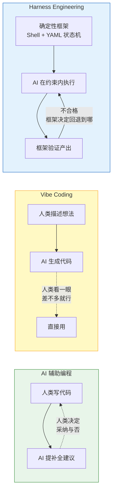
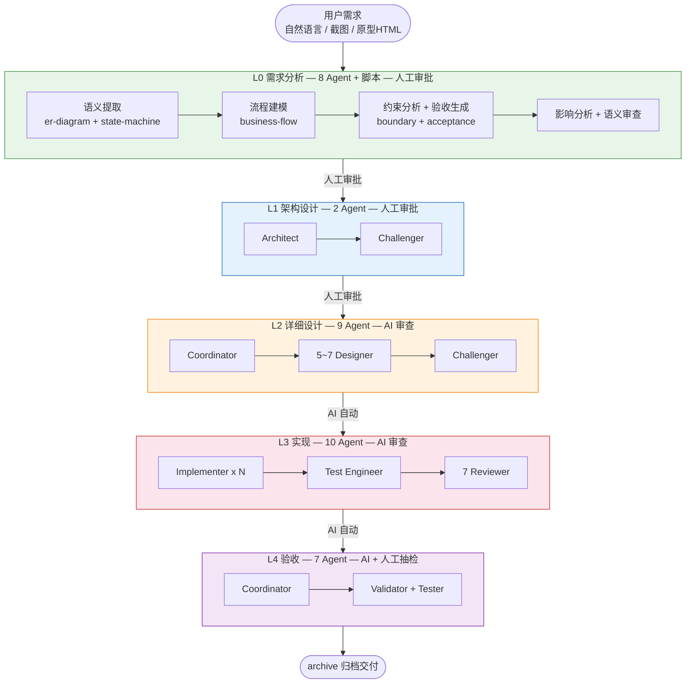
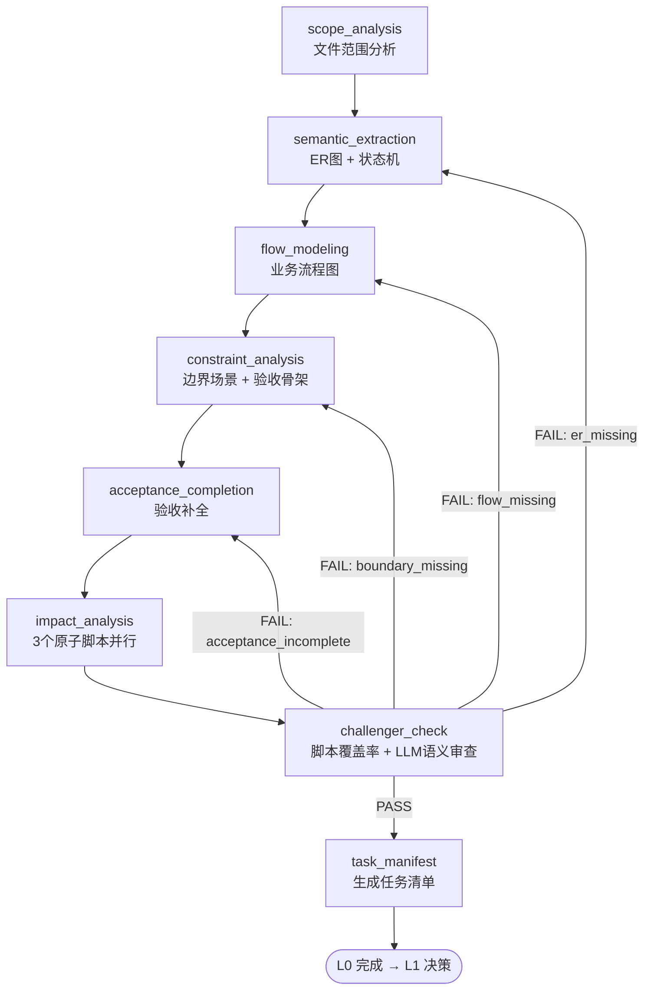
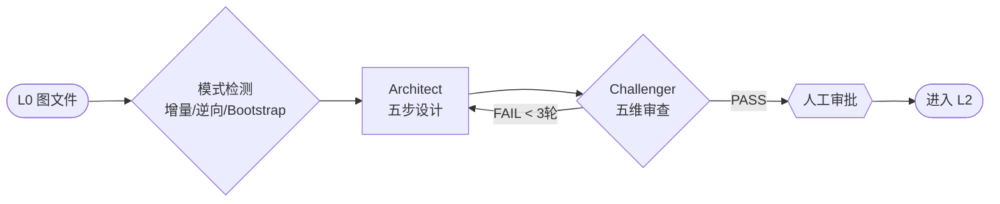
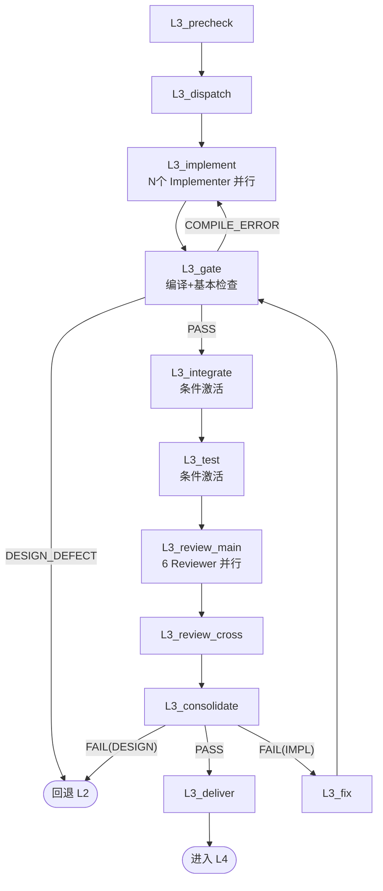
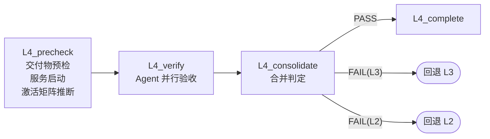
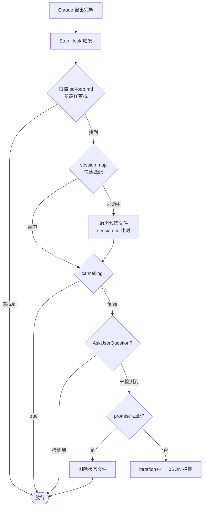
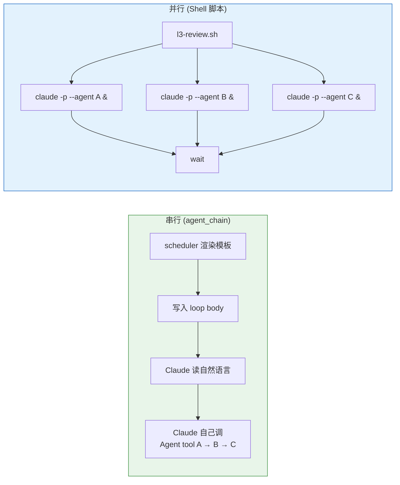
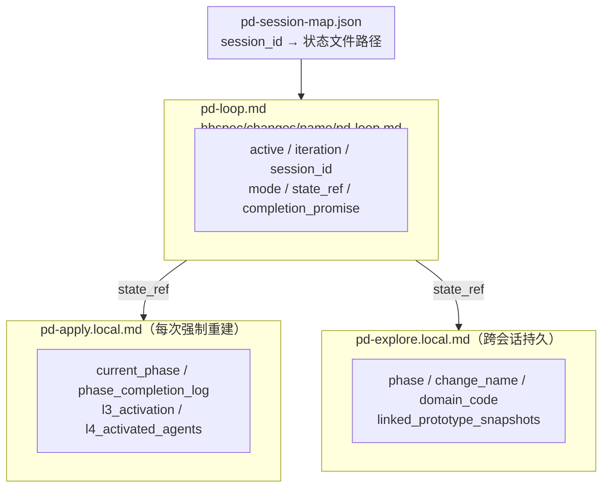

# PD 插件深度解析：业务流程与技术原理

> PD（Product Development）是一个运行在 Claude 上的 AI 驱动软件开发流水线插件。它把"从需求到交付"拆成 5 层（L0~L4），用 **37 个 AI Agent** 自动完成需求分析、架构设计、详细设计、编码实现和最终验收。
>
> 本文档基于 PD 插件 **v2.0.54** 源码逐文件分析整理。

---

## 零、PD 的本质：Harness Engineering

在理解 PD 的五层流水线和技术细节之前，先搞清楚一个根本问题：**PD 到底是什么类型的工程实践？**

### 三种 AI 编程范式对比

目前 AI 参与软件开发，主要有三种模式：



| | AI 辅助编程 | Vibe Coding | Harness Engineering (PD) |
|--|-----------|-------------|--------------------------|
| **典型工具** | GitHub Copilot、Cursor Tab | ChatGPT 对话、Cursor Composer | PD 插件 |
| **谁做决策** | 人类 | AI，人类验收 | 确定性框架（Shell + YAML 状态机） |
| **AI 角色** | 打字员，帮你补全 | 全栈实习生，你说它做 | 流水线工人，在约束框架内执行 |
| **质量保证** | 人类 Code Review | 人类看一眼/跑一下 | 37 个 Agent 七维交叉审查 |
| **出错后** | 人类自己修 | 告诉 AI "这不对，改一下" | 框架按 issue_type 精准回退到最小修复点 |
| **可追溯性** | 无 | 无 | 每行代码追溯到约束 ID |
| **适用规模** | 任意，单人为主 | 原型/小项目 | 中大型项目，团队工程 |

### Harness Engineering 是什么

一句话：**不是让 AI 更聪明，而是给 AI 套上缰绳（Harness），让它在可控的框架内可靠地产出。**

```text
传统思路：  让 AI 更强 → 希望它自己做对
Harness：  承认 AI 会犯错 → 用工程框架兜住它
```

PD 的 Harness 体现在 7 个层面：

| Harness 层面 | PD 中的实现 | 解决什么问题 |
|-------------|-----------|-------------|
| **确定性编排** | Shell 状态机决定"下一步做什么" | AI 不会迷路、跳步 |
| **约束注入** | 每个 Agent 启动时强制加载 prohibition + evidence-rules | AI 不会自由发挥 |
| **对抗验证** | 设计者和审查者永远是不同 Agent 实例（独立上下文） | AI 不会自我欺骗 |
| **有限迭代** | 3 轮上限 + promise 标签 | AI 不会无限循环 |
| **可追溯产出** | Traceability Map 强制每行代码→约束 ID | 知道 AI 为什么写这行代码 |
| **精准回退** | 按 issue_type 路由到最小修复点 | 不做无用功 |
| **反作弊** | "Do NOT output false statements to exit the loop" | AI 不会撒谎退出 |

### 一个具体例子

假设需求是"给用户管理模块加个删除功能"：

**Vibe Coding 做法：**
```text
你：帮我加个用户删除接口
AI：好的，这是代码...（一次性生成）
你：看着还行，部署吧
```

**PD 做法：**
```text
L0：从原型中提取 er-diagram.yml（用户实体有哪些字段）
    → state-machine.yml（用户状态流转：active→deleted 是否可逆？）
    → boundary-scenarios.yml（已有订单的用户能删吗？管理员删自己呢？）
    → acceptance.yml（6 个验收场景，含边界）
    → 人工确认

L1：设计 DELETE /api/users/{id} 接口契约 + 软删除策略 + 错误码
    → Challenger 审查：级联影响考虑了吗？→ 修订 → 人工确认

L2：伪代码级详设（入参验证 5 条规则 + 业务逻辑 8 个步骤 + 错误映射表）
    → Challenger AI 审查通过

L3：Implementer 逐条对照 L2 编码 → Test Engineer 写 12 个测试
    → 6 个 Reviewer 并行审查（功能/架构/安全/性能/规范/代码质量）
    → Security Reviewer 发现：userId 没做权限校验 → BLOCKING → 修复

L4：Validator 验收 → 全部 PASS → 归档
```

**区别的本质：** Vibe Coding 信任 AI 一次做对；PD 假设 AI 会犯错，用框架层层兜住。

### 为什么叫"Harness"而不是"Framework"

Framework 是被动的——提供工具，等你来用。Harness 是主动的——**套在 AI 身上，限制它的行为边界，驱使它按确定路径前进**。就像马的缰绳：马有跑的能力（AI 有写代码的能力），缰绳决定往哪跑、什么时候停（状态机决定执行什么、何时回退）。

PD 的 Stop Hook + YAML 状态机 + 37 份 Agent 角色剧本，就是这副缰绳。

---

## 一、全局架构



**核心原则：**

| 原则 | 说明 |
|------|------|
| 粒度递进 | L0 图文件(YAML) → L1 接口签名 → L2 伪代码 → L3 真实代码 |
| 对抗审查 | 每层都有 Challenger/Reviewer，设计者和审查者分离 |
| 3轮上限 | 所有审查最多迭代3轮，超限升级人工或回退上游（可通过 `pd-config.yml` 覆盖） |
| 只阻塞 BLOCKING | WARNING/INFO 记录但不阻塞流程 |
| 三层验证 | 每项产出物必须通过「存在性 → 正确性 → 完整性」三层验证 |

**Agent 统计：**

| 层级 | Agent 数 | 说明 |
|------|---------|------|
| L0 | 8 | semantic_extractor, flow_modeler, constraint_analyzer, acceptance_generator, impact_coordinator, scope_analyzer, semantic_reviewer, feature_expander |
| L1 | 2 | architect, challenger |
| L2 | 9 | coordinator, api/data/error/test/compliance designer, frontend/ui_test designer, challenger |
| L3 | 10 | implementer, test_engineer, integration_checker, 7 reviewer |
| L4 | 7 | coordinator, validator, ui_verifier, security_tester, performance_tester, ui_test_generator, prototype_fidelity_checker |
| 跨层 | 1 | completeness_reviewer（深度完整性语义审查，由脚本自动调用） |

---

## 二、L0 需求分析层

**目标：** 把用户的模糊想法变成**结构化图文件**（极简 YAML 格式），而非传统的自然语言需求文档。用结构化数据替代模糊的自然语言，让下游 Agent 有明确的、可机器解析的输入——这本身就是 Harness 思想的体现。

**8 个 Agent：**

| Agent | 职责 |
|-------|------|
| **l0_scope_analyzer** | 分析前端目录结构，识别多门户边界，确定变更相关文件范围 |
| **l0_semantic_extractor** | 从原型HTML + field-inventory 自动提取 `er-diagram.yml` + `state-machine.yml` |
| **l0_flow_modeler** | 基于 ER 图和状态机推断 `business-flow.yml` |
| **l0_constraint_analyzer** | 从图文件自动推导 `boundary-scenarios.yml`（7大边界类别） |
| **l0_acceptance_generator** | 生成 `acceptance.yml`（可执行验收场景，ctx/act/expect 格式） |
| **l0_impact_coordinator** | 调度3个并行原子脚本分析变更涟漪效应，合并为 `impact.yml` |
| **l0_semantic_reviewer** | 语义层面审查（一致性+可验收性） |
| **l0_feature_expander** | 六维度功能扩展 |

**Explore Phase 3 流水线（12 阶段）：**



**定向修复路由**——审查失败后根据 `issue_type` **精准回退到最小修复点**，而非笼统重做。错误恢复策略由框架决定，不交给 AI 判断。

**产出物：** `er-diagram.yml`、`state-machine.yml`、`business-flow.yml`、`boundary-scenarios.yml`、`acceptance.yml`、`impact.yml`、`task-manifest.yml`、`scope-manifest.yml`，以及对应的 `.mmd` Mermaid 可视化文件。

---

## 三、L1 架构设计层

**目标：** 把需求转化为可实施的系统架构蓝图。采用**单一 Architect**（不按前后端拆分），确保全系统一致性。

| Agent | 职责 |
|-------|------|
| **l1_architect** | 领域模型 + OpenAPI 契约 + 数据流 + 错误策略 + DB 设计（禁止外键） |
| **l1_challenger** | 五维对抗：一致性 + 完整性 + 可实现性 + 演进性 + 规范符合性 |

**三种工作模式：** 增量（已有代码库）、逆向（有代码无文档）、Bootstrap（全新项目）。



**Architect 五步：** ① 领域建模 → ② 接口契约 (OpenAPI 3.0) → ③ 数据流 → ④ 错误策略 → ⑤ 数据库设计

---

## 四、L2 详细设计层

**目标：** 细化为"照着就能写代码"的伪代码级详设。

| Agent | 条件 |
|-------|------|
| **l2_design_coordinator** | 始终 — 分派、汇总、冲突检测 |
| **l2_api_designer** | 4+ 端点 — 入参验证 + 业务逻辑 + 出参构造 + 错误码映射 |
| **l2_data_designer** | 4+ 端点 — Repository 方法 + DTO 映射 + 查询优化 + 事务边界 |
| **l2_error_designer** | 4+ 端点 — 异常分类 + 传播路径 + 降级/重试/熔断 |
| **l2_test_designer** | 4+ 端点 — 多层测试骨架 |
| **l2_compliance_designer** | 有 COMPLIANCE 需求 — 扫描代码库对比规范，产出逐文件重构清单 |
| **l2_frontend_designer** | 有 UI — 组件树 + 状态管理 + 路由 |
| **l2_ui_test_designer** | 有 UI — 视觉基线 + 交互路径 + 字段断言 |
| **l2_challenger** | 始终 — 五维审查（AI 自动，无需人工） |

**统一编号：** `VAL-NNN`（验证）、`RM-NNN`（Repository）、`MAP-NNN`（DTO映射）、`COMP-NNN`（组件）等，确保 L0→L2 全链路可追溯。

---

## 五、L3 实现层

**目标：** 把伪代码变成可运行代码，并通过七维审查。

L3 的编排由 `apply.md` **Sub-Phase 机制**直接驱动——确定性的 Shell 状态机控制流程，AI 只在每个节点内执行。

**10 个活跃 Agent：**

| 类型 | Agent | 职责 |
|------|-------|------|
| 实现 | **l3_implementer** x N | 按实现单元并行编码，逐条对照 L2 设计，禁止自由发挥 |
| 测试 | **l3_test_engineer** | 编写多层测试（禁止 Mock，使用真实实例） |
| 集成 | **l3_integration_checker** | 多 Implementer 时检查跨单元一致性（条件激活） |
| 合规审查 | **functional / architectural / spec_compliance** reviewer | L0 验收标准实现了？L1 边界遵守了？specs 规范符合了？ |
| 工艺审查 | **code / security / performance** reviewer | 逻辑错误？安全漏洞？性能陷阱？ |
| 跨切面 | **l3_cross_module_reviewer** | 重复逻辑可提取？模式可反哺 specs/？ |



Implementer 的核心身份约束写在 Agent 定义第一行——"你是实现者，逐条对照 L2 设计实现，**不允许自由发挥**"。发现设计不可行时不能自行变通，必须通过回退通道反馈。AI 有自由发挥的能力，但 Harness 不允许。

**冲突仲裁：** 安全 > 功能 > 架构 > 性能 > 质量；合规层 > 工艺层。

---

## 六、L4 验收层

**目标：** 最终交付验收。



| Agent | 激活条件 |
|-------|----------|
| **l4_coordinator** | 始终 |
| **l4_validator** | 始终 |
| **l4_ui_verifier** | 有 UI |
| **l4_security_tester** | 功能/混合 |
| **l4_performance_tester** | 技术优化/混合 |
| **l4_ui_test_generator** | 有 UI |
| **l4_prototype_fidelity_checker** | 有原型快照 |

L4 通过后输出完成摘要，提示用户运行 `/pd:archive`。**禁止自动归档**——关键操作必须人类显式触发。

---

## 七、技术底座

### 7.1 循环引擎（Stop Hook）

**本质：在 Claude 每次想退出时拦住它，喂入下一轮任务。** 没有它，AI 干完一轮就走了，不会自动推进到下一阶段。这是整个 Harness 最核心的机制。



**关键技术点：**

- **状态文件按变更隔离**：`hhspec/changes/<name>/pd-loop.md`，支持多变更并行
- **Session Map 加速**：`hhspec/pd-session-map.json`，O(1) 定位状态文件
- **Stale 回收**：会话崩溃后重启，自动回收唯一活跃循环绑定到新会话
- **JSON reason 防泄漏**：不嵌入完整 prompt，只写"读取指令"让 Claude 自己去读状态文件

---

### 7.2 状态机与调度器

**本质：一张 YAML 地铁线路图 + 一个 Bash 调度员。**

`apply-phases.yml` 定义约 22 个阶段节点，`explore-phases.yml` 定义 12 个阶段。调度器 `pd-scheduler.sh` 按类型分发：

| phase type | 行为 |
|-----------|------|
| `auto_script` | 执行 Shell 脚本（可链式跳转） |
| `agent_chain` | 渲染模板 → Claude 自己调 Agent |
| `parallel_agents` | Shell 启多个 claude 子进程 |
| `agent_single` / `agent_parallel` | 单/多 Agent 调用 |
| `script_parallel` | 多脚本并行 + merge |
| `hybrid` | 脚本 + LLM 混合执行（先脚本做覆盖率检查，再 LLM 做语义审查） |
| `interactive` | 等用户交互 |

---

### 7.3 Agent 定义与调用

每个 Agent 是 `agents/` 下的 `.md` 文件（YAML frontmatter + Markdown 正文）。调用时 Claude 使用内置 `Agent` tool，每个 Agent 以独立子进程运行。

---

### 7.4 串行 vs 并行的真相

**两种完全不同的技术实现：**



| | 串行 | 并行 |
|--|------|------|
| 谁控制 | Claude 自己 | Shell 脚本 |
| 调用方式 | 自然语言 → Agent tool | `claude -p --agent` CLI |
| 并发控制 | 无 | `&` + `wait` + `max_concurrency` |

---

### 7.5 状态文件体系

状态文件按变更隔离，支持多变更并行。



---

### 7.6~7.14 其他技术机制

| 机制 | 要点 |
|------|------|
| **原子锁** | `mkdir` 互斥锁。Stop Hook 拿不到锁直接跳过；Scheduler 重试一次 |
| **会话隔离** | `session_id` 比对 + Session Map 加速 + Stale 回收 |
| **嵌套循环** | `state_ref` 指向内层文件，存在则外层暂停 |
| **Promise 完成检测** | `<promise>TEXT</promise>` 标签精确匹配 |
| **用户阻塞** | 检测 `AskUserQuestion` → 直接 `exit 0`（不设 waiting_for_user） |
| **技术栈检测** | `tech-detection-rules.yml` 文件触发 → `tech-profile.yml` |
| **规范加载** | 5层：common → 层级通用 → 角色基线 → 角色特定 → 技术栈 |
| **产出物检查 (BC-007)** | 同会话内跳过已完成阶段（非跨会话断点续传） |
| **取消** | `/pd:cancel-loop`（优雅）/ 删状态文件（直接）/ Ctrl+C（暴力） |

---

## 八、产出物目录结构

```text
hhspec/
├── domains.yml
├── pd-config.yml                    # 可选：覆盖流水线默认值
├── pd-session-map.json              # session → 状态文件映射
├── specs/                           # 基线规范库
│   ├── requirements/
│   ├── architecture/
│   └── design/
├── changes/                         # 活跃变更
│   └── <change-name>/
│       ├── pd-loop.md               # 循环引擎（按变更隔离）
│       ├── pd-explore.local.md      # 探索状态（跨会话持久）
│       ├── pd-apply.local.md        # 流水线状态（每次重建）
│       ├── er-diagram.yml           # L0 图文件产出
│       ├── state-machine.yml
│       ├── business-flow.yml
│       ├── boundary-scenarios.yml
│       ├── acceptance.yml
│       ├── impact.yml
│       ├── task-manifest.yml
│       ├── scope-manifest.yml
│       ├── *.mmd                    # Mermaid 可视化
│       ├── specs/                   # staging 暂存区
│       ├── l3-state/
│       ├── .apply-history/
│       └── reviews/
└── prototype/                       # UI 原型文件
```

---

## 九、命令体系

| 命令 | 作用 |
|------|------|
| `/pd:init` | 创建 `CLAUDE.md` + `hhspec/` 目录结构 |
| `/pd:explore` | 交互式需求探索（L0 图文件 + L1 决策） |
| `/pd:apply` | 自动执行 L1.2→L4 完整流水线 |
| `/pd:verify` | 独立测试验证，不改代码不做审查 |
| `/pd:archive` | 将完成的变更合并回 specs/ 基线 |
| `/pd:prototype` | UI 原型设计 + 功能扩展 |
| `/pd:loop` | 通用循环引擎 |
| `/pd:cancel-loop` | 取消活跃循环 |
| `/pd:learn` | 从技能库学习创建新 Agent |

---

## 十、其他能力

### 10.1 设计风格库

`lib/styles/design-md/` 下内置 **58 个品牌设计风格**（Stripe、Vercel、Apple、Tesla、Spotify 等），每个含 DESIGN.md + preview.html。用于原型设计时快速应用品牌风格。

### 10.2 深度完整性审查

跨层 Agent `completeness_reviewer`，由 `completeness-scan.sh` 自动调用：
- **L2 模式**：检查设计文件是否语义层面覆盖 OpenAPI 所有端点
- **L3 模式**：检查实现是否实质性地实现了设计定义的业务逻辑（非骨架/stub）

### 10.3 条件激活机制

`apply-phases.yml` 支持 `activation_field` 字段，L3_integrate、L3_test 等阶段可根据 `activation-matrix.yml` 动态决定是否执行，避免不必要的阶段。

### 10.4 原型转 pnpm 工程

`scripts/prototype-to-pnpm/` 工具集，支持将原型 HTML 转换为 pnpm 工程，含依赖检测、端口分配、Playwright 对比、Git 工作流等。
