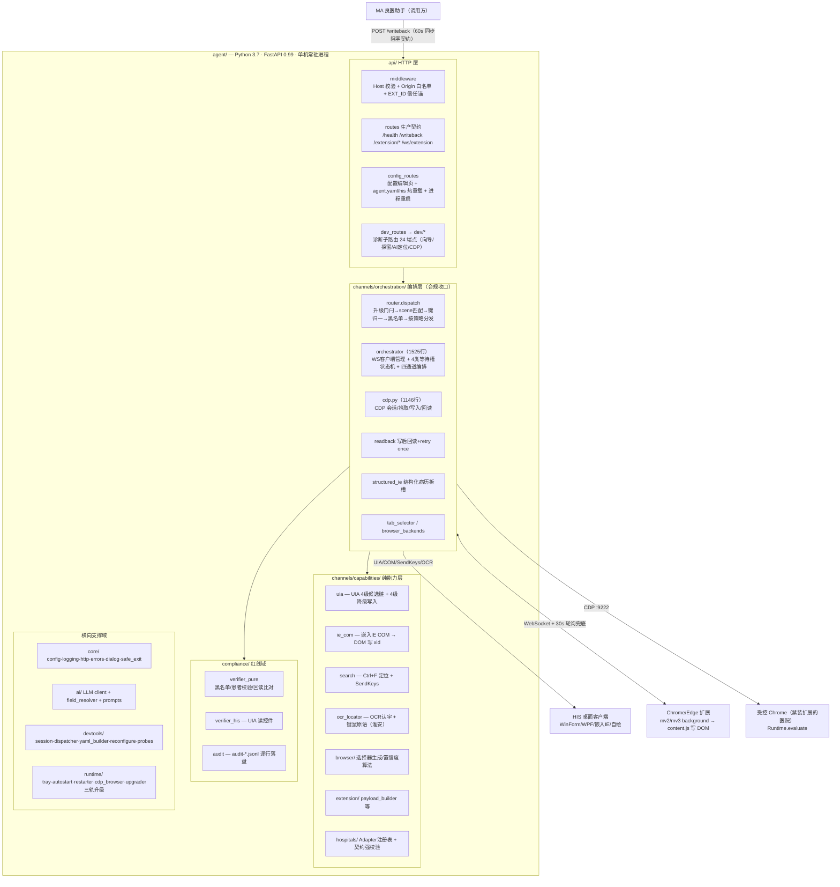
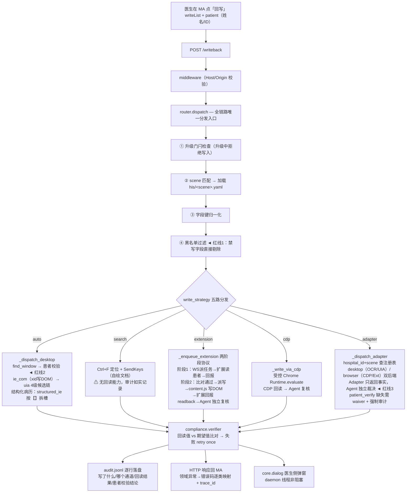
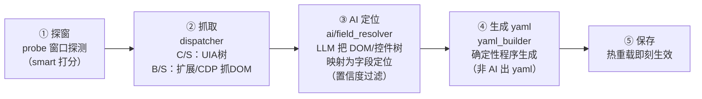

# RPA Agent 架构全景与业务逻辑学习指南

> 2026-07-20 | 面向学习者的项目全景文档
> 依据：同日《架构深度分析与重构方案》（源码 100% 覆盖 + 行号级证据）与已亲验的架构断言整理，均为现状事实，不含历史档案推测。
> 阅读对象：需要快速建立本项目技术 + 业务全貌的工程师。

---

## 0. 一句话定位

**医生在 MA（良医助手）写完病历 → 点"回写" → 本项目（单机 Windows 常驻 Agent）把内容安全写入第三方 HIS 系统**，全部合规裁决（黑名单 → 患者校验 → 写入 + 回读比对 + 重试 → 审计落盘）集中在 Agent 收口。

本质是一个**医疗场景的单机 RPA 执行器**，不是集群调度平台。

---

## 1. 技术架构全景图（分层 + 部署视角）



**依赖红线（`tests/test_architecture.py` AST 断言守护，改坏即测试红）**：

- `capabilities` 不依赖 `orchestration` / `compliance`（纯能力层）
- `compliance` 不依赖 `channels`（红线域独立）
- 共 7 条 AST 断言

### 关键技术事实

| 维度 | 现状 |
|---|---|
| 运行时 | Python 3.7（禁 `list[str]`/`X\|None` 运行时注解），Windows 生产 / 跨平台可测 |
| Web 框架 | FastAPI 0.99 + uvicorn，**同步路由为主**，仅 WS 异步 |
| 线程模型 | uvicorn 线程池跑同步路由；`threading.Event` 等待槽做扩展回报的同步等待；daemon 线程跑托盘/升级/弹窗 |
| 依赖注入 | `main.py` 的 `_DEPS` dict（对象引用，热重载靠原地替换）；⚠ `router.py` 有 4 处 `from main import AGENT_CFG` 反向依赖 |
| 配置体系 | `agent.yaml`（PC 级）+ `configs/his/*.yaml`（场景级，**文件名=scene 强绑定**，向导生成，启动扫描 + 热重载） |
| 升级 | 三轨：exe（manifest+sha）/ configs.zip（ETag）/ extension zip；轮询 + 升级门闩（与 `orchestrator.is_busy` 联动） |
| 审计 | `audit-YYYY-MM-DD.jsonl` 逐行落盘，独立于普通日志流 |
| 日志 | loguru 按天滚动 + stdlib 拦截桥；领域异常（`_contract.py` 4 类）→ routes 逐类映射错误码；全局兜底 handler 带 trace_id |

### 目录职责速查

```
rpa/
├── agent/                  Python 主源码
│   ├── main.py             入口：CLI + 配置加载 + FastAPI 装配 + 托盘/升级启动（import 即副作用）
│   ├── api/                HTTP 层（routes 生产契约 / config_routes / dev/* 诊断 24 端点）
│   ├── channels/
│   │   ├── capabilities/   纯能力层：uia / ie_com / search / ocr_locator / browser / extension / hospitals
│   │   └── orchestration/  编排层：router / orchestrator / cdp / readback / structured_ie
│   ├── compliance/         合规红线：verifier_pure / verifier_his / audit
│   ├── core/               基础设施（无向上依赖）
│   ├── ai/                 LLM 定位：client / field_resolver / prompts
│   ├── devtools/           接入诊断：session / dispatcher / yaml_builder / reconfigure / probes（7 探针）
│   ├── runtime/            工程化：tray / autostart / restarter / cdp_browser / upgrader（三轨升级）
│   └── configs/            agent.yaml + his/*.yaml（向导生成）
├── extension/              浏览器扩展：shared/content.js（唯一来源）+ mv2/mv3 background
├── scripts/                gen_manifest / assemble_extension / 语法门禁
├── mocks/                  本地联调三件套：caller（模拟 MA）/ mock_his / web
├── tests/                  85 个测试文件，镜像源码结构；test_architecture.py 7 条 AST 红线
└── logs/devtools/sessions/ 诊断会话产物
```

---

## 2. 业务逻辑架构图（生产回写主链路）

这是整个项目的心脏，一次回写的完整决策流：



### 场景 × 通道矩阵（业务决策表，理解项目的钥匙）

| HIS 形态 | write_strategy | 写入手段 | 校验读取 |
|---|---|---|---|
| 桌面 WinForm/WPF/嵌入 IE | `auto` | IE COM xid → UIA 4级候选链 | UIA 控件 / IE xid 回读 |
| 结构化病历引擎 | `auto` + ordered_slots/raw | 按顶层【】拆槽写 innerText | innerText 回读 |
| 自绘文档（博思等） | `search` | Ctrl+F 定位 + SendKeys | **无回读**（能力限制，审计记实） |
| B/S 网页（可装扩展） | `extension` | 扩展 content.js 写 DOM | 扩展 readback + Agent 复核 |
| B/S 网页（禁装扩展） | `cdp` | 受控 Chrome Runtime.evaluate | CDP 回读 + Agent 复核 |
| 通用手段全失效的医院 | `adapter` | 医院定制 Adapter（如淮安=OCR+键鼠） | Adapter 返回事实，Agent 裁决 |

**设计哲学**：通道能力可以千差万别（有的能回读有的不能），但**合规裁决权永远不下放**——扩展/CDP/Adapter 都只是"手"，患者校验与回读比对的"脑"在 Agent 的 compliance 层。这是与竞品最本质的差异，也是医学责任链设计。

---

## 3. 辅助业务流（第二条业务主线：接入新医院）

新医院接入分"零代码"和"定制"两条路线：

### 路线 A：通用场景（零代码）— 接入诊断向导（托盘入口，5 步）



- **已配医院修改**：/config 配置页 → 回向导 → 采集驱动合并（`reconfigure.py`：采到才覆盖/跳过保留，ruamel 保注释，事务回滚）。
- **③④分工是关键决策**：AI 只做"采集与定位"（层A），yaml 生成是确定性程序（层B）——AI 不直接产 yaml，杜绝幻觉配置；缺采集的字段生成纯 TODO 注释而非猜测值。

### 路线 B：定制场景（写代码）— hospitals/ Adapter

- 显式注册（registry）+ 契约强校验 + `adapt-hospital` SOP skill。
- 例：`huaian.py` = OCR 认字 + 粉块检测 + 键鼠原语（自绘控件无 API）。
- **红线**：`write_strategy=adapter` 时 `patient_verify` 必须配置；豁免需 waiver 字段且启动校验拦截 + 审计留痕。

---

## 4. 浏览器扩展子系统（唯一的非 Python 部分）

```
extension/
├── shared/content.js (1529行)  唯一来源，mv2/mv3 字节级共用
│     页面侧：DOM 读患者 / 写字段 / readback / 交互拾取（pick_field）
├── mv2/background.js (974行) ┐ 85-90% 业务等价，异步范式不同
├── mv3/background.js (914行) ┘ （callback vs Promise），双写并行维护
└── 与 Agent 通信：WS 长连（/ws/extension）+ 30s 轮询兜底
```

三个必须知道的坑：

1. **pick_field 三跳协议**：content → background → orchestrator，改协议必须三处同步，别漏 background.js 中继。
2. **MV3 onMessage 通道竞争**：多 listener 抢答导致 background 收到 undefined，根治靠 `executeScript` 直取返回值绕开消息通道。
3. **跨域 iframe 盲区**：选 tab 能匹中但穿透不进跨域子 frame，只能 warn（已显式化）。

---

## 5. 质量守护体系

| 机制 | 内容 |
|---|---|
| 架构测试 | `test_architecture.py` 7 条 AST 红线：capabilities 禁 import orchestration/compliance；compliance 禁 import channels；医院 profile 契约强校验等 |
| 测试规模 | 85 个测试文件，镜像源码目录结构；平台桩（win32/uiautomation）由 conftest 统一注入 |
| 审计 | 每次写入逐行 jsonl，含患者校验结论、通道、回读结果——医学责任链证据 |
| 构建 | PyInstaller 双架构 + Jenkinsfile 一键交付；`build.bat` 注入 `_build_stamp.py` 构建时间 |
| mocks/ | 本地联调三件套：caller（模拟 MA）/ mock_his / web |

---

## 6. 已知债务与风险（学习时留意的"雷区"）

2026-07-20 收敛结论：**无 P0，架构不需要大改**，只有两个待修 P1 + 一个并批 P2：

| 级别 | 问题 | 位置 |
|---|---|---|
| P1-1 | 配置保存后 reload 失败仍谎报"已热重载"（磁盘新/内存旧） | `config_routes.py` 4 处回调不检查返回值 |
| P1-2 | 扩展升级"先清空再复制"，中断留半套文件 | `runtime/upgrader/extension.py:172-189` |
| P2-11 | 配置写盘非原子（`open "w"` 直接覆盖），断电留半写 yaml | `config_routes.py` 3 处，随批1修 |
| 结构债 | `orchestrator.py` 1525 行上帝文件、`router→main` 反向依赖、`devtools↔api` 全库唯一双向环、mv2/mv3 双写 | 均已定级 P2/P3，**按痛点触发，不主动重构** |

详细问题清单与分批实施路线见同目录《2026-07-20-架构深度分析与重构方案.md》。

---

## 7. 建议学习路径（按依赖顺序读码）

1. **`agent/main.py`**（261 行）— 启动装配全貌，注意 import 即副作用；
2. **`api/routes.py` + `middleware.py`** — 生产契约面，很薄；
3. **`channels/orchestration/router.py` 的 `dispatch`** — 业务决策中枢，对照第 2 节流程图读；
4. **`compliance/verifier_pure.py`**（138 行纯逻辑）— 红线域，最短最重要；
5. **`orchestrator.py`** — 最难啃，按四个 `_dispatch_*` 入口分段读，别通读；
6. **一个 capabilities 文件**（推荐 `uia.py`，候选链+降级链模式在其他能力文件反复出现）；
7. **`configs/his/` 下任一 yaml + `devtools/yaml_builder.py`** — 理解"配置即业务"；
8. 最后读 `extension/shared/content.js` 的 `_rpaMsgHandler` 与《2026-07-20-架构深度分析与重构方案.md》全文。
