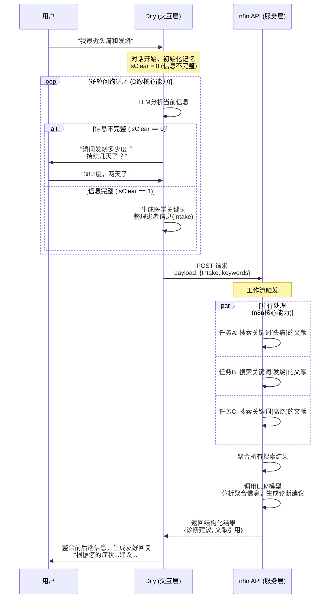

# 深入剖析 WebAPI 的作用以及 n8n 和 Dify 的核心区别与最佳应用场景

深入剖析 WebAPI 的作用以及 n8n 和 Dify 的核心区别与最佳应用场景。

## 一、深入解析：WebAPI 的核心作用与工作机理

WebAPI 绝非一个简单的接口，而是实现 **"前后端分离"式 AI 应用** 的战略性枢纽。

### 1. 角色定位

- **n8n (作为后端 - Backend)**：扮演 "数据处理与服务中心" 的角色。它将复杂的、非对话式的业务流程封装成一个独立的、可通过网络调用的服务。它的工作是默默地、高效地执行重型任务。

- **Dify (作为前端 - Frontend)**：扮演 "用户交互与调度中心" 的角色。它的职责是与用户进行友好、智能的沟通，理解用户意图，收集必要信息，然后向后端服务中心（n8n API）发起任务请求，并将结果优雅地呈现给用户。

### 2. 工作流程详解

整个协作过程涉及多个步骤和内部判断，其详细的工作流如下图所示：

### 3. 这种架构的优势

- **解耦与专业化**：各方只专注于自己最擅长的事，架构清晰，易于维护和扩展。
- **性能与用户体验**：用户在与 Dify 流畅对话时，n8n 可以在后台并行处理多个耗时任务（如多个关键词同时搜索），极大提高了系统整体效率。
- **灵活性**：这个 n8n API 不仅可以被 Dify 调用，未来也可以被小程序、App 或其他系统调用，复用性极高。

## 二、深度对比：n8n 与 Dify 的六大维度差异

| 维度            | Dify                                                                                                              | n8n                                                                                                                                           | 解读与分析                                                                                                   |
| --------------- | ----------------------------------------------------------------------------------------------------------------- | --------------------------------------------------------------------------------------------------------------------------------------------- | ------------------------------------------------------------------------------------------------------------ |
| **1. 核心定位** | AI 应用开发平台                                                                                                   | 通用自动化集成平台                                                                                                                            | 最根本的区别。Dify 一切围绕 LLM 展开；n8n 中 LLM 只是其众多功能节点中的一个。                                |
| **2. 设计哲学** | 对话与状态驱动                                                                                                    | 数据与流程驱动                                                                                                                                | Dify 关注"对话上下文"和"用户意图"；n8n 关注"数据如何从 A 点流转到 B 点并进行转换"。                          |
| **3. 核心优势** | 低代码构建复杂对话 AI Agent                                                                                       | 强大的数据处理与系统集成能力                                                                                                                  | Dify 简化了对话管理、记忆、知识库检索；n8n 提供了循环、分支、错误处理、格式转换等精细控制。                  |
| **4. 关键功能** | - ChatFlow: 可视化设计多轮对话 - 记忆功能: 自动维护对话历史 - 知识库: 与 LLM 无缝检索 - 发布为 WebApp | - 超 700+节点: 连接各种数据库、API、应用 - 高级逻辑控制: 循环、分支、错误处理 - 强大的数据转换: JSON/XML/CSV 操作 - 发布为 WebAPI | Dify 的功能是为对话定制的；n8n 的功能是为通用自动化设计的，其 ETL (Extract, Transform, Load) 能力远超 Dify。 |
| **5. 生态倾向** | 国内友好 - 优先支持国产模型 - 中文界面和文档 - 更符合国内需求场景                                     | 全球生态 - 支持超 700 种海外服务(Slack, Salesforce 等) - 社区活跃，模板丰富 - 国际化能力强                                        | 选择哪个平台，一定程度上也取决于你的技术栈和目标用户所在的市场。                                             |
| **6. 适用场景** | - 智能客服 - 对话式 AI 助手 - 多轮问答机器人 - 基于知识的聊天应用                                     | - 跨系统数据同步 - 复杂业务流程自动化 - 数据清洗与批处理 - 后端 API 服务编排                                                      | Dify 做"面子"（交互），n8n 做"里子"（逻辑和数据）。                                                          |

## 三、终极指南：如何选择与使用？

### 单一选择场景

- **选 Dify**：如果你的目标非常明确，就是快速构建一个高质量的对话机器人，且没有非常复杂的后端数据处理需求。

- **选 n8n**：如果你需要集成多个系统、自动化重复性业务流程（如：邮件提醒+数据入库+生成报告），或者主要进行数据清洗和格式转换。

### 强强联合场景（推荐）

采用本文的**"前后端分离"模式**：当你需要构建一个既要有友好智能对话，又要有强大后端处理能力的复杂应用时，这是最优解。

**分工：**

- **Dify 作前端（Frontend）**：负责所有用户交互，利用其 ChatFlow 和 记忆功能 收集用户输入和意图。
- **n8n 作后端（Backend）**：负责所有重型数据处理、第三方集成、复杂逻辑计算，并将其发布为 WebAPI。

**协作：** Dify 通过 HTTP 请求节点 或 自定义工具 调用 n8n 提供的 WebAPI，将任务派发到后端，获取结果后再回复用户。

## 结论

不要将 n8n 和 Dify 视为竞争对手，而应将它们视为不同领域的专业工具。就像你不会用螺丝刀去敲钉子，也不会用锤子去拧螺丝一样。根据你的任务需求，选择正确的工具，或者将它们组合起来，发挥各自最大的威力。
