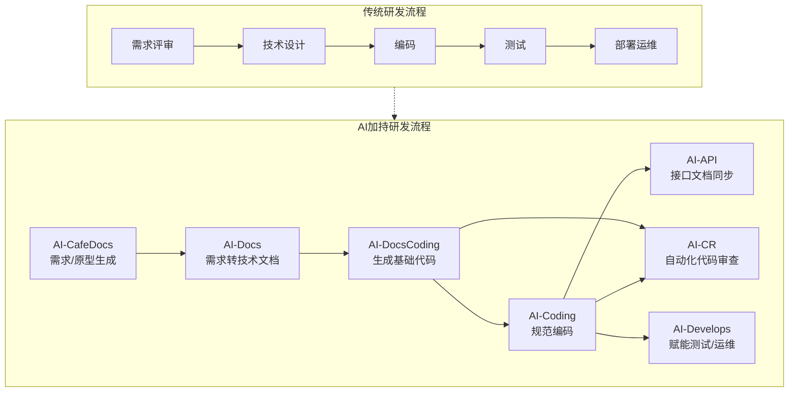
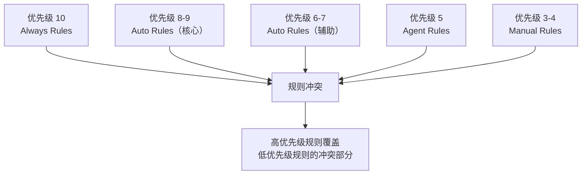
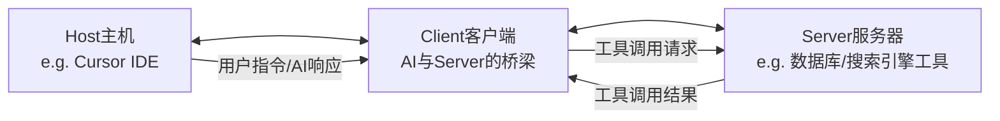
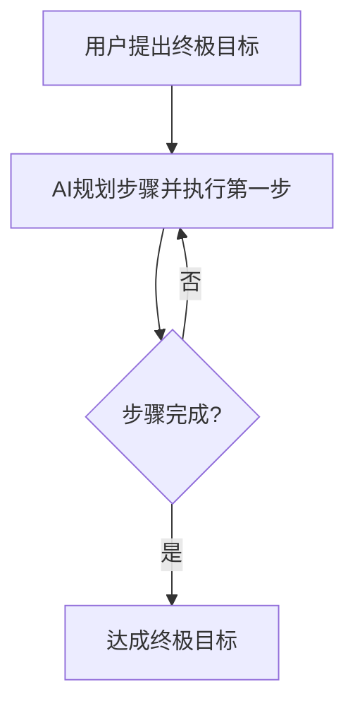

# 🚀 百度 Geek 说 - AI 在实际生产环境中的提效实践 - 详细总结

本文系统地介绍了百度某团队如何将 AI 深度集成到软件开发生命周期（SDLC）中，构建了一套名为 **"AI 工作流"** 的自动化提效方案。其核心思想是：让 AI 处理"重复的、可替代的、可节省的"机械化工作，而让人专注于核心的业务逻辑和创新。

## 📋 摘要

- **文章标题**：《AI 在实际生产环境中的提效实践》
- **发布方**：百度 Geek 说
- **核心内容**：一个研发团队利用 AI 技术优化从需求到运维的全流程，分享其落地经验、技术实践（如 Rule、MCP）及协作哲学。
- **核心目标**：拥抱 AI 时代，通过资源的配合与协调，实现研发效率的显著提升。

## 🎯 背景与目标

### 背景

- **工具泛滥**：AI 工具层出不穷，但缺乏与团队特定上下文结合的完整方案。
- **知识孤岛**：团队内部规范文档完备，但未融入开发流程，查阅成本高。
- **效率瓶颈**：Code Review、研发自测、接口文档更新等环节消耗大量高级研发人员的时间。

### 目标

- **流程智能化**：让团队研发流程向 AI 化转变，成为一个先进的锚点。
- **效率提升**：用 AI 武装研发团队，减少非核心事务的人力消耗，聚焦业务创新。

## 🗺️ 整体思路与 AI 工作流

团队将研发链路拆解，并在每个阶段注入 AI 能力，目标是将传统的线性流程转变为 AI 加持的并行自动化流程。

## ⚙️ 关键技术实践详解

文章重点详细介绍了开发阶段（AI-Coding）的三大核心技术实践。

### 1. Rule（规则）的精妙运用

Rule 被定义为 **"连接开发者意图与 AI 代码生成行为的关键桥梁"**。它将项目规范、编码标准等上下文信息持久化地注入到每次 AI 请求的提示词（Prompt）中，以解决大模型缺乏持久记忆的问题。

#### Rule 的五层分级策略

| 层级   | 名称                         | 位置                | 范围             | 内容                       | 优先级    |
| ------ | ---------------------------- | ------------------- | ---------------- | -------------------------- | --------- |
| 第一层 | IDE 全局层                   | User Rules          | 所有项目         | 个人编码风格偏好           | N/A       |
| 第二层 | 项目基础层 (Always Rules) | `.xx/rules/always/` | 整个项目强制遵循 | 技术栈、核心原则、基础规范 | 10 (最高) |
| 第三层 | 自动匹配层 (Auto Rules)   | `.xx/rules/auto/`   | 特定文件/目录    | 模块专门的开发规范         | 6-9       |
| 第四层 | 智能推荐层 (Agent Rules)  | `.xx/rules/agent/`  | AI 智能判断      | 优化建议和最佳实践         | 5         |
| 第五层 | 手动调用层 (Manual Rules) | `.xx/rules/manual/` | 手动调用         | 完整的项目或模块模板       | 3-4       |

#### Rule 优先级冲突解决机制

#### 最佳实践

- **内容优化**：用简洁的要点列表（20-30 行）代替冗长的代码示例和解释。
- **精确匹配**：使用 globs 模式精确匹配特定目录（如 `internal/handler/**/*.go`），避免过于宽泛（如 `**/*.go`）。

### 2. 记忆库 (Memory Bank)

为了解决 AI 在复杂项目中 **"上下文丢失"** 和 **"对业务逻辑一知半解"** 的痛点，团队引入了记忆库模式。

- **本质**：一种特殊的 Rule，将项目的重要上下文、历史决策、业务逻辑总结并存储，强制 AI 在每次交互时阅读，保持对话连续性。
- **与 IDE 长期记忆的区别**：
  - **记忆库**：公共的、项目级别的记忆，对所有协作者一致。
  - **IDE 长期记忆**：私人的、开发者级别的记忆，仅限个人使用。

### 3. MCP Server（模型上下文协议）

**MCP（Model Context Protocol）** 由 Anthropic 提出，是文章介绍的重中之重。它为大模型和外部世界（数据、工具、服务）提供统一的通信框架。

#### MCP 核心架构

#### 在开发中的具体应用

##### 用法一：接入百度搜索 MCP

- 无需切换浏览器，在 IDE 内让 AI 搜索技术问题、知识点，并由 AI 直接总结答案。

##### 用法二：接入各类数据库和运维工具 Client

- **自然语言操作数据库**：用口语化指令（如"查询用户张三最近一笔订单"）操作 MySQL、Redis，无需写 SQL。
- **自然语言操作基础设施**：通过 kubectl、GCP 等 Client 管理云资源。

> ⚠️ **关键警告**：严禁在开发环境使用线上账号密码，安全第一。

## 🔄 全链路 AI 应用概览

原本研发链路:

AI 加持研发流程

### 需求阶段 (AI-CafeDocs & AI-DocsCoding)

- **流程**：需求文档 → 百度低代码平台 Aisuda → 大模型 → 技术文档(Markdown)
- **价值**：生成初版技术文档和 API 设计，人工只需核对和补充核心业务逻辑，角色转变为"驱动者/验收者"。

### 集成阶段 (AI-CR)

- **痛点**：CR 耗时、沟通低效、重复劳动。
- **方案**：引入 AI 自动化审查，提前规避基础规范、常见漏洞问题，让人类专家专注于关键业务逻辑和架构审查。

### 运维阶段 (AI-Develops)

- **痛点**：告警数量多，存在"方向壁垒"和"年限壁垒"，故障排查效率低。
- **方案**：构建智能化应急诊断系统，通过 AI 自动分析、诊断甚至修复告警，大幅减少平均修复时间（MTTR）。

## 💡 核心思想与哲学

### 1. 递归使用 AI (Recursive Use)

不要一步步指挥 AI，而是将最终目标丢给 AI，让它自己规划步骤并执行下一步（递归地解决问题）。

**例如**：安装 MCP Server 时，只需提供链接，让 AI 自己完成安装、配置、调试的全过程。

### 2. 把 AI 当成真正的工具

遇到任何繁琐、重复、自己能做但嫌麻烦的"杂活"（如制作 GIF、捞数据、写文档），都应首先问：**"Can AI Do it?"**。

这将许多需要切换上下文的任务，简化为在 IDE 内的一句指令，真正实现"AI 在手，天下我有"。

## ✅ 总结

这篇文章的价值在于它超越了对单一 AI 工具的介绍，提供了一个完整的、可落地的**"AI 赋能研发体系"**的蓝图。它不仅分享了具体技术方案（Rule、MCP、Memory Bank），更重要的是传递了一种工作流重构思想和人机协作新范式。

**最终结论**：AI 并非要取代开发者，而是作为一个强大的杠杆，放大开发者的价值，让其从繁琐劳动中解放出来，专注于真正需要人类智慧和创造力的领域。未来的研发效率提升，在于系统地将 AI 能力像管道一样接入研发流程的各个角落。
