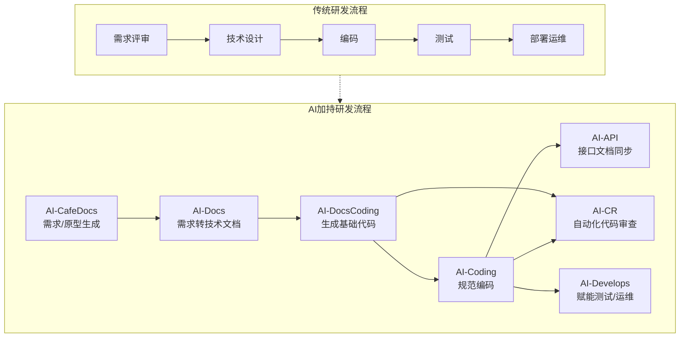
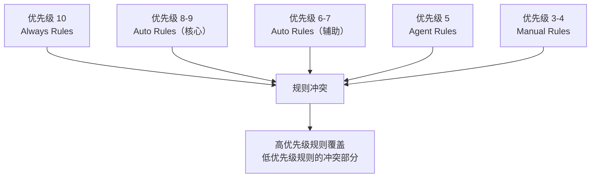
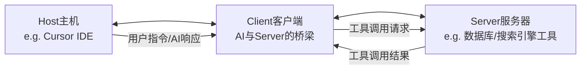
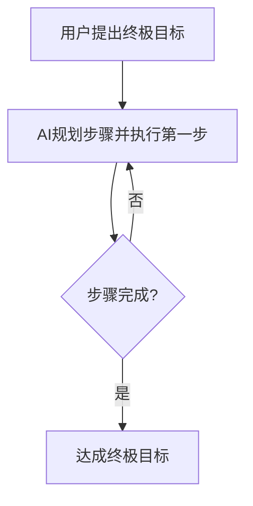

# AI 在生产环境中的提效实践

在实际项目中,我们将 AI 深度集成到软件开发生命周期（SDLC）的各个环节,构建了一套 **"AI 工作流"** 自动化方案。核心理念很简单：让 AI 处理重复的、机械化的工作,让开发者专注于核心业务逻辑和创新。

## 背景与目标

### 面临的问题

在实际工作中,我们发现了几个明显的痛点：

- **工具泛滥**：市面上 AI 工具很多,但缺乏与团队上下文结合的完整方案
- **知识孤岛**：团队规范文档很完备,但没有融入开发流程,查阅成本高
- **效率瓶颈**：Code Review、研发自测、接口文档更新等环节消耗大量时间

### 解决思路

- **流程智能化**：让研发流程向 AI 化转变
- **效率提升**：用 AI 减少非核心事务的人力消耗,聚焦业务创新

## 整体思路与 AI 工作流

我们将研发链路拆解,在每个阶段注入 AI 能力,将传统的线性流程转变为 AI 加持的并行自动化流程。

```mermaid
flowchart TD
    subgraph Traditional [传统研发流程]
        direction LR
        A1[需求评审] --> A2[技术设计] --> A3[编码] --> A4[测试] --> A5[部署运维]
    end

    subgraph AIPowered [AI加持研发流程]
        direction LR
        B1[AI-CafeDocs<br>需求/原型生成] --> B2[AI-Docs<br>需求转技术文档] --> B3[AI-DocsCoding<br>生成基础代码] --> B4[AI-Coding<br>规范编码] --> B5[AI-API<br>接口文档同步]

        B3 & B4 --> B6[AI-CR<br>自动化代码审查]
        B4 --> B7[AI-Develops<br>赋能测试/运维]
    end

    Traditional -.-> AIPowered
```

## 关键技术实践

在开发阶段（AI-Coding）,我们重点实践了三个核心技术方案。

### 1. Rule（规则）的精妙运用

Rule 是 **"连接开发者意图与 AI 代码生成行为的关键桥梁"**。它将项目规范、编码标准等上下文信息持久化地注入到每次 AI 请求的提示词（Prompt）中,解决大模型缺乏持久记忆的问题。

#### Rule 的五层分级策略

| 层级   | 名称                         | 位置                | 范围             | 内容                       | 优先级    |
| ------ | ---------------------------- | ------------------- | ---------------- | -------------------------- | --------- |
| 第一层 | IDE 全局层                   | User Rules          | 所有项目         | 个人编码风格偏好           | N/A       |
| 第二层 | 项目基础层 (Always Rules) | `.xx/rules/always/` | 整个项目强制遵循 | 技术栈、核心原则、基础规范 | 10 (最高) |
| 第三层 | 自动匹配层 (Auto Rules)   | `.xx/rules/auto/`   | 特定文件/目录    | 模块专门的开发规范         | 6-9       |
| 第四层 | 智能推荐层 (Agent Rules)  | `.xx/rules/agent/`  | AI 智能判断      | 优化建议和最佳实践         | 5         |
| 第五层 | 手动调用层 (Manual Rules) | `.xx/rules/manual/` | 手动调用         | 完整的项目或模块模板       | 3-4       |

#### Rule 优先级冲突解决机制

```mermaid
flowchart TD
    P10[优先级 10<br>Always Rules] --> W[规则冲突]
    P89[优先级 8-9<br>Auto Rules（核心）] --> W
    P67[优先级 6-7<br>Auto Rules（辅助）] --> W
    P5[优先级 5<br>Agent Rules] --> W
    P34[优先级 3-4<br>Manual Rules] --> W

    W --> R[高优先级规则覆盖<br>低优先级规则的冲突部分]
```

#### 最佳实践

- **内容优化**：用简洁的要点列表（20-30 行）代替冗长的代码示例和解释。
- **精确匹配**：使用 globs 模式精确匹配特定目录（如 `internal/handler/**/*.go`），避免过于宽泛（如 `**/*.go`）。

### 2. 记忆库 (Memory Bank)

为了解决 AI 在复杂项目中 **"上下文丢失"** 和 **"对业务逻辑一知半解"** 的痛点,我们引入了记忆库模式。

- **本质**：一种特殊的 Rule,将项目的重要上下文、历史决策、业务逻辑总结并存储,强制 AI 在每次交互时阅读,保持对话连续性
- **与 IDE 长期记忆的区别**：
  - **记忆库**：公共的、项目级别的记忆,对所有协作者一致
  - **IDE 长期记忆**：私人的、开发者级别的记忆,仅限个人使用

### 3. MCP Server（模型上下文协议）

**MCP（Model Context Protocol）** 是一个重要的技术实践点。它为大模型和外部世界（数据、工具、服务）提供统一的通信框架。

#### MCP 核心架构

```mermaid
flowchart LR
    H[Host主机<br>e.g. Cursor IDE] <--> C[Client客户端<br>AI与Server的桥梁]
    C <--> S[Server服务器<br>e.g. 数据库/搜索引擎工具]

    H -- 用户指令/AI响应 --> C
    C -- 工具调用请求 --> S
    S -- 工具调用结果 --> C
```

#### 在开发中的具体应用

##### 用法一：接入搜索引擎 MCP

无需切换浏览器,在 IDE 内让 AI 搜索技术问题、知识点,并直接总结答案。

##### 用法二：接入数据库和运维工具 Client

- **自然语言操作数据库**：用口语化指令（如"查询用户张三最近一笔订单"）操作 MySQL、Redis,无需写 SQL
- **自然语言操作基础设施**：通过 kubectl、GCP 等 Client 管理云资源

> ⚠️ **安全提醒**：严禁在开发环境使用线上账号密码,安全第一。

## 全链路 AI 应用

原本研发链路:

AI 加持研发流程

### 需求阶段 (AI-CafeDocs & AI-DocsCoding)

- **流程**：需求文档 → 低代码平台 Aisuda → 大模型 → 技术文档(Markdown)
- **价值**：生成初版技术文档和 API 设计,人工只需核对和补充核心业务逻辑,角色转变为"驱动者/验收者"。

### 集成阶段 (AI-CR)

- **痛点**：CR 耗时、沟通低效、重复劳动
- **方案**：引入 AI 自动化审查,提前规避基础规范、常见漏洞问题,让人类专家专注于关键业务逻辑和架构审查。

### 运维阶段 (AI-Develops)

- **痛点**：告警数量多,存在"方向壁垒"和"年限壁垒",故障排查效率低
- **方案**：构建智能化应急诊断系统,通过 AI 自动分析、诊断甚至修复告警,大幅减少平均修复时间（MTTR）。

## 核心思想与哲学

### 1. 递归使用 AI

不要一步步指挥 AI,而是将最终目标直接交给 AI,让它自己规划步骤并递归执行。

**例如**：安装 MCP Server 时,只需提供链接,让 AI 自己完成安装、配置、调试的全过程。

```mermaid
flowchart TD
    A[用户提出终极目标] --> B[AI规划步骤并执行第一步]
    B --> C{步骤完成?}
    C -- 否 --> B
    C -- 是 --> D[达成终极目标]
```

### 2. 把 AI 当成真正的工具

遇到任何繁琐、重复、嫌麻烦的"杂活"（如制作 GIF、捞数据、写文档）,都应首先问：**"Can AI Do it?"**。

这将许多需要切换上下文的任务,简化为在 IDE 内的一句指令。

## 总结

通过这套体系,我们不仅实践了具体技术方案（Rule、MCP、Memory Bank）,更重要的是重构了整个工作流程,建立了新的人机协作范式。

AI 并非要取代开发者,而是作为一个强大的杠杆,放大开发者的价值,让我们从繁琐劳动中解放出来,专注于真正需要人类智慧和创造力的领域。未来的研发效率提升,关键在于系统地将 AI 能力接入研发流程的各个环节。
