# AI 编程工具全景分析：2025 年发展现状与趋势

## 文章概述

本文系统梳理了 2025 年 AI 编程领域的发展现状，从 Agent 框架到编程助手，从终端工具到开发协议，全面分析了当前 AI 编程工具生态，并深入探讨了 Karpathy 提出的"软件三次变革"理论。随着 GPT-4o、Claude 3.5 Sonnet、Gemini 2.0 等新一代模型的发布，AI 编程工具正迎来前所未有的发展机遇。

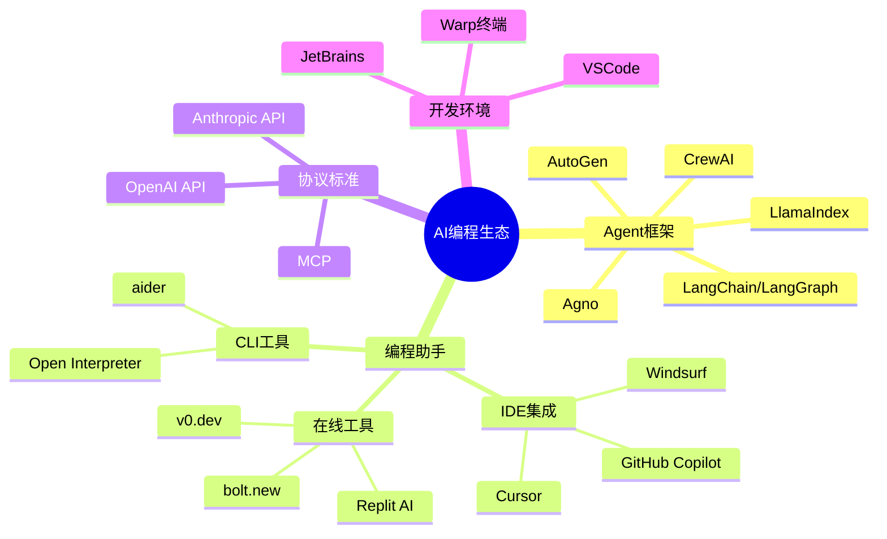

## 一、AI 编程工具分类体系

### 1. Agent 框架生态系统

**开源代表项目：**

- **LangChain & LangGraph**：2025 年最新版本 4.0 引入了更强的流式处理能力和多模态支持，成为 LLM 应用开发的事实标准
- **AutoGen**：Microsoft 开源的多智能体框架，2025 年新增了视觉 Agent 和代码执行沙箱功能
- **CrewAI**：轻量级 Python 框架，2025 年 10 月发布的 v2.0 版本支持动态角色分配和实时协作
- **LlamaIndex**：专注于 RAG 应用，新增了 GraphRAG 和多模态检索能力
- **Agno**：支持 5 级自主能力的 Python 框架，2025 年新增了安全沙箱和审计日志功能
- **GPT Researcher**：专为在线研究设计，集成了最新的搜索 API 和实时数据源

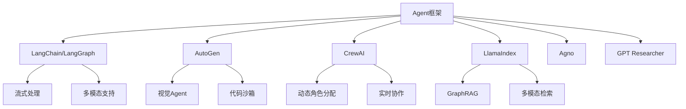

### 2. 编程助手矩阵

**IDE 集成类：**

- **独立 IDE**：

  - **Cursor**：2025 年最受欢迎的 AI IDE，新增了多文件编辑和项目级重构功能
  - **Windsurf**：Codeium 推出的新 IDE，支持实时协作和云端同步
  - **Zed**：基于 Rust 的高性能编辑器，2025 年新增了 AI 配对编程功能
  - **Trae**：专注于前端开发的 AI IDE

- **VSCode 插件生态**：
  - **GitHub Copilot**：2025 年新增了 Copilot Chat 和 Copilot Workspace 功能
  - **Gemini Code Assist**：Google 推出的代码助手，支持多语言和云端集成
  - **Claude Code**：Anthropic 的 VSCode 插件，擅长代码解释和重构
  - **Windsurf Plugin**：免费的 AI 编程助手，支持多种模型切换
  - **Tabnine**：基于深度学习的代码补全工具，支持多种编程语言
  - **CodeGPT**：集成多种 AI 模型的 VSCode 插件
  - **Amazon CodeWhisperer**：AWS 推出的 AI 代码生成助手
  - **Sourcegraph Cody**：企业级 AI 编程助手，支持代码搜索和生成
  - **Augment**：专注于代码生成和自动化重构的 AI 助手，支持智能代码建议

**Online 生成式：**

- **v0.dev**：Vercel 的 AI 界面生成器，2025 年新增了组件库和设计系统支持
- **bolt.new**：StackBlitz 推出的全栈应用生成器，支持实时预览和部署
- **jules**：专注于 React 组件生成的在线工具
- **Replit AI**：集成在 Replit 平台的 AI 编程助手

**CLI 工具：**

- **官方 CLI 工具**：

  - **OpenAI Codex CLI**：OpenAI 官方命令行工具，支持代码生成和补全
  - **Anthropic Claude Code**：Claude 的命令行接口，擅长代码解释和重构
  - **Google Gemini CLI**：Google 推出的 Gemini 命令行工具，支持多模态代码处理

- **第三方工具**：
  - **aider**：2025 年最受欢迎的命令行 AI 编程工具，支持多种模型和 Git 集成
  - **codename goose**：专注于代码重构和优化的 CLI 工具
  - **Open Interpreter**：支持本地代码执行的 AI 助手

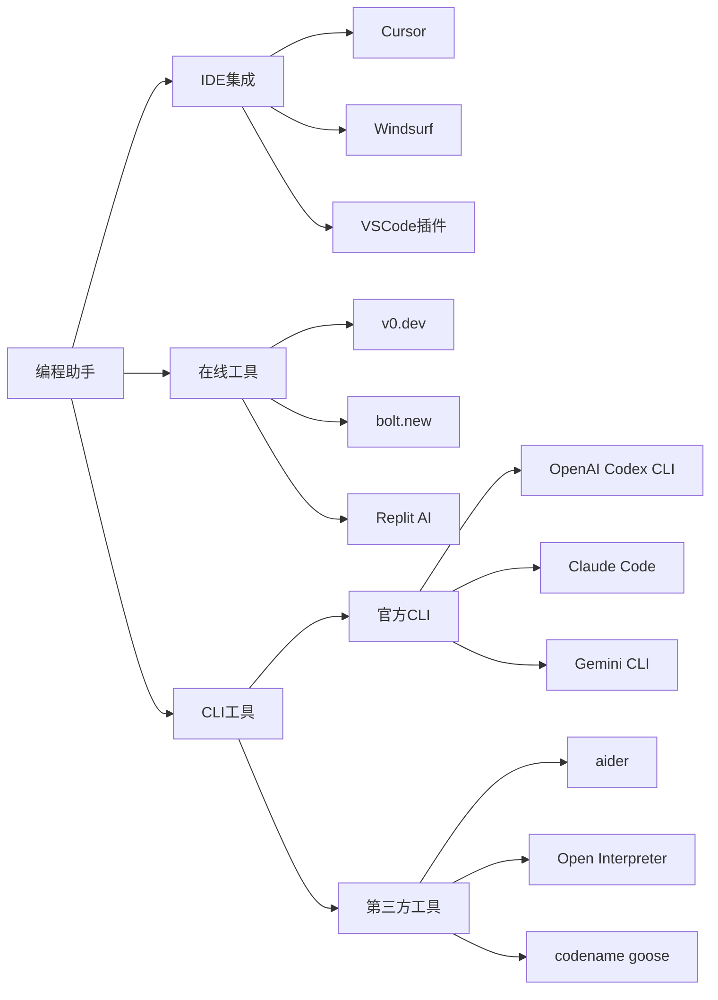

### 3. 终端与开发环境

- **Warp**：2025 年体验最好的 AI 终端，新增了 MCP 协议支持和多 Agent 协作功能
- **starship**：基于 Rust 的终端美化工具，2025 年新增了 AI 状态显示
- **编程字体**：Nerd Fonts 持续更新，为开发者提供更丰富的图标字形支持

## 二、技术协议与标准

### 1. MCP（Model Context Protocol）

2025 年 10 月，MCP 协议已成为 AI 工具互操作性的重要标准：

- **开放标准**：规范向 LLM 提供上下文信息的统一接口
- **广泛采用**：类似 USB-C 接口，成为 AI 工具生态的连接标准
- **实时更新**：支持动态上下文更新和多源数据融合

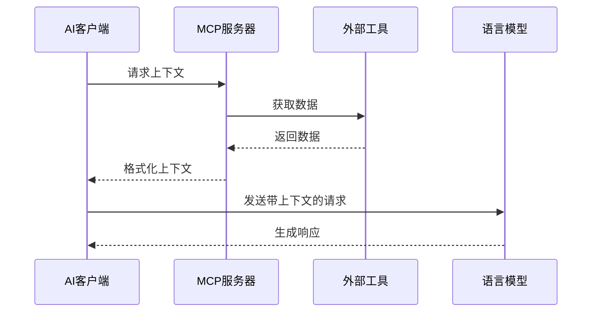

### 2. 企业级 MCP 应用生态

**开发工具集成：**

- **Context7**：通过 MCP 机制获取最新文档和代码示例，2025 年新增了实时 API 文档同步
- **DeepWiki**：基于 GitHub 源码生成可对话式文档，支持多语言和实时更新
- **Gitingest**：将 GitHub 代码库转换为适合 LLM 提示的文本摘要，新增了增量更新功能
- **Sequential Thinking MCP Server**：结构化思维过程，支持复杂问题的分步求解

**企业应用集成：**

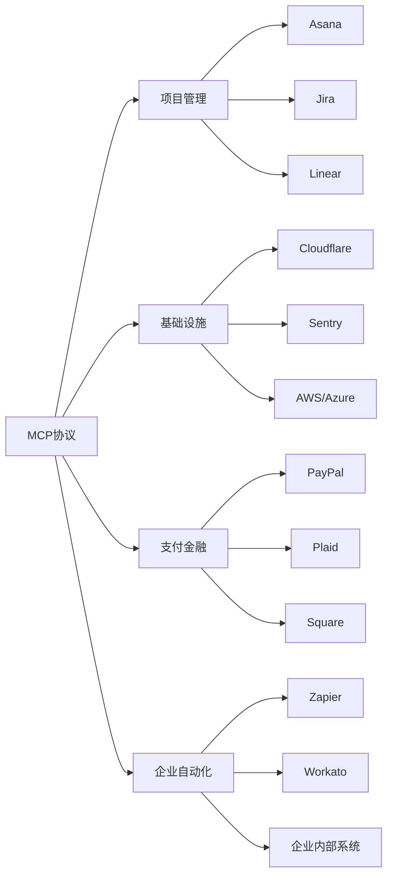

- **项目管理集成**：AI 智能体通过 MCP 协议直接操作 Asana、Jira、Linear 等项目管理工具
- **基础设施运维**：连接 Cloudflare、Sentry 等服务，实现智能化运维监控
- **支付与金融**：集成 PayPal、Plaid、Square 等支付服务，支持财务流程自动化
- **企业流程自动化**：通过 Zapier、Workato 连接企业内部系统，实现端到端自动化

**企业级重要性：**

建立组织级 MCP 能力对确保 AI 生成代码质量和企业系统集成至关重要，是 2025 年企业 AI 战略的核心组成部分。

## 三、开发工具链

### 1. AI SDK 生态

2025 年 AI SDK 生态更加成熟：

- **Vercel AI SDK**：TypeScript 工具包，2025 年 v4.0 版本支持流式 UI 和多模态输入
- **Google Gen AI SDK**：专为 TypeScript/JS 开发者设计，集成了 Gemini 2.0 的最新能力
- **OpenAI SDK**：支持 GPT-4o 和新的函数调用功能
- **Anthropic SDK**：集成 Claude 3.5 Sonnet 的计算机使用能力

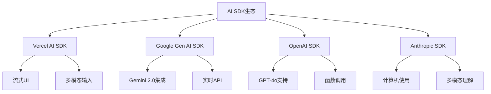

### 2. 代码生成友好框架

- **前端框架**：Next.js 15、React 19、Tailwind CSS 4.0 对 AI 代码生成更加友好
- **动画/3D 效果**：p5.js、three.js、framer-motion 为 AI 生成的交互效果提供强大支持
- **UI 组件**：shadcn/ui + tweakcn 可视化主题编辑器，2025 年新增了 AI 主题生成功能

### 3. 开源 Chat UI 项目

- **Open WebUI**：2025 年最受欢迎的开源聊天界面，支持多模型切换
- **LobeChat**：现代化的 AI 聊天界面，支持插件生态
- **Cherry Studio**：跨平台的 AI 聊天客户端
- **Text generation web UI**：专注于文本生成的 Web 界面
- **Chat SDK**：可定制的聊天界面开发套件，支持多种 AI 模型集成

## 四、Karpathy 的软件三次变革理论

Andrej Karpathy 提出的软件发展三个阶段在 2025 年得到了更深入的验证：

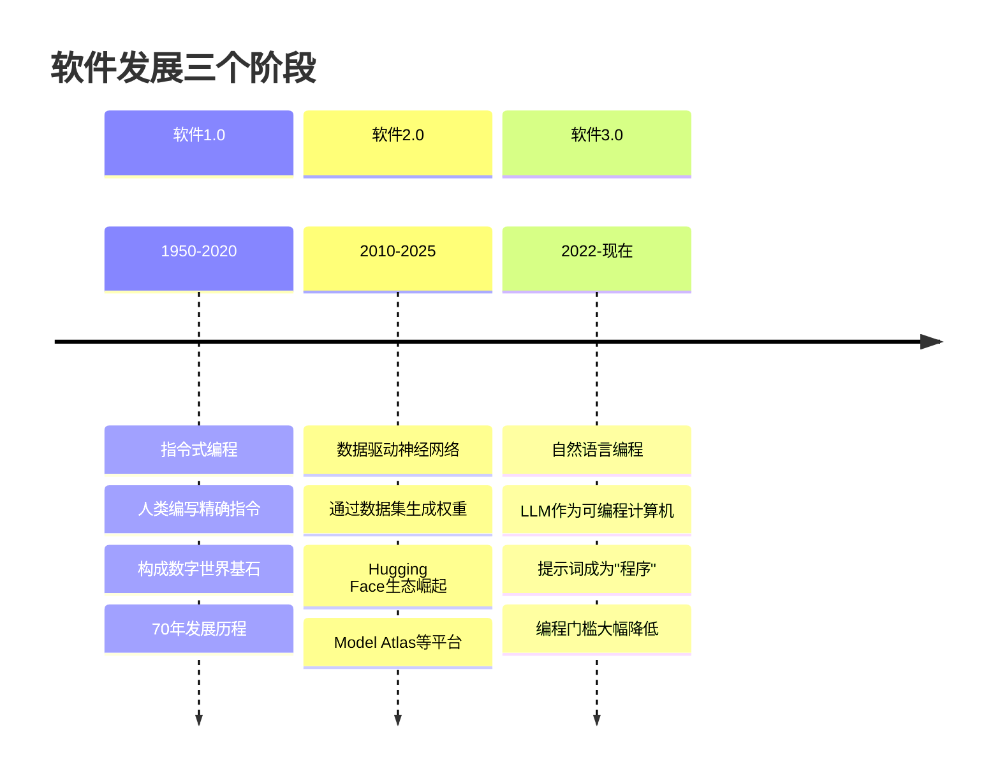

### 软件 1.0：指令式编程（70 年）

- 传统编程范式，人类编写精确指令
- 构成数字世界基石
- 需要深厚的技术背景

### 软件 2.0：数据驱动神经网络

- 通过调整数据集自动生成神经网络权重
- 出现 Hugging Face 和 Model Atlas 等模型平台
- 机器学习工程师成为新职业

### 软件 3.0：自然语言编程

- LLM 作为新型可编程计算机
- 提示词成为编程 LLM 的"程序"
- 编程门槛大幅降低，全民编程时代到来

## 五、LLM 本质与生态系统

### LLM 的多重比喻

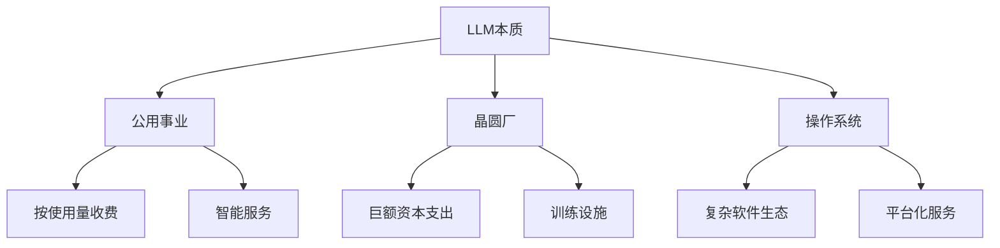

- **新型"公用事业"**：按使用量收费的智能服务，如水电一样普及
- **高科技"晶圆厂"**：需要巨额资本支出的训练设施，技术壁垒极高
- **数字"操作系统"**：复杂的软件生态系统，承载各种应用

### 技术扩散特点

- **反向扩散**：先消费者后企业（与传统技术相反）
- **1960 年代计算模式的回归**：云端集中，瘦客户端交互
- **API 经济**：模型即服务成为主流商业模式

## 六、LLM 心智特性分析

### 超能力

- **百科全书般的知识**：涵盖人类知识的广度和深度
- **超人信息处理能力**：远超个体人类的信息整合能力
- **多模态理解**：2025 年新增的视觉、音频理解能力

### 认知缺陷

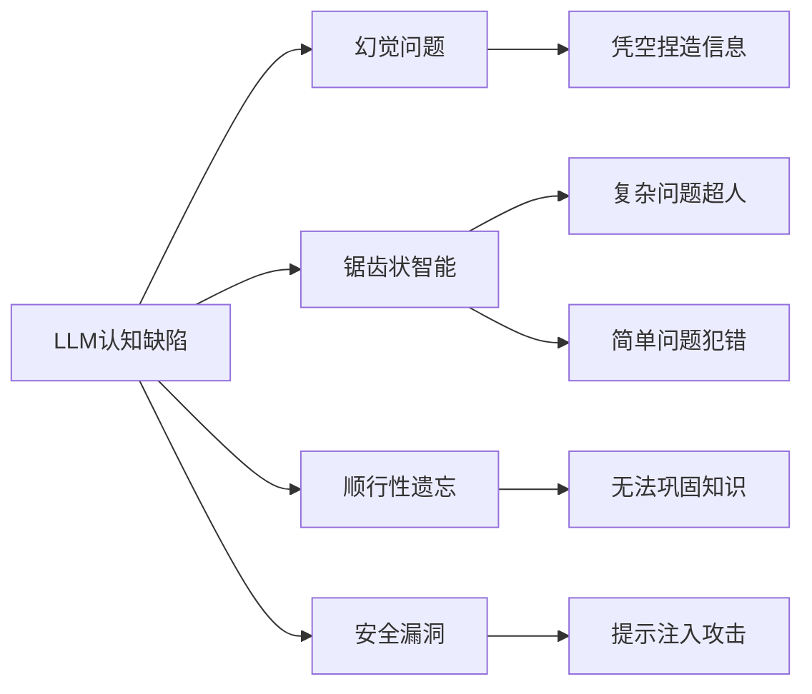

- **幻觉(Hallucination)**：凭空捏造看似合理的信息
- **锯齿状智能**：复杂问题表现超人，简单问题却会犯错
- **顺行性遗忘**：无法通过"睡眠"巩固新知识
- **安全漏洞**：面临提示注入攻击等安全风险

## 七、LLM 应用发展路径

### 应用特性

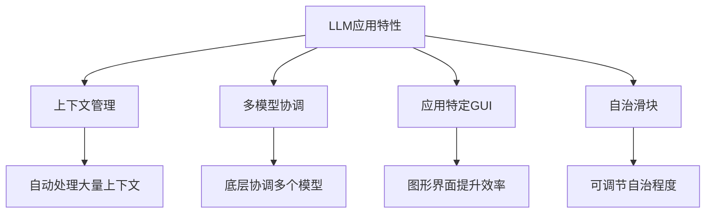

- **上下文管理**：自动处理大量上下文信息，智能筛选相关内容
- **多模型协调**：底层协调多个专业模型，提供最优解决方案
- **应用特定 GUI**：图形界面提升审计和验证效率
- **自治滑块**：可调节的自治程度，平衡效率与控制

### AI 代理团队协作模式

2025 年，AI 编程已从单兵作战演进为智能体团队协作，覆盖 SDLC 全流程：

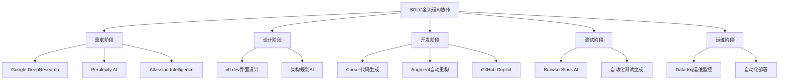

**整合性解决方案：**

- **GitHub Copilot Workspace**：提供从需求到部署的全流程支持
- **Atlassian Rovo**：深度嵌入专业化 AI 智能体到企业工作流
- **通用 AI Agent**：如 Manus 和 Agentic 浏览器 Fellou 整合完整工具链

### 人机协作模式

- **AI 负责"生成"，人类负责"验证"**：充分发挥各自优势
- **GUI 加速验证过程**：可视化界面提高审核效率
- **需要"牵住 AI 的缰绳"**：防止 AI 过度反应或偏离目标

## 八、为代理而设计的新范式

### LLM 友好基础设施

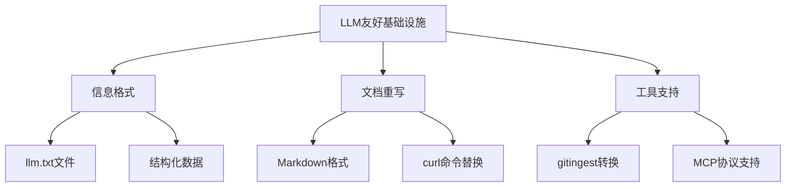

- **信息格式**：类似 robots.txt 的 llm.txt 文件，为 AI 提供结构化信息
- **文档重写**：Markdown 格式 + curl 命令替换传统的点击操作
- **工具支持**：gitingest 等工具将内容转化为 LLM 可读格式

## 九、AI 编程工作流程革新

### 1. "计划先行，代码后行"的新范式

2025 年，AI 编程工作流发生了根本性变革，从传统的"边写边想"转向"先规划后执行"：

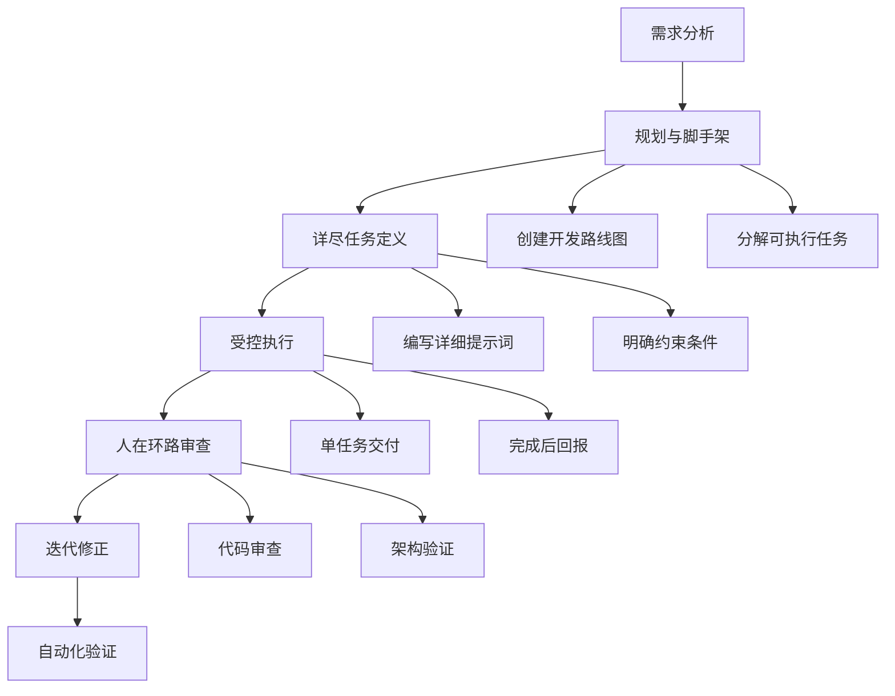

**核心特点：**

- **规划与脚手架搭建**：AI 协助创建开发路线图，将宏大目标分解为可执行的子任务
- **详尽任务定义**：为每个子任务编写极其详尽的提示词，明确定义工作内容和约束条件
- **受控执行过程**：一次只交付一个任务指令，要求 AI "完成后回报"
- **人在环路审查**：开发者仔细审查生成代码，进行迭代修正

**工具实现：**

- **Claude Code**：通过 TodoRead/TodoWrite 工具实时更新任务列表
- **Windsurf**：通过 update_plan 动态更新任务计划
- **Cursor**：项目级任务管理和进度跟踪

### 2. 异步 AI 编码的兴起

**从前台到后台的转变：**

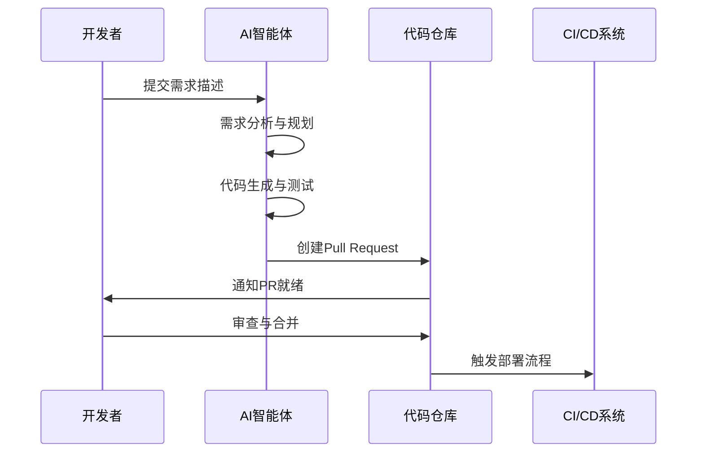

**工作模式特点：**

- **后台异步执行**：AI 编程从 IDE 中的交互式体验转向后台异步执行
- **PR 驱动开发**：开发者只需 review AI 生成的 PR，无需参与具体编码过程
- **全流程自动化**：需求分析、计划制定、代码生成和测试脚本编写都在后台完成

**技术支撑：**

- **远程开发基础设施**：云端开发环境和计算资源
- **代码库集成**：深度集成 Git 工作流和分支管理
- **上下文引擎**：智能理解项目历史和代码结构
- **模型上下文协议**：标准化的 AI 工具互操作接口

### 3. 自动化验证的强化

**多维度验证体系：**

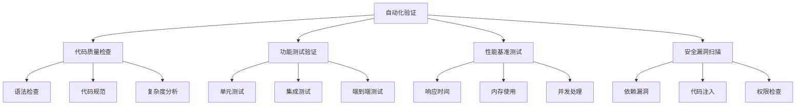

**验证策略：**

- **连续尝试多种验证方式**：从单元测试到多维度验证的全面覆盖
- **多轮自动测试和验证**：迭代式验证确保代码质量
- **轻量级测试脚本**：快速排除无关错误，聚焦核心问题

**代表性工具：**

- **Claude**：强大的代码理解和自动化校验能力
- **Augment**：智能代码分析和质量评估
- **GitHub Copilot**：集成的测试生成和验证功能

## 十、全民编程时代与 Vibe Coding

### Vibe Coding 特点

2025 年，"Vibe Coding"成为新的编程范式：

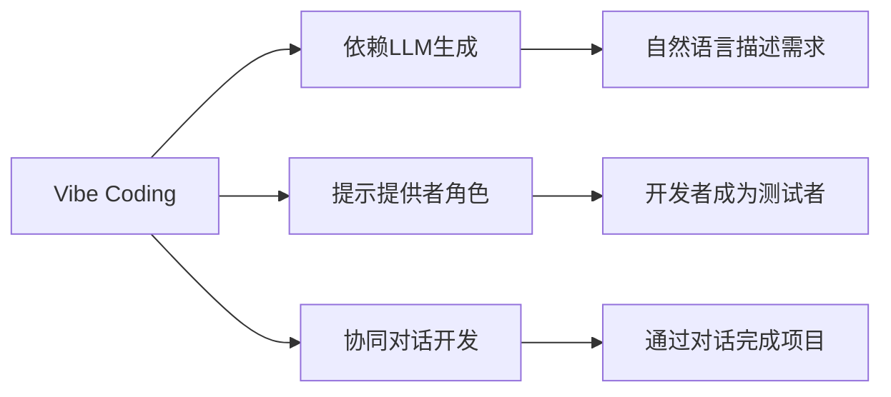

- **依赖 LLM 生成软件**：全新的编程方式，以自然语言为主要输入
- **开发者角色转变**：从代码编写者变为"提示提供者"和"测试者"
- **协同对话开发**：通过与 AI 的持续对话完成项目开发

### 发展预测

- **大量代码需要重写**：为了适应 AI 友好的架构和模式
- **双轨制发展**：专业程序员和 Vibe Coder 将长期共存
- **历史重演**：正处于类似 1960 年代操作系统发展的初期阶段

## 十一、上下文工程的重要性

### 从提示词工程到上下文工程

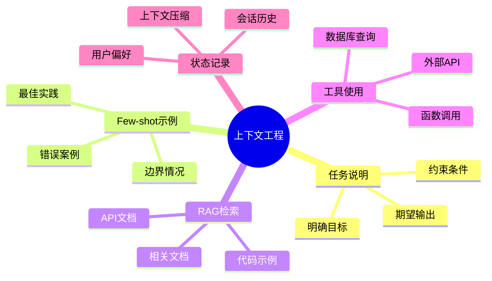

2025 年，上下文工程已成为 AI 应用开发的核心技能：

- **更准确的描述**：比"提示词工程"更能体现核心技能本质
- **足够且恰当的上下文**：提供 AI 所需的完整信息背景
- **工程与艺术的融合**：结合工程方法与直觉艺术

### 关键维度

- **任务说明**：清晰的目标定义和约束条件
- **Few-shot 示例**：提供最佳实践和边界案例
- **RAG 检索**：相关数据和知识库集成
- **工具使用**：外部 API 和函数调用能力
- **状态记录**：会话历史和用户偏好
- **上下文压缩**：智能筛选和压缩长上下文

## 十二、技术债务与质量挑战

### 1. 10 倍生产力背后的隐患

2025 年，AI 编程工具确实带来了 10 倍的生产力提升，但同时也引入了前所未有的技术债务风险：

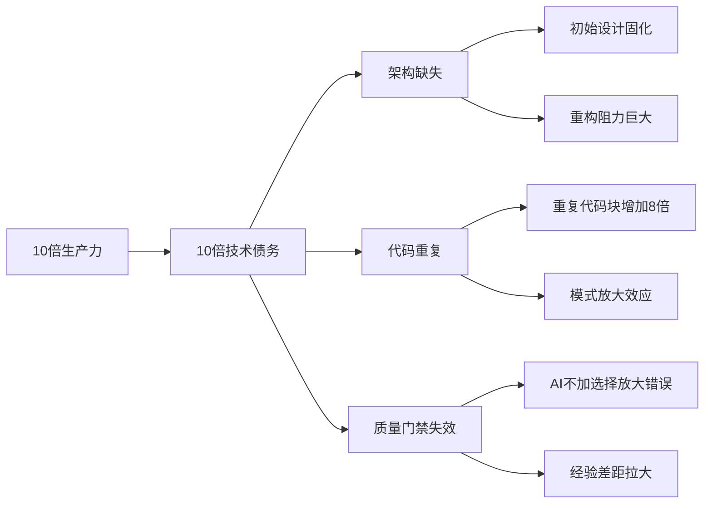

**数据支撑：**

根据 GitClear 2024 年研究显示，包含五行以上重复邻近代码的代码块出现频率增加了 **8 倍**，这直接反映了 AI 工具"不加分辨地放大输入模式"的特性。

### 2. 架构缺失导致的技术债务

**问题根源：**

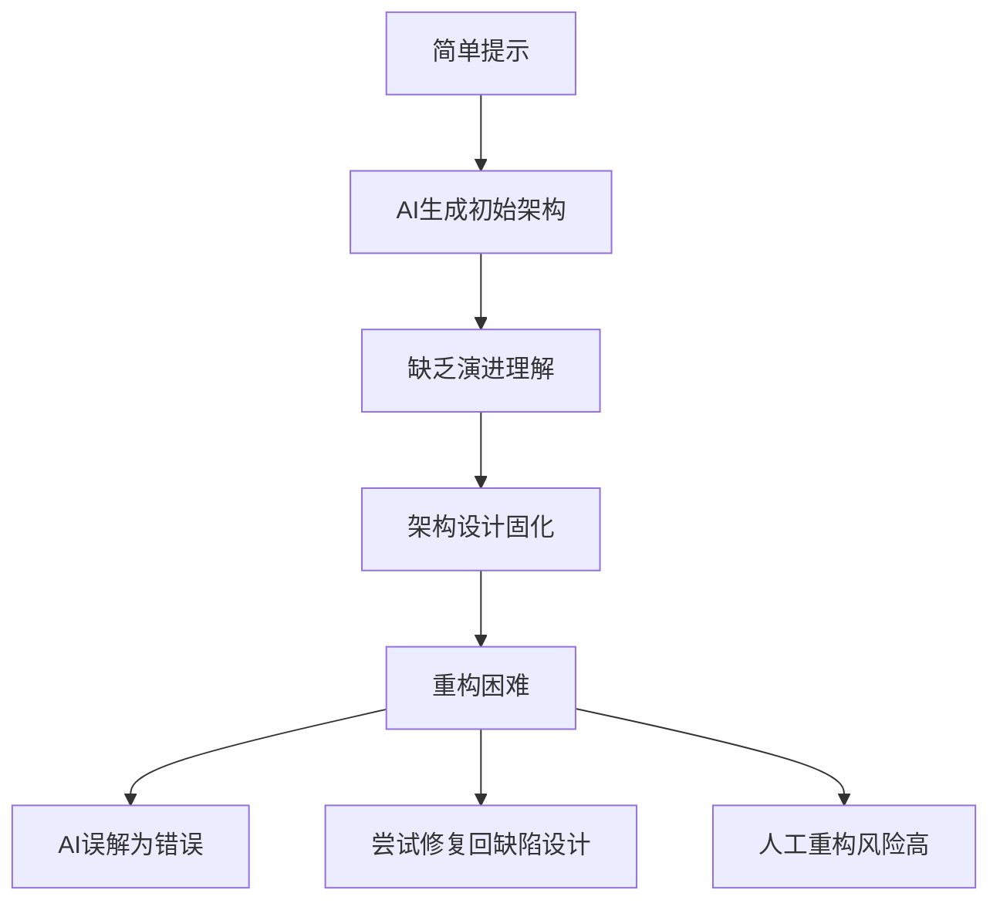

**核心挑战：**

- **初始设计固化**：AI 基于简单提示生成初始架构，缺乏对系统演进方向的深层理解
- **重构阻力巨大**：AI 可能将架构改动误解为"错误"并试图"修复"回缺陷设计
- **人工重构风险**：开发者缺乏 AI 初始决策的上下文，大规模改动充满风险

### 3. "氛围编程"的质量风险

**Vibe Coding 的负面效应：**

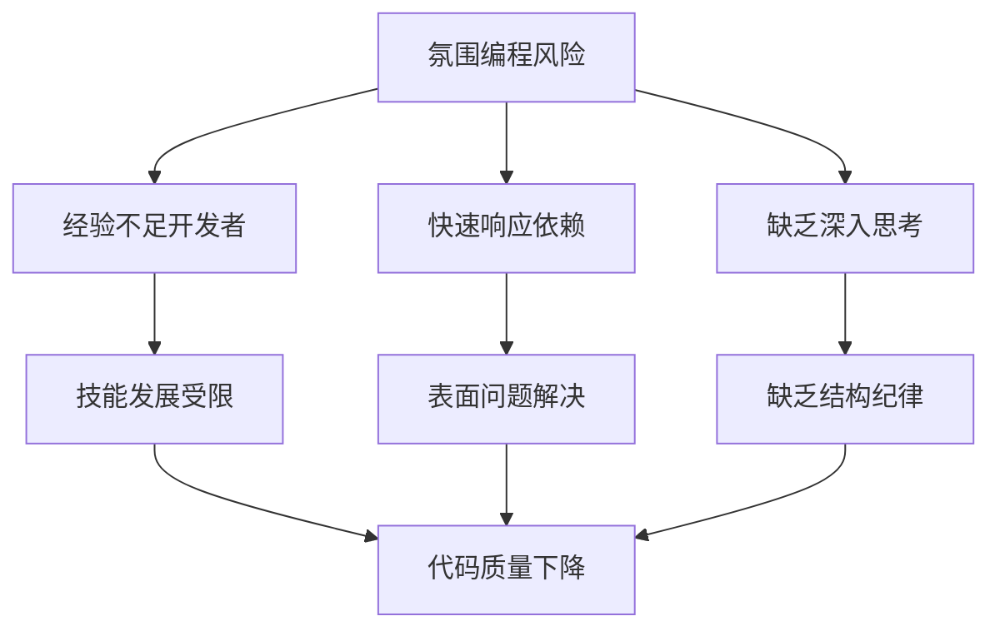

**风险表现：**

- **经验不足的开发者**：过度依赖 AI 快速响应而缺乏深入思考
- **缺乏结构和纪律**：生成的代码缺乏良好的架构设计和编程规范
- **技能发展受阻**：开发者失去学习和成长的机会

### 4. 代码质量门禁的新挑战

**传统质量控制失效：**

- **AI 会"不加选择地放大"错误**：帮助开发者更快、更大规模地犯错
- **质量差距拉大**：高质量代码库与低质量代码库之间的开发速度差距极大拉大
- **传统审查机制不足**：现有的代码审查流程难以应对 AI 生成代码的特殊挑战

### 5. 应对策略与最佳实践

**体系化管理方案：**

```mermaid
mindmap
  root((技术债务管理))
    文化建设
      AI编程规范
      质量意识培养
      持续学习机制
    流程优化
      分层审查制度
      架构设计前置
      增量重构策略
    工具链建设
      自动化质量检测
      架构一致性验证
      技术债务监控
    团队能力
      AI工具培训
      架构设计能力
      代码审查技能
```

**关键措施：**

- **认识悖论**：清醒认识到生产力提升与技术债务增加之间的平衡关系
- **主动构建**：建立相应的文化、流程和分层工具链来驯服 AI 智能体
- **持续优化**：将 AI 的强大力量转化为可持续的、架构优良的商业价值

## 十三、2025 年 AI 编程工具发展趋势

### 1. 技术趋势

```mermaid
timeline
    title 2025年AI编程技术发展趋势

    section Q1-Q2
        多模态集成 : 视觉理解代码
                   : 语音编程交互
                   : 图表生成代码

    section Q3-Q4
        实时协作 : 多人AI配对编程
                 : 云端同步开发
                 : 分布式代码生成

    section 全年
        安全增强 : 代码安全扫描
                 : 隐私保护机制
                 : 审计日志完善
```

### 2. 市场格局

- **开源 vs 闭源**：开源工具快速追赶，闭源模型保持技术领先
- **垂直化发展**：针对特定领域的专业 AI 编程工具涌现
- **平台化趋势**：大厂构建完整的 AI 开发生态系统

### 3. 用户体验演进

- **无缝集成**：AI 功能深度集成到现有开发流程
- **个性化定制**：根据开发者习惯提供定制化服务
- **实时反馈**：即时的代码质量和性能反馈

## 十四、总结表格：AI 编程工具分类

| 类别       | 代表工具                         | 2025 年新特点         | 适用场景                     | 主要挑战                 |
| ---------- | -------------------------------- | --------------------- | ---------------------------- | ------------------------ |
| Agent 框架 | LangChain, AutoGen, CrewAI       | 多模态支持、实时协作  | 复杂任务自动化、多智能体协调 | 架构设计、任务协调复杂度 |
| IDE 集成   | Cursor, Windsurf, GitHub Copilot | 项目级重构、云端同步  | 日常编程、代码审查           | 代码质量控制、技术债务   |
| 在线工具   | v0.dev, bolt.new, Replit AI      | 组件库支持、实时部署  | 快速原型、前端开发           | 架构缺失、重复代码       |
| CLI 工具   | OpenAI CLI, Claude Code, aider   | 官方支持、Git 集成    | 命令行开发、自动化脚本       | 上下文理解、错误放大     |
| SDK 生态   | Vercel AI SDK, 各厂商 SDK        | 流式 UI、多模态输入   | AI 应用开发、API 集成        | 标准化、互操作性         |
| 协议标准   | MCP, OpenAI API                  | 实时更新、互操作性    | 工具集成、标准化开发         | 企业级安全、数据隐私     |
| 终端工具   | Warp, starship                   | AI 状态显示、MCP 支持 | 开发环境优化、效率提升       | 学习曲线、配置复杂度     |

## 十五、未来展望与挑战并存

### 短期预测（2025-2026）

**机遇与挑战并存：**

- **模型能力提升**：代码理解和生成能力将显著提升，但技术债务管理成为关键
- **工具整合加速**：AI 编程工具将更深度集成到开发流程，需要新的质量控制机制
- **标准化进程**：MCP 等协议将推动工具生态标准化，企业级安全和隐私保护成为重点

### 中期预测（2026-2028）

**平衡发展阶段：**

- **全栈 AI 开发**：从需求分析到部署运维的全流程 AI 支持，架构设计能力成为核心竞争力
- **个性化编程助手**：基于个人编程习惯的定制化 AI 助手，避免"氛围编程"陷阱
- **质量管理革命**：建立适应 AI 编程的新质量管理体系，技术债务可视化和自动化管理

### 长期愿景（2028+）

**成熟协作时代：**

- **编程民主化**：非技术人员也能通过 AI 进行复杂软件开发，但需要专业架构师指导
- **智能软件生态**：软件系统具备自我优化和演进能力，人工监督和干预机制完善
- **人机协作新模式**：人类专注创意和战略，AI 负责实现和优化，形成可持续的协作生态

### 关键成功因素

```mermaid
mindmap
  root((AI编程成功要素))
    技术层面
      架构设计能力
      质量管理体系
      安全隐私保护
    文化层面
      持续学习意识
      质量优先理念
      协作沟通能力
    流程层面
      分层审查制度
      增量迭代方法
      风险控制机制
    工具层面
      智能化质量检测
      自动化债务监控
      可视化管理平台
```

---

## 结语

这篇文章提供了 2025 年 AI 编程领域的全面技术图谱，从底层协议到应用工具，从开发理念到实践方法，特别是深入分析了 AI 编程带来的机遇与挑战。

**核心观点总结：**

1. **技术革新**：AI 编程工具已从简单的代码补全演进为全流程的智能协作系统
2. **工作流变革**：从"边写边想"转向"计划先行，代码后行"的新范式
3. **生产力悖论**：10 倍生产力提升伴随着 10 倍技术债务的挑战
4. **质量管理**：传统的代码质量控制机制需要根本性重构
5. **未来协作**：人机协作将是可持续 AI 编程发展的关键

**给开发者的建议：**

- **保持清醒**：拥抱 AI 工具的同时，警惕技术债务陷阱
- **提升能力**：重点发展架构设计和系统思维能力
- **建立规范**：制定适应 AI 编程的团队规范和质量标准
- **持续学习**：跟上快速发展的 AI 编程技术和最佳实践

随着技术的快速发展，AI 编程工具正在重塑软件开发的未来。只有通过体系化的方法管理和优化 AI 编程流程，才能实现真正的生产力革命而非技术债务危机，开启一个可持续发展的智能编程时代。
