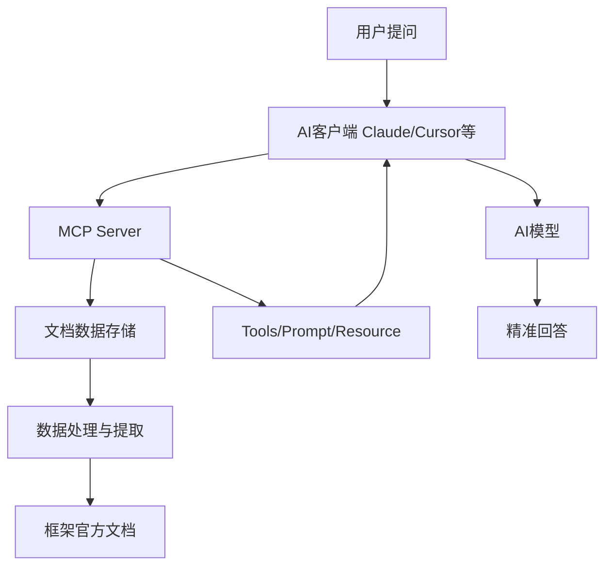
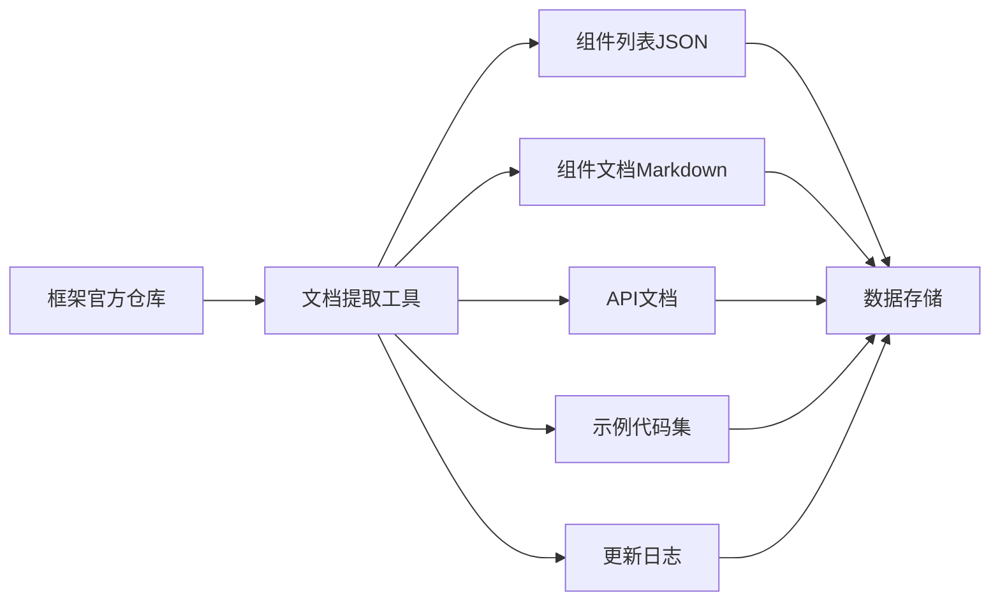
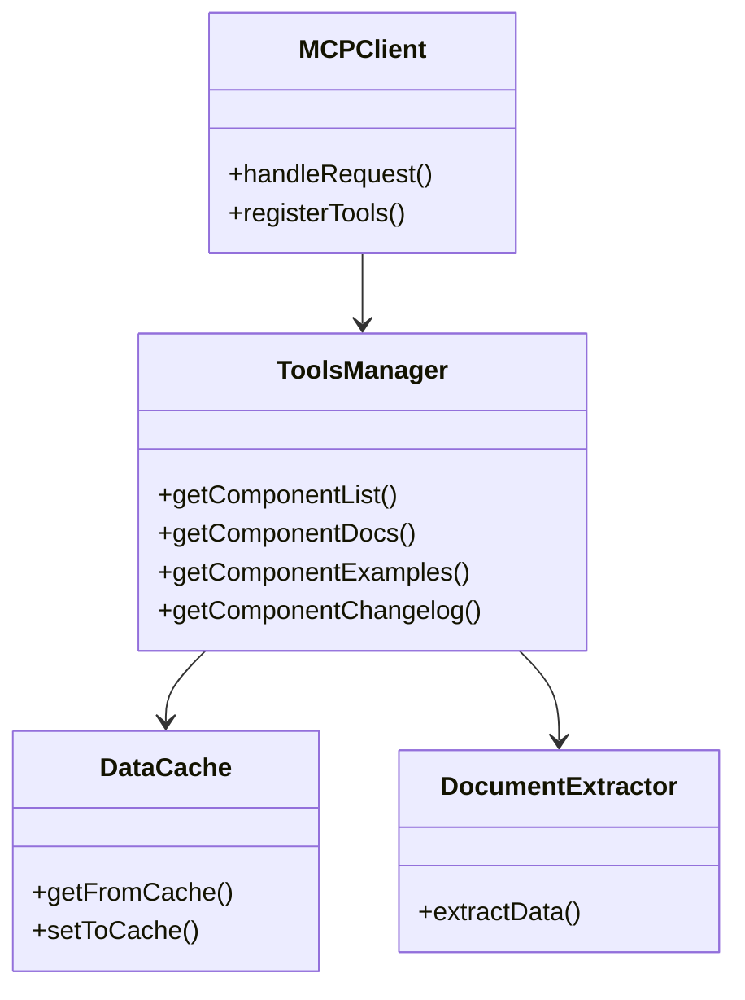
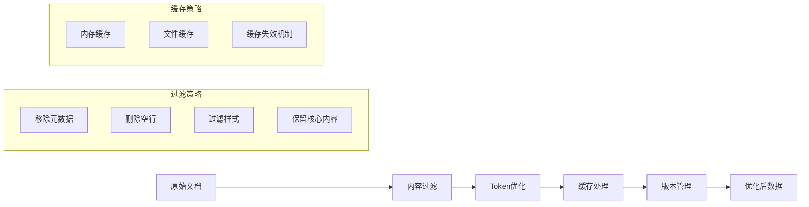

# 前端自建 MCP 服务连接框架文档指南

本文基于《让 AI 更懂 Ant Design：MCP 协议在前端领域的落地实践》的技术方案，提供完整的前端自建 MCP 服务指南。

## 什么是 MCP？

MCP（Model Context Protocol）是一种让大语言模型获取特定领域知识的协议。通过 MCP，可以将框架文档、组件库信息等专业知识提供给 AI 助手，使其能够生成更准确、相关的代码。

## 整体架构设计



## 实施步骤

### 第一步：环境准备与技术选型

```bash
# 创建 MCP 项目
mkdir my-framework-mcp
cd my-framework-mcp
npm init -y

# 安装必要依赖
npm install @modelcontextprotocol/sdk cheerio marked vfile-matter
npm install -D typescript @types/node
```

### 第二步：文档数据提取方案



### 文档提取工具实现

```typescript
// extractor.ts
import fs from 'fs';
import path from 'path';
import matter from 'vfile-matter';

class FrameworkExtractor {
  constructor(private repoPath: string) {}

  // 提取组件列表
  async extractComponentList(): Promise<Component[]> {
    const componentsDir = path.join(this.repoPath, 'components');
    const components = [];

    for (const componentName of fs.readdirSync(componentsDir)) {
      const componentPath = path.join(componentsDir, componentName);
      if (fs.statSync(componentPath).isDirectory()) {
        const meta = await this.extractComponentMeta(componentName);
        components.push(meta);
      }
    }

    return components;
  }

  // 提取组件文档
  async extractComponentDocs(componentName: string): Promise<string> {
    const docPath = path.join(this.repoPath, 'components', componentName, 'index.md');
    return this.optimizeContent(fs.readFileSync(docPath, 'utf-8'));
  }

  // 优化内容节省token
  private optimizeContent(content: string): string {
    // 移除元数据、空行、样式等无用内容
    return content
      .replace(/---[\s\S]*?---/g, '')
      .replace(/\n\s*\n/g, '\n')
      .trim();
  }
}
```

### 第三步：MCP Server 开发

#### MCP 服务核心结构



#### MCP 服务实现

```typescript
// server.ts
import { Server } from '@modelcontextprotocol/sdk/server';
import { McpServer } from '@modelcontextprotocol/sdk';

class FrameworkMCPServer {
  private server: McpServer;

  constructor() {
    this.server = new McpServer({
      name: 'my-framework-mcp',
      version: '1.0.0',
    });

    this.registerTools();
  }

  private registerTools() {
    // 工具1: 获取组件列表
    this.server.tool('get_component_list', { componentType: 'string?' }, async ({ componentType }) => {
      const components = await this.getComponentList(componentType);
      return {
        content: [{ type: 'text', text: JSON.stringify(components) }],
      };
    });

    // 工具2: 获取组件文档
    this.server.tool('get_component_docs', { componentName: 'string' }, async ({ componentName }) => {
      const docs = await this.getComponentDocs(componentName);
      return {
        content: [{ type: 'text', text: docs }],
      };
    });

    // 更多工具...
  }

  async start() {
    await this.server.start();
  }
}
```

### 第四步：Prompt 设计优化

```typescript
// 系统提示词设计
const SYSTEM_PROMPTS = {
  systemDescription: `# 角色设定
你是一个专业的${frameworkName}组件库专家助手，专注于提供准确、高效的组件技术支持。

## 技能
### 组件查询 - 快速检索和列出所有可用组件
### 文档解析 - 精确获取组件的props、API和用法说明
### 代码示例查询 - 精确获取组件的代码示例
### 代码生成 - 提供完整可运行的代码示例
### 版本追踪 - 查询组件的更新历史和变更内容

## 规则
1. 上下文优先：优先使用已有对话信息
2. 精确匹配：组件名称和props必须与官方文档一致
3. 最小工具调用：避免重复查询
4. 完整示例：代码必须包含完整上下文`,
};
```

### 第五步：客户端配置

#### Claude Desktop 配置

```json
// claude_desktop_config.json
{
  "mcpServers": {
    "My Framework Components": {
      "command": "npx",
      "args": ["my-framework-mcp"]
    }
  }
}
```

### 第六步：数据处理优化策略



## 最佳实践建议

- **数据版本管理**：为每个框架版本维护独立的文档数据
- **缓存策略**：实现多级缓存减少 IO 操作
- **Token 优化**：定期使用 OpenAI Tokenizer 检查内容长度
- **错误处理**：完善的错误处理和降级方案
- **性能监控**：添加性能指标和日志记录

## 扩展可能性

- **多框架支持**：适配 Ant Design、Element UI、Material UI 等流行框架
- **实时更新**：监控框架更新自动提取最新文档
- **自定义扩展**：支持团队内部组件库的集成
- **性能分析**：添加使用统计和性能分析功能

## 总结

通过自建 MCP 服务，可以将任何前端框架的文档知识集成到 AI 助手中，显著提升开发效率和代码质量。关键在于：

1. **完整的数据提取方案**
2. **高效的 MCP Tools 设计**
3. **智能的 Prompt 优化**
4. **性能优化的实现**

这种方案不仅适用于组件库，也可以扩展到 API 文档、设计系统、业务规范等任何需要 AI 辅助的领域。
