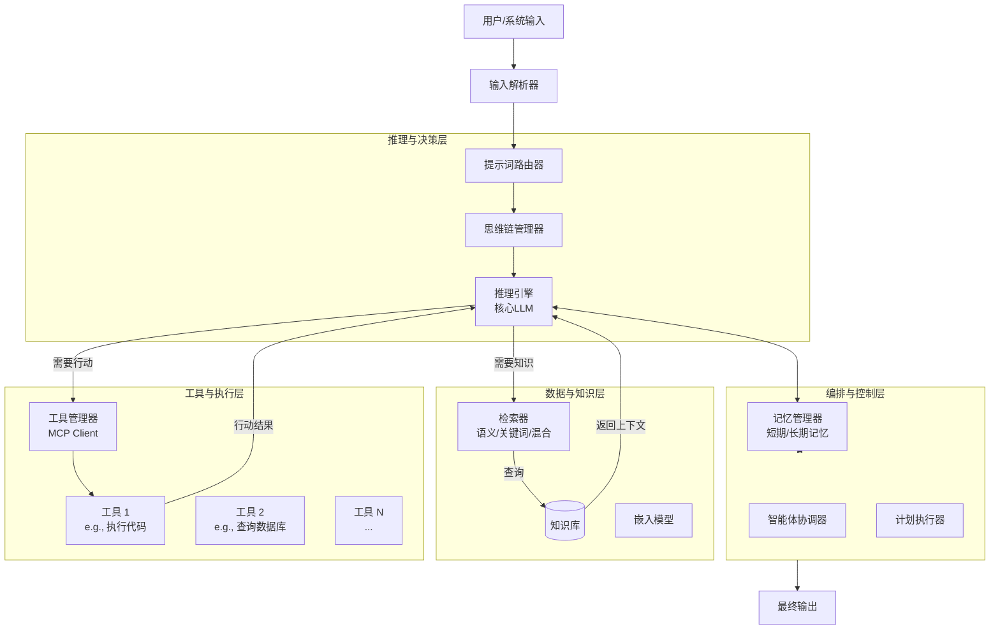
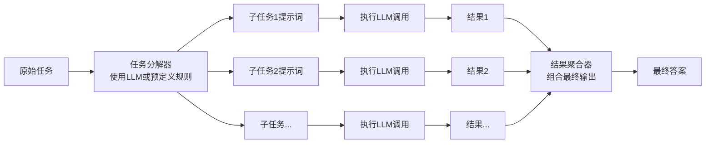
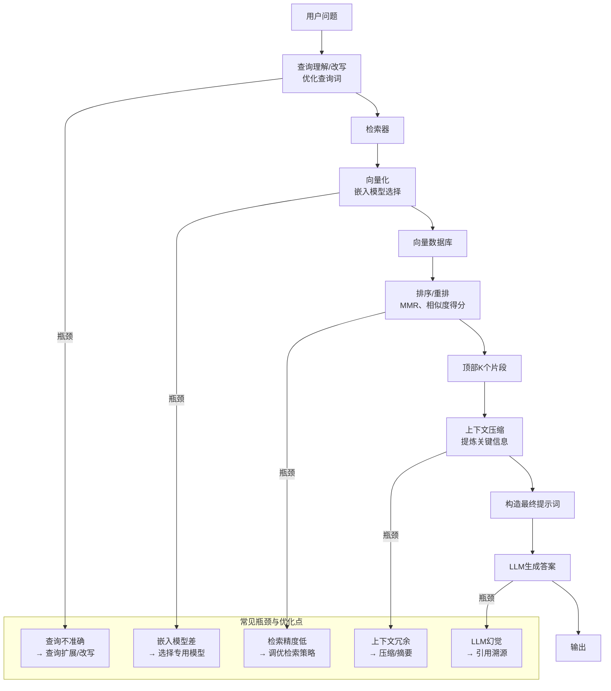
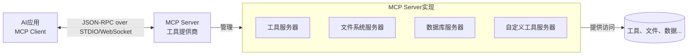

# AI Agent 构建实战指南详解

好的，我们来对这篇 **《AI Agent 构建实战指南》** 进行终极详细的、原子级的拆解。这篇文章的价值在于它将抽象的 AI 能力转化为可工程化的**具体组件、设计模式和最佳实践**。

为了让您彻底掌握其精髓，我将构建一个完整的**AI Agent 架构图**，并逐一拆解每个模块的技术细节、实现方法和设计考量。

## 全局架构总览：一个成熟 AI Agent 系统的核心组件

首先，我们通过下面这张图俯瞰一个完整 AI Agent 系统的全貌，它集成了指南中提到的所有核心模块：



上图展示了一个工业级 AI Agent 的完整技术栈。接下来，我们像拆解精密仪器一样，深入每一个模块。

---

### 模块一：结构化提示词工程 - 深度拆解

这是控制 LLM 行为的“编程语言”，其复杂度和精细度远超简单问答。

#### 1.1 提示链 (Chain-of-Thought) 的工程实现

不仅仅是概念，而是需要实现的**具体模式**。



**关键技术点:**

- **任务分解策略**: 可以是**静态模板**（固定步骤）、**LLM 动态分解**（让 LLM 自己规划步骤）或**两者结合**。
- **上下文传递**: 如何将子任务 1 的结果`${result1}`作为变量嵌入到子任务 2 的提示词中。
- **错误处理**: 某个子步骤失败时，是重试、跳过还是报错？需要有**断路机制**。

#### 1.2 提示路由 (Router) 的详细设计

其本质是一个**分类器**，将输入分配到不同的处理管道。

**实现方案对比:**
| 方案 | 实现方式 | 优点 | 缺点 | 适用场景 |
| :--- | :--- | :--- | :--- | :--- |
| **规则路由** | 基于关键词、正则表达式 | 简单、快速、稳定 | 灵活性差，无法处理新意图 | 简单、固定的任务类型 |
| **LLM 路由** | 使用小 LLM 或大 LLM 进行意图识别 | 极其灵活，能理解细微差别 | 延迟高，成本高，可能出错 | 复杂、开放的对话场景 |
| **混合路由** | 先规则匹配，失败再走 LLM | 兼顾效率和覆盖率 | 系统复杂度增加 | 大多数生产环境 |

**示例提示词 (LLM 路由):**

```python
# 系统提示词
你是一个路由助手。请分析用户的输入，并将其分类到以下选项之一：
- "general_qa": 一般知识问答，如“太阳为什么是圆的？”
- "code_analysis": 代码相关，如“解释这段Python代码”
- "command": 需要执行命令，如“请帮我重启服务”
- "unknown": 无法识别

请只输出类别名称，不要输出其他任何内容。

用户输入: ${user_input}
```

#### 1.3 结构化输出的严格约束

这是实现**LLM 与程序自动化集成**的关键。必须使用 LLM 提供的结构化输出功能（如 OpenAI 的`response_format={ "type": "json_object" }`）。

**高级技巧：JSON Schema 约束**
不仅可以要求输出 JSON，还可以规定 JSON 的**具体结构、字段类型和枚举值**，极大提升输出稳定性。

```python
# 提示词示例
请生成一个关于诗人的简介。输出必须严格遵守以下JSON Schema定义：

{
  "$schema": "http://json-schema.org/draft-07/schema#",
  "type": "object",
  "properties": {
    "name": { "type": "string" },
    "dynasty": { "type": "string" },
    "representative_works": {
      "type": "array",
      "items": { "type": "string" }
    },
    "overview": { "type": "string" }
  },
  "required": ["name", "dynasty", "overview"]
}

诗人：李白
```

---

### 模块二：上下文工程与知识检索 - 深度拆解

RAG 不是简单的“搜索->回答”，而是一个需要精细调优的**搜索引擎系统**。

#### 2.1 RAG 管道全流程及瓶颈分析

一个生产级的 RAG 包含多个环节，每个环节都有其优化点：



#### 2.2 高级检索模式详解

- **混合检索 (Hybrid Search)**

  - **工作原理**: 同时执行**向量搜索**（语义相似）和**全文搜索**（关键词匹配），然后将两者的结果集进行**融合重排**（如使用 Reciprocal Rank Fusion - RRF 算法）。
  - **优势**: 兼顾召回率（Recall）和精确率（Precision）。既能找到语义相关但没出现关键词的文档，也能精准命中含有关键词的段落。

- **智能体化检索 (Agentic RAG)**
  这是 RAG 的终极形态，将检索的控制权交给 LLM 本身。

  ```mermaid
  flowchart TD
      A[复杂问题] --> B[LLM分析<br>生成搜索策略]
      B --> C[生成搜索查询1]
      C --> D[执行检索]
      D --> E[评估结果]
      E -- 不充分 --> B
      E -- 充分 --> F[合成最终答案]
      B --> G[生成搜索查询2]
      G --> D
  ```

  **示例**: 用户问“我们的竞争对手产品 Y 最近有什么动态？”。LLM 可能自主生成多条查询策略：

  1. `“竞争对手Y 最新产品发布”` (搜索新闻)
  2. `“Y公司 财报 2024”` (搜索财经文档)
  3. `“产品Y 用户评价”` (搜索社区论坛)
     它会持续检索、评估，直到认为自己掌握了足够的信息来回答。

---

### 模块三：工具使用 - 深度拆解

工具是 Agent 的“手脚”，其设计直接关系到系统的**能力、安全性和可靠性**。

#### 3.1 工具设计的“SOLID”原则

借鉴软件工程的思想，优秀的工具设计应遵循：

- **单一职责原则 (Single Responsibility)**: 如 `send_email` 工具只负责发送邮件，不应包含编辑邮件内容的功能。
- **开闭原则 (Open/Closed)**: 工具的功能应该是扩展的（通过添加新工具），而非修改已有的工具。
- **清晰接口原则**: 工具的描述（name, description, parameters）就是它的 API 文档，必须对人类和机器都清晰易懂。
- **无状态原则**: 工具调用 ideally 应该是无状态的，输出只由输入决定，这简化了错误重试和调试。

#### 3.2 MCP (Model Context Protocol) 详解

MCP 是一个**客户端-服务器协议**，它解决了“每个 AI 应用都要重复造一遍工具连接轮子”的问题。



- **工作方式**: AI 应用（Client）启动时连接到 MCP Server。Server 告诉 Client“我这里提供了哪些工具（函数）和资源（数据源）”。Client 在需要时通过 JSON-RPC 调用 Server 提供的工具。
- **巨大优势**:
  1. **解耦**: AI 应用与工具实现完全分离，可以独立开发和更新。
  2. **标准化**: 任何实现了 MCP 协议的工具，都可以被任何支持 MCP 的 AI 应用使用。
  3. **安全性**: 工具运行在独立的 Server 进程中，权限更容易控制。

---

### 模块四：智能体规划与协作 - 深度拆解

多智能体系统是一个**分布式系统**，需要解决规划、通信、协调等经典分布式问题。

#### 4.1 智能体内部推理循环：ReAct 模式

这是单个智能体做决策的**核心算法循环**，完美体现了“思考-行动”的结合。

```mermaid
flowchart TD
    A[思考 Thought] --> B[评估当前状态<br>分析下一步]
    B --> C[行动 Action]<br>调用工具/生成回复
    C --> D[观察 Observation]<br>获取工具结果/用户反馈
    D --> E{任务完成?}
    E -- 否 --> A
    E -- 是 --> F[输出最终结果]
```

**代码示例 (ReAct 循环伪代码):**

```python
def react_loop(initial_task):
    context = initial_task
    for step in range(MAX_STEPS):
        # 思考：生成下一步计划
        prompt = f"基于当前上下文，你的下一步思考和行动是什么？上下文：{context}"
        reasoning = llm.generate(prompt)

        # 决定行动：是结束，还是调用工具？
        if "最终答案" in reasoning:
            return extract_final_answer(reasoning)
        else:
            # 解析出要调用的工具和参数
            tool_name, params = parse_tool_call(reasoning)
            # 执行行动
            result = call_tool(tool_name, params)
            # 观察：将结果纳入上下文
            context += f"\n行动结果: {result}"
    return "任务超时失败"
```

#### 4.2 多智能体协作架构模式

##### 模式一：主从模式 (Manager-Worker)

- **架构**: 一个**管理智能体**（Manager）负责接收任务、制定规划、分解子任务并分配给多个**工作智能体**（Worker），最后汇总结果。
- **优点**: 结构清晰，易于控制和调试。
- **缺点**: Manager 容易成为性能和单点故障的瓶颈。

##### 模式二：平等协作模式 (Swarm)

- **架构**: 多个智能体地位平等，通过**共享工作区**（Blackboard）或**消息总线**进行通信。智能体"监听"与自己相关的任务，自主"认领"并执行。
- **优点**: 去中心化，扩展性强，容错性好。
- **缺点**: 系统行为更复杂，难以预测和调试。

##### 模式三：流水线模式 (Pipeline)

- **架构**: 任务像流水线一样被处理，每个智能体完成一道特定工序，然后将结果传递给下一个智能体。
- **优点**: 高效率，适合流程固定的任务。
- **缺点**: 不灵活，一个环节失败会导致整个流水线中断。

### 总结：工程化的思维框架

这篇指南的伟大之处在于，它提供了**一整套构建 AI 系统的思维框架和工具箱**：

1. **分而治之**: 用**提示链**和**多智能体**分解复杂问题。
2. **依赖注入**: 用**RAG**和**工具**为 LLM 注入知识和能力。
3. **标准化接口**: 用**结构化输出**和**MCP**定义清晰的人机、机机协作契约。
4. **控制流**: 用**路由**和**规划器**管理复杂的逻辑流程。
5. **持续改进**: 通过**评估**和**反思**环节，让整个系统能够从错误中学习并优化。

它标志着 AI 开发从“炼金术”走向了“工程学”。开发者不再是漫无目的地提示 LLM，而是像建筑师一样，精心设计和组装这些模块化的组件，最终构建出稳定、强大、可预测的 AI 应用系统。
