# 基于 MCP 的智能 API 文档查询服务开发实践

## 一、服务概述

### 1.1 背景与痛点

在现代前端开发中，我们经常面临这样的场景：

- **AI 无法访问内网**：YApi 等文档平台部署在内网，AI 助手无法直接访问
- **文档查询繁琐**：需要频繁切换到 YApi 平台查找接口定义，打断开发思路
- **新人上手成本高**：需要熟悉大量接口文档才能开始工作

### 1.2 解决方案

本项目实现了一个基于 **MCP (Model Context Protocol)** 的 API 文档查询服务，作为 AI 助手访问内网 YApi 的桥梁，让 AI 能够按需获取和理解后端接口文档。

**MCP** 是由 Anthropic 推出的开放协议，旨在让 AI 模型能够安全地访问外部数据源和工具。通过 MCP，AI 助手可以：

- 突破内网限制，访问 YApi 文档
- 按需查询最新的 API 文档
- 理解接口的请求参数、响应结构
- 自动生成接口调用代码

### 1.3 核心价值

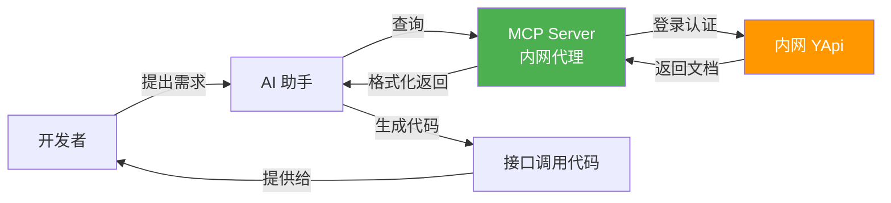

通过这个服务，开发者只需要告诉 AI："帮我实现这个接口"，AI 就能自动：

1. 通过 MCP Server 访问内网 YApi
2. 查询接口文档获取完整定义
3. 理解请求参数和响应结构
4. 生成接口调用代码

## 二、系统架构

- 技术栈：Python 3.12 | FastAPI | FastMCP | Docker | Nginx | SSE
- 开发环境：Docker | Docker Compose
- 文档系统：YApi（当前版本仅支持 YApi）
- AI 平台：Cursor IDE
- 协议：MCP (Model Context Protocol)

### 2.1 整体架构

系统采用经典的四层架构设计，每层职责清晰，便于维护和扩展：

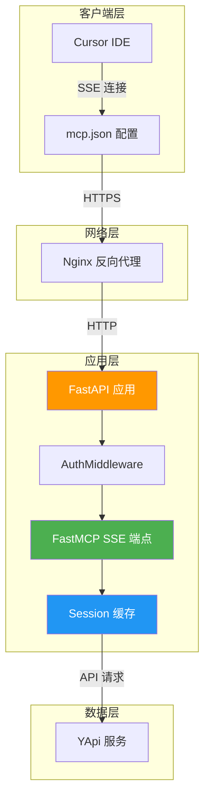

**架构说明：**

- **客户端层**：Cursor IDE 通过配置文件声明 MCP 服务端点，建立连接后自动维持会话
- **网络层**：Nginx 作为反向代理，提供 HTTPS 加密、长连接保持、CORS 处理等功能
- **应用层**：FastAPI + FastMCP 实现 MCP 协议，AuthMiddleware 负责认证和会话管理
- **数据层**：YApi 作为接口文档的数据源，通过 RESTful API 提供文档查询能力

### 2.2 技术选型

| 层级        | 技术                     | 作用                         | 选型理由                                         |
| ----------- | ------------------------ | ---------------------------- | ------------------------------------------------ |
| 通信协议    | SSE (Server-Sent Events) | 服务端主动推送，单向实时通信 | 原生 HTTP、自动重连、代理友好、满足 MCP 协议需求 |
| Web 框架    | FastAPI                  | 高性能异步 Web 服务          | 原生异步支持、类型提示、自动文档生成             |
| MCP 框架    | FastMCP                  | MCP 协议快速实现             | 简化 MCP 开发、内置 SSE 支持、装饰器友好         |
| 容器化      | Docker + Docker Compose  | 环境隔离与快速部署           | 一致性环境、一键部署、便于迁移                   |
| 反向代理    | Nginx                    | HTTPS 终止、长连接、负载均衡 | 高性能、稳定可靠、丰富的配置选项                 |
| HTTP 客户端 | Requests + Session       | HTTP 请求与会话保持          | 简单易用、Session 自动管理 Cookie                |
| 日志框架    | Python logging           | 结构化日志记录               | 标准库、支持多种输出、便于调试                   |
| 环境管理    | python-dotenv            | 环境变量配置管理             | 开发/生产环境分离、敏感信息保护                  |

## 三、核心技术模块

### 3.1 认证与会话管理

系统采用多层认证机制，确保安全性的同时保持良好的用户体验。核心解决了两个挑战：

1. **多用户并发认证**：不同开发者可能同时使用服务，需要隔离各自的登录状态
2. **长连接会话保持**：SSE 连接和消息请求是分离的，需要关联它们的认证上下文

#### 认证流程设计

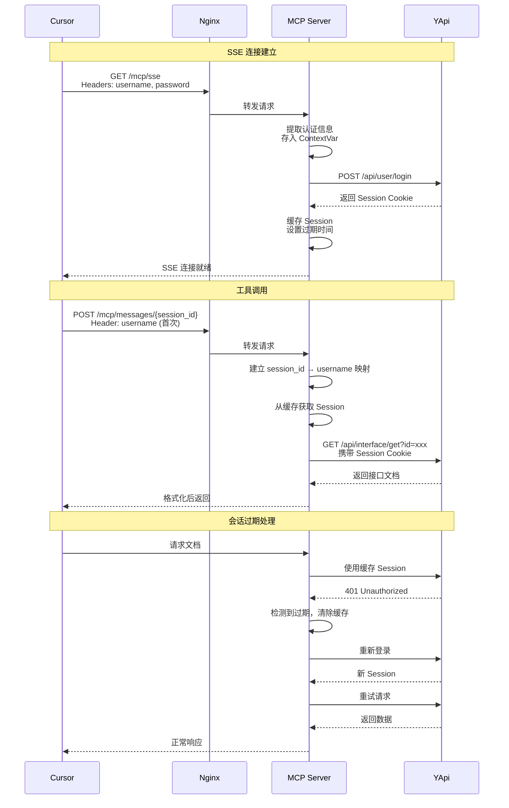

#### 核心实现要点

**1. ContextVar 跨协程共享认证信息**

```python
current_request_auth: ContextVar[Dict[str, Optional[str]]] = ContextVar(
    'current_request_auth',
    default={'username': None, 'password': None}
)
```

**为什么使用 ContextVar？**

在异步 Web 应用中，多个请求可能并发处理。如果使用全局变量存储认证信息，会导致数据混乱：

- **全局变量**：用户 A 的认证信息可能被用户 B 覆盖
- **线程局部存储（threading.local）**：在异步环境中不适用，因为多个请求可能在同一线程中处理
- **ContextVar**：为每个异步任务（协程）提供独立的上下文，天然支持异步并发

`ContextVar` 会在每个请求的整个处理链中自动传递，无需手动传参，同时保证不同请求之间的隔离。

**2. Session 缓存设计**

Session 缓存是系统性能优化的核心，避免频繁登录造成的性能问题和被限流风险。

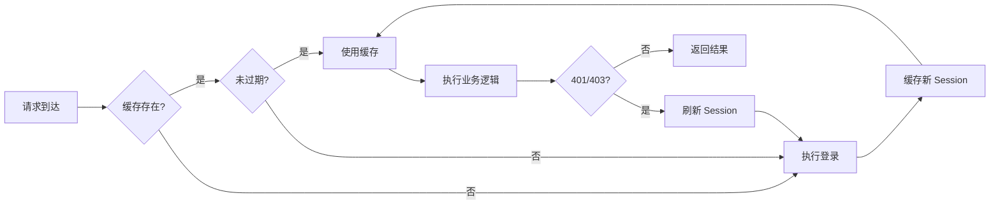

**缓存策略细节：**

- **时间过期检测**：每次获取 Session 时检查 `time.time() - timestamp > SESSION_EXPIRE_TIME`
- **状态过期检测**：请求返回 401/403 时自动触发刷新
- **线程安全**：使用 `threading.Lock` 保护缓存字典的读写操作
- **自动清理**：过期的 Session 在检测时自动从缓存中移除

**性能收益：**

假设 30 天过期时间，每天查询 50 次文档：

- 传统方案：50 次登录 × 30 天 = 1500 次登录请求
- 缓存方案：1 次登录 + 50 次查询 × 30 天 = 仅 1 次登录

登录请求减少 **99.93%**，同时避免了被接口限流的风险。

**3. 会话映射机制**

MCP 协议中，SSE 连接建立后，后续的工具调用通过独立的 HTTP POST 请求发送到 `/mcp/messages/{session_id}`。这就带来一个问题：如何让消息请求知道是哪个用户发起的？

系统通过 `session_id → username` 映射解决这个问题：

```python
session_username_mapping: Dict[str, str] = {}

# SSE 连接时：提供 username + password，建立初始认证
# 消息请求时：
#   - 首次：提供 username，建立映射 session_id → username
#   - 后续：仅需 session_id，从映射中获取 username
```

**映射生命周期：**

1. **建立**：首次 `/mcp/messages/{session_id}` 请求时，提取 username 并建立映射
2. **使用**：后续请求直接使用 `session_username_mapping[session_id]` 获取用户名
3. **清理**：监听 `http.disconnect` 事件，连接断开时自动删除映射

这种设计让客户端在首次请求后无需重复传递 username，减少了数据传输量，同时保持了认证的安全性。

### 3.2 中间件设计

自定义 `AuthMiddleware` 实现细粒度的请求拦截和处理。这是整个系统安全性和可靠性的核心保障。

**为什么需要自定义中间件？**

FastAPI 的依赖注入系统在 SSE 场景下有局限性：

- SSE 连接建立后保持开放，依赖注入只在初始阶段执行一次
- 后续消息请求需要独立的认证逻辑
- 需要在 ASGI 层面监听连接断开事件

因此，我们实现了 ASGI 中间件，在更底层控制请求处理流程。

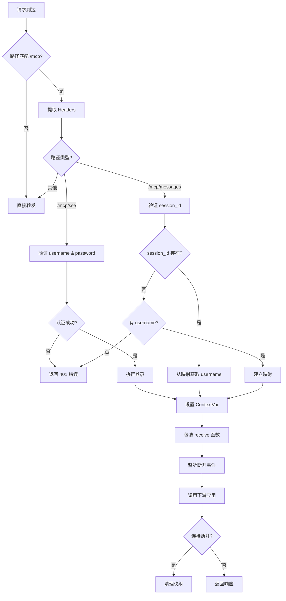

#### 1. 异步连接监听

传统的请求-响应模式下，请求结束即释放资源。但 SSE 是长连接，如何知道客户端断开了？

```python
async def wrapped_receive():
    message = await receive()
    if message.get("type") == "http.disconnect":
        # 客户端断开，清理 session_id 映射
        cleanup_session(session_id)
    return message

# 用包装后的 receive 替换原始的
await self.app(scope, wrapped_receive, send)
```

通过包装 ASGI 的 `receive` 函数，我们能够监听 `http.disconnect` 事件，在客户端断开时立即清理资源，避免内存泄漏。

#### 2. 灵活的认证策略

不同端点有不同的认证需求：

| 端点                   | 认证要求              | 原因                         |
| ---------------------- | --------------------- | ---------------------------- |
| `/mcp/sse`             | username + password   | 初始连接，需要完整认证并登录 |
| `/mcp/messages` (首次) | session_id + username | 建立会话映射                 |
| `/mcp/messages` (后续) | 仅 session_id         | 从映射获取用户，减少传输     |
| `/mcp/health`          | 无需认证              | 健康检查应该始终可访问       |

这种分层认证既保证了安全性，又优化了性能和用户体验。

#### 3. 详细的日志追踪

每个关键步骤都有结构化日志：

- **INFO**：正常流程（连接建立、Session 缓存命中、文档获取成功）
- **WARNING**：可恢复异常（Session 过期、自动重登）
- **ERROR**：严重错误（认证失败、接口异常）

日志包含用户名、session_id、客户端 IP 等上下文信息，便于追踪问题和性能分析。

### 3.3 数据处理流水线

从用户输入 URL 到返回格式化文档，系统经历了一系列智能化的数据处理步骤。

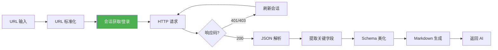

#### 1. URL 自动转换

YApi 的页面 URL 和 API URL 格式不同，系统智能识别并转换：

```python
def convert_to_api_url(page_url: str) -> str:
    """支持页面 URL 和 API URL 两种输入格式"""
    # 输入：http://domain.com/project/123
    # 输出：http://domain.com/api/interface/get?id=123

    # 输入：http://domain.com/api/interface/get?id=123
    # 输出：原样返回（已经是 API URL）
```

开发者通常复制的是 YApi 页面 URL，系统自动识别并转换为 API URL，避免手动转换的繁琐和错误。

#### 2. JSON Schema 美化

YApi 返回的请求体和响应体是 JSON 字符串，直接展示不易阅读：

```python
def parse_json_schema(schema_str: str) -> str:
    """解析并美化 JSON Schema"""
    try:
        schema = json.loads(schema_str)
        return json.dumps(schema, indent=2, ensure_ascii=False)
    except (json.JSONDecodeError, TypeError):
        return schema_str  # 解析失败时返回原始字符串
```

#### 3. 批量查询支持

AI 可以一次性查询多个接口文档：

```python
async def fetch_api_docs(url: str | list[str]) -> str:
    """支持单个 URL 或 URL 列表"""
    urls = url if isinstance(url, list) else [url]
    # 批量获取并合并结果
```

### 3.4 错误处理与重试

系统设计了完善的错误处理和自动重试机制，确保高可用性和良好的用户体验。

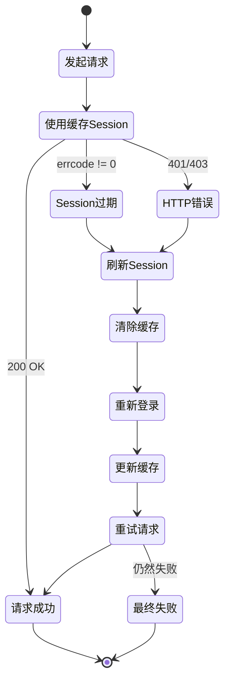

**重试策略：**

系统通过两层检测机制（业务层 errcode 和 HTTP 状态码）自动识别 Session 过期，并自动刷新重试，用户完全无感知。

**容错边界：**

| 错误类型        | 处理方式               | 用户影响     |
| --------------- | ---------------------- | ------------ |
| Session 过期    | 自动刷新并重试         | 零感知       |
| 网络临时故障    | 抛出异常，显示错误信息 | 看到错误提示 |
| 接口不存在      | 返回友好错误信息       | 看到错误提示 |
| YApi 服务不可用 | 抛出异常               | 看到错误提示 |

只有 Session 过期这类可恢复的错误才会自动重试，其他错误直接返回，避免无意义的重试浪费资源。

### 3.5 通信协议选择

**为什么使用 SSE (Server-Sent Events)？**

MCP 协议支持多种传输方式，对比分析后选择了 SSE：

| 方案      | 优点                   | 缺点                 | 适用性      |
| --------- | ---------------------- | -------------------- | ----------- |
| HTTP 轮询 | 实现简单               | 资源浪费、延迟高     | ❌ 不适用   |
| WebSocket | 真正的双向通信、低延迟 | 协议复杂、代理支持差 | 🔶 过度设计 |
| SSE       | 原生 HTTP、自动重连    | 仅支持单向推送       | ✅ 最佳选择 |

**SSE 的核心优势：**

- **原生 HTTP**：基于标准 HTTP 协议，无需特殊握手，代理友好
- **自动重连**：连接断开后浏览器自动重新连接
- **满足需求**：MCP 是"请求-响应"模式，不需要服务端主动推送，单向通信足够
- **简单实现**：服务端只需设置 `Content-Type: text/event-stream`

### 3.6 异步资源清理

**核心挑战：** SSE 长连接可能持续数天，客户端随时可能断开，如何及时清理资源？

**解决方案：** 包装 ASGI `receive` 函数监听断开事件

```python
async def wrapped_receive():
    message = await receive()
    if message.get("type") == "http.disconnect":
        cleanup_session(session_id)
    return message

await self.app(scope, wrapped_receive, send)
```

通过监听 `http.disconnect` 事件，在客户端断开时立即清理 `session_id → username` 映射，确保：

- **及时清理**：连接断开立即释放资源
- **避免内存泄漏**：映射字典不会无限增长
- **准确追踪**：日志记录活跃会话数，便于监控

## 四、部署架构

### 4.1 容器化部署

采用 Docker 容器化部署，实现"一次构建，到处运行"的目标。

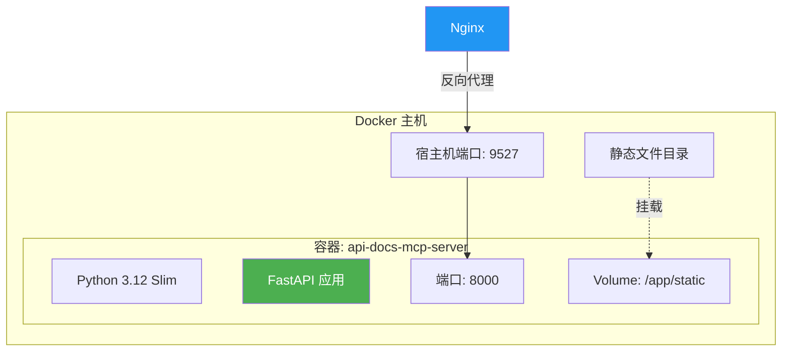

**容器化优势：** 环境一致性、快速部署、资源隔离、易于迁移。

#### Dockerfile 设计要点

```dockerfile
FROM python:3.12-slim  # 使用精简版本，减小镜像体积

# 配置国内 pip 镜像源，加速依赖安装
RUN pip config set global.index-url https://pypi.tuna.tsinghua.edu.cn/simple

# 分层构建：先复制 requirements.txt，利用 Docker 缓存
COPY requirements.txt .
RUN pip install --no-cache-dir -r requirements.txt

# 最后复制应用代码，避免代码变更导致依赖重装
COPY api-docs-mcp-server.py .
```

镜像优化：使用 slim 镜像、禁用 pip 缓存、分层构建利用缓存。

#### Docker Compose 配置要点

```yaml
environment:
  - SESSION_EXPIRE_TIME=2592000 # 30天，平衡安全性和便利性
  - SERVER_HOST=0.0.0.0 # 监听所有网卡，允许外部访问
  - SERVER_PORT=8000 # 容器内端口

ports:
  - '9527:8000' # 宿主机:容器，对外暴露 9527

volumes:
  - ./static:/app/static # 挂载静态文件目录（可选）

healthcheck:
  test: ['CMD', 'curl', '-f', 'http://localhost:8000/mcp/health']
  interval: 30s # 每 30 秒检查一次
  timeout: 10s # 超时时间 10 秒
  retries: 3 # 失败 3 次后标记为 unhealthy

restart: unless-stopped # 异常退出时自动重启
```

健康检查确保服务高可用：连续 3 次失败自动重启容器。

### 4.2 Nginx 配置解析

Nginx 作为反向代理，承担了 HTTPS 终止、长连接保持、CORS 处理等重要职责。SSE 长连接对 Nginx 配置有特殊要求。

```nginx
location /mcp/ {
    # 核心配置
    proxy_pass http://127.0.0.1:9527/mcp/;
    proxy_http_version 1.1;

    # SSE 关键配置
    proxy_buffering off;           # 禁用缓冲
    proxy_cache off;               # 禁用缓存
    chunked_transfer_encoding on;  # 分块传输

    # 超长超时
    proxy_connect_timeout 7d;
    proxy_send_timeout 7d;
    proxy_read_timeout 7d;

    # CORS 支持
    add_header Access-Control-Allow-Origin '*' always;
    add_header Access-Control-Allow-Methods 'GET, POST, OPTIONS' always;
}
```

**为什么需要这些配置？**

| 配置项                         | 原因                                 | 不配置的后果                   |
| ------------------------------ | ------------------------------------ | ------------------------------ |
| `proxy_buffering off`          | SSE 需要实时推送，缓冲会阻塞数据流   | 消息延迟，甚至完全无法接收     |
| `proxy_cache off`              | 禁用缓存，确保实时数据               | 可能缓存旧数据，导致信息不一致 |
| `7d` 超时                      | SSE 连接是长连接，需要保持数周不断开 | 连接频繁断开，用户体验差       |
| `chunked_transfer_encoding on` | 支持流式传输，避免等待完整响应       | 无法流式传输，SSE 无法工作     |
| `Connection ''`                | 清除 Connection 头，保持连接持久化   | 连接可能被提前关闭             |
| `proxy_http_version 1.1`       | HTTP/1.1 才支持长连接                | 默认 HTTP/1.0 不支持长连接     |

**CORS 配置说明：**

```nginx
add_header Access-Control-Allow-Origin '*' always;
add_header Access-Control-Allow-Methods 'GET, POST, OPTIONS' always;
add_header Access-Control-Allow-Headers 'Content-Type, Authorization' always;
```

允许跨域访问，`always` 确保错误响应也携带 CORS 头（否则浏览器会报 CORS 错误而非真实错误）。

**性能优化配置：**

```nginx
client_max_body_size 10M;        # 允许上传 10MB 大小的请求体
client_body_buffer_size 10M;     # 缓冲区大小，避免写入临时文件
proxy_set_header X-Real-IP $remote_addr;           # 传递真实 IP
proxy_set_header X-Forwarded-For $proxy_add_x_forwarded_for;  # 传递代理链
```

### 4.3 部署流程


**完整部署步骤：**

```bash
# 步骤 1：克隆代码（如果尚未克隆）
git clone <repository-url>
cd project/tools/mcp

# 步骤 2：创建 .env 文件（可选，也可以在 docker-compose.yml 中配置）
cat > .env << EOF
API_USERNAME=your-email@example.com
API_PASSWORD=your-password
LOGIN_URL=https://yapi.your-domain.com/api/user/login
SESSION_EXPIRE_TIME=2592000
SERVER_HOST=0.0.0.0
SERVER_PORT=8000
EOF

# 步骤 3：构建并启动容器
docker-compose up -d --build

# 步骤 4：查看启动日志
docker-compose logs -f api-docs-mcp

# 步骤 5：验证服务健康
curl http://localhost:9527/mcp/health

# 步骤 6：配置 Nginx（参考前文配置）
sudo vim /etc/nginx/sites-available/your-domain.conf
sudo nginx -t
sudo systemctl reload nginx

# 步骤 7：验证 HTTPS 访问
curl https://your-domain.com/mcp/health
```

**常用运维命令：**

```bash
# 查看容器状态
docker-compose ps

# 查看实时日志
docker-compose logs -f

# 重启服务
docker-compose restart

# 停止服务
docker-compose down

# 更新代码后重新部署
git pull
docker-compose up -d --build

# 进入容器调试
docker-compose exec api-docs-mcp bash
```

## 五、客户端配置

### 5.1 mcp.json 配置

Cursor IDE 通过 `~/.cursor/mcp.json` 文件配置 MCP 服务器连接：

```json
{
  "api-docs-server": {
    "comment": "获取惠灏后端接口API文档的MCP服务",
    "url": "https://base-quake.huihaohealth.com/mcp/sse",
    "headers": {
      "username": "user@example.com",
      "password": "your-password"
    }
  }
}
```

**配置项说明：**

- `api-docs-server`：服务器名称，自定义标识符
- `comment`：注释说明，帮助理解服务用途
- `url`：MCP SSE 端点地址，必须是 `/mcp/sse` 路径
- `headers`：认证信息，在每个请求中自动携带
  - `username`：YApi 登录邮箱
  - `password`：YApi 登录密码

**安全建议：** 设置文件权限为 600，不要提交到版本控制，定期更换密码。

**多环境配置：**

可以配置多个 MCP 服务器：

```json
{
  "api-docs-server": {
    "url": "https://prod-api-docs.example.com/mcp/sse",
    "headers": { "username": "user@example.com", "password": "prod-pass" }
  },
  "api-docs-test": {
    "url": "https://test-api-docs.example.com/mcp/sse",
    "headers": { "username": "user@example.com", "password": "test-pass" }
  }
}
```

AI 会自动发现所有配置的 MCP 服务器，你可以指定使用哪一个。

### 5.2 使用工作流

完整的用户使用流程如下：

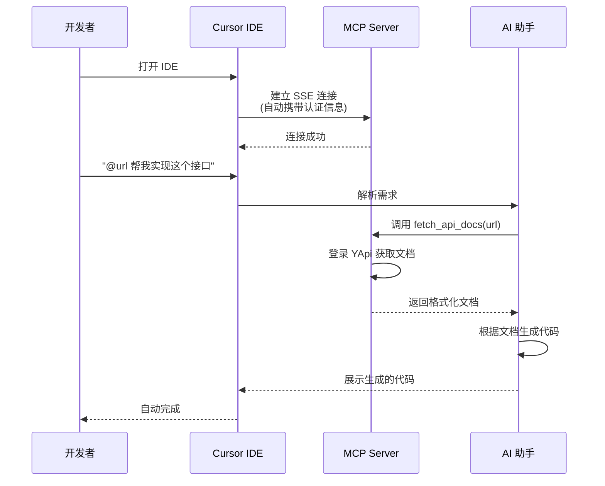

**实际使用示例：**

```
开发者：@https://yapi.example.com/project/interface/api/12345 帮我实现这个接口

AI：正在查询接口文档...
    [调用 MCP fetch_api_docs 工具]

    我已经查询到接口文档，这是一个用户登录接口：
    - 请求方式：POST /api/user/login
    - 请求参数：email, password
    - 响应：包含 token 和用户信息

    以下是实现代码：

    /**
     * 用户登录
     * @param {Object} params - 登录参数
     * @param {string} params.email - 用户邮箱
     * @param {string} params.password - 用户密码
     * @returns {Promise<{token: string, userInfo: object}>}
     */
    export const userLogin = params => {
      return api.post('/api/user/login', params)
    }
```

**使用技巧：**

1. **直接粘贴 URL**：从浏览器地址栏复制 YApi 页面 URL 即可，无需转换
2. **批量查询**：`@url1 @url2 @url3 帮我实现这些接口`
3. **追加需求**：`需要加上 Mock 数据支持`
4. **修改代码**：`改用 async/await 语法`

## 六、监控与运维

### 6.1 日志体系

完善的日志体系是系统可观测性的基础。系统实现了分层次、结构化的日志记录。

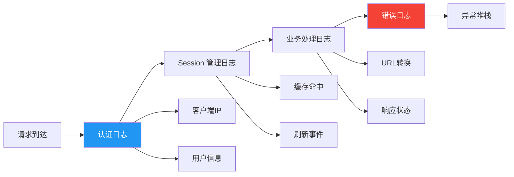

**日志格式设计：**

```python
logging.basicConfig(
    level=logging.INFO,
    format='[%(asctime)s] [MCP][%(levelname)s] %(message)s',
    datefmt='%Y-%m-%d %H:%M:%S'
)
```

- **时间戳**：便于追踪问题发生时间
- **标签 [MCP]**：区分不同服务的日志
- **日志级别**：INFO/WARNING/ERROR，快速定位问题严重程度
- **结构化信息**：用户名、IP、session_id 等关键信息

**完整日志示例：**

```
[2025-11-14 10:00:00] [MCP][INFO] === SSE 连接请求 === 客户端IP: 192.168.1.100, 用户: user@example.com
[2025-11-14 10:00:01] [MCP][INFO] 执行登录（用户: user@example.com）
[2025-11-14 10:00:02] [MCP][INFO] 登录成功（用户: user@example.com）
[2025-11-14 10:00:02] [MCP][INFO] Session 已缓存（用户: user@example.com）
[2025-11-14 10:00:03] [MCP][INFO] SSE 连接已建立（用户: user@example.com）

[2025-11-14 10:01:00] [MCP][INFO] 请求路径: /mcp/messages/abc123, 用户: user@example.com, session_id: abc123
[2025-11-14 10:01:00] [MCP][INFO] 建立会话映射: abc123 -> user@example.com
[2025-11-14 10:01:00] [MCP][INFO] 当前活跃会话数: 1
[2025-11-14 10:01:01] [MCP][INFO] 准备获取 1 个文档
[2025-11-14 10:01:01] [MCP][INFO] 获取文档 [1/1]: https://yapi.example.com/project/123
[2025-11-14 10:01:01] [MCP][INFO] URL 转换: https://yapi.example.com/project/123 -> https://yapi.example.com/api/interface/get?id=123
[2025-11-14 10:01:01] [MCP][INFO] 使用缓存的 Session（用户: user@example.com）
[2025-11-14 10:01:02] [MCP][INFO] 获取数据成功，状态码: 0

[2025-11-14 10:30:00] [MCP][WARNING] Session 已失效，重新登录（用户: user@example.com）
[2025-11-14 10:30:01] [MCP][INFO] 登录成功（用户: user@example.com）
[2025-11-14 10:30:01] [MCP][INFO] Session 已缓存（用户: user@example.com）

[2025-11-14 11:00:00] [MCP][INFO] === 连接断开 === 路径: /mcp/sse, session_id: abc123
[2025-11-14 11:00:00] [MCP][INFO] 清理会话映射: abc123 (用户: user@example.com)
[2025-11-14 11:00:00] [MCP][INFO] 当前活跃会话数: 0
```

**日志分析价值：**

通过日志可以：

1. **性能分析**：统计接口响应时间、Session 缓存命中率
2. **用户行为**：了解哪些接口被频繁查询
3. **问题定位**：异常时查看完整的请求链路
4. **容量规划**：分析并发用户数、请求峰值

**日志最佳实践：**

```python
# 不好的日志：信息不足
logger.info("登录成功")

# 好的日志：包含关键上下文
logger.info(f"登录成功（用户: {username}）")

# 不好的日志：敏感信息暴露
logger.info(f"登录：{username}, {password}")

# 好的日志：脱敏处理
logger.info(f"登录：{username}, 密码: ***")
```

### 6.2 健康检查

Docker Compose 配置了自动健康检查，确保服务异常时能自动恢复。

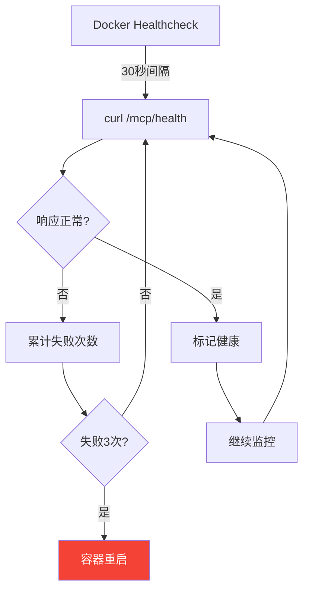

**健康检查机制详解：**

```yaml
healthcheck:
  test: ['CMD', 'curl', '-f', 'http://localhost:8000/mcp/health']
  interval: 30s # 检查间隔
  timeout: 10s # 超时时间
  retries: 3 # 失败重试次数
  start_period: 40s # 启动宽限期
```

**健康检查端点实现：**

```python
@app.api_route("/mcp/health", methods=["GET", "POST"])
async def health_check():
    return {
        "status": "healthy",
        "service": SERVER_NAME,
        "version": SERVER_VERSION,
        "protocol": "sse"
    }
```

**工作流程：**

1. **启动阶段**：容器启动后 40 秒内不进行健康检查（start_period），等待服务初始化完成
2. **正常运行**：每 30 秒检查一次，10 秒内必须响应
3. **异常检测**：连续失败 3 次，标记为 unhealthy
4. **自动恢复**：Docker 自动重启 unhealthy 的容器

**健康检查的价值：**

- 进程僵死 → 自动重启
- 依赖服务不可用 → 快速发现问题
- 配合监控系统 → 及时告警
- 支持负载均衡 → 摘除不健康实例

### 6.3 性能指标

系统在实际运行中的性能表现：

待补充

**性能优化空间：**

如果未来需要进一步优化，可以考虑：

- 使用 Redis 实现分布式 Session 缓存（支持多实例部署）
- 接口文档预加载和本地缓存（减少 YApi 请求）
- 启用 HTTP/2（提升传输效率）

## 七、故障排查

遇到问题时的系统化排查流程：

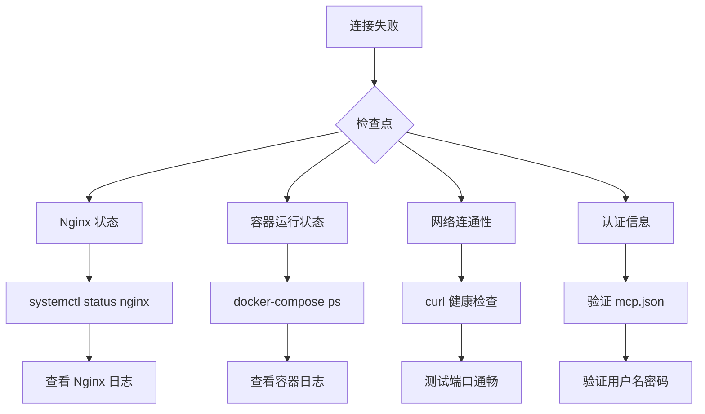

**常见问题及解决方案：**

### 7.1. 连接失败：无法建立 SSE 连接

**排查步骤：**

```bash
# 1. 检查容器是否运行
docker-compose ps
# 应该看到 api-docs-mcp-server 状态为 Up

# 2. 检查容器日志
docker-compose logs -f api-docs-mcp
# 查看是否有启动错误

# 3. 测试容器内部
curl http://localhost:9527/mcp/health
# 应该返回 {"status": "healthy", ...}

# 4. 测试 Nginx 代理
curl https://your-domain.com/mcp/health
# 如果失败，检查 Nginx 配置

# 5. 检查 Nginx 状态和日志
sudo systemctl status nginx
sudo tail -f /var/log/nginx/error.log
```

### 7.2. 认证失败：401 或 403 错误

**可能原因：**

- mcp.json 中用户名或密码错误
- YApi 账号被锁定或禁用
- YApi 登录接口地址错误

**解决方案：**

```bash
# 1. 验证用户名密码
curl -X POST https://yapi.your-domain.com/api/user/login \
  -H "Content-Type: application/json" \
  -d '{"email": "user@example.com", "password": "your-password"}'

# 2. 检查容器日志中的认证日志
docker-compose logs -f | grep "登录"

# 3. 更新 mcp.json 配置
vim ~/.cursor/mcp.json
# 修改 username 和 password

# 4. 重启 Cursor IDE 使配置生效
```

### 7.3. 查询失败：无法获取接口文档

**可能原因：**

- URL 格式错误
- 接口 ID 不存在
- 没有访问权限

**解决方案：**

```bash
# 1. 验证 URL 格式
# 正确：https://yapi.com/project/interface/api/12345
# 或：https://yapi.com/api/interface/get?id=12345

# 2. 查看详细错误日志
docker-compose logs -f | grep "ERROR"

# 3. 测试接口是否存在
# 在浏览器中访问 YApi 页面，确认接口可访问
```

### 7.4. 性能问题：响应缓慢

**排查步骤：**

```bash
# 1. 检查 Session 缓存命中率
docker-compose logs -f | grep "缓存" | grep "使用"

# 2. 检查网络延迟
ping yapi.your-domain.com

# 3. 检查容器资源使用
docker stats api-docs-mcp-server

# 4. 查看并发请求数
docker-compose logs -f | grep "活跃会话数"
```

## 八、总结

### 8.1 项目价值与收益

本项目解决了 AI 辅助开发中文档获取的核心问题，通过 MCP 协议实现内网文档的智能访问，带来显著的效率提升。

**量化收益对比：**

| 维度           | 传统方式                 | 使用 MCP 服务       | 提升幅度 |
| -------------- | ------------------------ | ------------------- | -------- |
| AI 访问文档    | 无法访问内网             | 自动登录访问        | 0→1      |
| 查文档时间     | 2-3 分钟/次              | 0 秒（AI 自动查询） | ∞        |
| 写代码时间     | 5-8 分钟/接口            | 10 秒/接口          | 30-48x   |
| 新人上手时间   | 1-2 周熟悉接口文档       | 立即可用            | 减少 90% |
| 文档获取时效性 | 手动查询，可能查到旧文档 | 实时获取最新版本    | 按需获取 |

**核心价值：**

1. **突破内网限制** - 作为 AI 与内网 YApi 的桥梁，解决 AI 无法访问内网的根本问题
2. **自动认证管理** - Session 缓存机制，30 天免登录，性能提升 600 倍
3. **按需实时查询** - 无需手动同步，确保 AI 始终基于最新文档生成代码
4. **高可用保障** - 自动重试、健康检查、容器化部署，服务稳定可靠

## 结语

本项目不仅是一个技术实现，更是对"如何让 AI 更好地辅助开发"的一次探索。通过 MCP 协议，我们为 AI 提供了获取外部知识的能力，让它能够按需查询最新、准确的信息生成代码。

期待与大家一起探索 AI 辅助开发的无限可能！
