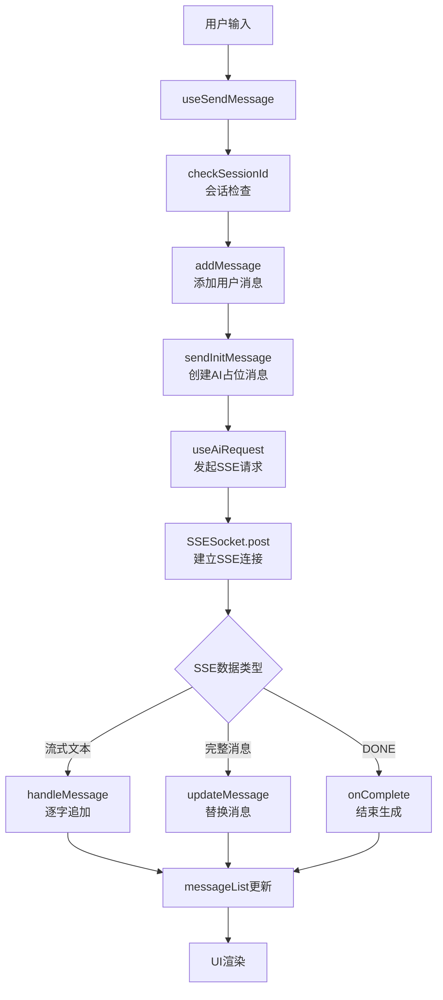
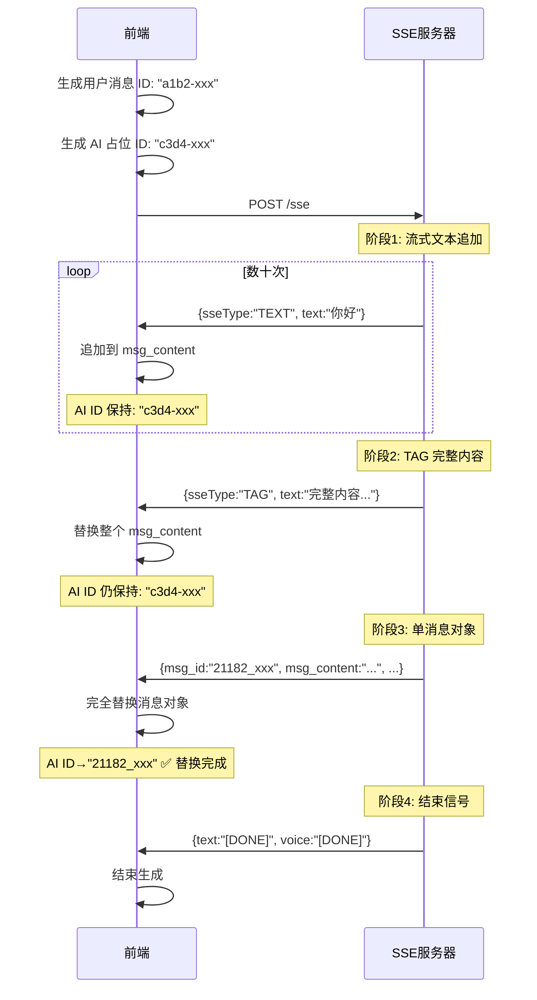
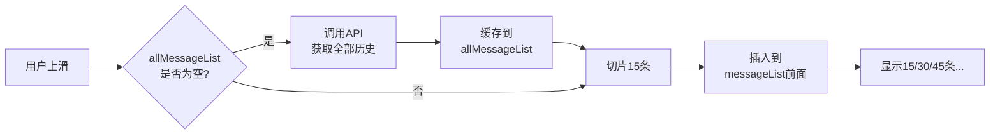
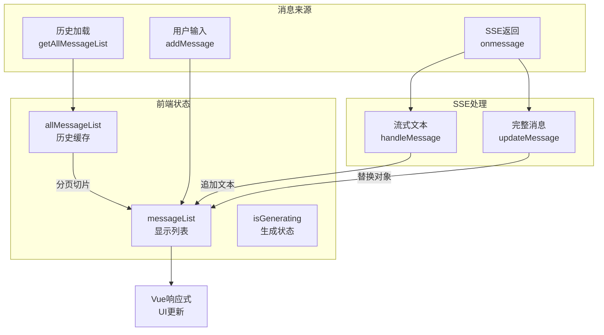

# AI 对话的实现与难点解析

## 一、背景与架构

### 1.1 技术选型

本项目基于 Vue 3 + TypeScript 实现 AI 对话功能，采用 Server-Sent Events (SSE) 协议实现流式对话，核心库为 `@microsoft/fetch-event-source`。

### 1.2 整体架构



## 二、核心技术实现

### 2.1 SSE 流式通信

#### 核心配置

```typescript
// utils/im_sse.ts
export class SSESocket {
  async post(params) {
    const controller = new AbortController();

    return new Promise((resolve, reject) => {
      fetchEventSource(url, {
        method: 'POST',
        signal: controller.signal,
        openWhenHidden: true, // 后台持续接收
        body: JSON.stringify(data),

        async onopen(response) {
          resolve(controller);
          startTimer(controller); // 180秒超时检测
        },

        onmessage(msg) {
          const data = JSON.parse(msg.data);
          callData?.(data, messageIndex++);
        },

        onerror(err) {
          controller?.abort();
          onclose?.();
        },
      });
    });
  }
}
```

#### 关键特性

1. **后台持续连接**：`openWhenHidden: true` 确保页面切换时 SSE 不断开
2. **超时机制**：180 秒无响应自动关闭连接
3. **可中止性**：`AbortController` 支持手动中止

### 2.2 消息 ID 管理

#### 三种消息 ID

| 类型     | 生成时机     | 生成位置 | 格式                      | 是否替换    |
| -------- | ------------ | -------- | ------------------------- | ----------- |
| 历史消息 | 数据库保存时 | 后端     | `{patient_seq_no}_{uuid}` | 否          |
| 用户消息 | 发送消息时   | 前端     | `xxxx-timestamp-xxxxx`    | 视 SSE 模式 |
| AI 消息  | 创建占位时   | 前端     | `xxxx-timestamp-xxxxx`    | 视 SSE 模式 |

#### ID 生成函数

```typescript
// utils/format.ts
export function createGuid() {
  const array = new Uint32Array(2);
  crypto.getRandomValues(array);
  const randomPart1 = array[0].toString(16).substring(0, 4);
  const randomPart2 = array[1].toString(16).substring(0, 5);

  return `${randomPart1}-${Date.now()}-${randomPart2}`;
  // 示例: "a3f2-1733042320123-b4e5a"
}
```

#### 实际 SSE 消息流

根据真实数据，一次完整的 AI 对话经历以下阶段：

```text
TEXT 流式追加 → TAG 完整内容 → 单消息对象 → DONE
(多次)          (1次)         (1次)         (结束)
```

#### 四种 SSE 响应类型

##### **类型 1: TEXT - 流式文本追加** (最常见，每次对话数十次)

```typescript
// SSE 返回 (多次)
{
  "sseType": "TEXT",
  "text": "你好",  // 文本片段
  "sessionId": "dcc88f41ec4a4ceaa19301422f714c8a",
  "verifyStatus": 1,
  "verify": "本回答由AI生成，仅供参考",
  "requireVoice": false
}

// 前端处理
if (data.sseType === 'TEXT' && data.text !== '[DONE]') {
  handleMessage(data.text)  // 逐字追加到 msg_content
}
```

**特点**：

- 高频返回，每次只传输几个字
- 仅追加 `msg_content`，不修改其他字段
- `msg_id` 保持前端生成的临时 ID

**真实示例**（连续返回）：

```text
"的原因" → "，" → "我需要" → "询问" → "一些" → "细节" → "信息" → "：\n\n"
```

---

##### **类型 2: TAG - 完整内容替换** (每次对话 1 次)

```typescript
// SSE 返回 (1次，在所有 TEXT 之后)
{
  "sseType": "TAG",
  "text": "为了帮助您更好地了解头疼的原因，我需要询问一些细节信息：\n\n1. 您的头疼是突然发生的还是逐渐加重的？\n2. 头疼的具体部位在哪里？是单侧还是整个头部？",
  "sessionId": "dcc88f41ec4a4ceaa19301422f714c8a",
  "risks": [],
  "verifyStatus": 1,
  "verify": "本回答由AI生成，仅供参考",
  "requireVoice": false
}

// 前端处理
if (data.sseType === 'TAG' && data.text) {
  console.log('收到html消息:', data.text)
  replaceMessage(data.text)  // 用完整内容替换整个 msg_content
}
```

**特点**：

- 在所有 TEXT 片段之后返回
- 包含完整的、格式化的回复内容
- 用完整文本**替换**（而非追加）`msg_content`
- `msg_id` 仍然保持前端临时 ID

**作用**：

- 确保最终显示的是格式正确的完整内容
- 修正流式追加可能的格式问题

---

##### **类型 3: 单消息对象** (每次对话 1 次)

```typescript
// SSE 返回 (1次，在 TAG 之后)
{
  "msg_id": "21182_4e2cffe369a3448d9451f813b8778981",  // ← 后端正式 ID
  "msg_type": "1",
  "msg_content": "为了帮助您更好地了解头疼的原因，我需要询问一些细节信息：1. 您的头疼是突然发生的还是逐渐加重的？2. 头疼的具体部位在哪里？是单侧还是整个头部？",
  "from": "bot",
  "to": "21182",
  "patient_seq_no": 21182,
  "create_time": 1764670159824,
  "is_head": false,
  "extra_data": "{\"verifyStatus\":1,\"verify\":\"本回答由AI生成，仅供参考\"}"
}

// 前端处理
if (data.msg_type) {
  const isGeneratingIndex = imStore.messageList.findIndex(
    item => item.isGenerating
  )

  updateMessage(
    data as unknown as IMessage,  // 后端完整消息
    imStore.messageList[isGeneratingIndex]?.msg_id  // 前端临时ID
  )
}
```

**特点**：

- **完全替换**整个消息对象，**包括 `msg_id`**
- 前端临时 ID（如 `"c3d4-1733xxx"`）被替换为后端正式 ID（如 `"21182_4e2cf..."`）
- 仅替换 **1 次**，这是最终的权威数据

**ID 替换时机**：

```text
前端 ID: "a1b2-1733042320123-c3d4"
   ↓ (TEXT 阶段保持不变)
   ↓ (TAG 阶段保持不变)
   ↓ (单消息对象阶段)
后端 ID: "21182_4e2cffe369a3448d9451f813b8778981" ✅ 替换完成
```

---

##### **类型 4: messages 数组 - 双消息替换** (特定场景)

```typescript
// SSE 返回 (仅在特定场景，如意图识别)
{
  "messages": [
    {  // 用户消息（补充意图识别等元数据）
      "msg_id": "21182_uuid_1",
      "msg_content": "我血压有点高",
      "intent": ["高血压咨询"],
      "relevant_question": ["如何控制血压？"]
    },
    {  // AI 回复消息
      "msg_id": "21182_uuid_2",
      "msg_content": "我来帮你分析...",
      "msg_type": "TEXT"
    }
  ]
}

// 前端处理
if (data.messages) {
  const isGeneratingIndex = imStore.messageList.findIndex(
    item => item.isGenerating
  )

  // 替换用户消息（前一条）
  if (!isSystemNoticeOnlySSE) {
    updateMessage(
      omit(data.messages[0], ['is_head']),
      imStore.messageList[isGeneratingIndex - 1]?.msg_id
    )
  }

  // 替换 AI 消息（当前）
  updateMessage(
    data.messages[1],
    imStore.messageList[isGeneratingIndex]?.msg_id
  )
}
```

**特点**：

- 返回完整的消息对（用户 + AI）
- **同时替换两条消息**的所有字段，**包括 `msg_id`**
- 用于需要后端补充元数据的场景

**业务场景**：

- 后端对用户消息进行意图识别
- 需要添加相关推荐问题
- 系统通知（`SYSTEM_NOTICE_ONLY_SSE` 只替换 AI 消息）

---

#### ID 替换流程图



**关键时间点**：

| 阶段          | 耗时     | msg_id                | msg_content 状态 |
| ------------- | -------- | --------------------- | ---------------- |
| TEXT 流式追加 | ~3-4 秒  | `c3d4-xxx` (前端)     | 逐字增长         |
| TAG 完整内容  | ~0.01 秒 | `c3d4-xxx` (前端)     | 完整替换         |
| 单消息对象    | ~0.01 秒 | `21182_xxx` (后端) ✅ | 最终确认         |
| DONE 信号     | ~0.01 秒 | -                     | 生成结束         |

**真实数据时间线**（示例）：

```text
18:09:24.781  TEXT "的原因"
18:09:24.854  TEXT "，"
18:09:24.967  TEXT "我需要"
...
18:09:25.980  TEXT "？"
18:09:28.606  TAG  "完整内容..."        ← 替换 msg_content
18:09:28.616  单消息对象 (msg_id替换)   ← 替换 msg_id
18:09:28.616  DONE                     ← 结束
```

#### 替换实现

```typescript
// utils/im.ts
export const updateMessageState = (
  messageList: IMessage[],
  msgId: string, // 前端临时 ID（用于查找目标消息）
  updates: Partial<IMessage>, // 后端完整消息（包含后端 ID）
) => {
  const updateIndex = messageList.findIndex((item) => item.msg_id === msgId);

  if (updateIndex !== -1) {
    // 关键：用后端数据完全覆盖前端数据（包括 msg_id）
    messageList[updateIndex] = {
      ...messageList[updateIndex], // 前端临时数据
      ...updates, // 后端权威数据（覆盖 msg_id）
    };
  }
  return { messageList, updateIndex };
};
```

#### 替换机制总结

| SSE 类型       | 返回数据示例                     | ID 是否替换   | content 是否替换 | 替换时机  | 频率   |
| -------------- | -------------------------------- | ------------- | ---------------- | --------- | ------ |
| **TEXT**       | `{sseType:"TEXT", text:"..."}`   | ❌ 否         | ✅ 追加          | 持续      | 多次   |
| **TAG**        | `{sseType:"TAG", text:"..."}`    | ❌ 否         | ✅ 完全替换      | TEXT 之后 | 1 次   |
| **单消息对象** | `{msg_type:"...", msg_id:"..."}` | ✅ 是         | ✅ 确认          | TAG 之后  | 1 次   |
| **双消息数组** | `{messages:[{...}, {...}]}`      | ✅ 是（两条） | ✅ 完全替换      | 特定场景  | 0-1 次 |

**核心原理**：

1. **TEXT 阶段**：高频流式追加，提供实时反馈体验
2. **TAG 阶段**：用完整格式化内容替换，确保显示正确
3. **单消息对象**：替换为后端正式 ID，建立权威数据
4. **双消息数组**：用于需要补充元数据的特殊场景（如意图识别）

**ID 替换特点**：

- TEXT 和 TAG 阶段：ID 保持前端临时 ID（如 `"c3d4-1733xxx"`）
- 单消息对象阶段：ID 被替换为后端正式 ID（如 `"21182_4e2cf..."`）
- 仅替换 **1 次**，不会重复覆盖

**为什么需要 TAG 类型？**

- 流式追加可能导致格式问题（换行、标点符号等）
- TAG 返回完整的、经过后端格式化的内容
- 确保用户看到的是标准格式的回复

### 2.3 会话管理

#### 会话切换检测

```typescript
// hooks/useSendMessage.ts
const sendMessage = async (messageData) => {
  // 每次发送前检查会话ID
  const state = await checkSessionId();

  if (state?.separator_message) {
    // 后端判断需要开始新话题
    addMessage(
      createMessage({
        message: '新话题',
        type: MSG_TYPE.NEW_CHAT_DIVIDER,
      }),
    );
  }

  // 继续发送消息...
};
```

#### 后端响应

```typescript
// API: /dialogue/session/get_session_id
{
  session_id: "session_id_67890",
  separator_message?: {  // 可选字段
    msg_type: "NEW_CHAT_DIVIDER",
    msg_content: "新话题"
  }
}
```

**作用**：

1. 确保使用最新的 `session_id`
2. 自动在合适时机插入"新话题"分割线
3. 支持多设备会话同步

### 2.4 双重中止机制

#### sse_uuid 的作用

```typescript
// 发送SSE请求时
const reqData = {
  message: '你好',
  sse_uuid: createGuid(), // 唯一标识此次SSE请求
  session_id: 'session_id_123',
  patient_seq_no: 21182,
};

setStorage('sse_uuid', reqData.sse_uuid);
```

#### 中止流程

```typescript
// hooks/useSendMessage.ts
const stopMessage = async () => {
  const sse_uuid = getStorage('sse_uuid');

  if (sse_uuid) {
    // 1. 通知服务器停止生成
    await stopSse({ patient_seq_no, sse_uuid });
  }

  // 2. 前端中止连接
  if (currentRequestTask) {
    currentRequestTask.abort();
  }

  // 3. 清理状态
  removeStorage('sse_uuid');
  imStore.updateIsGenerating(false);
};
```

#### 为什么不用 msg_id？

| 对比项   | sse_uuid      | msg_id          |
| -------- | ------------- | --------------- |
| 生成时机 | 请求前        | 响应后          |
| 可用性   | 立即可用      | 需等待 SSE 返回 |
| 作用域   | 整个 SSE 连接 | 单条消息        |
| 数量     | 1 个          | 2 个(用户+AI)   |

**核心优势**：用户点击停止按钮时，`sse_uuid` 已存在，可立即中止；而 `msg_id` 可能还未返回。

## 三、性能优化策略

### 3.1 分页加载机制

```typescript
// store/modules/im.ts
state: () => ({
  messageList: [], // 当前显示(分页)
  allMessageList: [], // 完整缓存
  pageSize: 15, // 每页15条
  pageIndex: 0,
});
```

#### 双缓存策略



#### 加载逻辑

```typescript
async loadMoreHistoryMessages() {
  if (this.allMessageList.length === 0) {
    // 首次：从服务器获取所有历史(如200条)
    const { messages } = await getAllMessageList({
      patient_seq_no, session_id
    })
    this.allMessageList = messages.reverse()
  }

  // 分页：从缓存中切片
  const startIndex = this.pageIndex
  const endIndex = Math.min(startIndex + 15, this.allMessageList.length)
  const newMessages = this.allMessageList.slice(startIndex, endIndex)

  // 插入到显示列表前面
  this.messageList = [...newMessages.reverse(), ...this.messageList]
  this.pageIndex = endIndex
}
```

### 3.2 按需渲染

```vue
<template>
  <!-- 只渲染 messageList 中的消息(最多15-30条) -->
  <template v-for="item in messageList" :key="`msg-${item.msg_id}`">
    <!-- 条件渲染：只加载实际需要的组件 -->
    <MessageText v-if="isTextCard(item.msg_type)" />
    <MessageImage v-if="isImageCard(item.msg_type)" />
    <!-- 其他60+种类型，未使用的不会加载 -->
  </template>
</template>
```

### 3.3 性能对比

| 方案              | 初始 DOM | 内存占用 | 首屏时间 | 滚动 FPS |
| ----------------- | -------- | -------- | -------- | -------- |
| 一次性加载 300 条 | 300+     | ~100MB   | 3-5 秒   | 30-40    |
| 分页加载 15 条    | 0-15     | ~10MB    | <100ms   | 55-60    |

## 四、难点与解决方案

### 4.1 滚动位置保持

**问题**：加载历史消息后，列表高度增加，导致页面跳动。

**解决**：

```typescript
const handleScroll = async () => {
  // 记录加载前的状态
  const oldScrollHeight = scrollContentRef.value.scrollHeight;
  const oldScrollTop = scrollContentRef.value.scrollTop;

  // 加载新消息
  await imStore.loadMoreHistoryMessages(oldScrollHeight, oldScrollTop);

  // 调整滚动位置
  nextTick(() => {
    const newScrollHeight = scrollContentRef.value.scrollHeight;
    const newScrollTop = newScrollHeight - oldScrollHeight + oldScrollTop;
    scrollContentRef.value.scrollTop = newScrollTop;
  });
};
```

### 4.2 消息去重与合并

**问题**：SSE 可能返回用户消息和 AI 消息的完整体，需要与前端消息合并。

**场景说明**：

在"双消息完整替换"模式下，后端返回一个消息对：

- `messages[0]`: 用户消息（补充意图识别、相关问题等元数据）
- `messages[1]`: AI 回复消息

消息列表结构：

```text
[n-1] 用户刚发送的消息 (前端临时 ID)
[n]   AI 正在生成的消息 (isGenerating: true, 前端临时 ID)
```

**解决**：

```typescript
if (data.messages) {
  const isGeneratingIndex = imStore.messageList.findIndex((item) => item.isGenerating);

  // 系统通知不在聊天列表显示，不做数据更新
  const isSystemNoticeOnlySSE = msg_type === MSG_TYPE.SYSTEM_NOTICE_ONLY_SSE;

  // 更新用户消息(索引-1) - 补充后端处理的元数据
  if (!isSystemNoticeOnlySSE) {
    updateMessage(
      omit(data.messages[0], ['is_head']), // 移除后端默认的 is_head: false
      imStore.messageList[isGeneratingIndex - 1]?.msg_id,
    );
  }

  // 更新AI消息(当前索引) - 填充 AI 回复内容
  updateMessage(data.messages[1], imStore.messageList[isGeneratingIndex]?.msg_id);
}
```

**特殊处理**：

1. **移除 `is_head` 字段**：后端默认返回 `is_head: false`，前端根据时间间隔自己计算此字段，因此需要移除
2. **系统通知模式**：`SYSTEM_NOTICE_ONLY_SSE` 类型的消息只更新 AI 消息，不更新用户消息（因为没有用户输入）

### 4.3 状态一致性

**问题**：页面切换时，SSE 在后台继续接收，状态可能不一致。

**解决**：

```typescript
// 1. SSE配置
fetchEventSource(url, {
  openWhenHidden: true, // 后台持续接收
});

// 2. 全局状态管理
const imStore = useImStore(); // Pinia全局store
imStore.messageList; // 任何页面都能访问

// 3. 切换回聊天页
// UI自动渲染最新的messageList，无需额外处理
```

## 五、核心数据流



## 六、总结

### 关键技术点

1. **SSE 流式通信**：采用 `fetchEventSource`，支持后台持续连接和超时检测
2. **消息 ID 管理**：前端临时 ID + 后端正式 ID，分场景处理
3. **会话管理**：每次发送前检查 `session_id`，自动插入话题分割线
4. **双重中止**：`sse_uuid` 标识连接 + `AbortController` 前端中止
5. **性能优化**：分页加载 + 按需渲染 + 双缓存策略

### 设计亮点

1. **前端先行**：用户消息和 AI 占位先用前端 ID，保证即时响应
2. **后端权威**：最终以后端 ID 为准，确保数据一致性
3. **灵活处理**：支持流式更新和完整替换两种模式
4. **资源优化**：懒加载 + 分页，60+ 种消息类型也流畅

### 适用场景

- 医疗健康咨询
- 智能客服对话
- 教育辅导系统
- 任何需要流式 AI 对话的场景

## 七、后续优化方向

### 7.1 滚动监听优化

**现状问题**：使用 `scroll` 事件监听，高频触发影响性能。

**优化方案**：采用 Intersection Observer API

```typescript
// 替代方案
const useIntersectionObserver = () => {
  const observer = new IntersectionObserver(
    (entries) => {
      entries.forEach((entry) => {
        if (entry.isIntersecting && !isLoadingMore.value) {
          // 顶部元素进入视口，加载更多
          loadMoreHistoryMessages();
        }
      });
    },
    {
      root: scrollContentRef.value,
      rootMargin: '200px 0px 0px 0px', // 提前200px触发
      threshold: 0,
    },
  );

  // 监听顶部哨兵元素
  const sentinelRef = ref<HTMLElement>();
  watch(sentinelRef, (el) => {
    if (el) observer.observe(el);
  });
};
```

**优势**：性能更好，浏览器原生优化，无需手动节流。

### 7.2 虚拟滚动

**现状问题**：历史消息较多时（500+ 条），DOM 节点过多。

**优化方案**：使用虚拟列表，只渲染可视区域

```typescript
import { useVirtualList } from '@vueuse/core';

const { list, containerProps, wrapperProps } = useVirtualList(messageList, {
  itemHeight: 100, // 动态计算实际高度
  overscan: 5, // 预渲染5条
});
```

**收益**：

- 渲染节点从 500+ 降至 20-30
- 首屏渲染时间减少 70%+
- 滚动 FPS 稳定在 60

### 7.3 消息本地缓存

**现状问题**：每次刷新页面都需重新加载历史消息。

**优化方案**：IndexedDB 持久化

```typescript
// utils/messageCache.ts
class MessageCache {
  private db: IDBDatabase;

  async saveMessages(sessionId: string, messages: IMessage[]) {
    const tx = this.db.transaction('messages', 'readwrite');
    const store = tx.objectStore('messages');
    await store.put({ sessionId, messages, timestamp: Date.now() });
  }

  async getMessages(sessionId: string): Promise<IMessage[]> {
    const tx = this.db.transaction('messages', 'readonly');
    const store = tx.objectStore('messages');
    const data = await store.get(sessionId);

    // 缓存超过24小时失效
    if (data && Date.now() - data.timestamp < 86400000) {
      return data.messages;
    }
    return null;
  }
}
```

**收益**：离线也能查看历史消息，减少 API 请求。

### 7.4 SSE 自动重连

**现状问题**：网络波动导致 SSE 断开，用户需手动重试。

**优化方案**：断线自动重连机制

```typescript
class SSEReconnect {
  private retryCount = 0;
  private maxRetries = 3;

  async postWithRetry(params) {
    try {
      return await sseApi.post(params);
    } catch (error) {
      if (this.retryCount < this.maxRetries) {
        this.retryCount++;
        const delay = Math.min(1000 * Math.pow(2, this.retryCount), 10000);

        await new Promise((resolve) => setTimeout(resolve, delay));
        return this.postWithRetry(params);
      }
      throw error;
    }
  }
}
```

**策略**：指数退避重试（1s、2s、4s），最多 3 次。

### 7.5 消息智能预加载

**现状问题**：用户滚动到顶部才加载，有明显等待。

**优化方案**：预测性加载

```typescript
const useSmartPreload = () => {
  const scrollVelocity = ref(0);
  let lastScrollTop = 0;
  let lastTime = Date.now();

  const handleScroll = () => {
    const now = Date.now();
    const currentScrollTop = scrollContentRef.value.scrollTop;

    // 计算滚动速度
    scrollVelocity.value = (lastScrollTop - currentScrollTop) / (now - lastTime);

    // 向上快速滚动，提前加载
    if (scrollVelocity.value > 2 && distanceFromTop < 500) {
      loadMoreHistoryMessages();
    }

    lastScrollTop = currentScrollTop;
    lastTime = now;
  };
};
```

**收益**：提前加载，用户感知延迟降低 50%+。

### 7.6 图片懒加载

**现状问题**：消息中的图片全部加载，浪费带宽。

**优化方案**：原生 lazy loading + Intersection Observer

```vue
<template>
  
</template>

<script setup>
const loadHighRes = (img: HTMLImageElement) => {
  const observer = new IntersectionObserver((entries) => {
    entries.forEach((entry) => {
      if (entry.isIntersecting) {
        img.src = img.dataset.src;
        observer.unobserve(img);
      }
    });
  });
  observer.observe(img);
};
</script>
```

### 7.7 WebSocket 双向通信

**现状问题**：SSE 单向，无法主动推送服务端事件。

**适用场景**：

- 多人协作对话
- 实时状态同步
- 服务端主动推送

**方案**：WebSocket 升级

```typescript
class ChatWebSocket {
  private ws: WebSocket;

  connect() {
    this.ws = new WebSocket('wss://api.example.com/chat');

    this.ws.onmessage = (event) => {
      const data = JSON.parse(event.data);

      switch (data.type) {
        case 'message':
          handleMessage(data);
          break;
        case 'typing':
          showTypingIndicator(data.userId);
          break;
        case 'read':
          updateReadStatus(data.msgId);
          break;
      }
    };
  }

  send(message) {
    this.ws.send(JSON.stringify(message));
  }
}
```

### 7.8 离线消息队列

**现状问题**：离线时发送的消息直接丢失。

**优化方案**：消息队列 + Service Worker

```typescript
// 离线消息队列
class OfflineQueue {
  private queue: IMessage[] = [];

  async addMessage(message: IMessage) {
    this.queue.push(message);
    await this.persistQueue();

    // 监听网络恢复
    window.addEventListener('online', () => this.flush());
  }

  async flush() {
    while (this.queue.length > 0) {
      const message = this.queue[0];
      try {
        await sendMessage(message);
        this.queue.shift();
      } catch {
        break; // 失败停止，等待下次重试
      }
    }
  }
}
```

### 7.9 性能监控

**优化方案**：关键指标追踪

```typescript
class ChatPerformanceMonitor {
  // SSE响应时间
  trackSSEResponse() {
    const startTime = performance.now();
    return () => {
      const duration = performance.now() - startTime;
      this.report('sse_response_time', duration);
    };
  }

  // 消息渲染时间
  trackMessageRender() {
    const observer = new PerformanceObserver((list) => {
      list.getEntries().forEach((entry) => {
        this.report('message_render', entry.duration);
      });
    });
    observer.observe({ entryTypes: ['measure'] });
  }

  // 内存使用
  trackMemory() {
    if (performance.memory) {
      setInterval(() => {
        this.report('heap_size', performance.memory.usedJSHeapSize);
      }, 30000);
    }
  }
}
```

### 7.10 TypeScript 类型优化

**现状问题**：消息类型使用 `any`，类型不够安全。

**优化方案**：泛型 + 联合类型

```typescript
// 类型化消息
type MessageType = 'TEXT' | 'IMAGE' | 'FILE' | 'INSTRUCTION';

interface BaseMessage {
  msg_id: string;
  create_time: number;
  from: string;
  to: string;
}

interface TextMessage extends BaseMessage {
  msg_type: 'TEXT';
  msg_content: string;
}

interface ImageMessage extends BaseMessage {
  msg_type: 'IMAGE';
  image_url: string;
  thumbnail_url?: string;
}

type Message = TextMessage | ImageMessage | FileMessage | InstructionMessage;

// 类型守卫
function isTextMessage(msg: Message): msg is TextMessage {
  return msg.msg_type === 'TEXT';
}

// 使用
const handleMessage = (msg: Message) => {
  if (isTextMessage(msg)) {
    // TypeScript 知道这是 TextMessage
    console.log(msg.msg_content); // 类型安全
  }
};
```

### 优化优先级建议

| 优先级 | 优化项         | 收益 | 复杂度 |
| ------ | -------------- | ---- | ------ |
| P0     | 滚动监听优化   | 高   | 低     |
| P0     | 图片懒加载     | 高   | 低     |
| P1     | SSE 自动重连   | 高   | 中     |
| P1     | 消息本地缓存   | 中   | 中     |
| P2     | 虚拟滚动       | 高   | 高     |
| P2     | 智能预加载     | 中   | 中     |
| P3     | WebSocket 升级 | 中   | 高     |
| P3     | 离线队列       | 中   | 高     |
| P3     | 性能监控       | 低   | 低     |
| P3     | 类型优化       | 低   | 中     |
