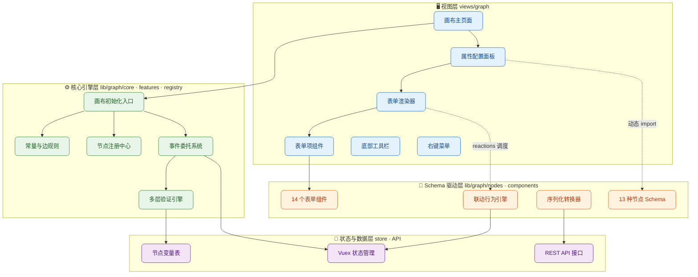
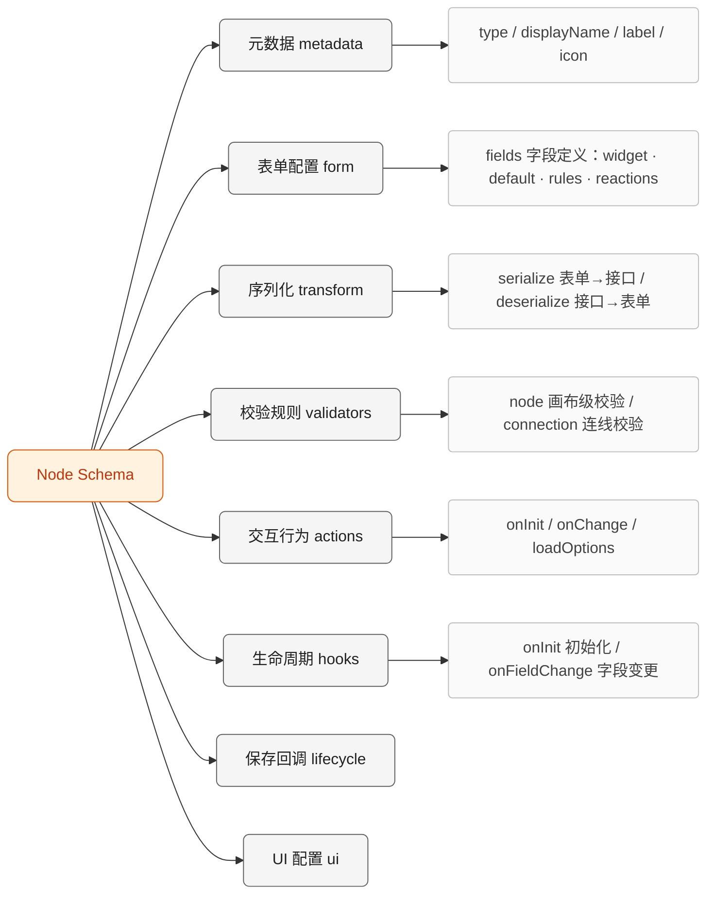
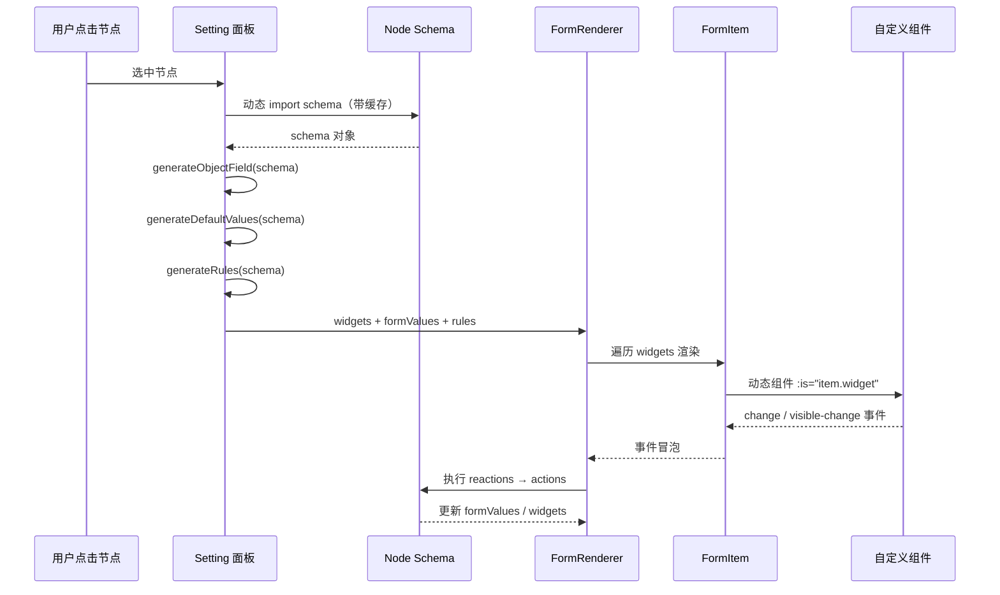
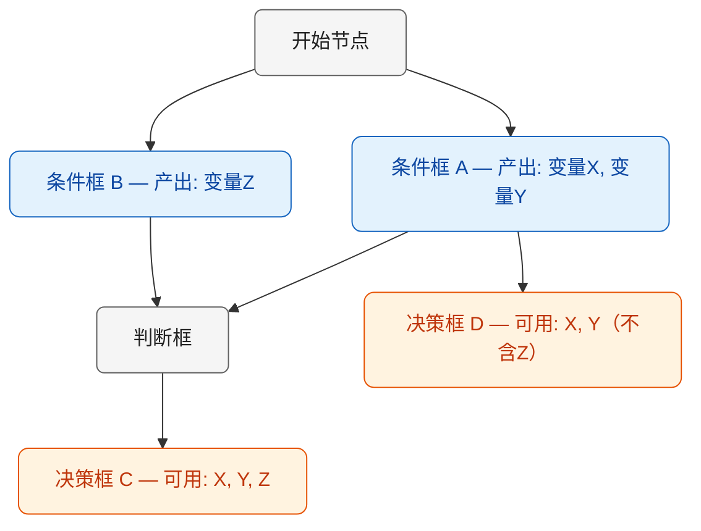
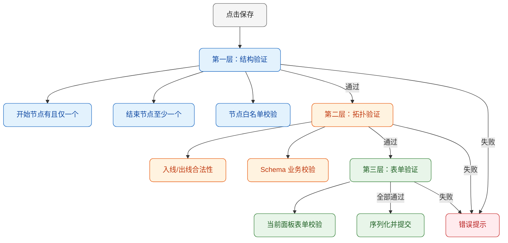
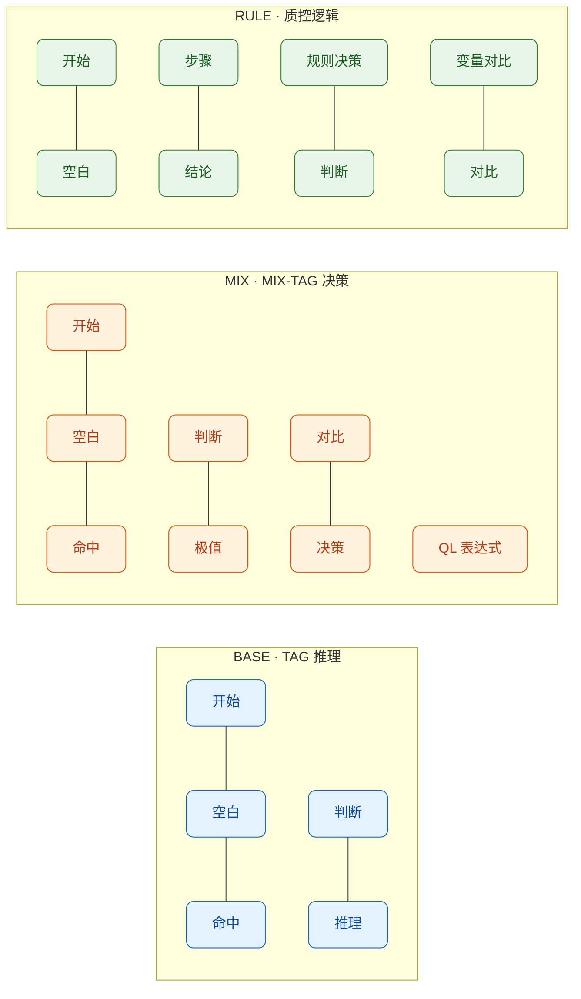
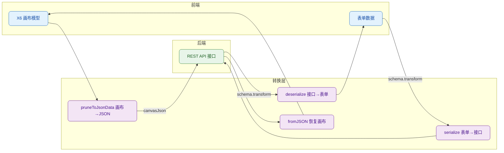
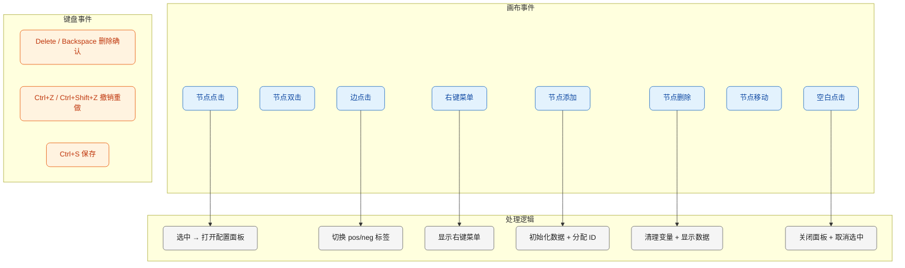
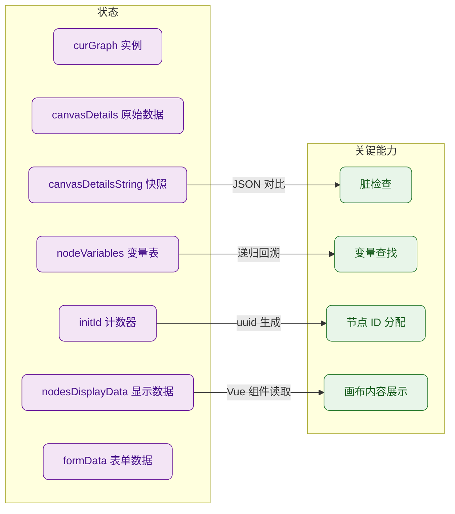
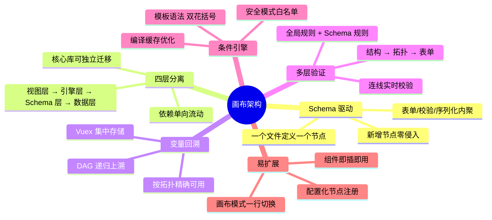

# 润达医疗 规则引擎可视化画布架构设计与实践

> 基于 Vue 2 + AntV X6 构建的医疗质控推理引擎可视化编排系统

## 一、背景与目标

在医疗质控场景中，业务规则复杂且多变——从 TAG 推理、MIX-TAG 决策到 RULE 质控逻辑，每种规则都有独特的节点组合和校验约束。我们需要一套可视化画布系统，让业务人员通过拖拽节点、连线编排来构建推理流程，同时保证数据完整性和扩展性。

核心挑战：

- **13 种节点类型**，每种有独立的表单配置、序列化逻辑和校验规则
- **3 种画布模式**（BASE / MIX / RULE），节点组合互斥
- 节点间存在**变量传递**关系，下游节点需要感知上游产出的变量
- 表单配置复杂度跨度大——从 0 字段（空白节点）到 1700+ 行 Schema（质控逻辑框）

## 二、整体架构



### 架构分离原则

整个系统严格遵循**四层分离**架构，每层职责单一、边界清晰：

| 层级          | 目录                                   | 职责                                     | 依赖方向            |
| ------------- | -------------------------------------- | ---------------------------------------- | ------------------- |
| 视图层        | `views/graph/`                         | 页面组装、用户交互、UI 渲染              | → 引擎层、Schema 层 |
| 核心引擎层    | `lib/graph/core · features · registry` | 画布初始化、事件委托、节点注册、验证调度 | → Schema 层、数据层 |
| Schema 驱动层 | `lib/graph/nodes · components`         | 节点定义、表单组件、序列化、联动逻辑     | → 数据层            |
| 状态与数据层  | `store/ · API`                         | 全局状态管理、变量存储、接口通信         | 无外部依赖          |

关键设计约束：

- **依赖单向流动**：上层可以依赖下层，下层不感知上层存在。核心引擎层不 import 任何视图组件，Schema 层不依赖任何 UI 框架。
- **核心库可独立迁移**：`lib/graph/` 整体不依赖 `views/`，可以直接移植到其他项目中使用。
- **Schema 与渲染解耦**：渲染器只做"Schema → UI"的通用映射，不包含任何节点业务逻辑；所有业务规则内聚在 Schema 文件中。
- **动态加载隔离**：视图层通过 `import()` 按需加载 Schema，避免首屏加载全部节点配置，同时保持层间松耦合。

## 三、Schema 驱动的节点体系

这是整个架构最核心的设计——每个节点类型由一个 Schema 对象完整描述，Schema 就是节点的"身份证"。

### 3.1 Schema 结构规范



以判断框（Judge）为例：

```javascript
export default {
  metadata: {
    type: 'judge',
    displayName: '判断',
    label: '判断框',
    icon: NODE_ICON_MAP[NODE_TYPES.JUDGE],
  },

  form: {
    fields: {
      judgeType: {
        type: 'string',
        widget: 'CustomSelect',
        default: '',
        options: [
          { label: '全部都满足', value: 'all' },
          { label: '任一满足', value: 'any_one' },
          { label: '满足x/n', value: 'x_n' },
        ],
        // 联动：选择变化时触发 setNValue
        reactions: [{ on: 'visible-change', action: 'setNValue', params: { targets: ['nvalue'] } }],
      },
      // ...
    },
  },

  transform: {
    serialize({ cell, args }) { /* 表单数据 → 接口格式 */ },
    deserialize(nodeData) { /* 接口数据 → 表单格式 */ },
  },

  validators: {
    node(cell) { /* 画布保存时的业务校验 */ },
    connection(sourceType, targetType, ...) { /* 连线时的约束校验 */ },
  },

  actions: {
    setNValue(ctx, payload, params) { /* 联动逻辑 */ },
  },
}
```

这种设计的好处：**新增节点类型只需新建一个 Schema 文件**，无需修改渲染器、验证器或序列化逻辑。

### 3.2 节点类型全景

| 分类       | 节点                      | 适用画布   | Schema 复杂度                          |
| ---------- | ------------------------- | ---------- | -------------------------------------- |
| 控制节点   | start / empty / hit       | 全部       | 极简（无表单）                         |
| 判断节点   | judge                     | 全部       | 中等（联动校验）                       |
| 推理节点   | inferNode                 | BASE       | 高（动态数据源 + 内容选择 + 变量赋值） |
| 决策节点   | decision / ruleDecision   | MIX / RULE | 高（TAG 选择 + 时间变量 + 注解）       |
| 对比节点   | compare / variableCompare | MIX / RULE | 中等（时间/变量对比）                  |
| 时间节点   | extrimun                  | MIX        | 中等（时间极值 + 变量赋值）            |
| 流程节点   | step / conclusion         | RULE       | 中等（步骤/结论配置）                  |
| 表达式节点 | inferQlExpression         | MIX        | 中等（QL 表达式编辑）                  |

## 四、表单渲染引擎

表单渲染采用三层架构，将 Schema 解析、表单渲染、组件实例化完全解耦。



### 4.1 Schema 缓存与动态加载

```javascript
const schemaCache = new Map()

async updateLayoutCfg(nodeType) {
  if (!schemaCache.has(nodeType)) {
    const module = await import(`@/lib/graph/nodes/${nodeType}/schema`)
    schemaCache.set(nodeType, module.default || module)
  }
  this.layoutCfg = schemaCache.get(nodeType)
}
```

Schema 按需加载 + Map 缓存，避免首屏加载全部节点配置，同时保证切换节点时的响应速度。

### 4.2 Reactions 联动机制

Schema 中的 `reactions` 定义了字段间的联动关系，`FormRenderer` 作为事件总线负责分发：

```javascript
// Schema 中声明联动
conditionType: {
  reactions: [{ on: 'change', action: 'loadColumnList' }],
}

// FormRenderer 中执行
async handleEmitEvent(eventName, payload, widgetSchema) {
  const reactions = widgetSchema.reactions.filter(r => r.on === eventName)
  for (const reaction of reactions) {
    const actionFn = schema.actions[reaction.action]
    await actionFn(context, payload, reaction.params)
  }
}
```

联动逻辑完全内聚在 Schema 的 `actions` 中，渲染器只负责"事件名 → action 名"的映射调度，不关心具体业务。

### 4.3 条件可见性引擎

表单项支持通过 `visible` 条件动态显示/隐藏，底层由一个带缓存的条件表达式引擎驱动：

```javascript
// 支持模板语法
visible: "{{judgeType === 'x_n'}}";

// 条件引擎：模板解析 → 安全校验 → 编译缓存 → 执行
const conditionCache = new Map();

export const checkCondition = (condition, context) => {
  const parsed = parseTemplateExpression(condition); // {{expr}} → formValues.expr
  if (!conditionCache.has(parsed)) {
    // 安全模式校验 + Function 编译
    const fn = new Function(...keys, `'use strict'; return ${parsed}`);
    conditionCache.set(parsed, fn);
  }
  return conditionCache.get(parsed)(...values);
};
```

编译后的函数被缓存，同一条件表达式只编译一次，后续执行直接命中缓存。

## 五、变量回溯算法

这是画布系统中最有技术含量的部分。节点可以产出变量（如条件框的变量赋值），下游节点需要引用上游节点的变量。问题在于：画布是一个 DAG（有向无环图），变量的可用范围取决于图的拓扑关系。



### 5.1 递归回溯实现

```javascript
/**
 * 沿入边递归向上收集所有上游节点的变量
 */
export const collectUpstreamVariables = (nodeId, nodeVariables, result, graph) => {
  const incomingEdges = graph.model.getIncomingEdges(nodeId);
  if (!incomingEdges?.length) return;

  for (const edge of incomingEdges) {
    const upstreamNode = edge.source?.cell;
    const upstreamCell = graph.getCellById(upstreamNode);
    const upstreamNodeId = upstreamCell?.getData?.()?.nodeId;

    // 收集该节点的变量
    if (upstreamNodeId && nodeVariables[upstreamNodeId]) {
      result[upstreamNodeId] = nodeVariables[upstreamNodeId];
    }

    // 到达根节点则停止
    if (graph.model.isRoot?.(upstreamNode)) continue;

    // 递归向上
    collectUpstreamVariables(upstreamNode, nodeVariables, result, graph);
  }
};
```

### 5.2 变量生命周期


变量数据存储在 Vuex 的 `nodeVariables` 中，以 `nodeId` 为 key。节点保存时通过 Schema 的 `extractVariables` 方法提取变量，下游节点通过 `getAvailableVariables` 递归回溯获取可用变量列表。

## 六、多层验证体系

画布保存时执行三层递进式验证，确保数据完整性。



### 连线验证

连线时同样执行双重验证：

```javascript
// 1. 全局通用规则（环路检测、重复连接、类型约束）
const CONNECTION_RULES = [
  { check: (s, t, cell) => detectLoop(...), message: '不能形成环路' },
  { check: (s, t, cell) => isDuplicateConnection(...), message: '已存在连接' },
  { check: (s, t) => s === NODE_TYPES.START && t === NODE_TYPES.HIT, message: '开始不能直连结束' },
  // ...
]

// 2. 节点自定义规则（由 Schema 定义）
const targetSchema = SCHEMA_MAP[targetType]
if (targetSchema?.validators?.connection) {
  const result = targetSchema.validators.connection(sourceType, targetType, ...)
  if (!result.valid) return false
}
```

全局规则保证基本拓扑正确性，Schema 级规则处理节点特有的连接约束。

## 七、画布模式与节点注册

系统支持三种画布模式，通过 `segmentType` 控制可用节点集合。



注册机制的核心是一个配置映射表：

```javascript
const NODE_OPTIONS_OBJECT = {
  BASE: [NODE_TYPES.START, NODE_TYPES.EMPTY, NODE_TYPES.HIT, NODE_TYPES.JUDGE, NODE_TYPES.INFER_NODE],
  MIX:  [NODE_TYPES.START, NODE_TYPES.EMPTY, NODE_TYPES.HIT, NODE_TYPES.EXTRIMUN, NODE_TYPES.JUDGE, ...],
  RULE: [NODE_TYPES.START, NODE_TYPES.EMPTY, NODE_TYPES.STEP, NODE_TYPES.CONCLUSION, ...],
}

export const ruleNodeList = (segmentType = 'BASE') => NODE_OPTIONS_OBJECT[segmentType] || []
```

初始化时根据 `segmentType` 过滤节点列表，Stencil 面板和验证逻辑共用同一份配置，保证一致性。

## 八、序列化与数据流

画布数据需要在前端 X6 模型和后端接口格式之间双向转换。



每个节点的序列化逻辑由 Schema 自行定义，`canvas.js` 中的 `getInstanceGraphArg` 遍历所有 cells，根据节点类型分发到对应的 `transformHandler`：

```javascript
const transformHandler = {
  judge: (params) => judgeSchema.transform.serialize(params),
  inferNode: (params) => inferNodeSchema.transform.serialize(params),
  // ... 每种节点类型一个处理器
};
```

后端接口按节点类型分组（`judges[]`、`inferNodes[]`、`lanes[]`...），`API_NODE_CONFIG` 统一管理所有分组的 key 和 ID 字段映射。

## 九、事件系统

画布事件采用集中委托模式，所有事件在 `features/events.js` 中统一绑定。



删除操作有拦截机制——已保存数据的节点删除前会弹出确认框，防止误删导致变量赋值丢失：

```javascript
export const deleIntercept = (node, { message = '删除后变量赋值不可恢复，是否确认?' } = {}) => {
  if (!nodeData.isGroup && nodeData.form) {
    return MessageBox.confirm(message, '提示', { type: 'warning' });
  }
  return true;
};
```

## 十、状态管理

Vuex Store（`ruleEngine` 模块）管理画布的全局状态：



脏检查通过对比 `canvasDetailsString`（加载时快照）和当前画布 JSON 实现，路由离开时如果检测到未保存修改会弹出确认框。

## 十一、扩展性设计

### 新增节点类型的步骤

```text
1. nodes/<newType>/schema.js    — 定义 Schema（metadata + form + transform + validators）
2. nodes/<newType>/node.vue     — 定义画布上的节点外观组件
3. registry/vue-node.js         — 注册 Vue 组件
4. registry/register.js         — 创建 X6 节点实例
5. config/constants.js          — 添加 NODE_TYPES 和 API_NODE_CONFIG
6. canvas.js transformHandler   — 添加序列化处理器
```

其中步骤 3-6 都是在已有的映射表中添加一行配置，真正的业务逻辑只在 Schema 和 Vue 组件中。

### 新增自定义表单组件的步骤

```text
1. components/NewWidget.vue     — 实现组件（v-model + options + form-values）
2. FormItem.vue components      — 注册组件
3. 在 Schema 的 field.widget 中引用组件名
```

### 扩展点汇总

| 扩展点     | 机制                       | 修改范围            |
| ---------- | -------------------------- | ------------------- |
| 新节点类型 | Schema + 注册配置          | 新增文件 + 配置表   |
| 新表单组件 | Vue 组件 + FormItem 注册   | 新增文件 + 1 行注册 |
| 新画布模式 | NODE_OPTIONS_OBJECT 配置   | 1 行配置            |
| 新连线规则 | CONNECTION_RULES 数组      | 1 条规则            |
| 新验证逻辑 | Schema.validators          | Schema 内部         |
| 新联动行为 | Schema.reactions + actions | Schema 内部         |

## 十二、架构亮点总结



这套架构的核心思想是**"Schema 即节点 + 四层分离"**——将节点的全部行为（表单、校验、序列化、联动、变量产出）封装在一个 Schema 对象中，渲染引擎只做通用的解析和调度；同时通过视图层、引擎层、Schema 层、数据层的严格分离，确保依赖单向流动、核心库可独立迁移。这使得系统在面对频繁的业务需求变更时，能够以最小的改动范围完成扩展，同时保持代码的可维护性和一致性。
