# Kubernetes 实践笔记

## 1. 准备工作

在开始 Kubernetes 学习之前，需要配置好本地环境。以下是必需的工具和安装步骤。

### 1.1 安装 Docker

Docker 是容器化技术的基础，用于构建和运行容器镜像。

#### 推荐安装方法

使用 Docker Desktop 是最简单的安装方案：

1. 访问 [Docker Desktop 官网](https://www.docker.com/products/docker-desktop/)
2. 下载对应操作系统的安装包
3. 按照安装向导完成安装

**验证安装：**

```bash
docker run hello-world
```

#### 替代安装方法

由于 Docker Desktop 对大型企业收费（2021 年起），可以选择只安装 Docker CLI。

### 1.2 安装 Minikube

Minikube 用于在本地搭建 Kubernetes 集群，是学习 K8s 的理想选择。

**MacOS 安装：**

```bash
brew install minikube
```

**启动 Minikube：**

如果使用 Docker Desktop：

```bash
minikube start --vm-driver docker --container-runtime=docker
```

如果只有 Docker CLI：

```bash
brew install hyperkit
minikube start --vm-driver hyperkit --container-runtime=docker

# 配置 Docker CLI 连接到 minikube
eval $(minikube docker-env)

# 添加主机名映射
echo "`minikube ip` docker.local" | sudo tee -a /etc/hosts > /dev/null

# 测试
docker run hello-world
```

**验证安装：**

```bash
minikube status
```

#### Minikube 常用命令

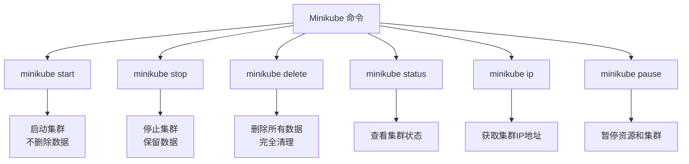

| 命令              | 功能                 |
| ----------------- | -------------------- |
| `minikube start`  | 启动 Kubernetes 集群 |
| `minikube stop`   | 停止集群（保留数据） |
| `minikube delete` | 删除所有集群数据     |
| `minikube status` | 查看集群状态         |
| `minikube ip`     | 获取集群 IP 地址     |
| `minikube pause`  | 暂停集群资源         |

### 1.3 安装 kubectl

kubectl 是 Kubernetes 的命令行工具，用于与集群交互。

**MacOS 安装：**

```bash
brew install kubectl
```

> **注意：** 如果不安装 kubectl，可以使用 `minikube kubectl` 命令替代所有 `kubectl` 操作。

### 1.4 注册 Docker Hub 账号

由于 Minikube 默认从 DockerHub 拉取镜像，需要：

1. 在 [Docker Hub](https://hub.docker.com/) 注册账号
2. 使用命令行登录：

```bash
docker login
```

### 环境架构图

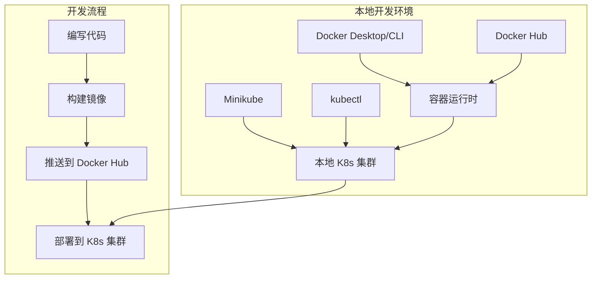

### 准备工作检查清单

- [ ] Docker 安装并能运行 `hello-world`
- [ ] Minikube 安装并成功启动
- [ ] kubectl 安装（或使用 `minikube kubectl`）
- [ ] Docker Hub 账号注册并登录
- [ ] `minikube status` 显示集群运行正常

完成以上准备工作后，就可以开始 Kubernetes 的实践学习了。

## 2. Container（容器化）

容器化是 Kubernetes 的基础。我们从一个简单的 Go 应用开始，学习如何将代码打包成容器镜像。

### 2.1 示例应用

创建一个简单的 Go Web 服务：

#### main.go

```go
package main

import (
 "io"
 "net/http"
)

func hello(w http.ResponseWriter, r *http.Request) {
 io.WriteString(w, "[v1] Hello, Kubernetes!")
}

func main() {
 http.HandleFunc("/", hello)
 http.ListenAndServe(":3000", nil)
}
```

这个应用：

- 启动 HTTP 服务器，监听 3000 端口
- 访问根路径 `/` 时返回 `[v1] Hello, Kubernetes!`

### 2.2 容器化的优势

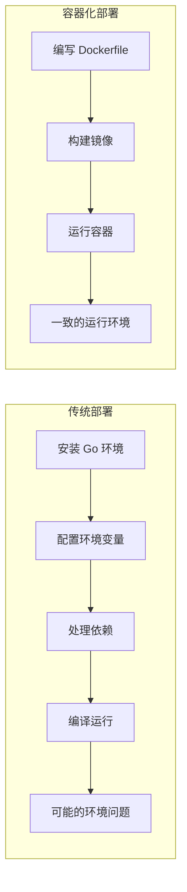

**容器化的好处：**

- **环境一致性**：消除"在我机器上能运行"的问题
- **快速部署**：无需安装运行时环境
- **资源隔离**：沙盒技术保证安全性
- **易于分发**：镜像可以轻松共享

### 2.3 编写 Dockerfile

#### Dockerfile

```dockerfile
# 多阶段构建：先编译，再打包
FROM golang:1.16-buster AS builder
RUN mkdir /src
ADD . /src
WORKDIR /src

RUN go env -w GO111MODULE=auto
RUN go build -o main .

# 使用精简的基础镜像
FROM gcr.io/distroless/base-debian10

WORKDIR /
COPY --from=builder /src/main /main
EXPOSE 3000
ENTRYPOINT ["/main"]
```

**多阶段构建的优势：**

- 将 300MB 的镜像压缩到 20MB
- 上传到 Docker Hub 后仅 10MB
- 提高网络传输效率

### 2.4 构建和运行

**构建镜像：**

```bash
# 替换 guangzhengli 为你的 Docker Hub 用户名
docker build . -t guangzhengli/hellok8s:v1
```

**查看镜像：**

```bash
docker images
# guangzhengli/hellok8s    v1    f956e8cf7d18    8 days ago    25.4MB
```

**运行容器：**

```bash
docker run -p 3000:3000 --name hellok8s -d guangzhengli/hellok8s:v1
```

**测试应用：**

```bash
# 本地测试
curl http://127.0.0.1:3000

# 如果使用 minikube，需要使用 minikube IP
minikube ip  # 例如返回 192.168.59.100
curl http://192.168.59.100:3000
```

**推送到 Docker Hub：**

```bash
docker push guangzhengli/hellok8s:v1
```

### 2.5 容器技术原理

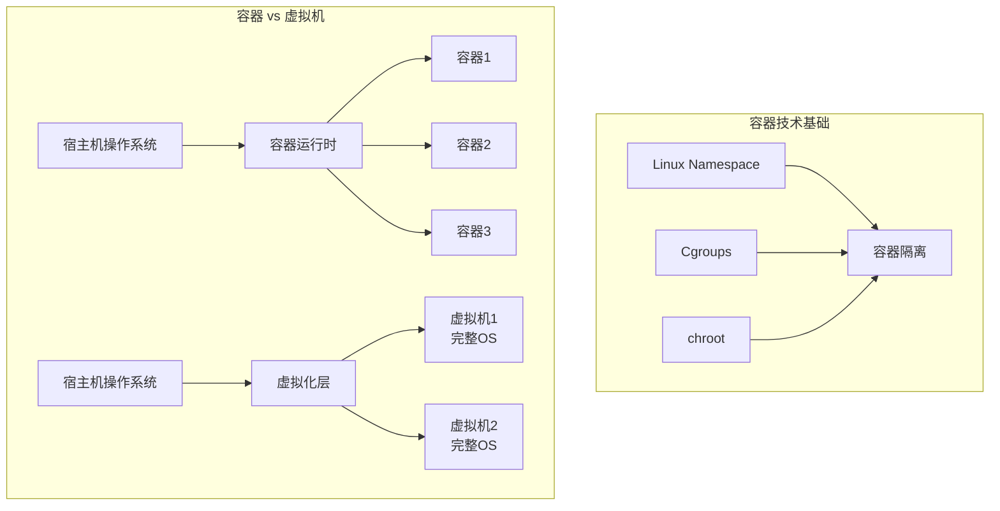

**容器是什么？**

- 基于 Linux Namespace、Cgroups、chroot 等技术
- 提供进程级别的隔离
- 共享宿主机内核，比虚拟机更轻量

### 2.6 容器化流程图

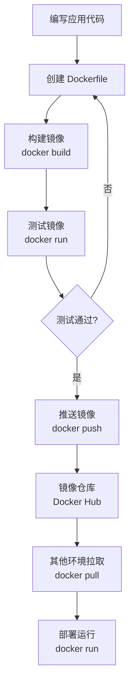

### 2.7 实践练习

尝试容器化其他服务：

1. **Nginx 服务**

   ```bash
   docker pull nginx
   docker run -p 8080:80 nginx
   ```

2. **MySQL 数据库**

   ```bash
   docker pull mysql:8.0
   docker run -e MYSQL_ROOT_PASSWORD=password -p 3306:3306 mysql:8.0
   ```

3. **Redis 缓存**

   ```bash
   docker pull redis
   docker run -p 6379:6379 redis
   ```

### 小结：容器化

通过这个章节，我们学会了：

- ✅ 编写简单的 Go Web 应用
- ✅ 创建 Dockerfile 进行容器化
- ✅ 使用多阶段构建优化镜像大小
- ✅ 构建、运行和推送 Docker 镜像
- ✅ 理解容器技术的基本原理

容器化解决了应用部署的环境一致性问题，为后续的 Kubernetes 学习奠定了基础。

## 3. Pod（最小部署单元）

Pod 是 Kubernetes 中可以创建和管理的最小可部署计算单元。理解 Pod 是掌握 Kubernetes 的关键第一步。

### 3.1 什么是 Pod

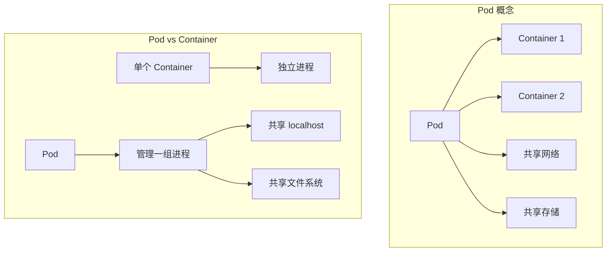

**Pod 的特点：**

- 包含一个或多个容器
- 容器共享网络和存储
- Pod 内容器可以通过 `localhost` 通信
- Pod 是原子性的部署单位

### 3.2 创建第一个 Pod

让我们从一个简单的 Nginx Pod 开始：

#### nginx.yaml

```yaml
apiVersion: v1
kind: Pod
metadata:
  name: nginx-pod
spec:
  containers:
    - name: nginx-container
      image: nginx
```

**YAML 文件解析：**

- `apiVersion: v1` - API 版本
- `kind: Pod` - 资源类型
- `metadata.name` - Pod 名称（集群内唯一）
- `spec.containers` - 容器定义列表

### 3.3 Pod 操作实践

**创建 Pod：**

```bash
kubectl apply -f nginx.yaml
# pod/nginx-pod created
```

**查看 Pod 状态：**

```bash
kubectl get pods
# NAME        READY   STATUS    RESTARTS   AGE
# nginx-pod   1/1     Running   0          6s
```

**端口转发访问：**

```bash
kubectl port-forward nginx-pod 4000:80
# Forwarding from 127.0.0.1:4000 -> 80
# Forwarding from [::1]:4000 -> 80
```

**测试访问：**

```bash
curl http://127.0.0.1:4000
# 返回 Nginx 默认页面
```

### 3.4 进入 Pod 容器

**执行命令：**

```bash
kubectl exec -it nginx-pod -- /bin/bash
```

**修改 Nginx 首页：**

```bash
echo "hello kubernetes by nginx!" > /usr/share/nginx/html/index.html
exit
```

**再次测试：**

```bash
kubectl port-forward nginx-pod 4000:80
curl http://127.0.0.1:4000
# hello kubernetes by nginx!
```

### 3.5 Pod 生命周期

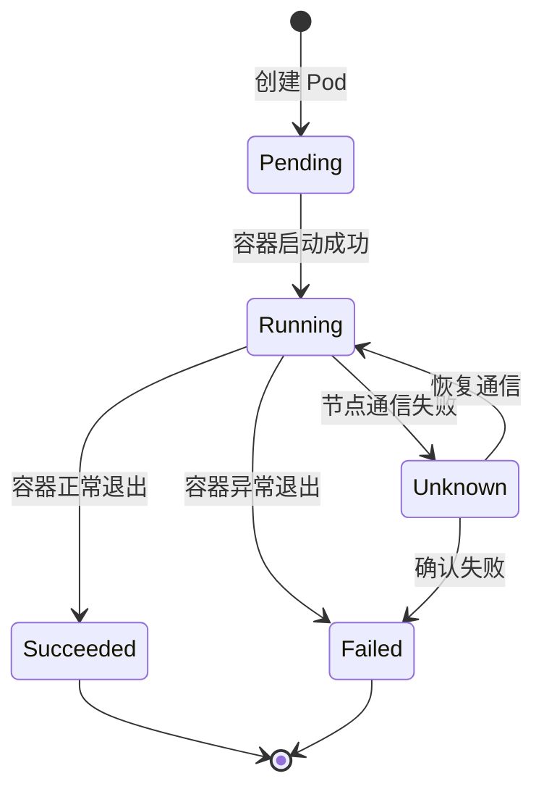

**Pod 状态说明：**

- **Pending**: Pod 已创建，但容器未启动
- **Running**: Pod 已绑定到节点，所有容器已创建
- **Succeeded**: 所有容器成功终止
- **Failed**: 至少一个容器失败终止
- **Unknown**: 无法获取 Pod 状态

### 3.6 Pod 与 Container 的关系

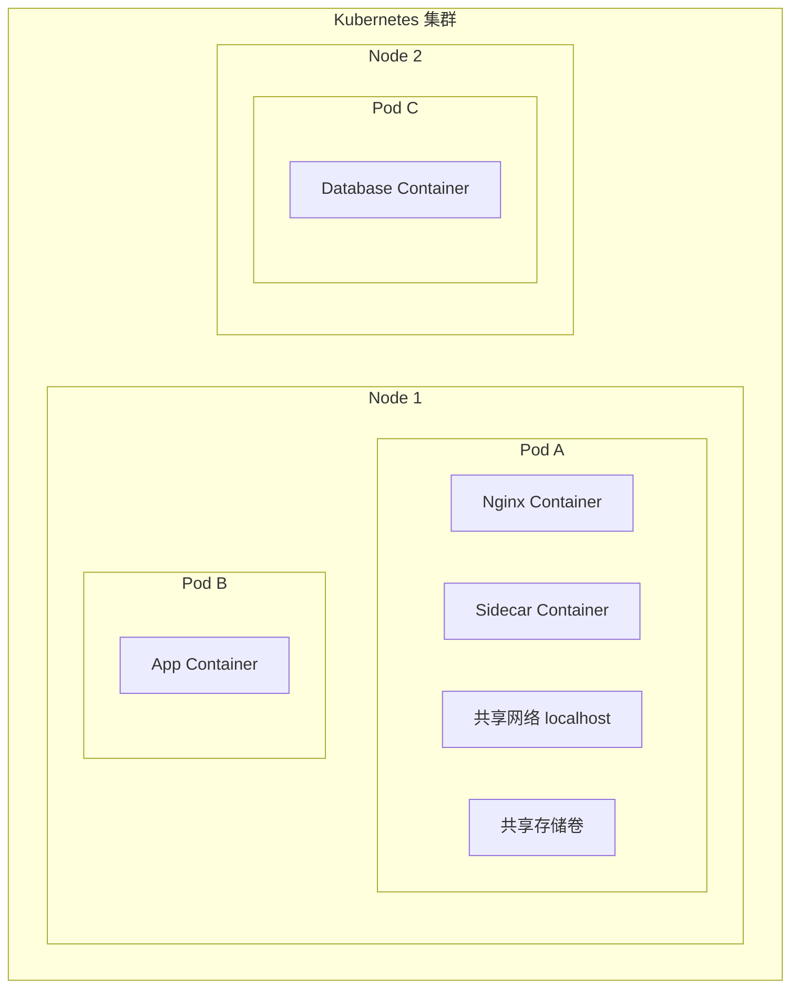

**使用场景：**

1. **单容器 Pod**（最常见）
   - 一个 Pod 包含一个应用容器
2. **多容器 Pod**（特殊场景）
   - 日志收集：主应用 + 日志收集器
   - 代理服务：主应用 + 网络代理
   - 数据同步：主应用 + 数据同步器

### 3.7 创建 HelloK8s Pod

基于之前构建的镜像创建 Pod：

#### hellok8s.yaml

```yaml
apiVersion: v1
kind: Pod
metadata:
  name: hellok8s
spec:
  containers:
    - name: hellok8s-container
      image: guangzhengli/hellok8s:v1
```

**部署和测试：**

```bash
kubectl apply -f hellok8s.yaml
kubectl get pods
kubectl port-forward hellok8s 3000:3000

# 新终端测试
curl http://localhost:3000
# [v1] Hello, Kubernetes!
```

### 3.8 Pod 常用命令

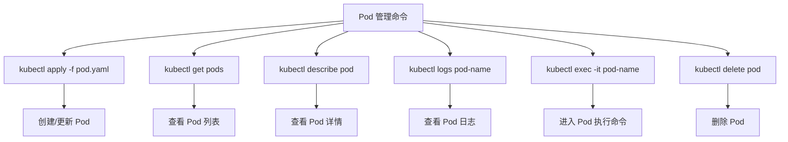

**常用命令汇总：**

| 命令                                  | 功能                |
| ------------------------------------- | ------------------- |
| `kubectl apply -f pod.yaml`           | 创建或更新 Pod      |
| `kubectl get pods`                    | 查看 Pod 列表       |
| `kubectl get pods -o wide`            | 查看 Pod 详细信息   |
| `kubectl describe pod <name>`         | 查看 Pod 详情和事件 |
| `kubectl logs <pod-name>`             | 查看 Pod 日志       |
| `kubectl logs -f <pod-name>`          | 实时查看日志        |
| `kubectl exec -it <pod> -- /bin/bash` | 进入 Pod 执行命令   |
| `kubectl port-forward <pod> 8080:80`  | 端口转发            |
| `kubectl delete pod <name>`           | 删除 Pod            |
| `kubectl delete -f pod.yaml`          | 通过文件删除 Pod    |

### 3.9 故障排查

**Pod 启动失败排查：**

1. **查看 Pod 状态：**

   ```bash
   kubectl get pods
   # NAME       READY   STATUS    RESTARTS   AGE
   # hellok8s   0/1     ImagePullBackOff   0          22m
   ```

2. **查看详细信息：**

   ```bash
   kubectl describe pod hellok8s
   ```

3. **常见问题和解决方案：**

   - `ImagePullBackOff`: 镜像拉取失败

     ```bash
     # 切换到 minikube docker 环境
     eval $(minikube docker-env)
     # 重新构建镜像
     docker build . -t guangzhengli/hellok8s:v1
     ```

   - `CrashLoopBackOff`: 容器启动后立即退出
   - `Pending`: 资源不足或调度失败

### 3.10 Pod 网络模型

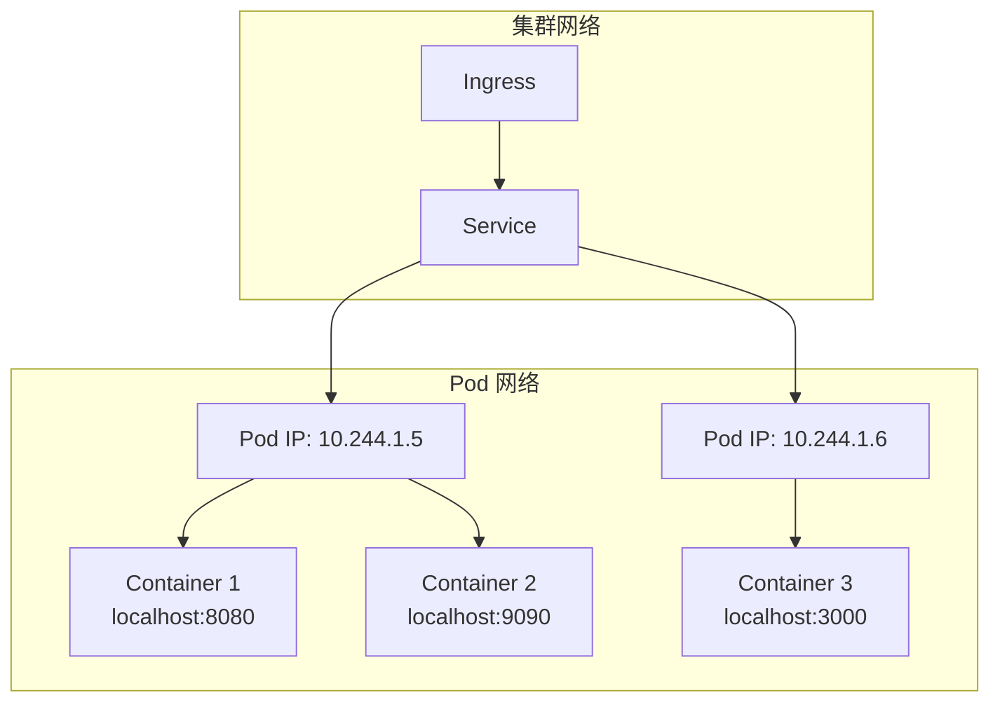

**网络特点：**

- 每个 Pod 有唯一的 IP 地址
- Pod 内容器共享网络命名空间
- 容器间通过 localhost 通信
- Pod 间通过 Pod IP 直接通信

### 小结：Pod

通过这个章节，我们学会了：

- ✅ 理解 Pod 的概念和作用
- ✅ 创建和管理 Pod 资源
- ✅ 使用 kubectl 操作 Pod
- ✅ 进入 Pod 执行命令和查看日志
- ✅ 理解 Pod 的生命周期和网络模型
- ✅ 排查 Pod 常见问题

Pod 是 Kubernetes 的基础构建块，为后续学习 Deployment、Service 等高级概念奠定了基础。

## 4. Deployment（自动化管理）

在生产环境中，我们很少直接管理 Pod。Deployment 提供了声明式的 Pod 管理能力，包括自动扩容、滚动更新、故障恢复等功能。

### 4.1 为什么需要 Deployment

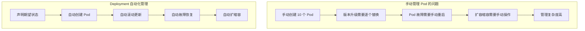

**Deployment 解决的问题：**

- 🔄 **自动故障恢复**：Pod 异常时自动重建
- 📈 **弹性伸缩**：根据需求自动调整副本数
- 🚀 **滚动更新**：零停机时间的版本升级
- 📝 **声明式管理**：描述期望状态，系统自动达成

### 4.2 创建 Deployment

#### deployment.yaml

```yaml
apiVersion: apps/v1
kind: Deployment
metadata:
  name: hellok8s-deployment
spec:
  replicas: 1
  selector:
    matchLabels:
      app: hellok8s
  template:
    metadata:
      labels:
        app: hellok8s
    spec:
      containers:
        - image: guangzhengli/hellok8s:v1
          name: hellok8s-container
```

**配置解析：**

- `replicas: 1` - 期望的 Pod 副本数
- `selector.matchLabels` - 选择器，匹配要管理的 Pod
- `template` - Pod 模板，定义创建的 Pod 规格
- `labels: app: hellok8s` - Pod 标签，与选择器对应

### 4.3 Deployment 自愈能力

**部署 Deployment：**

```bash
kubectl apply -f deployment.yaml
kubectl get deployments
# NAME                  READY   UP-TO-DATE   AVAILABLE   AGE
# hellok8s-deployment   1/1     1            1           39s

kubectl get pods
# NAME                                   READY   STATUS    RESTARTS   AGE
# hellok8s-deployment-77bffb88c5-qlxss   1/1     Running   0          119s
```

**测试自愈能力：**

```bash
# 手动删除 Pod
kubectl delete pod hellok8s-deployment-77bffb88c5-qlxss
# pod "hellok8s-deployment-77bffb88c5-qlxss" deleted

# 立即查看，发现新 Pod 自动创建
kubectl get pods
# NAME                                   READY   STATUS    RESTARTS   AGE
# hellok8s-deployment-77bffb88c5-xp8f7   1/1     Running   0          18s
```

### 4.4 自动扩容

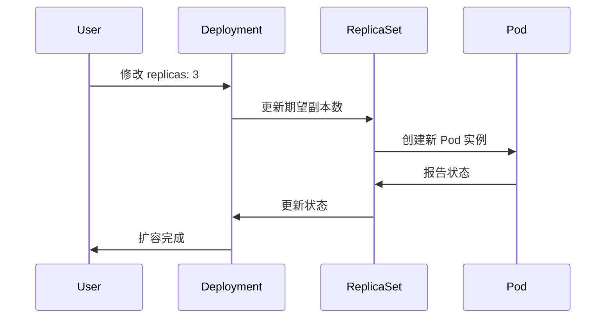

**扩容到 3 个副本：**

```yaml
apiVersion: apps/v1
kind: Deployment
metadata:
  name: hellok8s-deployment
spec:
  replicas: 3 # 修改副本数
  selector:
    matchLabels:
      app: hellok8s
  template:
    metadata:
      labels:
        app: hellok8s
    spec:
      containers:
        - image: guangzhengli/hellok8s:v1
          name: hellok8s-container
```

**应用更改：**

```bash
kubectl apply -f deployment.yaml

# 观察扩容过程
kubectl get pods --watch
# NAME                                   READY   STATUS    RESTARTS   AGE
# hellok8s-deployment-77bffb88c5-xp8f7   1/1     Running   0          5m
# hellok8s-deployment-77bffb88c5-abc123  0/1     Pending   0          1s
# hellok8s-deployment-77bffb88c5-def456  0/1     Pending   0          1s
# hellok8s-deployment-77bffb88c5-abc123  1/1     Running   0          10s
# hellok8s-deployment-77bffb88c5-def456  1/1     Running   0          12s
```

### 4.5 版本升级

**构建 v2 版本：**

#### main.go (v2)

```go
package main

import (
 "io"
 "net/http"
)

func hello(w http.ResponseWriter, r *http.Request) {
 io.WriteString(w, "[v2] Hello, Kubernetes!")
}

func main() {
 http.HandleFunc("/", hello)
 http.ListenAndServe(":3000", nil)
}
```

**构建和推送：**

```bash
docker build . -t guangzhengli/hellok8s:v2
docker push guangzhengli/hellok8s:v2
```

**更新 Deployment：**

```yaml
apiVersion: apps/v1
kind: Deployment
metadata:
  name: hellok8s-deployment
spec:
  replicas: 3
  selector:
    matchLabels:
      app: hellok8s
  template:
    metadata:
      labels:
        app: hellok8s
    spec:
      containers:
        - image: guangzhengli/hellok8s:v2 # 更新镜像版本
          name: hellok8s-container
```

**应用更新：**

```bash
kubectl apply -f deployment.yaml
kubectl get pods
kubectl port-forward hellok8s-deployment-66799848c4-kpc6q 3000:3000

# 测试新版本
curl http://localhost:3000
# [v2] Hello, Kubernetes!
```

### 4.6 滚动更新策略

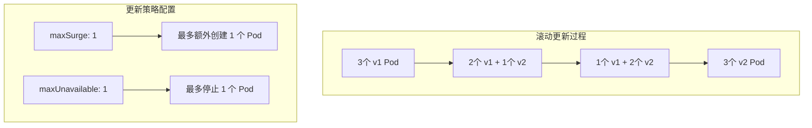

**配置滚动更新策略：**

```yaml
apiVersion: apps/v1
kind: Deployment
metadata:
  name: hellok8s-deployment
spec:
  strategy:
    type: RollingUpdate
    rollingUpdate:
      maxSurge: 1 # 最大峰值：可以创建的超出期望 Pod 数的 Pod 数量
      maxUnavailable: 1 # 最大不可用：更新过程中不可用的 Pod 数量上限
  replicas: 3
  selector:
    matchLabels:
      app: hellok8s
  template:
    metadata:
      labels:
        app: hellok8s
    spec:
      containers:
        - image: guangzhengli/hellok8s:v2
          name: hellok8s-container
```

**更新策略类型：**

- **RollingUpdate**（默认）：逐步替换旧 Pod
- **Recreate**：先删除所有旧 Pod，再创建新 Pod

### 4.7 版本回滚

**查看部署历史：**

```bash
kubectl rollout history deployment hellok8s-deployment
# REVISION  CHANGE-CAUSE
# 1         <none>
# 2         <none>
```

**回滚到上一版本：**

```bash
kubectl rollout undo deployment hellok8s-deployment
# deployment.apps/hellok8s-deployment rolled back

kubectl get pods
kubectl describe pod hellok8s-deployment-77bffb88c5-cvm5c
# Image: guangzhengli/hellok8s:v1  # 已回滚到 v1
```

**回滚到指定版本：**

```bash
kubectl rollout undo deployment/hellok8s-deployment --to-revision=2
```

### 4.8 健康检查

#### 4.8.1 存活探针 (Liveness Probe)

存活探针用于检测容器是否还在运行，如果检测失败，kubelet 会重启容器。

**带健康检查的应用 (v3)：**

```go
package main

import (
 "fmt"
 "io"
 "net/http"
 "time"
)

func hello(w http.ResponseWriter, r *http.Request) {
 io.WriteString(w, "[v3] Hello, Kubernetes!")
}

func main() {
 started := time.Now()
 http.HandleFunc("/healthz", func(w http.ResponseWriter, r *http.Request) {
  duration := time.Since(started)
  if duration.Seconds() > 15 {
   w.WriteHeader(500)
   w.Write([]byte(fmt.Sprintf("error: %v", duration.Seconds())))
  } else {
   w.WriteHeader(200)
   w.Write([]byte("ok"))
  }
 })

 http.HandleFunc("/", hello)
 http.ListenAndServe(":3000", nil)
}
```

**配置存活探针：**

```yaml
apiVersion: apps/v1
kind: Deployment
metadata:
  name: hellok8s-deployment
spec:
  replicas: 3
  selector:
    matchLabels:
      app: hellok8s
  template:
    metadata:
      labels:
        app: hellok8s
    spec:
      containers:
        - image: guangzhengli/hellok8s:liveness
          name: hellok8s-container
          livenessProbe:
            httpGet:
              path: /healthz
              port: 3000
            initialDelaySeconds: 3 # 启动后等待时间
            periodSeconds: 3 # 检查间隔
```

**观察重启行为：**

```bash
kubectl apply -f deployment.yaml
kubectl get pods
# NAME                                   READY   STATUS    RESTARTS     AGE
# hellok8s-deployment-5995ff9447-d5fbz   1/1     Running   4 (6s ago)   102s

kubectl describe pod hellok8s-deployment-5995ff9447-d5fbz
# Events:
#   Normal   Killing    11m (x3 over 12m)     kubelet            Container hellok8s-container failed liveness probe, will be restarted
```

#### 4.8.2 就绪探针 (Readiness Probe)

就绪探针用于检测容器是否准备好接受流量，如果检测失败，Pod 会从 Service 的负载均衡中移除。

**模拟有问题的版本：**

```go
package main

import (
 "io"
 "net/http"
)

func hello(w http.ResponseWriter, r *http.Request) {
 io.WriteString(w, "[bad] Hello, Kubernetes!")
}

func main() {
 http.HandleFunc("/healthz", func(w http.ResponseWriter, r *http.Request) {
  w.WriteHeader(500)  // 始终返回错误
 })

 http.HandleFunc("/", hello)
 http.ListenAndServe(":3000", nil)
}
```

**配置就绪探针：**

```yaml
apiVersion: apps/v1
kind: Deployment
metadata:
  name: hellok8s-deployment
spec:
  strategy:
    rollingUpdate:
      maxSurge: 1
      maxUnavailable: 1
  replicas: 3
  selector:
    matchLabels:
      app: hellok8s
  template:
    metadata:
      labels:
        app: hellok8s
    spec:
      containers:
        - image: guangzhengli/hellok8s:bad
          name: hellok8s-container
          readinessProbe:
            httpGet:
              path: /healthz
              port: 3000
            initialDelaySeconds: 1
            successThreshold: 5 # 连续成功 5 次才认为就绪
```

**观察滚动更新被阻止：**

```bash
kubectl apply -f deployment.yaml
kubectl get pods
# NAME                                   READY   STATUS    RESTARTS   AGE
# hellok8s-deployment-66799848c4-8xzsz   1/1     Running   0          102s  # 旧版本继续运行
# hellok8s-deployment-66799848c4-m9dl5   1/1     Running   0          102s  # 旧版本继续运行
# hellok8s-deployment-9c57c7f56-rww7k    0/1     Running   0          26s   # 新版本未就绪
# hellok8s-deployment-9c57c7f56-xt9tw    0/1     Running   0          26s   # 新版本未就绪
```

### 4.9 Deployment 架构图

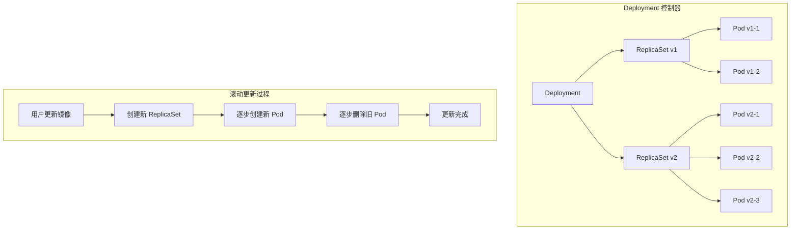

**组件关系：**

- **Deployment**：管理 ReplicaSet 的生命周期
- **ReplicaSet**：确保指定数量的 Pod 副本运行
- **Pod**：实际运行的应用实例

### 4.10 常用命令

| 命令                                                      | 功能                 |
| --------------------------------------------------------- | -------------------- |
| `kubectl create deployment <name> --image=<image>`        | 快速创建 Deployment  |
| `kubectl get deployments`                                 | 查看 Deployment 列表 |
| `kubectl describe deployment <name>`                      | 查看 Deployment 详情 |
| `kubectl scale deployment <name> --replicas=5`            | 扩缩容               |
| `kubectl set image deployment/<name> <container>=<image>` | 更新镜像             |
| `kubectl rollout status deployment/<name>`                | 查看滚动更新状态     |
| `kubectl rollout history deployment/<name>`               | 查看更新历史         |
| `kubectl rollout undo deployment/<name>`                  | 回滚到上一版本       |
| `kubectl rollout restart deployment/<name>`               | 重启 Deployment      |

### 小结：Deployment

通过这个章节，我们学会了：

- ✅ 理解 Deployment 的作用和优势
- ✅ 创建和管理 Deployment 资源
- ✅ 实现自动扩缩容和故障恢复
- ✅ 配置滚动更新策略
- ✅ 使用健康检查保证服务可用性
- ✅ 进行版本升级和回滚操作

Deployment 是 Kubernetes 中最重要的工作负载资源，为应用提供了生产级的部署和管理能力。

## 5. Service（服务发现与负载均衡）

Service 解决了 Pod IP 地址不稳定和负载均衡的问题，为一组 Pod 提供稳定的网络访问入口。

### 5.1 为什么需要 Service

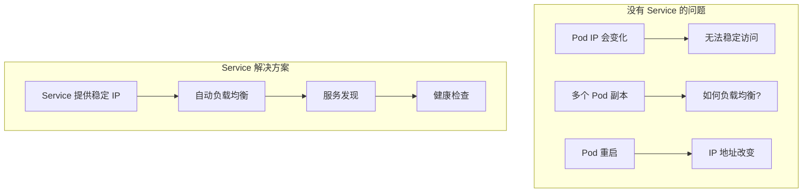

**Service 解决的问题：**

- 🔗 **稳定访问**：为 Pod 提供不变的访问地址
- ⚖️ **负载均衡**：自动分发请求到多个 Pod
- 🔍 **服务发现**：通过 DNS 名称访问服务
- 🏥 **健康检查**：只向就绪的 Pod 转发流量

### 5.2 准备测试环境

首先创建一个返回主机名的应用版本：

#### main.go (v3)

```go
package main

import (
 "fmt"
 "io"
 "net/http"
 "os"
)

func hello(w http.ResponseWriter, r *http.Request) {
 host, _ := os.Hostname()
 io.WriteString(w, fmt.Sprintf("[v3] Hello, Kubernetes!, From host: %s", host))
}

func main() {
 http.HandleFunc("/", hello)
 http.ListenAndServe(":3000", nil)
}
```

**构建和部署：**

```bash
docker build . -t guangzhengli/hellok8s:v3
docker push guangzhengli/hellok8s:v3
```

#### deployment.yaml (v3)

```yaml
apiVersion: apps/v1
kind: Deployment
metadata:
  name: hellok8s-deployment
spec:
  replicas: 3
  selector:
    matchLabels:
      app: hellok8s
  template:
    metadata:
      labels:
        app: hellok8s
    spec:
      containers:
        - image: guangzhengli/hellok8s:v3
          name: hellok8s-container
```

### 5.3 ClusterIP Service

ClusterIP 是默认的 Service 类型，只能在集群内部访问。

#### service-hellok8s-clusterip.yaml

```yaml
apiVersion: v1
kind: Service
metadata:
  name: service-hellok8s-clusterip
spec:
  type: ClusterIP
  selector:
    app: hellok8s # 选择标签为 app: hellok8s 的 Pod
  ports:
    - port: 3000 # Service 端口
      targetPort: 3000 # Pod 端口
```

**部署和测试：**

```bash
kubectl apply -f deployment.yaml
kubectl apply -f service-hellok8s-clusterip.yaml

# 查看 Service 和 Endpoints
kubectl get service
# NAME                         TYPE        CLUSTER-IP      EXTERNAL-IP   PORT(S)    AGE
# service-hellok8s-clusterip   ClusterIP   10.104.96.153   <none>        3000/TCP   10s

kubectl get endpoints
# NAME                         ENDPOINTS                                          AGE
# service-hellok8s-clusterip   172.17.0.10:3000,172.17.0.2:3000,172.17.0.3:3000   10s

kubectl get pod -o wide
# NAME                                   READY   STATUS    RESTARTS   AGE    IP           NODE
# hellok8s-deployment-5d5545b69c-24lw5   1/1     Running   0          112s   172.17.0.7   minikube
# hellok8s-deployment-5d5545b69c-9g94t   1/1     Running   0          112s   172.17.0.3   minikube
# hellok8s-deployment-5d5545b69c-9gm8r   1/1     Running   0          112s   172.17.0.2   minikube
```

### 5.4 Service 工作原理

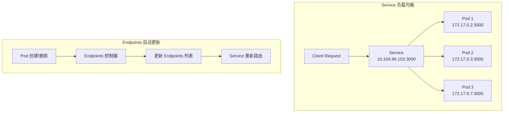

**在集群内测试 Service：**

创建一个测试 Pod：

```yaml
apiVersion: v1
kind: Pod
metadata:
  name: nginx
  labels:
    app: nginx
spec:
  containers:
    - name: nginx-container
      image: nginx
```

```bash
kubectl apply -f nginx.yaml
kubectl exec -it nginx -- /bin/bash

# 在 nginx 容器内测试
curl 10.104.96.153:3000
# [v3] Hello, Kubernetes!, From host: hellok8s-deployment-5d5545b69c-9gm8r

curl 10.104.96.153:3000
# [v3] Hello, Kubernetes!, From host: hellok8s-deployment-5d5545b69c-9g94t
```

可以看到每次请求返回不同的主机名，说明 Service 在自动负载均衡。

### 5.5 NodePort Service

NodePort 通过每个节点的 IP 和静态端口暴露服务，可以从集群外部访问。

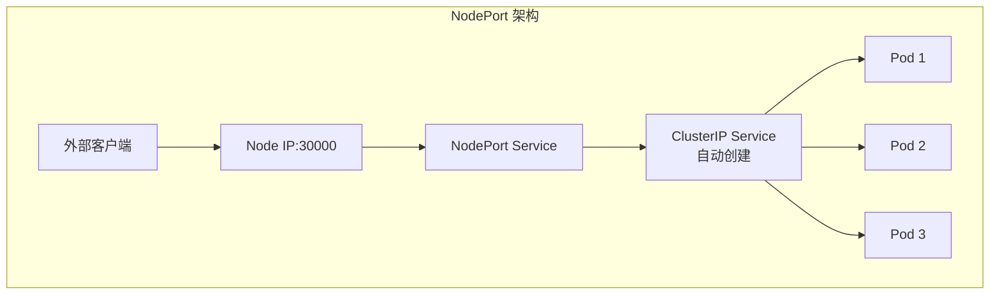

#### service-hellok8s-nodeport.yaml

```yaml
apiVersion: v1
kind: Service
metadata:
  name: service-hellok8s-nodeport
spec:
  type: NodePort
  selector:
    app: hellok8s
  ports:
    - port: 3000
      nodePort: 30000 # 节点端口 (30000-32767)
```

**部署和测试：**

```bash
kubectl apply -f service-hellok8s-nodeport.yaml

kubectl get service
# NAME                         TYPE        CLUSTER-IP       EXTERNAL-IP   PORT(S)          AGE
# service-hellok8s-nodeport    NodePort    10.109.188.161   <none>        3000:30000/TCP   28s

# 获取 minikube IP
minikube ip
# 192.168.59.100

# 从集群外部访问
curl http://192.168.59.100:30000
# [v3] Hello, Kubernetes!, From host: hellok8s-deployment-5d5545b69c-9g94t
```

**Docker Desktop 用户注意：**
如果无法通过 Node IP 访问，使用以下命令：

```bash
minikube service service-hellok8s-nodeport --url
# http://127.0.0.1:50896

curl http://127.0.0.1:50896
# [v3] Hello, Kubernetes!, From host: hellok8s-deployment-559cfdd58c-zp2pc
```

### 5.6 LoadBalancer Service

LoadBalancer 使用云提供商的负载均衡器向外部暴露服务。

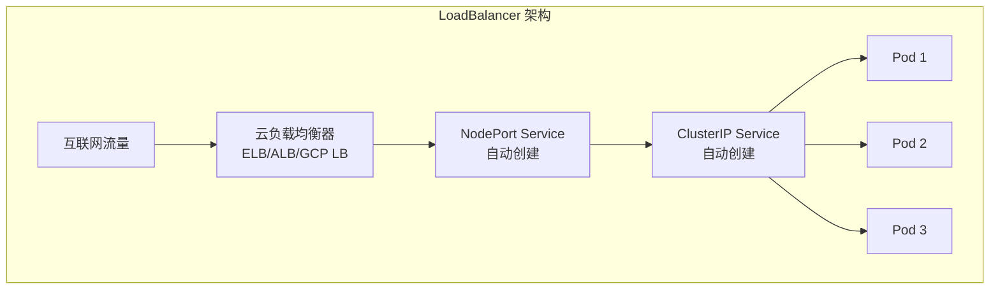

#### service-hellok8s-loadbalancer.yaml

```yaml
apiVersion: v1
kind: Service
metadata:
  name: service-hellok8s-loadbalancer
spec:
  type: LoadBalancer
  selector:
    app: hellok8s
  ports:
    - port: 3000
      targetPort: 3000
```

**在云环境中的效果：**

```bash
kubectl get service
# NAME                            TYPE           CLUSTER-IP     EXTERNAL-IP      PORT(S)          AGE
# service-hellok8s-loadbalancer   LoadBalancer   10.100.200.1   52.123.45.67     3000:31234/TCP   2m
```

> **注意：** 在 minikube 中需要使用 `minikube tunnel` 来模拟 LoadBalancer，但与真实云环境有差异。

### 5.7 Service 类型对比

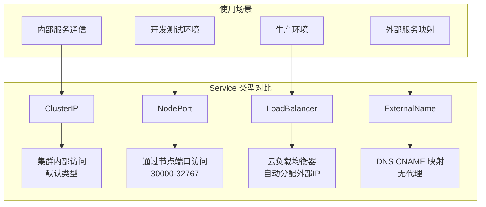

| Service 类型     | 访问方式       | 使用场景     | 外部访问 |
| ---------------- | -------------- | ------------ | -------- |
| **ClusterIP**    | 集群内部 IP    | 内部服务通信 | ❌       |
| **NodePort**     | 节点 IP + 端口 | 开发测试     | ✅       |
| **LoadBalancer** | 云负载均衡器   | 生产环境     | ✅       |
| **ExternalName** | DNS CNAME      | 外部服务映射 | N/A      |

### 5.8 Service 发现

Kubernetes 提供了多种服务发现机制：

#### 5.8.1 环境变量

```bash
kubectl exec -it nginx -- env | grep HELLOK8S
# SERVICE_HELLOK8S_CLUSTERIP_SERVICE_HOST=10.104.96.153
# SERVICE_HELLOK8S_CLUSTERIP_SERVICE_PORT=3000
```

#### 5.8.2 DNS 解析

```bash
kubectl exec -it nginx -- nslookup service-hellok8s-clusterip
# Name: service-hellok8s-clusterip.default.svc.cluster.local
# Address: 10.104.96.153

# 直接通过服务名访问
kubectl exec -it nginx -- curl service-hellok8s-clusterip:3000
# [v3] Hello, Kubernetes!, From host: hellok8s-deployment-5d5545b69c-24lw5
```

**DNS 命名规则：**

```text
<service-name>.<namespace>.svc.cluster.local
```

### 5.9 Service 网络模型

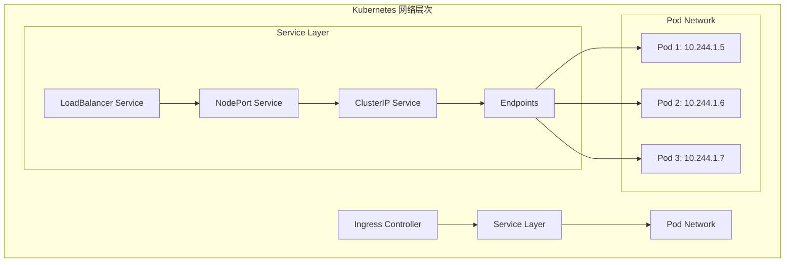

### 5.10 Service 高级特性

#### 5.10.1 会话亲和性

```yaml
apiVersion: v1
kind: Service
metadata:
  name: service-hellok8s-session
spec:
  type: ClusterIP
  sessionAffinity: ClientIP # 基于客户端 IP 的会话保持
  selector:
    app: hellok8s
  ports:
    - port: 3000
      targetPort: 3000
```

#### 5.10.2 多端口服务

```yaml
apiVersion: v1
kind: Service
metadata:
  name: service-hellok8s-multiport
spec:
  type: ClusterIP
  selector:
    app: hellok8s
  ports:
    - name: http
      port: 80
      targetPort: 3000
    - name: https
      port: 443
      targetPort: 3443
```

#### 5.10.3 无头服务 (Headless Service)

```yaml
apiVersion: v1
kind: Service
metadata:
  name: service-hellok8s-headless
spec:
  clusterIP: None # 无头服务
  selector:
    app: hellok8s
  ports:
    - port: 3000
      targetPort: 3000
```

无头服务直接返回 Pod IP 地址，常用于有状态应用。

### 5.11 Service 故障排查

**常见问题和解决方案：**

1. **Service 无法访问**

   ```bash
   # 检查 Service 配置
   kubectl describe service <service-name>

   # 检查 Endpoints
   kubectl get endpoints <service-name>

   # 检查 Pod 标签
   kubectl get pods --show-labels
   ```

2. **负载均衡不工作**

   ```bash
   # 检查 Pod 就绪状态
   kubectl get pods

   # 检查就绪探针配置
   kubectl describe pod <pod-name>
   ```

3. **DNS 解析失败**

   ```bash
   # 测试 DNS 解析
   kubectl exec -it <pod> -- nslookup <service-name>

   # 检查 CoreDNS
   kubectl get pods -n kube-system | grep coredns
   ```

### 5.12 Service 最佳实践

```mermaid
graph TD
    A[Service 最佳实践] --> B[合理选择 Service 类型]
    A --> C[配置健康检查]
    A --> D[使用有意义的标签]
    A --> E[监控 Service 性能]

    B --> B1[内部通信用 ClusterIP]
    B --> B2[生产环境用 LoadBalancer]

    C --> C1[配置 readinessProbe]
    C --> C2[设置合理的超时时间]

    D --> D1[使用语义化标签]
    D --> D2[避免标签冲突]

    E --> E1[监控延迟和错误率]
    E --> E2[设置告警规则]
```

### 小结：Service

通过这个章节，我们学会了：

- ✅ 理解 Service 的作用和重要性
- ✅ 掌握不同类型 Service 的使用场景
- ✅ 配置 ClusterIP、NodePort、LoadBalancer
- ✅ 理解服务发现和负载均衡机制
- ✅ 使用 DNS 进行服务间通信
- ✅ 排查 Service 常见问题

Service 是 Kubernetes 网络的核心组件，为微服务架构提供了稳定可靠的服务间通信基础。

## 6. Ingress（流量网关）

Ingress 是 Kubernetes 的 API 网关，提供 HTTP 和 HTTPS 路由功能，是集群外部访问内部服务的统一入口。

### 6.1 什么是 Ingress

```mermaid
graph TB
    subgraph "传统方式的问题"
        A1[多个 NodePort Service] --> A2[端口管理复杂]
        A3[LoadBalancer Service] --> A4[成本高昂]
        A5[缺乏路由规则] --> A6[无法基于域名/路径分发]
    end

    subgraph "Ingress 解决方案"
        B1[统一入口] --> B2[基于域名路由]
        B2 --> B3[基于路径路由]
        B3 --> B4[SSL/TLS 终结]
        B4 --> B5[负载均衡]
    end
```

**Ingress 的优势：**

- 🌐 **统一入口**：一个 IP 地址处理所有外部流量
- 🔀 **智能路由**：基于域名、路径进行流量分发
- 🔒 **SSL 终结**：集中管理 HTTPS 证书
- 💰 **成本优化**：减少 LoadBalancer 数量

### 6.2 启用 Ingress Controller

在 minikube 中启用 nginx-ingress：

```bash
minikube addons enable ingress
# ✅  ingress is now enabled

# 验证 Ingress Controller 运行状态
kubectl get pods -n ingress-nginx
# NAME                                        READY   STATUS      RESTARTS   AGE
# ingress-nginx-admission-create-xxx          0/1     Completed   0          2m
# ingress-nginx-admission-patch-xxx           0/1     Completed   1          2m
# ingress-nginx-controller-xxx                1/1     Running     0          2m
```

### 6.3 准备测试服务

首先清理之前的资源，然后创建测试服务：

```bash
kubectl delete deployment,service --all
```

**创建 HelloK8s 服务：**

#### hellok8s.yaml (Service)

```yaml
apiVersion: v1
kind: Service
metadata:
  name: service-hellok8s-clusterip
spec:
  type: ClusterIP
  selector:
    app: hellok8s
  ports:
    - port: 3000
      targetPort: 3000

---
apiVersion: apps/v1
kind: Deployment
metadata:
  name: hellok8s-deployment
spec:
  replicas: 3
  selector:
    matchLabels:
      app: hellok8s
  template:
    metadata:
      labels:
        app: hellok8s
    spec:
      containers:
        - image: guangzhengli/hellok8s:v3
          name: hellok8s-container
```

**创建 Nginx 服务：**

#### nginx.yaml (Service)

```yaml
apiVersion: v1
kind: Service
metadata:
  name: service-nginx-clusterip
spec:
  type: ClusterIP
  selector:
    app: nginx
  ports:
    - port: 4000
      targetPort: 80

---
apiVersion: apps/v1
kind: Deployment
metadata:
  name: nginx-deployment
spec:
  replicas: 2
  selector:
    matchLabels:
      app: nginx
  template:
    metadata:
      labels:
        app: nginx
    spec:
      containers:
        - image: nginx
          name: nginx-container
```

**部署服务：**

```bash
kubectl apply -f hellok8s.yaml
kubectl apply -f nginx.yaml

kubectl get pods
# NAME                                   READY   STATUS    RESTARTS   AGE
# hellok8s-deployment-5d5545b69c-4wvmf   1/1     Running   0          55s
# hellok8s-deployment-5d5545b69c-qcszp   1/1     Running   0          55s
# hellok8s-deployment-5d5545b69c-sn7mn   1/1     Running   0          55s
# nginx-deployment-d47fd7f66-d9r7x       1/1     Running   0          34s
# nginx-deployment-d47fd7f66-hp5nf       1/1     Running   0          34s
```

### 6.4 创建 Ingress 规则

#### ingress.yaml

```yaml
apiVersion: networking.k8s.io/v1
kind: Ingress
metadata:
  name: hello-ingress
  annotations:
    # 关闭 HTTPS 重定向，使用 HTTP
    nginx.ingress.kubernetes.io/ssl-redirect: 'false'
spec:
  rules:
    - http:
        paths:
          - path: /hello
            pathType: Prefix
            backend:
              service:
                name: service-hellok8s-clusterip
                port:
                  number: 3000
          - path: /
            pathType: Prefix
            backend:
              service:
                name: service-nginx-clusterip
                port:
                  number: 4000
```

**配置解析：**

- `path: /hello` - 匹配 `/hello` 前缀的请求
- `pathType: Prefix` - 前缀匹配模式
- `backend.service` - 后端服务配置
- `annotations` - Ingress Controller 特定配置

### 6.5 Ingress 路由规则

```mermaid
graph TB
    subgraph "Ingress 路由流程"
        A[客户端请求] --> B{Ingress Controller}
        B -->|/hello/*| C[HelloK8s Service]
        B -->|/*| D[Nginx Service]

        C --> E[HelloK8s Pod 1]
        C --> F[HelloK8s Pod 2]
        C --> G[HelloK8s Pod 3]

        D --> H[Nginx Pod 1]
        D --> I[Nginx Pod 2]
    end
```

**部署和测试：**

```bash
kubectl apply -f ingress.yaml

kubectl get ingress
# NAME            CLASS   HOSTS   ADDRESS   PORTS   AGE
# hello-ingress   nginx   *                 80      16s

# 获取 minikube IP
minikube ip
# 192.168.59.100

# 测试路由规则
curl http://192.168.59.100/hello
# [v3] Hello, Kubernetes!, From host: hellok8s-deployment-5d5545b69c-sn7mn

curl http://192.168.59.100/
# <!DOCTYPE html>
# <html>
# <head>
# <title>Welcome to nginx!</title>
```

### 6.6 基于域名的路由

#### ingress-host.yaml

```yaml
apiVersion: networking.k8s.io/v1
kind: Ingress
metadata:
  name: hello-ingress-host
  annotations:
    nginx.ingress.kubernetes.io/ssl-redirect: 'false'
spec:
  rules:
    - host: hello.k8s.local
      http:
        paths:
          - path: /
            pathType: Prefix
            backend:
              service:
                name: service-hellok8s-clusterip
                port:
                  number: 3000
    - host: nginx.k8s.local
      http:
        paths:
          - path: /
            pathType: Prefix
            backend:
              service:
                name: service-nginx-clusterip
                port:
                  number: 4000
```

**配置本地 DNS：**

```bash
# 添加域名映射到 /etc/hosts
echo "$(minikube ip) hello.k8s.local nginx.k8s.local" | sudo tee -a /etc/hosts

# 测试基于域名的路由
curl http://hello.k8s.local/
# [v3] Hello, Kubernetes!, From host: hellok8s-deployment-5d5545b69c-4wvmf

curl http://nginx.k8s.local/
# <!DOCTYPE html>
# <html>
# <head>
# <title>Welcome to nginx!</title>
```

### 6.7 HTTPS 和 TLS 配置

**创建自签名证书：**

```bash
# 生成私钥
openssl genrsa -out tls.key 2048

# 生成证书
openssl req -new -x509 -key tls.key -out tls.cert -days 365 -subj /CN=hello.k8s.local

# 创建 TLS Secret
kubectl create secret tls hello-tls --cert=tls.cert --key=tls.key
```

#### ingress-tls.yaml

```yaml
apiVersion: networking.k8s.io/v1
kind: Ingress
metadata:
  name: hello-ingress-tls
spec:
  tls:
    - hosts:
        - hello.k8s.local
      secretName: hello-tls
  rules:
    - host: hello.k8s.local
      http:
        paths:
          - path: /
            pathType: Prefix
            backend:
              service:
                name: service-hellok8s-clusterip
                port:
                  number: 3000
```

**测试 HTTPS：**

```bash
kubectl apply -f ingress-tls.yaml

# 测试 HTTPS 访问（忽略证书验证）
curl -k https://hello.k8s.local/
# [v3] Hello, Kubernetes!, From host: hellok8s-deployment-5d5545b69c-qcszp
```

### 6.8 Ingress 高级功能

#### 6.8.1 重写和重定向

```yaml
apiVersion: networking.k8s.io/v1
kind: Ingress
metadata:
  name: hello-ingress-rewrite
  annotations:
    nginx.ingress.kubernetes.io/rewrite-target: /$2
    nginx.ingress.kubernetes.io/ssl-redirect: 'false'
spec:
  rules:
    - http:
        paths:
          - path: /api(/|$)(.*)
            pathType: Prefix
            backend:
              service:
                name: service-hellok8s-clusterip
                port:
                  number: 3000
```

#### 6.8.2 限流和访问控制

```yaml
apiVersion: networking.k8s.io/v1
kind: Ingress
metadata:
  name: hello-ingress-rate-limit
  annotations:
    nginx.ingress.kubernetes.io/rate-limit: '10'
    nginx.ingress.kubernetes.io/rate-limit-window: '1m'
    nginx.ingress.kubernetes.io/whitelist-source-range: '10.0.0.0/8,172.16.0.0/12'
spec:
  rules:
    - http:
        paths:
          - path: /
            pathType: Prefix
            backend:
              service:
                name: service-hellok8s-clusterip
                port:
                  number: 3000
```

#### 6.8.3 跨域配置 (CORS)

```yaml
apiVersion: networking.k8s.io/v1
kind: Ingress
metadata:
  name: hello-ingress-cors
  annotations:
    nginx.ingress.kubernetes.io/enable-cors: 'true'
    nginx.ingress.kubernetes.io/cors-allow-origin: '*'
    nginx.ingress.kubernetes.io/cors-allow-methods: 'GET, POST, PUT, DELETE, OPTIONS'
spec:
  rules:
    - http:
        paths:
          - path: /api
            pathType: Prefix
            backend:
              service:
                name: service-hellok8s-clusterip
                port:
                  number: 3000
```

### 6.9 Ingress Controller 对比

```mermaid
graph TD
    subgraph "主流 Ingress Controller"
        A[Nginx Ingress] --> A1[最流行<br/>功能丰富]
        B[Traefik] --> B1[自动服务发现<br/>现代化界面]
        C[HAProxy Ingress] --> C1[高性能<br/>企业级特性]
        D[Istio Gateway] --> D1[服务网格<br/>高级流量管理]
        E[Kong Ingress] --> E1[API 网关<br/>插件生态]
    end

    subgraph "选择标准"
        F[性能要求] --> G[功能需求]
        G --> H[生态兼容性]
        H --> I[运维复杂度]
    end
```

| Ingress Controller  | 优势               | 适用场景           |
| ------------------- | ------------------ | ------------------ |
| **Nginx Ingress**   | 成熟稳定、功能丰富 | 通用场景、生产环境 |
| **Traefik**         | 配置简单、自动发现 | 微服务、容器化环境 |
| **HAProxy Ingress** | 高性能、负载均衡   | 高并发、企业环境   |
| **Istio Gateway**   | 服务网格、安全性   | 复杂微服务架构     |
| **Kong Ingress**    | API 管理、插件     | API 网关场景       |

### 6.10 Docker Desktop 用户解决方案

如果使用 Docker Desktop 无法通过 minikube IP 访问：

```bash
# 查看服务列表
minikube service list

# 通过 minikube 代理访问 Ingress
minikube service ingress-nginx-controller -n ingress-nginx --url
# http://127.0.0.1:61691      # HTTP
# http://127.0.0.1:61692      # HTTPS

# 测试访问
curl http://127.0.0.1:61691/hello
# [v3] Hello, Kubernetes!, From host: hellok8s-deployment-5d5545b69c-sn7mn

curl http://127.0.0.1:61691/
# <!DOCTYPE html>
# <html>
# <head>
# <title>Welcome to nginx!</title>
```

### 6.11 Ingress 架构图

```mermaid
graph TB
    subgraph "Ingress 完整架构"
        A[Internet] --> B[Load Balancer]
        B --> C[Ingress Controller<br/>nginx-ingress]

        C --> D{Ingress Rules}
        D -->|hello.k8s.local/api| E[HelloK8s Service]
        D -->|nginx.k8s.local/*| F[Nginx Service]
        D -->|app.k8s.local/admin| G[Admin Service]

        E --> H[HelloK8s Pods]
        F --> I[Nginx Pods]
        G --> J[Admin Pods]
    end

    subgraph "配置组件"
        K[Ingress Resource] --> L[路由规则]
        M[TLS Secret] --> N[HTTPS 证书]
        O[ConfigMap] --> P[Controller 配置]
    end
```

### 6.12 Ingress 最佳实践

```mermaid
graph TD
    A[Ingress 最佳实践] --> B[安全配置]
    A --> C[性能优化]
    A --> D[监控告警]
    A --> E[证书管理]

    B --> B1[启用 TLS]
    B --> B2[配置访问控制]
    B --> B3[限流保护]

    C --> C1[启用 Gzip 压缩]
    C --> C2[配置缓存策略]
    C --> C3[连接池优化]

    D --> D1[监控响应时间]
    D --> D2[错误率告警]
    D --> D3[流量监控]

    E --> E1[使用 cert-manager]
    E --> E2[自动续期]
    E --> E3[证书轮换]
```

**推荐配置：**

1. **安全配置**

   ```yaml
   annotations:
     nginx.ingress.kubernetes.io/ssl-redirect: 'true'
     nginx.ingress.kubernetes.io/force-ssl-redirect: 'true'
     nginx.ingress.kubernetes.io/hsts: 'true'
   ```

2. **性能优化**

   ```yaml
   annotations:
     nginx.ingress.kubernetes.io/enable-gzip: 'true'
     nginx.ingress.kubernetes.io/proxy-body-size: '50m'
     nginx.ingress.kubernetes.io/proxy-connect-timeout: '600'
   ```

3. **监控配置**

   ```yaml
   annotations:
     nginx.ingress.kubernetes.io/enable-access-log: 'true'
     nginx.ingress.kubernetes.io/configuration-snippet: |
       more_set_headers "X-Request-ID: $req_id";
   ```

### 小结：Ingress

通过这个章节，我们学会了：

- ✅ 理解 Ingress 的作用和架构
- ✅ 启用和配置 Ingress Controller
- ✅ 创建基于路径和域名的路由规则
- ✅ 配置 HTTPS 和 TLS 证书
- ✅ 使用 Ingress 高级功能
- ✅ 选择合适的 Ingress Controller

Ingress 是 Kubernetes 集群的流量入口，为微服务提供了统一的访问网关和路由管理能力。

## 7. 配置管理（Namespace、ConfigMap、Secret）

在实际项目中，我们需要管理不同环境的配置、敏感信息和资源隔离。Kubernetes 提供了 Namespace、ConfigMap 和 Secret 来解决这些问题。

### 7.1 Namespace（命名空间）

Namespace 提供了资源隔离机制，可以在同一集群中创建多个虚拟集群。

```mermaid
graph TB
    subgraph "Kubernetes 集群"
        subgraph "default namespace"
            A[hellok8s-pod]
            B[nginx-pod]
        end

        subgraph "dev namespace"
            C[hellok8s-dev-pod]
            D[mysql-dev-pod]
        end

        subgraph "prod namespace"
            E[hellok8s-prod-pod]
            F[mysql-prod-pod]
        end

        subgraph "kube-system namespace"
            G[coredns]
            H[kube-proxy]
        end
    end
```

**创建 Namespace：**

#### namespaces.yaml

```yaml
apiVersion: v1
kind: Namespace
metadata:
  name: dev

---
apiVersion: v1
kind: Namespace
metadata:
  name: test
```

```bash
kubectl apply -f namespaces.yaml

kubectl get namespaces
# NAME              STATUS   AGE
# default           Active   215d
# dev               Active   2m44s
# test              Active   2m44s
# kube-system       Active   215d
# kube-public       Active   215d
```

**在指定 Namespace 中操作：**

```bash
# 在 dev namespace 中创建资源
kubectl apply -f deployment.yaml -n dev

# 查看指定 namespace 的资源
kubectl get pods -n dev

# 切换默认 namespace
kubectl config set-context --current --namespace=dev
```

### 7.2 ConfigMap（配置映射）

ConfigMap 用于存储非敏感的配置数据，将配置与应用代码分离。

**应用示例（v4 版本）：**

```go
package main

import (
 "fmt"
 "io"
 "net/http"
 "os"
)

func hello(w http.ResponseWriter, r *http.Request) {
 host, _ := os.Hostname()
 dbURL := os.Getenv("DB_URL")
 io.WriteString(w, fmt.Sprintf("[v4] Hello, Kubernetes! From host: %s, Get Database Connect URL: %s", host, dbURL))
}

func main() {
 http.HandleFunc("/", hello)
 http.ListenAndServe(":3000", nil)
}
```

**创建不同环境的 ConfigMap：**

#### hellok8s-config-dev.yaml

```yaml
apiVersion: v1
kind: ConfigMap
metadata:
  name: hellok8s-config
data:
  DB_URL: 'http://DB_ADDRESS_DEV'
  LOG_LEVEL: 'debug'
  CACHE_SIZE: '100'
```

#### hellok8s-config-prod.yaml

```yaml
apiVersion: v1
kind: ConfigMap
metadata:
  name: hellok8s-config
data:
  DB_URL: 'http://DB_ADDRESS_PROD'
  LOG_LEVEL: 'info'
  CACHE_SIZE: '1000'
```

**在 Pod 中使用 ConfigMap：**

```yaml
apiVersion: v1
kind: Pod
metadata:
  name: hellok8s-pod
spec:
  containers:
    - name: hellok8s-container
      image: guangzhengli/hellok8s:v4
      env:
        - name: DB_URL
          valueFrom:
            configMapKeyRef:
              name: hellok8s-config
              key: DB_URL
        - name: LOG_LEVEL
          valueFrom:
            configMapKeyRef:
              name: hellok8s-config
              key: LOG_LEVEL
```

**部署和测试：**

```bash
# 在不同 namespace 创建不同配置
kubectl apply -f hellok8s-config-dev.yaml -n dev
kubectl apply -f hellok8s-config-prod.yaml -n prod

# 部署应用
kubectl apply -f hellok8s.yaml -n dev
kubectl apply -f hellok8s.yaml -n prod

# 测试不同环境的配置
kubectl port-forward hellok8s-pod 3000:3000 -n dev
curl http://localhost:3000
# [v4] Hello, Kubernetes! From host: hellok8s-pod, Get Database Connect URL: http://DB_ADDRESS_DEV

kubectl port-forward hellok8s-pod 3000:3000 -n prod
curl http://localhost:3000
# [v4] Hello, Kubernetes! From host: hellok8s-pod, Get Database Connect URL: http://DB_ADDRESS_PROD
```

### 7.3 Secret（密钥管理）

Secret 用于存储敏感信息，如密码、令牌、密钥等。

```mermaid
graph LR
    subgraph "ConfigMap vs Secret"
        A[ConfigMap] --> A1[非敏感配置<br/>明文存储]
        B[Secret] --> B1[敏感信息<br/>Base64编码]
    end

    subgraph "Secret 类型"
        C[Opaque] --> C1[通用密钥]
        D[kubernetes.io/tls] --> D1[TLS 证书]
        E[kubernetes.io/dockerconfigjson] --> E1[Docker 镜像拉取]
    end
```

**创建 Secret：**

#### 方法 1：命令行创建

```bash
# 创建通用 Secret
kubectl create secret generic hellok8s-secret \
  --from-literal=DB_PASSWORD=my-secret-password \
  --from-literal=API_KEY=abc123def456

# 创建 TLS Secret
kubectl create secret tls my-tls-secret \
  --cert=path/to/cert/file \
  --key=path/to/key/file
```

#### 方法 2：YAML 文件创建

```yaml
apiVersion: v1
kind: Secret
metadata:
  name: hellok8s-secret
type: Opaque
data:
  DB_PASSWORD: bXktc2VjcmV0LXBhc3N3b3Jk # base64 编码
  API_KEY: YWJjMTIzZGVmNDU2 # base64 编码
```

**Base64 编码/解码：**

```bash
# 编码
echo "my-secret-password" | base64
# bXktc2VjcmV0LXBhc3N3b3JkCg==

# 解码
echo "bXktc2VjcmV0LXBhc3N3b3JkCg==" | base64 -d
# my-secret-password
```

**在应用中使用 Secret：**

**应用代码（v5 版本）：**

```go
package main

import (
 "fmt"
 "io"
 "net/http"
 "os"
)

func hello(w http.ResponseWriter, r *http.Request) {
 host, _ := os.Hostname()
 dbPassword := os.Getenv("DB_PASSWORD")
 apiKey := os.Getenv("API_KEY")
 io.WriteString(w, fmt.Sprintf("[v5] Hello, Kubernetes! From host: %s, DB Password: %s, API Key: %s", host, dbPassword, apiKey))
}

func main() {
 http.HandleFunc("/", hello)
 http.ListenAndServe(":3000", nil)
}
```

**Pod 配置：**

```yaml
apiVersion: v1
kind: Pod
metadata:
  name: hellok8s-pod
spec:
  containers:
    - name: hellok8s-container
      image: guangzhengli/hellok8s:v5
      env:
        - name: DB_PASSWORD
          valueFrom:
            secretKeyRef:
              name: hellok8s-secret
              key: DB_PASSWORD
        - name: API_KEY
          valueFrom:
            secretKeyRef:
              name: hellok8s-secret
              key: API_KEY
```

### 7.4 配置管理最佳实践

```mermaid
graph TD
    A[配置管理最佳实践] --> B[环境隔离]
    A --> C[安全管理]
    A --> D[版本控制]
    A --> E[自动化部署]

    B --> B1[使用 Namespace 分离环境]
    B --> B2[不同环境不同配置]

    C --> C1[敏感信息用 Secret]
    C --> C2[最小权限原则]
    C --> C3[定期轮换密钥]

    D --> D1[配置文件版本化]
    D --> D2[变更记录追踪]

    E --> E1[CI/CD 集成]
    E --> E2[配置验证]
```

**推荐的目录结构：**

```text
k8s-configs/
├── base/
│   ├── deployment.yaml
│   ├── service.yaml
│   └── configmap.yaml
├── environments/
│   ├── dev/
│   │   ├── namespace.yaml
│   │   ├── configmap-dev.yaml
│   │   └── secret-dev.yaml
│   ├── test/
│   │   ├── namespace.yaml
│   │   ├── configmap-test.yaml
│   │   └── secret-test.yaml
│   └── prod/
│       ├── namespace.yaml
│       ├── configmap-prod.yaml
│       └── secret-prod.yaml
```

## 8. Job 和 CronJob（任务管理）

对于一次性任务和定时任务，Kubernetes 提供了 Job 和 CronJob 资源。

### 8.1 Job（一次性任务）

```mermaid
graph LR
    A[Job 创建] --> B[Pod 启动]
    B --> C{任务执行}
    C -->|成功| D[Job 完成]
    C -->|失败| E[重试执行]
    E --> B
    D --> F[Pod 保留<br/>可查看日志]
```

#### hello-job.yaml

```yaml
apiVersion: batch/v1
kind: Job
metadata:
  name: hello-job
spec:
  parallelism: 3 # 并发执行数
  completions: 5 # 总完成数
  template:
    spec:
      restartPolicy: OnFailure
      containers:
        - name: echo
          image: busybox
          command:
            - '/bin/sh'
          args:
            - '-c'
            - 'for i in 9 8 7 6 5 4 3 2 1 ; do echo $i ; done'
```

```bash
kubectl apply -f hello-job.yaml

kubectl get jobs
# NAME        COMPLETIONS   DURATION   AGE
# hello-job   5/5           19s        83s

kubectl get pods
# NAME              READY   STATUS      RESTARTS   AGE
# hello-job--1-xxx   0/1     Completed   0          34s
```

### 8.2 CronJob（定时任务）

#### hello-cronjob.yaml

```yaml
apiVersion: batch/v1
kind: CronJob
metadata:
  name: hello-cronjob
spec:
  schedule: '*/1 * * * *' # 每分钟执行一次
  jobTemplate:
    spec:
      template:
        spec:
          restartPolicy: OnFailure
          containers:
            - name: echo
              image: busybox
              command:
                - '/bin/sh'
              args:
                - '-c'
                - 'date; echo Hello from Kubernetes CronJob'
```

**Cron 表达式说明：**

```text
# ┌───────────── 分钟 (0 - 59)
# │ ┌───────────── 小时 (0 - 23)
# │ │ ┌───────────── 日 (1 - 31)
# │ │ │ ┌───────────── 月 (1 - 12)
# │ │ │ │ ┌───────────── 星期 (0 - 6，0=周日)
# │ │ │ │ │
# * * * * *

# 常用示例：
# "0 2 * * *"     # 每天凌晨2点
# "0 */6 * * *"   # 每6小时
# "0 0 1 * *"     # 每月1号
# "0 0 * * 1"     # 每周一
```

## 9. Helm（包管理器）

Helm 是 Kubernetes 的包管理器，简化了复杂应用的部署和管理。

### 9.1 安装 Helm

```bash
# macOS
brew install helm

# 验证安装
helm version
```

### 9.2 使用 Helm Chart

**快速体验：**

```bash
# 添加官方仓库
helm repo add stable https://charts.helm.sh/stable
helm repo update

# 搜索 Chart
helm search repo nginx

# 安装应用
helm install my-nginx stable/nginx-ingress

# 查看已安装的应用
helm list

# 卸载应用
helm uninstall my-nginx
```

### 9.3 创建自定义 Chart

```bash
# 创建 Chart 模板
helm create hellok8s-chart

# Chart 目录结构
hellok8s-chart/
├── Chart.yaml          # Chart 元信息
├── values.yaml         # 默认配置值
├── templates/          # 模板文件
│   ├── deployment.yaml
│   ├── service.yaml
│   └── ingress.yaml
└── charts/            # 依赖 Chart
```

**简化的 values.yaml：**

```yaml
image:
  repository: guangzhengli/hellok8s
  tag: v3
  pullPolicy: IfNotPresent

service:
  type: ClusterIP
  port: 3000

ingress:
  enabled: true
  host: hello.k8s.local

replicaCount: 3

env:
  DB_URL: 'http://localhost:5432'
```

**部署和管理：**

```bash
# 安装 Chart
helm install hellok8s ./hellok8s-chart

# 升级应用
helm upgrade hellok8s ./hellok8s-chart --set replicaCount=5

# 回滚版本
helm rollback hellok8s 1

# 查看历史
helm history hellok8s
```

## 10. 总结与最佳实践

通过本实践教程，我们完整地学习了 Kubernetes 的核心概念和实际应用：

### 10.1 学习路径总结

```mermaid
graph TD
    A[容器化基础] --> B[Pod 管理]
    B --> C[Deployment 自动化]
    C --> D[Service 网络]
    D --> E[Ingress 网关]
    E --> F[配置管理]
    F --> G[任务调度]
    G --> H[Helm 包管理]

    A --> A1[Docker 镜像构建]
    B --> B1[最小部署单元]
    C --> C1[滚动更新/扩缩容]
    D --> D1[服务发现/负载均衡]
    E --> E1[流量路由/SSL终结]
    F --> F1[环境隔离/配置分离]
    G --> G1[批处理/定时任务]
    H --> H1[应用打包/版本管理]
```

### 10.2 生产环境最佳实践

1. **资源管理**

   - 设置资源限制和请求
   - 使用 HPA 自动扩缩容
   - 配置节点亲和性

2. **安全配置**

   - 启用 RBAC 权限控制
   - 使用 NetworkPolicy 网络隔离
   - 定期更新镜像和集群

3. **监控告警**

   - 部署 Prometheus + Grafana
   - 配置应用和基础设施监控
   - 设置关键指标告警

4. **备份恢复**
   - 定期备份 etcd 数据
   - 制定灾难恢复计划
   - 测试恢复流程

### 10.3 进阶学习方向

- **服务网格**：Istio、Linkerd
- **CI/CD 集成**：GitOps、ArgoCD
- **存储管理**：PV、PVC、StorageClass
- **集群管理**：多集群、联邦
- **安全加固**：Pod Security Standards、OPA

通过这个实践教程，你已经掌握了 Kubernetes 的核心技能，可以开始在实际项目中应用这些知识了！

---

**参考资源：**

- [Kubernetes 官方文档](https://kubernetes.io/docs/)
- [Helm 官方文档](https://helm.sh/docs/)
- [kubectl 命令参考](https://kubernetes.io/docs/reference/kubectl/)
- [YAML 配置示例](https://github.com/kubernetes/examples)
