# React 渲染流程与 Fiber 机制完全指南

## 1. 前置知识：浏览器渲染原理

在深入 React 之前，我们需要理解浏览器是如何渲染页面的。

### 1.1 浏览器渲染流程

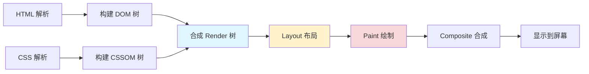

**关键阶段：**

- **DOM 树构建**：解析 HTML 生成 DOM 树
- **CSSOM 树构建**：解析 CSS 生成样式树
- **Render 树**：结合 DOM 和 CSSOM，只包含可见元素
- **Layout (回流/重排)**：计算元素的几何信息（位置、大小）
- **Paint (重绘)**：绘制元素的视觉样式
- **Composite (合成)**：将图层合成到屏幕上

### 1.2 帧率与流畅度

浏览器通过**事件循环**不断刷新页面：

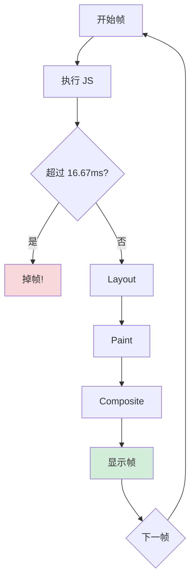

**核心公式：**

```text
流畅体验 = 60fps = 1帧/16.67ms

掉帧 = (JS执行 + Layout + Paint + Composite) > 16.67ms
```

> [!WARNING]
> 如果 JavaScript 执行时间过长，会阻塞浏览器的渲染流程，导致页面卡顿！

---

## 2. React 的演进：为什么需要 Fiber

### 2.1 React 15 的问题

在 React 15 及之前，React 使用**栈协调器**（Stack Reconciler）：

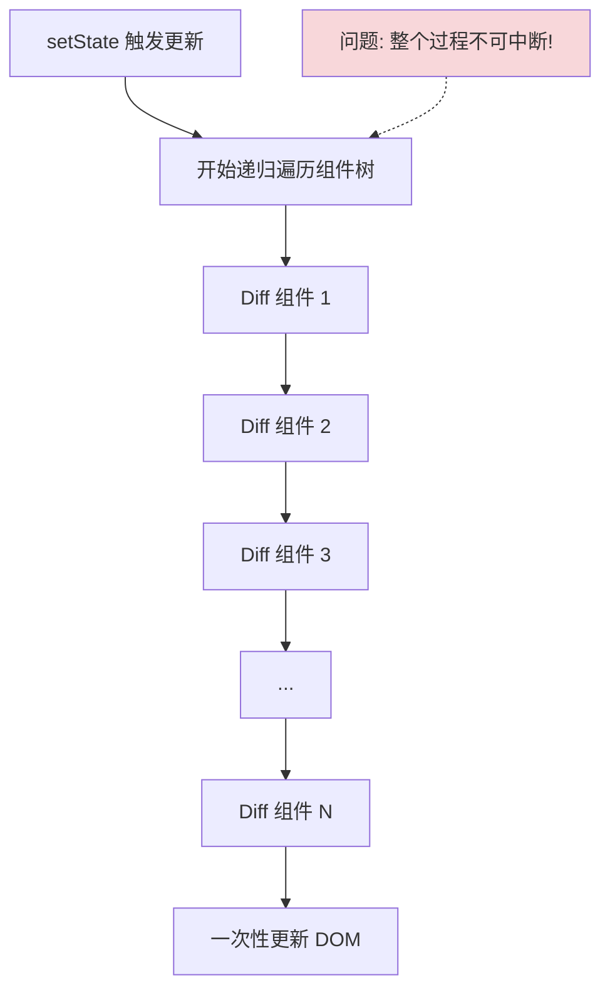

**主要问题：**

1. **递归不可中断**：一旦开始协调，必须完成整棵树
2. **长时间占用主线程**：大型应用会导致页面卡顿
3. **无法区分优先级**：用户输入和动画与普通更新同等对待

### 2.2 Fiber 的解决方案

React 16 引入 Fiber 架构，实现了两个核心能力：

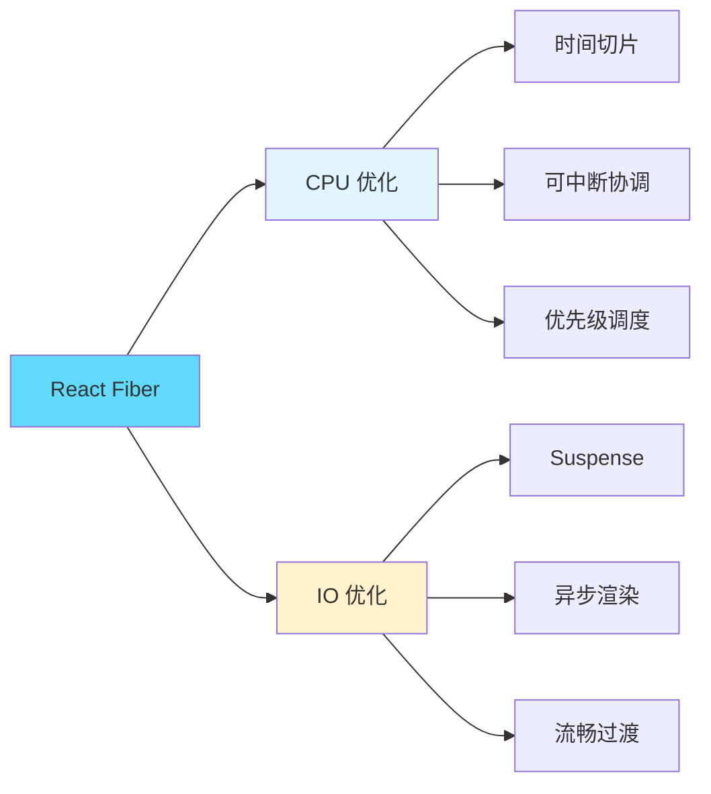

---

## 3. 性能基础概念

### 3.1 流畅度的本质

```text
不流畅 === 掉帧 === (JS执行 + Layout + Paint) > 16.67ms
```

### 3.2 React 的两个优化方向

| 优化方向     | 技术方案     | 解决的问题                       |
| ------------ | ------------ | -------------------------------- |
| **CPU 优化** | Fiber 机制   | 可中断协调，时间切片，优先级调度 |
| **IO 优化**  | Suspense API | 异步数据加载，避免内容切换闪屏   |

---

## 4. React 渲染的两大阶段

React 的渲染分为两个阶段，这是理解 Fiber 的关键：

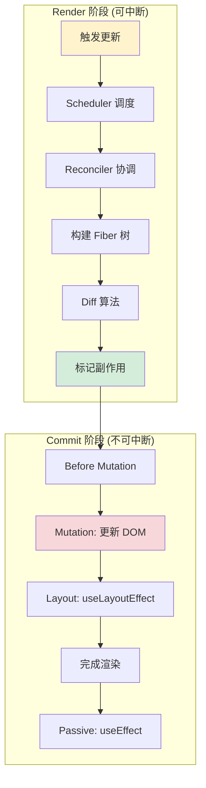

### 4.1 Render 阶段 (可中断)

**包含两个核心模块：**

| 模块                    | 职责                     | 特点                 |
| ----------------------- | ------------------------ | -------------------- |
| **Scheduler (调度器)**  | 任务调度、优先级管理     | 基于优先级和时间切片 |
| **Reconciler (协调器)** | Diff 算法、构建 Fiber 树 | 可中断、可恢复       |

**特点：**

- ✅ **可以被中断**：让出主线程给高优先级任务
- ✅ **有优先级机制**：用户输入 > 动画 > 数据更新
- ✅ **纯计算过程**：不会直接操作 DOM
- ✅ **可以丢弃重来**：如果被中断，可以从头开始

### 4.2 Commit 阶段 (不可中断)

**执行的操作：**

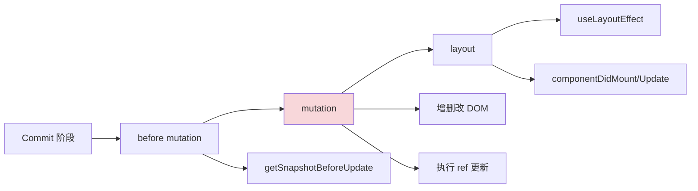

**特点：**

- ❌ **同步执行，不可中断**：确保视图更新的一致性
- ✅ **操作真实 DOM**：应用在 Render 阶段标记的变更
- ✅ **执行副作用**：生命周期、effect、ref 等

---

## 5. 数据转换流程

React 如何从 JSX 变成屏幕上的 UI：

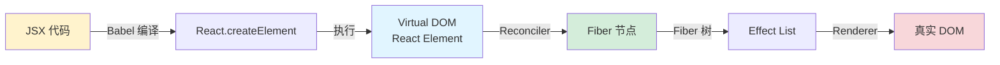

**详细过程：**

1. **JSX → render function**

   ```jsx
   // JSX
   <div className="app">
     <h1>Hello</h1>
   </div>;

   // 编译后
   React.createElement('div', { className: 'app' }, React.createElement('h1', null, 'Hello'));
   ```

2. **render function → Virtual DOM**

   ```javascript
   {
     type: 'div',
     props: {
       className: 'app',
       children: {
         type: 'h1',
         props: { children: 'Hello' }
       }
     }
   }
   ```

3. **Virtual DOM → Fiber Tree**
   - 这一步由 **Reconciler** 完成
   - 整个过程由 **Scheduler** 调度执行

---

## 6. Scheduler 调度器

Scheduler 是 React 实现时间切片和优先级调度的核心。

### 6.1 实现原理

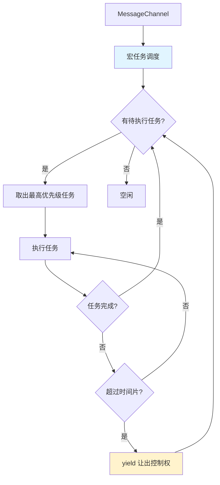

**为什么用 MessageChannel？**

- ✅ 宏任务，不会阻塞微任务（Promise）
- ✅ 比 setTimeout 更精确
- ✅ 不受浏览器最小延迟限制（4ms）

### 6.2 优先级系统

> [!IMPORTANT] > **修正常见误解**：Scheduler 没有固定的 5ms 超时时间！

实际的优先级和过期时间：

```javascript
// React 源码中的优先级定义
const ImmediatePriority = 1; // 立即执行: -1ms (已过期)
const UserBlockingPriority = 2; // 用户交互: 250ms
const NormalPriority = 3; // 普通更新: 5000ms
const LowPriority = 4; // 低优先级: 10000ms
const IdlePriority = 5; // 空闲时: 最大整数
```

**优先级对应场景：**

| 优先级       | 过期时间    | 典型场景 | 示例               |
| ------------ | ----------- | -------- | ------------------ |
| Immediate    | -1ms (立即) | 同步任务 | 遗留的同步模式     |
| UserBlocking | 250ms       | 用户交互 | 点击、输入、拖拽   |
| Normal       | 5000ms      | 普通更新 | 数据获取、状态更新 |
| Low          | 10000ms     | 低优先级 | 分析、预渲染       |
| Idle         | 最大值      | 空闲任务 | 离屏内容           |

### 6.3 调度机制

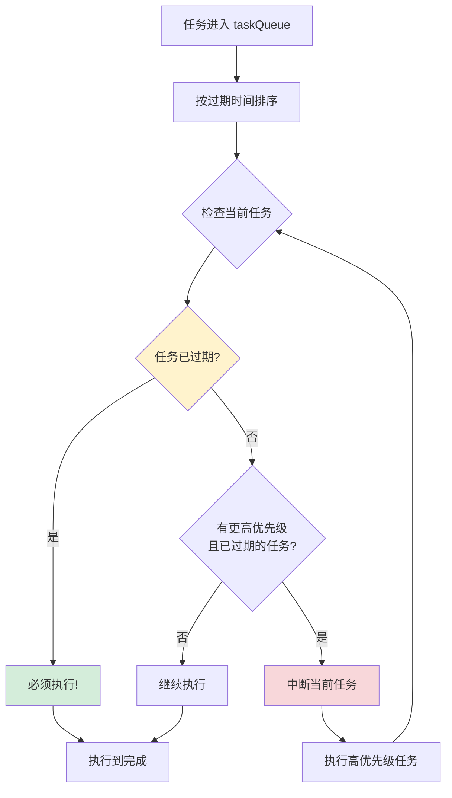

**关键点：**

- 优先级影响 taskQueue 的**排序**
- 中断只根据任务是否**过期**，而不是简单的优先级比较
- 已过期的任务必须立即执行，即使优先级较低

---

## 7. Fiber 架构深度解析

### 7.1 什么是 Fiber？

Fiber 有三层含义：

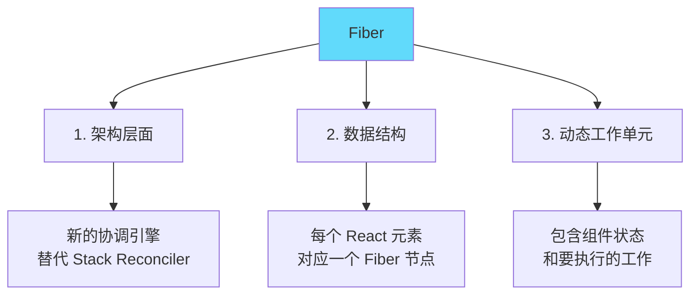

### 7.2 Fiber 节点结构

```javascript
function FiberNode(tag, pendingProps, key) {
  // 节点类型信息
  this.tag = tag; // 组件类型
  this.key = key; // key
  this.type = null; // 对应的函数/类
  this.stateNode = null; // 对应的真实 DOM

  // Fiber 树结构
  this.return = null; // 父节点
  this.child = null; // 第一个子节点
  this.sibling = null; // 下一个兄弟节点
  this.index = 0; // 在父节点中的索引

  // 工作单元
  this.pendingProps = pendingProps; // 新的 props
  this.memoizedProps = null; // 上次渲染的 props
  this.updateQueue = null; // 更新队列
  this.memoizedState = null; // 上次渲染的 state

  // 副作用
  this.flags = NoFlags; // 副作用标记
  this.subtreeFlags = NoFlags; // 子树副作用
  this.deletions = null; // 要删除的子节点

  // 双缓存
  this.alternate = null; // 指向另一棵树的对应节点
}
```

### 7.3 Fiber 树的遍历

Fiber 使用**链表结构**而不是递归，实现可中断：

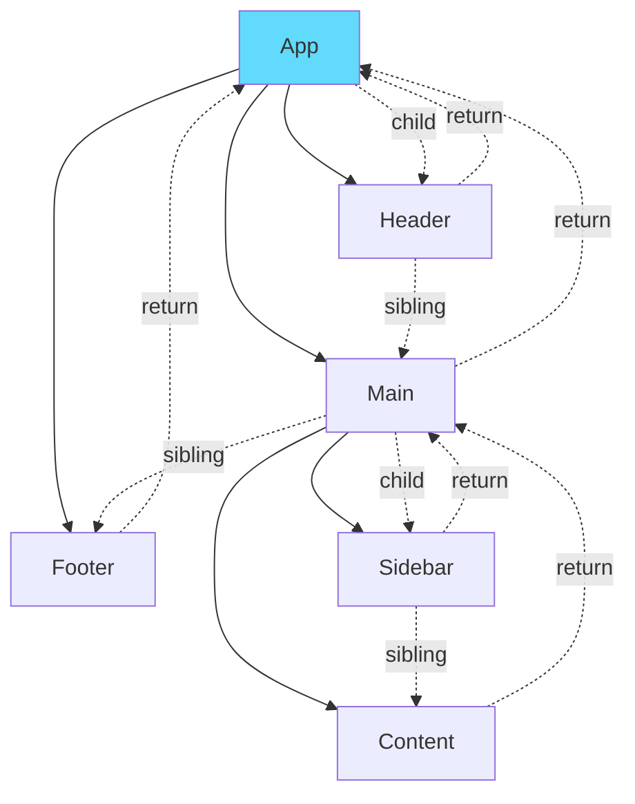

**遍历顺序（深度优先）：**

```text
App → Header → Main → Sidebar → Content → Footer
```

**遍历伪代码：**

```javascript
function workLoop() {
  while (workInProgress !== null && !shouldYield()) {
    workInProgress = performUnitOfWork(workInProgress);
  }
}

function performUnitOfWork(fiber) {
  // 1. 处理当前节点
  beginWork(fiber);

  // 2. 有子节点，返回子节点
  if (fiber.child) {
    return fiber.child;
  }

  // 3. 没有子节点，完成当前节点
  completeWork(fiber);

  // 4. 有兄弟节点，返回兄弟节点
  if (fiber.sibling) {
    return fiber.sibling;
  }

  // 5. 返回父节点
  return fiber.return;
}
```

### 7.4 Fiber 的主要特点

| 特点     | 传统递归    | Fiber           |
| -------- | ----------- | --------------- |
| 执行方式 | 递归调用栈  | 链表遍历        |
| 可中断性 | ❌ 不可中断 | ✅ 可中断       |
| 优先级   | ❌ 无优先级 | ✅ 支持优先级   |
| 错误恢复 | ❌ 难以恢复 | ✅ 可以丢弃重来 |
| 并发渲染 | ❌ 不支持   | ✅ 支持         |

### 7.5 双缓存机制

React Fiber 使用**双缓存**（Double Buffering）技术，类似游戏渲染：

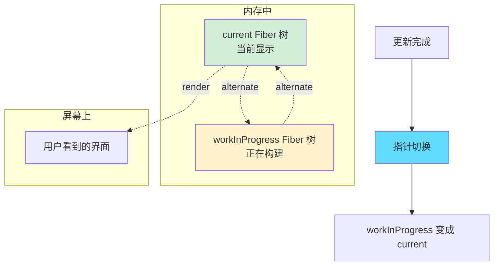

**工作流程：**

1. **初始化**

   ```javascript
   // 首次渲染创建 current 树
   const root = createFiberRoot();
   root.current = createHostRootFiber();
   ```

2. **更新阶段**

   ```javascript
   // 基于 current 创建 workInProgress
   workInProgress = createWorkInProgress(current, pendingProps);
   workInProgress.alternate = current;
   current.alternate = workInProgress;
   ```

3. **提交阶段**

   ```javascript
   // 切换指针
   root.current = finishedWork; // workInProgress 变成 current
   ```

**优势：**

- ✅ 避免每次都创建新对象，复用内存
- ✅ 支持快速回退（直接丢弃 workInProgress）
- ✅ 新旧树可以同时存在，方便对比

### 7.6 首次渲染 vs 更新

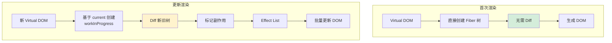

**首次渲染：**

```text
不需要 Diff，直接将 Virtual DOM 转换为 Fiber 树
```

**更新流程：**

1. 触发更新（setState、props 变化）
2. 基于 current 树创建 workInProgress 树
3. Diff 算法对比新旧节点
4. 标记需要更新的节点（Effect List）
5. Commit 阶段批量应用更新

### 7.7 可中断执行机制

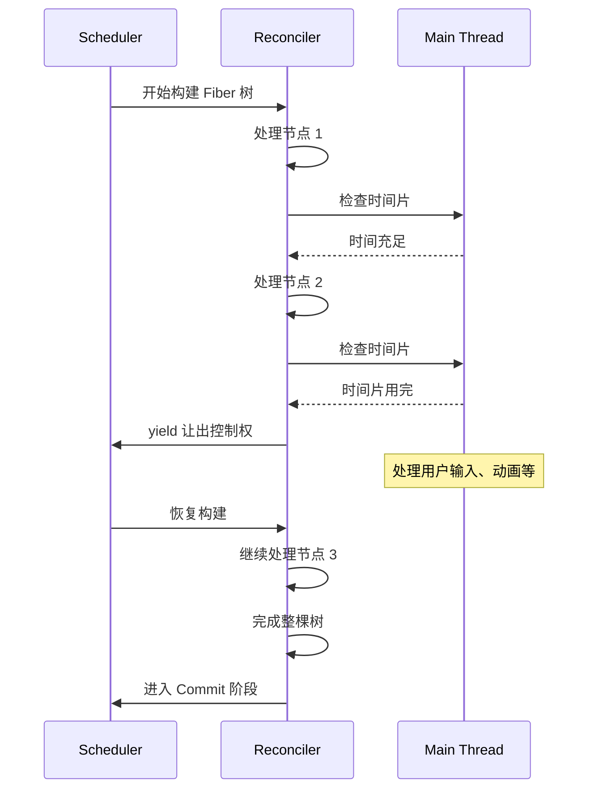

**关键代码逻辑：**

```javascript
function workLoopConcurrent() {
  // 并发模式：可中断
  while (workInProgress !== null && !shouldYield()) {
    performUnitOfWork(workInProgress);
  }
}

function shouldYield() {
  const currentTime = getCurrentTime();

  // 时间片用完了吗？（通常是 5ms）
  if (currentTime >= deadline) {
    return true;
  }

  // 有更高优先级的任务吗？
  if (有更高优先级任务) {
    return true;
  }

  return false;
}
```

**中断后的处理：**

- ✅ 丢弃未完成的 workInProgress 树
- ✅ current 树保持不变（用户界面不受影响）
- ✅ 空闲时重新开始构建

---

## 8. Reconciliation 协调过程

### 8.1 完整协调流程

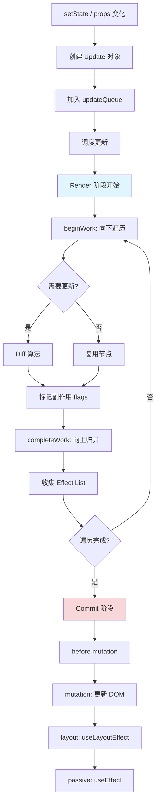

### 8.2 Diff 算法策略

React 的 Diff 算法基于三个假设：

```mermaid
graph LR
    A[Diff 算法优化策略] --> B[1. 只比较同层级]
    A --> C[2. 不同类型重建]
    A --> D[3. key 优化列表]

    B --> B1[时间复杂度:<br/>O\(n³\) → O\(n\)]
    C --> C1[div → span<br/>直接删除重建]
    D --> D1[快速定位移动节点]

    style A fill:#61dafb
```

**详细说明：**

1. **同层比较**

   ```jsx
   // 只比较同一层级，不会跨层级比较
   <div>
     {' '}
     <div>
       <A /> VS <B />
     </div>{' '}
   </div>
   // 不会检测 A 是否移动到其他地方，直接删除 A 创建 B
   ```

2. **类型不同直接替换**

   ```jsx
   // old
   <div><Child /></div>

   // new
   <span><Child /></span>

   // 即使 Child 相同，也会删除整个 div 树，重建 span 树
   ```

3. **key 优化列表**

   ```jsx
   // without key
   [A, B, C] → [A, C, B]  // 更新 B 和 C

   // with key
   [A(key:a), B(key:b), C(key:c)] → [A(key:a), C(key:c), B(key:b)]
   // 只移动 B，不更新任何节点
   ```

### 8.3 副作用标记（Flags）

```javascript
// React 源码中的 flags
const Placement = 0b0000000000000010; // 新增
const Update = 0b0000000000000100; // 更新
const Deletion = 0b0000000000001000; // 删除
const ChildDeletion = 0b0000000000010000; // 子节点删除
const Passive = 0b0000010000000000; // useEffect
const Layout = 0b0000100000000000; // useLayoutEffect
const Ref = 0b0000000100000000; // ref 更新
```

**Effect List 示例：**

```text
Root
  ↓
[Update] App
  ↓
[Placement] NewChild
  ↓
[Deletion] OldChild
  ↓
null

// Commit 阶段沿着这条链表执行所有副作用
```

---

## 9. useEffect vs useLayoutEffect

### 9.1 完整的渲染时间线

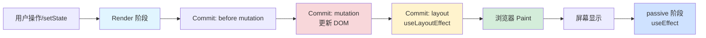

### 9.2 详细对比

| 特性             | useLayoutEffect           | useEffect                |
| ---------------- | ------------------------- | ------------------------ |
| **执行时机**     | DOM 更新后，浏览器绘制前  | 浏览器绘制后（异步）     |
| **是否阻塞绘制** | ✅ 阻塞（同步执行）       | ❌ 不阻塞                |
| **执行顺序**     | Commit 阶段的 layout 阶段 | Commit 后的 passive 阶段 |
| **适用场景**     | 测量 DOM、同步修改样式    | 数据获取、订阅、异步操作 |
| **SSR 兼容性**   | ⚠️ 服务端会警告           | ✅ 完全兼容              |

### 9.3 示例对比

#### 问题代码：闪烁的计数器

```javascript
import { useEffect, useState } from 'react';

export default function App() {
  const [count, setCount] = useState(0);

  useEffect(() => {
    if (count === 0) {
      // 模拟计算
      const randomNum = Math.floor(10 + Math.random() * 1000);
      setCount(randomNum);
    }
  }, [count]);

  return <div onClick={() => setCount(0)}>{count}</div>;
}
```

**渲染流程分析：**

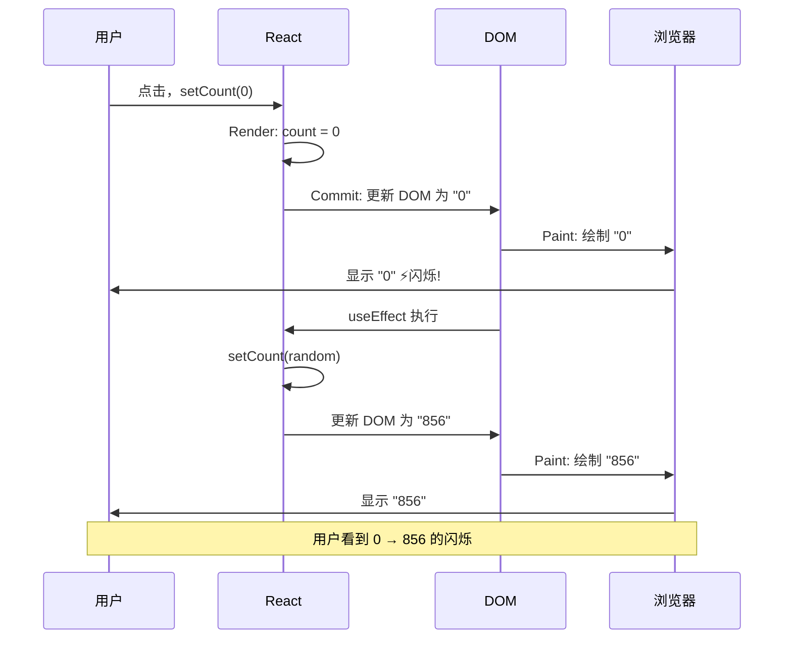

#### 解决方案：使用 useLayoutEffect

```javascript
import { useLayoutEffect, useState } from 'react';

export default function App() {
  const [count, setCount] = useState(0);

  useLayoutEffect(() => {
    if (count === 0) {
      const randomNum = Math.floor(10 + Math.random() * 1000);
      setCount(randomNum);
    }
  }, [count]);

  return <div onClick={() => setCount(0)}>{count}</div>;
}
```

**渲染流程分析：**

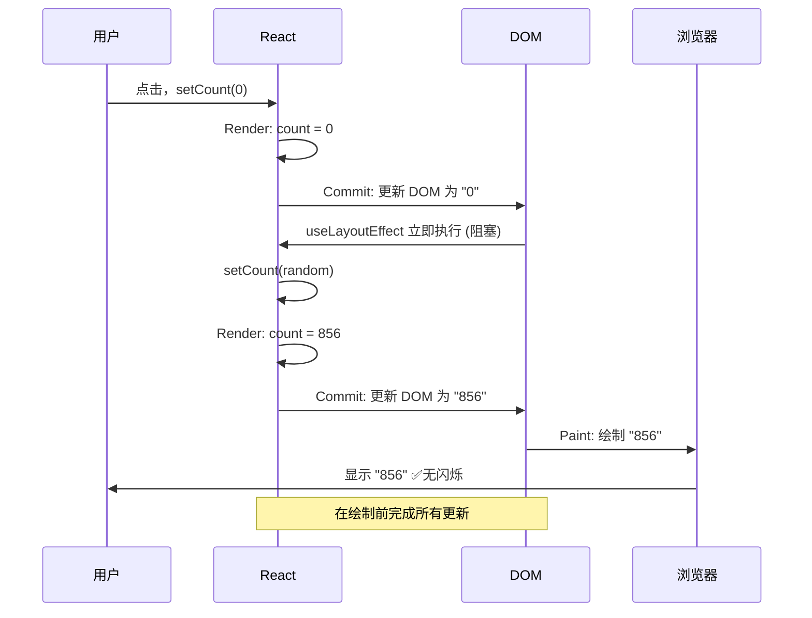

### 9.4 阻塞性任务问题

#### 错误示例：长时间同步任务

```javascript
useEffect(() => {
  // ❌ 虽然 DOM 已更新，但会阻塞浏览器渲染
  const start = Date.now();
  while (Date.now() - start < 3000) {
    // 同步阻塞 3 秒
  }
  setCount(randomNum);
}, [count]);
```

**问题分析：**

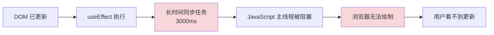

#### 正确做法：异步化

```javascript
useEffect(() => {
  // ✅ 使用异步任务，不阻塞渲染
  setTimeout(() => {
    // 这里的代码在下一个宏任务执行
    // 浏览器有机会完成绘制
    setCount(randomNum);
  }, 0);
}, [count]);

// 或者使用 Promise
useEffect(() => {
  Promise.resolve().then(() => {
    setCount(randomNum);
  });
}, [count]);
```

### 9.5 选择指南

```mermaid
graph TD
    A[需要操作 DOM?] -->|是| B{需要同步读取<br/>或修改 DOM?}
    A -->|否| C[useEffect]

    B -->|是| D[useLayoutEffect]
    B -->|否| E{会导致<br/>视觉闪烁?}

    E -->|是| D
    E -->|否| C

    style D fill:#fff3cd
    style C fill:#d4edda
```

**典型使用场景：**

| 场景            | 推荐 Hook       | 原因                     |
| --------------- | --------------- | ------------------------ |
| 数据获取        | useEffect       | 异步操作，不阻塞渲染     |
| 事件订阅        | useEffect       | 不需要同步               |
| 测量 DOM 尺寸   | useLayoutEffect | 需要同步读取 layout 信息 |
| 动画初始化      | useLayoutEffect | 避免闪烁                 |
| 条件性 DOM 更新 | useLayoutEffect | 避免中间状态显示         |
| 日志记录        | useEffect       | 不影响用户体验           |

---

## 10. 总结与最佳实践

### 10.1 核心知识点回顾

```mermaid
mindmap
  root((React Fiber))
    浏览器基础
      帧率 60fps
      事件循环
      渲染流程
    架构演进
      React 15 问题
      Fiber 解决方案
      双缓存机制
    调度系统
      Scheduler
      优先级
      时间切片
    协调过程
      Reconciliation
      Diff 算法
      Effect List
    副作用管理
      useEffect
      useLayoutEffect
      执行时机
```

### 10.2 关键要点

1. **Fiber 是可中断的协调机制**

   - 将渲染工作分解为可中断的小单元
   - 让出主线程给高优先级任务
   - 提高应用的响应性

2. **Scheduler 基于优先级调度**

   - 不同优先级有不同的过期时间（不是固定 5ms）
   - 中断判断基于任务是否过期
   - 使用 MessageChannel 实现时间切片

3. **双缓存机制**

   - current 和 workInProgress 两棵树
   - 复用内存，提高性能
   - 支持快速回退

4. **Render 和 Commit 两阶段**

   - Render 阶段可中断（调度 + 协调）
   - Commit 阶段不可中断（应用变更）
   - 理解阶段划分对性能优化很重要

5. **useEffect vs useLayoutEffect**
   - useEffect 在绘制后执行，不阻塞
   - useLayoutEffect 在绘制前执行，阻塞
   - 优先使用 useEffect，避免不必要的阻塞

### 10.3 最佳实践

#### 1. 组件拆分

```jsx
// ❌ 单个大组件
function HugeComponent() {
  return <div>{/* 1000+ 行代码 */}</div>;
}

// ✅ 拆分成小组件
function Dashboard() {
  return (
    <>
      <Header />
      <Sidebar />
      <MainContent />
      <Footer />
    </>
  );
}
```

**好处：**

- 每个组件是独立的工作单元
- Fiber 可以在组件边界中断
- 提高可维护性

#### 2. 合理使用 key

```jsx
// ❌ 使用索引作为 key
{
  items.map((item, index) => <Item key={index} {...item} />);
}

// ✅ 使用稳定的唯一标识
{
  items.map((item) => <Item key={item.id} {...item} />);
}
```

#### 3. 避免不必要的渲染

```jsx
// ✅ 使用 memo 优化
const ExpensiveComponent = memo(function ExpensiveComponent({ data }) {
  // 只在 data 变化时重新渲染
  return <div>{/* 复杂渲染逻辑 */}</div>;
});

// ✅ 使用 useMemo 缓存计算结果
const sortedList = useMemo(() => {
  return items.sort((a, b) => a.value - b.value);
}, [items]);
```

#### 4. Effect 使用指南

```javascript
// ✅ 优先使用 useEffect
useEffect(() => {
  fetchData();
}, []);

// ✅ 只在必要时使用 useLayoutEffect
useLayoutEffect(() => {
  const { height } = ref.current.getBoundingClientRect();
  setHeight(height);
}, []);

// ❌ 避免在 effect 中执行长时间同步任务
useEffect(() => {
  // 错误：阻塞渲染
  heavySyncTask();

  // 正确：异步化
  setTimeout(heavySyncTask, 0);
}, []);
```

#### 5. 利用优先级

```jsx
import { useTransition, useDeferredValue } from 'react';

function SearchResults() {
  const [isPending, startTransition] = useTransition();
  const [query, setQuery] = useState('');

  const handleChange = (e) => {
    // 高优先级：立即更新输入框
    setQuery(e.target.value);

    // 低优先级：延迟更新搜索结果
    startTransition(() => {
      setSearchResults(search(e.target.value));
    });
  };

  return (
    <div>
      <input value={query} onChange={handleChange} />
      {isPending ? <Loading /> : <Results />}
    </div>
  );
}
```

### 10.4 调试技巧

```javascript
// 1. React DevTools Profiler
// 记录组件渲染时间和原因

// 2. 自定义 hook 追踪更新原因
function useWhyDidYouUpdate(name, props) {
  const previousProps = useRef();

  useEffect(() => {
    if (previousProps.current) {
      const allKeys = Object.keys({ ...previousProps.current, ...props });
      const changedProps = {};

      allKeys.forEach((key) => {
        if (previousProps.current[key] !== props[key]) {
          changedProps[key] = {
            from: previousProps.current[key],
            to: props[key],
          };
        }
      });

      if (Object.keys(changedProps).length) {
        console.log('[why-did-you-update]', name, changedProps);
      }
    }
    previousProps.current = props;
  });
}
```

### 10.5 性能优化检查清单

- [ ] 组件是否合理拆分？
- [ ] 列表是否使用了稳定的 key？
- [ ] 是否使用 memo/useMemo/useCallback 避免不必要的渲染？
- [ ] 是否避免在 render 中进行昂贵的计算？
- [ ] Effect 依赖数组是否正确？
- [ ] 是否有不必要的 useLayoutEffect？
- [ ] 是否合理利用了 Suspense 和 lazy？
- [ ] 是否使用了 useTransition 优化用户体验？

---

## 参考资料

### 官方文档

- [React 官方文档](https://react.dev/)
- [React Hooks API Reference](https://react.dev/reference/react)
- [React Reconciliation](https://react.dev/learn/preserving-and-resetting-state)

### 深度解析

- [React Fiber Architecture - Andrew Clark](https://github.com/acdlite/react-fiber-architecture)
- [Lin Clark - A Cartoon Intro to Fiber](https://www.youtube.com/watch?v=ZCuYPiUIONs)
- [React 技术揭秘](https://react.iamkasong.com/)

### 源码学习

- [React Source Code](https://github.com/facebook/react)
- [React Scheduler 源码](https://github.com/facebook/react/tree/main/packages/scheduler)
- [React Reconciler 源码](https://github.com/facebook/react/tree/main/packages/react-reconciler)

---
