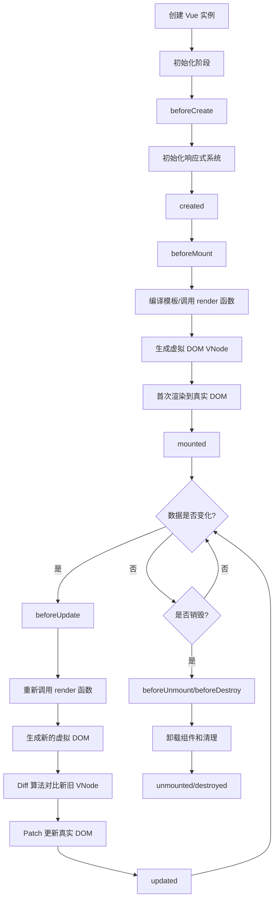
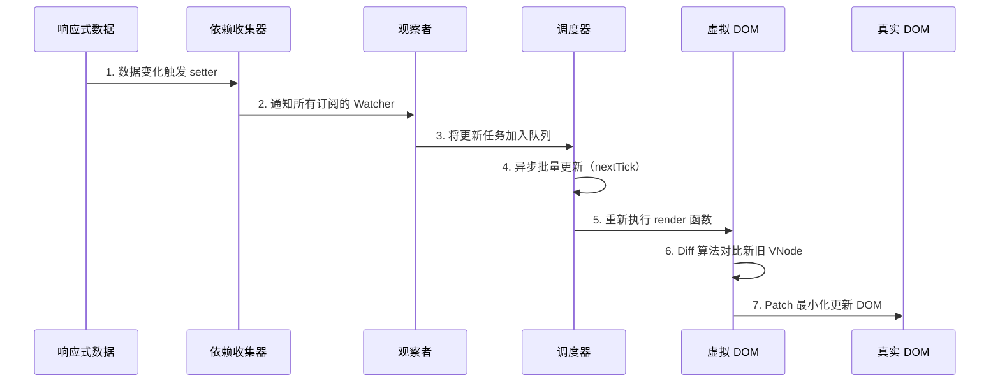

# Vue.js 渲染流程详解

Vue.js 的渲染流程是从组件实例化到最终更新 DOM 的完整过程。深入理解这个流程有助于性能优化和问题排查。

:::tip 版本说明
本文同时适用于 **Vue 2** 和 **Vue 3**，核心渲染流程基本一致。在关键差异处会明确标注版本区别，如响应式实现、生命周期钩子名称、Diff 算法等。文末有详细的版本对比表格。
:::

## 渲染流程概览



## 1. 初始化阶段

Vue 实例创建时会执行一系列初始化操作：

### beforeCreate 钩子

- 实例初始化完成
- 此时无法访问 `data`、`computed`、`methods` 等

### 响应式系统初始化

- **数据劫持**：通过 `Object.defineProperty`（Vue 2）或 `Proxy`（Vue 3）将 `data` 转为响应式
- **依赖收集器**：为每个响应式属性创建 `Dep` 实例
- **观察者模式**：建立数据与视图的订阅关系

### created 钩子

- 响应式数据、计算属性、方法、侦听器已完成初始化
- 可以访问和修改数据
- DOM 尚未挂载，无法访问 `$el`

## 2. 挂载阶段（Mounting）

### beforeMount 钩子

- 模板编译完成，即将开始首次渲染
- 虚拟 DOM 创建前的最后时机

### 渲染函数执行

```javascript
// Vue 会执行 render 函数
render(h) {
  return h('div', { class: 'container' }, [
    h('p', this.message)
  ])
}
```

### 虚拟 DOM 生成

- 调用 `render` 函数生成 VNode 树
- VNode 是对真实 DOM 的轻量级描述

### 首次渲染

- 将 VNode 转换为真实 DOM 节点
- 使用 `createElement`、`createTextNode` 等原生 API
- 插入到挂载点（如 `#app`）

### mounted 钩子

- 组件已挂载到 DOM
- 可以进行 DOM 操作、发起异步请求等
- **注意**：子组件的 `mounted` 先于父组件触发

## 3. 响应式更新流程



### 依赖收集

```javascript
// 渲染时访问响应式数据
<template>
  <div>{{ message }}</div>  <!-- 收集 message 依赖 -->
</template>
```

- **Getter 触发**：读取数据时，将当前 Watcher 添加到 Dep
- **订阅关系**：建立数据与渲染 Watcher 的关联

### 数据变化检测

- **Setter 触发**：修改数据时，通知所有订阅的 Watcher
- **异步更新队列**：Vue 将多次数据修改合并为一次更新

### 重新渲染

```javascript
// 数据变化后
this.message = 'Hello World'; // 触发 setter
// Vue 异步执行：
// 1. 标记 Watcher 为 dirty
// 2. 下一个 tick 重新调用 render
```

### Diff 算法

Vue 使用高效的 Diff 算法对比新旧 VNode：

1. **同层比较**：只比较同一层级的节点
2. **Key 优化**：通过 `key` 属性复用节点
3. **双端比较**：从头尾同时开始比较（Vue 2）
4. **最长递增子序列**：更高效的算法（Vue 3）

### Patch 更新

- 只更新变化的部分
- 最小化 DOM 操作
- 批量更新提升性能

## 4. 更新生命周期钩子

### beforeUpdate 钩子

- 数据已更新，DOM 尚未重新渲染
- 可以在更新前访问旧的 DOM
- 适合手动移除事件监听器等

### updated 钩子

- DOM 已完成更新
- 可以执行依赖新 DOM 的操作
- **避免**：在此钩子中修改数据，可能导致无限循环

```javascript
updated() {
  // ❌ 避免这样做
  this.count++  // 会再次触发 updated

  // ✅ 推荐做法
  this.$nextTick(() => {
    // DOM 已更新完成
    console.log(this.$el.textContent)
  })
}
```

## 5. 卸载阶段（Unmounting）

### beforeUnmount / beforeDestroy

- Vue 3: `beforeUnmount`
- Vue 2: `beforeDestroy`
- 组件即将销毁，仍可访问实例
- 适合清理定时器、事件监听、订阅等

```javascript
beforeUnmount() {
  clearInterval(this.timer)
  window.removeEventListener('resize', this.handleResize)
}
```

### 销毁过程

1. **移除 Watcher**：解除数据订阅关系
2. **递归销毁子组件**：先销毁子组件
3. **移除事件监听**：清理所有事件监听器
4. **移除 DOM**：从页面中移除组件

### unmounted / destroyed

- Vue 3: `unmounted`
- Vue 2: `destroyed`
- 组件已完全销毁
- 所有指令解绑，事件监听器移除

## 性能优化建议

### 1. 合理使用 computed 和 watch

```javascript
// ✅ 使用 computed 缓存计算结果
computed: {
  fullName() {
    return `${this.firstName} ${this.lastName}`
  }
}

// ❌ 避免在 methods 中进行复杂计算
methods: {
  getFullName() {
    return `${this.firstName} ${this.lastName}`  // 每次渲染都会执行
  }
}
```

### 2. 使用 v-show vs v-if

- `v-show`：切换 CSS `display`，适合频繁切换
- `v-if`：销毁/重建组件，适合条件不常变化

### 3. 列表渲染优化

```vue
<!-- ✅ 始终使用 key -->
<div v-for="item in items" :key="item.id">
  {{ item.name }}
</div>

<!-- ❌ 避免使用 index 作为 key -->
<div v-for="(item, index) in items" :key="index">
  {{ item.name }}
</div>
```

### 4. 异步组件和懒加载

```javascript
// 路由懒加载
const Home = () => import('./views/Home.vue');

// 异步组件
components: {
  AsyncComponent: () => import('./components/AsyncComponent.vue');
}
```

### 5. 使用 Object.freeze() 冻结大数据

```javascript
data() {
  return {
    // 大型只读数据，避免响应式转换
    largeList: Object.freeze([...])
  }
}
```

## Vue 2 vs Vue 3 差异

| 特性       | Vue 2                         | Vue 3                                |
| ---------- | ----------------------------- | ------------------------------------ |
| 响应式实现 | `Object.defineProperty`       | `Proxy`                              |
| Diff 算法  | 双端比较                      | 最长递增子序列 + 双端比较            |
| 生命周期   | `beforeDestroy` / `destroyed` | `beforeUnmount` / `unmounted`        |
| 编译优化   | 无                            | 静态提升、预字符串化、缓存事件处理器 |
| Fragment   | 不支持                        | 支持多根节点                         |
| Teleport   | 不支持                        | 支持 Portal 传送                     |

## 总结

Vue.js 的渲染流程可以概括为：

1. **初始化** → 创建响应式系统和生命周期
2. **挂载** → 生成虚拟 DOM 并渲染到真实 DOM
3. **更新** → 数据变化触发重新渲染，通过 Diff 算法最小化更新
4. **卸载** → 清理资源并销毁组件

理解这个流程有助于：

- 🎯 选择合适的生命周期钩子
- ⚡ 优化组件性能
- 🐛 快速定位和解决问题
- 🔧 编写更高质量的 Vue 应用

深入掌握渲染流程是成为 Vue 高级开发者的必经之路。
