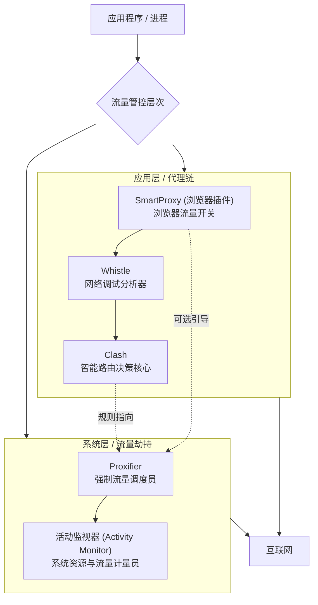
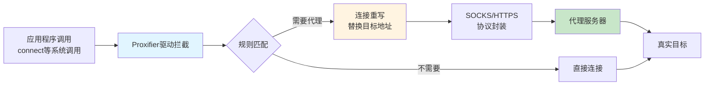
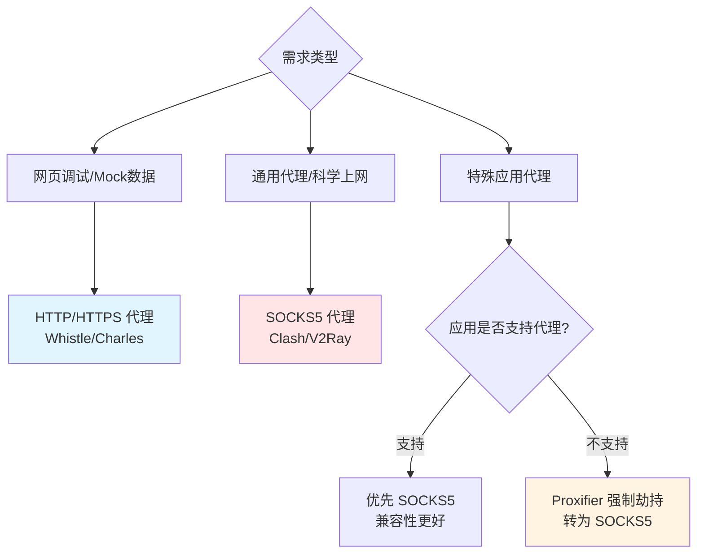
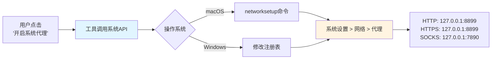
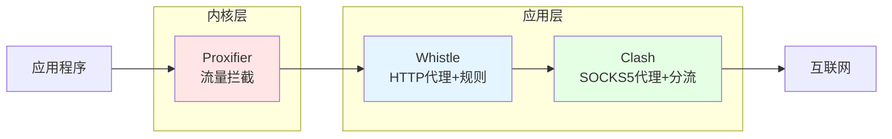
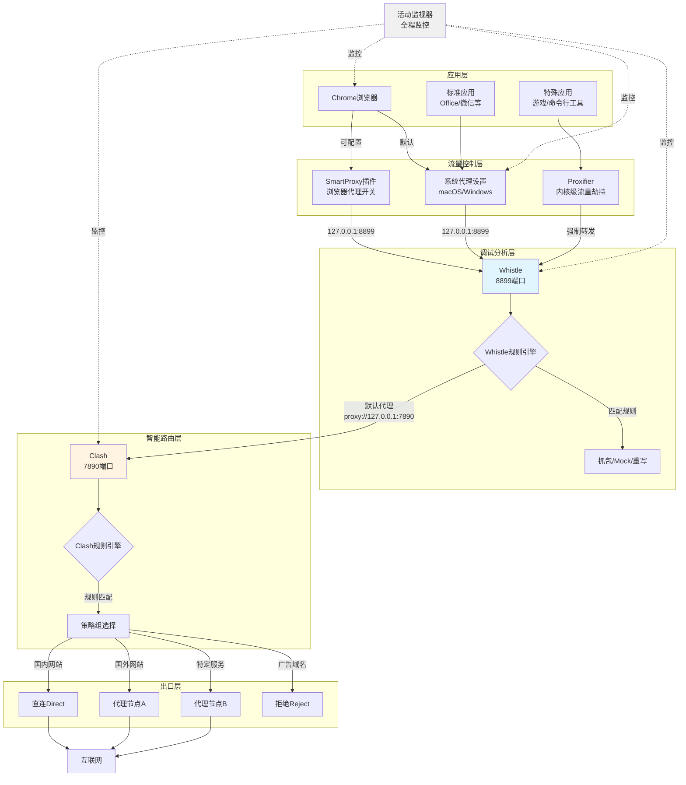
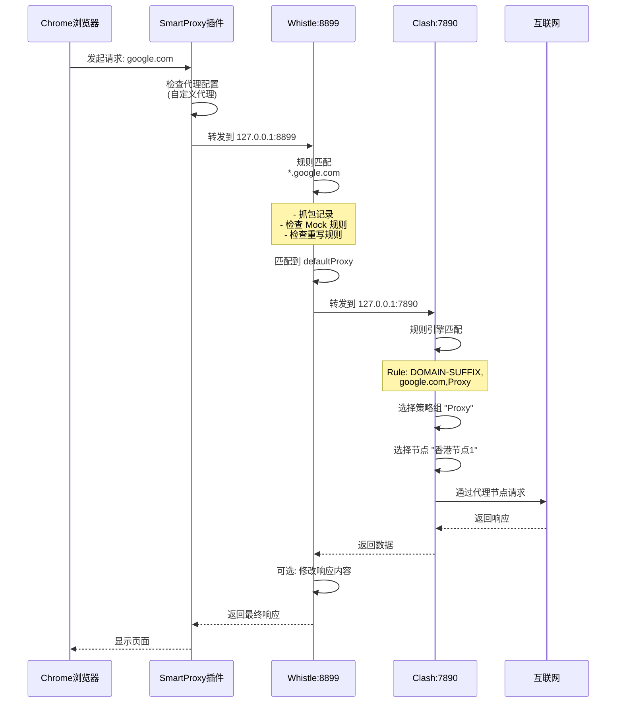

# 网络流量管控与调试工具链深度解析

> 全面掌握活动监视器、Proxifier、Clash、Whistle 与 SmartProxy 的核心原理与协作机制

## 前言

在现代软件开发中,精细化的网络流量管控和调试至关重要。本文剩析五个核心工具的工作原理和协作机制,帮你构建完整的网络流量管控体系。

---

### 1. 核心工具定位与关系总览

在深入每个工具之前，我们首先通过一张架构图来理解它们在网络栈中所处的层次和协作关系。这有助于建立宏观认知。



**图解**：

- **自上而下**：数据从应用程序发出，经过不同工具的处理，最终流向互联网。
- **左右分区**：左侧是**用户态**的代理链，工具需要应用主动配合或手动配置；右侧是**内核态**的系统级工具，能力更强，可强制接管流量。
- **虚线**：表示可选的配置或影响关系。

---

### 2. 各工具深度剖析

#### 2.1 活动监视器 (Activity Monitor)

**核心原理**: 挂钩于操作系统内核,监控所有进程的资源占用,包括网络 I/O。它计量通过系统网络栈的数据量,但不分析数据内容。

**主要作用**: 快速识别哪个进程在消耗网络带宽,提供 CPU、内存、能耗等实时数据。

**能力边界**:

- ✅ 显示每个进程的实时发送/接收速度
- ❌ 无法分析流量目的地、协议内容、控制流量走向

---

#### 2.2 Proxifier

**核心原理**: 通过系统级驱动在内核层劫持应用程序的网络连接,强制重定向到指定代理。不依赖应用自身的代理设置。

**技术实现机制**:



**代理协议基础知识**:

在深入 Proxifier 配置前,有必要理解不同代理协议的本质区别:

##### SOCKS5 vs HTTP/HTTPS 代理

| 特性         | SOCKS5 代理                           | HTTP/HTTPS 代理                     |
| ------------ | ------------------------------------- | ----------------------------------- |
| **工作层次** | 会话层 (OSI 第 5 层)                  | 应用层 (OSI 第 7 层)                |
| **协议支持** | 所有 TCP/UDP 协议 (HTTP、FTP、SSH 等) | 仅 HTTP/HTTPS                       |
| **数据处理** | 仅转发 TCP/UDP 数据包,不解析内容      | 可以解析和修改 HTTP 请求/响应       |
| **性能开销** | 低 (纯转发)                           | 较高 (需要解析 HTTP 协议)           |
| **安全特性** | 支持用户名/密码认证                   | 支持 SSL/TLS 加密 (HTTPS)           |
| **典型应用** | 通用代理,游戏加速,绕过防火墙          | 网页浏览,内容过滤,缓存              |
| **代表工具** | Clash、V2Ray、Shadowsocks             | Whistle、Charles、Squid、浏览器内置 |

**SOCKS5 的核心优势**:

1. **协议无关性**: 可以代理任何基于 TCP/UDP 的流量,不局限于 HTTP

   - 代理数据库连接 (MySQL、PostgreSQL)
   - 代理邮件协议 (SMTP、POP3、IMAP)
   - 代理游戏流量、SSH 连接等

2. **透明转发**: 不修改应用层数据,仅在传输层转发,性能更优

3. **灵活部署**: 可作为其他代理的上游,构成代理链

**HTTP/HTTPS 代理的核心优势**:

1. **内容感知**: 能理解 HTTP 协议,支持高级功能

   - 请求/响应修改 (Mock 数据、注入脚本)
   - 请求头管理 (User-Agent 伪造、Cookie 处理)
   - 缓存和压缩优化

2. **调试友好**: 可视化显示请求详情,适合开发调试

   - 抓包分析 (Whistle、Charles)
   - 断点调试、重发请求

3. **广泛支持**: 浏览器和大部分应用原生支持,无需额外配置

**实际应用中的选择**:



**代理链中的角色**:

在本文的工具链中:

- **Whistle (HTTP 代理)**: 负责调试和 Mock,可解析修改 HTTP 内容
- **Clash (SOCKS5 代理)**: 负责智能路由和科学上网,支持多协议
- **Proxifier**: 强制将应用流量转为 SOCKS5 或 HTTP,接入代理链

这种分层设计充分发挥了各协议的优势:HTTP 代理处理内容,SOCKS5 代理处理路由。

**典型规则配置示例**:

```text
Chrome.app     → 127.0.0.1:8899 (Whistle)
Git            → Direct
192.168.*.*    → Direct
*              → 127.0.0.1:7890 (Clash)
```

**注意事项**:

- 需要管理员权限安装内核驱动
- macOS 需在"系统设置 > 安全性与隐私"中允许系统扩展
- 与某些 VPN 软件可能冲突

**注册码** (仅供学习测试):

```text
57J8Z-D2QD5-A37WU-LEG4E-43WYH
```

---

#### 2.3 Clash

**核心原理**: 功能强大的本地代理服务器,根据 YAML 配置的规则库决定流量走向。

**工作模式**:

1. **Rule (规则) 模式** ⭐ 最常用

   - 根据域名、IP、GEOIP、进程名等条件,将流量分流向不同的策略
   - 每条规则指定匹配条件和对应的策略 (Proxy/Direct/Reject)
   - 规则从上到下匹配,命中即停止

2. **Global (全局) 模式**

   - 所有流量强制走指定的代理节点
   - 适合临时测试或确保所有流量都经过代理

3. **Direct (直连) 模式**

   - 所有流量直连,不经过任何代理
   - 相当于关闭代理功能

4. **TUN 模式** (高级功能)
   - 创建虚拟网卡 (如 `utun` 设备),在网络层 (L3) 接管系统流量
   - 可代理那些绕过应用层代理的流量(如未设置代理的应用、系统服务)
   - 需要管理员权限,需配置路由表和 DNS

**核心规则类型**:

```yaml
rules:
  # 域名匹配
  - DOMAIN-SUFFIX,google.com,Proxy
  - DOMAIN,www.example.com,Direct

  # IP 匹配
  - IP-CIDR,192.168.0.0/16,Direct
  - GEOIP,CN,Direct

  # 进程匹配
  - PROCESS-NAME,WeChat,Direct

  # 默认规则
  - MATCH,Proxy
```

**策略组配置**:

```yaml
proxy-groups:
  # 手动选择
  - name: Proxy
    type: select
    proxies: [Auto, 香港, 美国, 日本]

  # 自动选择（测速）
  - name: Auto
    type: url-test
    proxies: [香港1, 香港2]
    url: http://www.gstatic.com/generate_204
    interval: 300
```

**核心能力**:

- **智能分流**: 基于规则的精细化流量控制
- **负载均衡**: 多节点间分散流量
- **自动故障转移**: 节点不可用时自动切换
- **协议转换**: 支持 Shadowsocks、VMess、Trojan、Snell 等多种协议
- **DNS 处理**: 内置 DNS 服务器,支持 DNS 分流、DoH、DoT
- **性能优化**: 支持 TCP 并发、连接复用等高级特性

**注意事项**:

- 配置文件语法严格,缩进错误会导致启动失败
- 规则顺序很重要,应将特殊规则放在前面,通用规则放在后面
- GEOIP 数据库需要定期更新以保证准确性
- TUN 模式在某些系统上可能需要额外配置

---

#### 2.4 Whistle

**核心原理**: 基于 Node.js 的 HTTP 代理服务器,提供抽包、Mock、重写等调试功能。支持 HTTPS 解密和规则配置。

**核心功能**:

1. **抽包与查看**: 可视化展示 HTTP/HTTPS 请求和响应,支持 WebSocket、二进制数据。

2. **映射与重写**:

   ```text
   # Map Local - 映射到本地文件
   www.example.com/api/user.json  file:///path/to/mock.json

   # Map Remote - 重定向
   www.example.com  www.test.com

   # ResBody - 修改响应
   www.example.com/api  resBody://{"status": "ok"}

   # 默认代理 - 转发给 Clash
   *  proxy://127.0.0.1:7890
   ```

3. **其他功能**: Mock 数据、延迟模拟、注入脚本/样式。

**HTTPS 证书配置与抓包设置**:

Whistle 要解密 HTTPS 流量，需要完成证书安装和信任配置。以下是完整的配置流程：

##### Chrome 浏览器配置

1. **启动 Whistle**

   ```bash
   w2 start
   ```

2. **配置浏览器代理**

   - 使用 SmartProxy 插件
   - 代理服务器: `127.0.0.1`
   - 代理端口: `8899`

3. **下载并安装证书**

   - 访问 `http://127.0.0.1:8899/`
   - 点击顶部导航的 "HTTPS" 标签
   - 点击 "Download RootCA" 下载证书
   - 双击证书文件 → 导入"钥匙串访问"
   - 找到 "whistle" 证书 → 双击 → 展开"信任"
   - 将 "使用此证书时" 设置为 **"始终信任"**

4. **启用 HTTPS 抓包**

   - 在 Whistle 的 HTTPS 页面勾选 "Capture HTTPS CONNECTs"

5. **验证配置**
   - 重启 Whistle: `w2 restart`
   - 重启 Chrome 浏览器
   - 访问 `http://127.0.0.1:8899/` 点击 Network 标签
   - 访问任意 HTTPS 网站，检查流量是否出现

##### 微信小程序配置

1. 打开微信开发者工具
2. 设置 → 代理 → 手动设置代理
   - 代理地址: `127.0.0.1:8899`
3. 重启开发者工具
4. 在 Whistle Network 页面查看流量

##### iOS 设备配置

1. **获取 Mac IP 地址**

   - Mac: 系统设置 → 网络 → Wi-Fi → 详细信息 → TCP/IP
   - 记录 IP 地址（如 `192.168.1.100`）

2. **配置 iPhone 代理**

   - 设置 → Wi-Fi → 点击已连接的网络旁边的 (i)
   - 配置代理 → 手动
   - 服务器: `192.168.1.100`（你的 Mac IP）
   - 端口: `8899`

3. **下载证书**

   - Safari 打开 `http://rootca.pro`
   - 点击下载证书（会提示"此网站尝试下载配置描述文件"）
   - 点击"允许"

4. **安装证书**

   - 设置 → 通用 → VPN 与设备管理
   - 找到下载的描述文件 → 安装
   - 输入密码完成安装

5. **信任证书**

   - 设置 → 通用 → 关于本机 → 证书信任设置
   - 找到 "whistle" 证书，打开开关
   - 点击"继续"确认

6. **验证配置**
   - 在 Mac 的 Whistle 页面 (`http://127.0.0.1:8899/`) 查看 Network
   - iPhone 访问任意网站，检查流量是否出现

##### 常见问题

- **证书不受信任**: 确保在钥匙串中将 whistle 证书设置为"始终信任"
- **看不到流量**: 检查代理设置是否正确，端口是否冲突
- **iPhone 无法访问**: 确保 Mac 和 iPhone 在同一 Wi-Fi 网络
- **HTTPS 解密失败**: 重新下载并信任证书，重启 Whistle

**规则配置技巧**: 支持正则表达式、组合操作和条件过滤,详见官方文档。

**注意**: Whistle 是被动工具,流量必须手动配置为指向它才能工作。HTTPS 解密需完全信任根证书。

---

#### 2.5 SmartProxy (Chrome 插件)

**主要作用**: Chrome 浏览器的代理快捷开关,支持一键切换、基于域名的自动规则、配置管理等。

**工作模式**:

- 直连模式: 不使用代理
- 系统代理: 使用操作系统配置的代理
- 自定义代理: 配置特定的代理服务器（如 `127.0.0.1:8899`）

**注意**: 仅限 Chrome 浏览器,插件代理优先级高于系统代理。

---

### 3. 工具链协同工作机制

理解工具如何协同工作是掌握网络流量管控的关键。

#### 3.0 系统代理工作原理

在深入协同机制前，先理解"系统代理"的本质。

**核心原理**:

当工具（Clash、v2ray、Whistle 等）点击"设置为系统代理"时，它们会调用操作系统 API，自动在当前网络（Wi-Fi/以太网）的代理设置中写入代理地址和端口。



**影响范围**:

- ✅ **遵守系统代理的应用**: Safari、Chrome、App Store、Office、大多数图形界面应用
- ❌ **不遵守的应用**: 部分游戏、命令行工具、某些国产软件（需用 Proxifier 强制）

**优先级关系**:

```text
浏览器插件代理 > 应用自身代理设置 > 系统代理设置
```

**常见问题**:

- **工具冲突**: 多个工具都修改同一份系统配置，后设置的会覆盖前者
- **代理残留**: 工具异常退出未清除代理，需手动到系统设置中取消勾选
- **排查方法**: 检查"系统设置 > 网络 > Wi-Fi > 代理"确认当前配置

---

#### 3.1 协同工作的核心概念

**代理链模式**:



**关键协同机制**:

1. **流量劫持与引导**

   - Proxifier 在内核层拦截连接,强制引导到代理
   - SmartProxy 在应用层控制浏览器代理设置
   - 系统代理设置影响大部分标准应用

2. **代理转发 (Proxy Chaining)**

   - Whistle 可以通过 `proxy://` 规则将流量转发给 Clash
   - Clash 可以配置上游代理 (upstream proxy)
   - 形成多层代理结构,每层处理不同任务

3. **规则协同**
   - Proxifier: 按进程和目标地址分流
   - Whistle: 按 URL 模式进行调试和 Mock
   - Clash: 按域名/IP/地理位置进行路由决策

#### 3.2 典型协同架构

下图展示了完整的工具协同架构和数据流向:



#### 3.3 数据流详细说明

**完整请求流程**:

以 Chrome 浏览器访问 `https://www.google.com` 为例:



**不同配置模式**:

1. **完整调试模式** (开发调试)

   ```text
   浏览器 → SmartProxy(8899) → Whistle(抓包+Mock) → Clash(7890) → 互联网
   ```

2. **纯路由模式** (日常使用)

   ```text
   应用 → 系统代理(7890) → Clash(智能分流) → 互联网
   ```

3. **强制接管模式** (特殊应用)

   ```text
   特殊应用 → Proxifier(内核劫持) → Whistle → Clash → 互联网
   ```

---

#### 3.4 实战场景详解

##### 场景一:开发调试 (抓包与 Mock)

**目标**: 对浏览器和手机 App 的 API 请求进行抓包和 Mock。

**协作流程**:

1. **引导流量**:

   - **浏览器**: 使用 SmartProxy 插件,设置为 `127.0.0.1:8899` (Whistle)
   - **手机**: 在 Wi-Fi 设置中,将 HTTP 代理设置为电脑 IP 和端口 `8899`
   - **安装证书**: 手机需要安装并信任 Whistle 的 HTTPS 证书

2. **分析调试**:

   - 流量到达 Whistle,在 Web 界面 (`http://127.0.0.1:8899`) 查看所有请求
   - 在 Rules 中配置 Mock 规则:

     ```text
     # Mock API 数据
     example.com/api/userinfo resBody://{{"id": 123, "name": "测试用户"}}

     # 映射到本地文件
     example.com/api/config file:///Users/xxx/mock/config.json
     ```

3. **代理上网**:

   - 在 Whistle 中配置: `* proxy://127.0.0.1:7890` (转发给 Clash)
   - Clash 根据规则智能分流 (国内直连,国外走代理)

4. **监控验证**:
   - 打开活动监视器,确认 `whistle` 和 `clash` 进程的网络活动正常

##### 场景二:管理不守规矩的应用

**目标**: 让不遵循系统代理的游戏客户端通过代理联网。

**协作流程**:

1. **Proxifier 强制引流**:

   ```text
   应用程序: Game.exe
   目标主机: Any
   动作: Proxy SOCKS5 127.0.0.1:7890
   ```

2. **选择性调试**:

   - 如需抓包,改为: `Proxy HTTP 127.0.0.1:8899`
   - 在 Whistle 中观察游戏的连接行为

3. **路由决策**:

   - 在 Clash 中为游戏服务器配置专用节点:

     ```yaml
     - DOMAIN-SUFFIX,gameserver.com,游戏专线
     - IP-CIDR,1.2.3.0/24,游戏专线
     ```

##### 场景三:多设备协同调试

**目标**: 在不同设备上测试同一个 Web 应用,共享相同的 Mock 数据。

**协作流程**:

1. **Whistle 作为局域网代理**:

   - 启动 Whistle: `w2 start -p 8899 --host 0.0.0.0`
   - 查看本机 IP: `192.168.1.100`

2. **设备配置**:

   - PC 浏览器: SmartProxy 设置 `192.168.1.100:8899`
   - Mac: 系统代理设置 `192.168.1.100:8899`
   - 手机/iPad: Wi-Fi 代理设置 `192.168.1.100:8899`

3. **统一 Mock**:

   ```text
   # 所有设备共享这些 Mock 规则
   test.example.com file:///Users/xxx/project/dist
   test.example.com/api resBody://{{...}}
   ```

---

### 4. 最佳实践与故障排查

#### 4.1 配置最佳实践

##### 1. 证书管理

- **Whistle HTTPS 证书**必须完全信任,否则只能看到加密流量
- **多设备**: 将证书导出为 `.p12` 格式,方便在多台设备安装
- **定期更新**: Whistle 更新可能需要重新安装证书

##### 2. 规则优先级

所有工具的规则都是**从上到下匹配,命中即停止**:

```yaml
# Clash 规则示例 - 特殊规则在前
- DOMAIN,analytics.google.com,REJECT # 先拦截
- DOMAIN-SUFFIX,google.com,Proxy # 再匹配
- GEOIP,CN,DIRECT # 通用规则
- MATCH,Proxy # 兜底规则(必须在最后)
```

##### 3. 端口规划

避免端口冲突,建议规划:

| 工具      | 默认端口 | 协议        | 用途     |
| --------- | -------- | ----------- | -------- |
| Whistle   | 8899     | HTTP        | 调试代理 |
| Clash     | 7890     | HTTP/SOCKS5 | 智能路由 |
| Clash API | 9090     | HTTP        | 控制面板 |
| V2Ray     | 1087     | SOCKS5      | 备用代理 |

##### 4. DNS 配置

- **Clash DNS**: 启用 fake-ip 模式,提升性能并避免 DNS 泄露
- **Whistle**: 可配置自定义 DNS 解析规则
- **注意**: 多层代理时,DNS 解析可能发生在不同层级

#### 4.2 故障排查清单

##### 问题 1: Whistle 看不到 HTTPS 流量

- √ 检查是否安装证书
- √ 检查证书是否完全信任
- √ 检查 Whistle HTTPS 标签页是否启用 "Capture HTTPS CONNECTs"
- √ Chrome 检查: `chrome://net-internals/#hsts` 删除强制 HTTPS 站点

##### 问题 2: Proxifier 规则不生效

- √ 确认已授予管理员权限和系统扩展允许
- √ 检查规则优先级顺序
- √ 查看 Proxifier 日志,确认流量是否被拦截
- √ 检查代理服务器地址和端口是否正确

##### 问题 3: Clash 规则不匹配

- √ 检查 YAML 语法(缩进必须用空格,不能用 Tab)
- √ 查看 Clash 日志: `~/.config/clash/logs/`
- √ 使用 Clash 控制面板查看实时连接和规则匹配
- √ 更新 GEOIP 数据库

##### 问题 4: 代理链断开

排查顺序(从下往上):

1. **测试 Clash**: 直接设置浏览器代理为 `127.0.0.1:7890`,访问测试网站
2. **测试 Whistle**: 设置代理为 `127.0.0.1:8899`,检查能否转发到 Clash
3. **测试 Proxifier**: 检查是否正确劫持流量并转发

常用测试命令:

```bash
# 测试 HTTP 代理
curl -x http://127.0.0.1:8899 https://www.google.com

# 测试 SOCKS5 代理
curl -x socks5://127.0.0.1:7890 https://www.google.com

# 查看端口监听状态
lsof -i :8899
lsof -i :7890
```

##### 问题 5: 性能下降

- √ 减少代理链层级(不需要时跳过 Whistle)
- √ Clash 启用连接复用和 TCP 并发
- √ 选择低延迟的代理节点
- √ 使用 Clash 的 url-test 或 fallback 策略组自动选择最优节点

#### 4.3 安全与隐私注意事项

1. **HTTPS 中间人证书**: Whistle 证书拥有完全解密 HTTPS 的能力,请妥善保管,不要泄露给他人
2. **规则泄露**: 避免在规则中硬编码敏感信息 (如 API Token)
3. **局域网代理**: Whistle 开启 `--host 0.0.0.0` 时可被局域网访问,注意安全
4. **日志清理**: 定期清理 Whistle 和 Clash 的日志,避免敏感信息积累

---

### 5. 总结

这套工具链提供了一个从**应用层到系统层**、从**可视化监控到强制调度**、从**调试分析到智能路由**的完整解决方案。理解每个工具的定位和边界，像搭积木一样灵活组合它们，可以满足从开发调试、到网络管理、再到安全研究的各种复杂需求。掌握它们，就意味着你完全掌控了自己设备上的网络流量。
