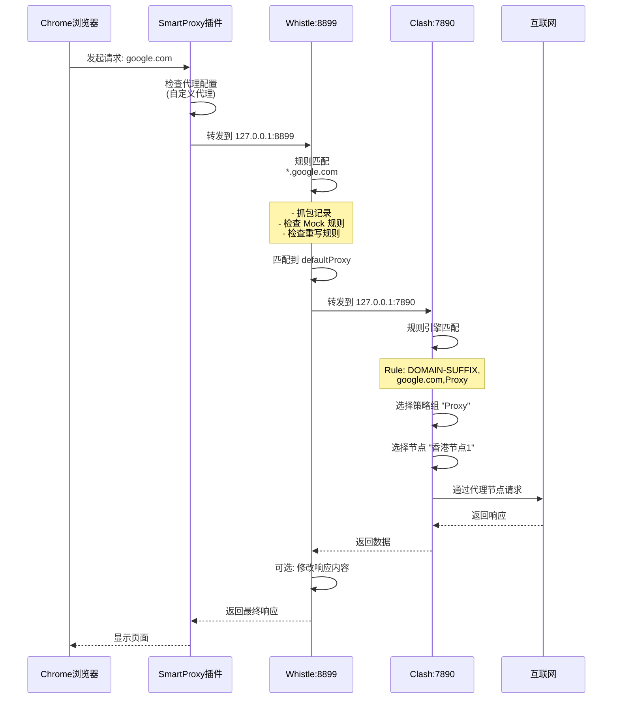

# 网络流量管控与调试工具链深度解析

> 全面掌握活动监视器、Proxifier、Clash、Whistle 与 SmartProxy 的核心原理与协作机制

## 前言

在现代软件开发和网络调试场景中,我们经常需要对网络流量进行精细化管控、分析和调试。本文深入剖析五个核心工具的工作原理、技术特性以及协作模式,帮助你构建一套完整的网络流量管控体系。

这些工具分布在不同的网络层次,从系统级监控到应用层代理,从流量劫持到智能路由,每个工具都有其独特的定位和能力边界。理解它们的协作机制,是实现高效网络调试和流量管控的关键。

### 1. 核心工具定位与关系总览

在深入每个工具之前，我们首先通过一张架构图来理解它们在网络栈中所处的层次和协作关系。这有助于建立宏观认知。

```mermaid
flowchart TD
    A[应用程序 / 进程] --> B{流量管控层次}

    B --> C[“用户态 (User Space)”]
    B --> D[“内核态 (Kernel Space)<br>（操作系统底层）”]

    subgraph C [应用层 / 代理链]
        direction LR
        C1[“SmartProxy (浏览器插件)<br>浏览器流量开关”] --> C2[“Whistle<br>网络调试分析器”] --> C3[“Clash<br>智能路由决策核心”]
    end

    subgraph D [系统层 / 流量劫持]
        D1[“Proxifier<br>强制流量调度员”] --> D2[“活动监视器 (Activity Monitor)<br>系统资源与流量计量员”]
    end

    C --> E[互联网]
    D --> E

    C1 -.->|“可选引导”</span>.-> D1
    C3 -.->|“规则指向”</span>.-> D1
```

**图解**：

- **自上而下**：数据从应用程序发出，经过不同工具的处理，最终流向互联网。
- **左右分区**：左侧是**用户态**的代理链，工具需要应用主动配合或手动配置；右侧是**内核态**的系统级工具，能力更强，可强制接管流量。
- **虚线**：表示可选的配置或影响关系。

---

### 2. 各工具深度剖析

#### 2.1 活动监视器 (Activity Monitor)

- **角色定位**：系统资源“仪表盘”。
- **核心原理**：挂钩于操作系统内核，监控所有进程的资源占用情况，包括网络 I/O。它**计量**的是通过系统网络栈的数据量，但不分析数据内容。
- **主要作用**：
  - 快速回答“**是哪个进程**在消耗网络带宽？”。
  - 提供 CPU、内存、能耗等的实时快照。
- **能力边界**：
  - **能**：显示每个进程的实时发送/接收字节数和速度。
  - **不能**：分析流量的目的地、协议内容、控制流量的走向。
- **使用提示**：在“网络”标签页中，可点击表头排序，快速找出流量异常进程。

#### 2.2 Proxifier

- **角色定位**: 流量"强制调度员"。
- **核心原理**: 通过安装系统级驱动(macOS 上为网络扩展,Windows 上为 LSP/WFP 驱动),**在内核层劫持**指定应用程序发起的网络连接,并将其**强制重定向**到配置的代理服务器。它不依赖应用自身的代理设置,即使应用程序代码中硬编码了直连逻辑也能生效。

**技术实现机制**:

1. **连接劫持**: 当应用程序调用 `connect()` 等系统调用尝试建立 TCP 连接时,Proxifier 的驱动会拦截这个请求
2. **规则匹配**: 根据配置的规则(进程名、目标地址、端口等)判断该连接是否需要代理
3. **连接重写**: 如果需要代理,将原始目标地址替换为代理服务器地址,建立到代理的连接
4. **协议封装**: 使用 SOCKS4/SOCKS5/HTTPS 协议与代理服务器通信,告知真实目标地址
5. **数据转发**: 代理服务器建立到真实目标的连接,Proxifier 在应用和代理之间透明转发数据

**主要作用**:

- 让那些**不支持代理**或**故意绕过系统代理**的应用程序(如某些游戏、命令行工具、国产软件)的流量也能进入代理链条
- 实现按应用、按目标地址的精细化代理策略
- 支持代理链 (Proxy Chain),可以将流量依次经过多个代理服务器

**关键特性**:

- **基于进程的精确规则**: 可以配置 `AppA.exe` 走代理 A,`AppB.exe` 直连,`AppC.exe` 走代理链
- **协议无关**: 可处理 TCP/UDP 流量(UDP 需代理服务器支持 SOCKS5 UDP Associate)
- **DNS 解析控制**:
  - **通过代理解析**: DNS 查询也通过代理进行,防止 DNS 泄露
  - **本地解析**: 先在本地解析 DNS,再将 IP 发送给代理
- **灵活的规则系统**:
  - 按应用程序名称匹配
  - 按目标主机名/IP 地址匹配(支持通配符)
  - 按目标端口匹配
  - 规则优先级可调整

**注意事项**:

- 需要管理员权限安装内核驱动
- **基于进程的精确规则**: 可以配置 `AppA.exe` 走代理 A,`AppB.exe` 直连,`AppC.exe` 走代理链
- **协议无关**: 可处理 TCP/UDP 流量(UDP 需代理服务器支持 SOCKS5 UDP Associate)
- **DNS 解析控制**:
  - **通过代理解析**: DNS 查询也通过代理进行,防止 DNS 泄露
  - **本地解析**: 先在本地解析 DNS,再将 IP 发送给代理
- **灵活的规则系统**:
  - 按应用程序名称匹配
  - 按目标主机名/IP 地址匹配(支持通配符)
  - 按目标端口匹配
  - 规则优先级可调整

**注意事项**:

- 需要管理员权限安装内核驱动
- macOS 系统需要在"系统偏好设置 > 安全性与隐私"中允许系统扩展
- 规则配置不当可能导致应用无法联网,建议从宽松规则开始逐步收紧
- 与某些 VPN 软件可能存在冲突(都在内核层操作网络栈)

#### 2.3 Clash

- **角色定位**: 智能路由"决策中心"。
- **核心原理**: 本身是一个功能强大的本地代理服务器 (支持 HTTP/SOCKS5/Redir 等多种入站协议)。它接收来自应用程序或系统的代理请求,并根据一套极其灵活的规则库 (YAML 配置) 决定流量的最终去向。

**工作模式**:

1. **Rule (规则) 模式** ⭐ 最常用

    - 根据域名、IP、GEOIP、进程名等条件,将流量分流向不同的策略
    - 每条规则指定匹配条件和对应的策略 (Proxy/Direct/Reject)
    - 规则从上到下匹配,命中即停止

2. **Global (全局) 模式**

    - 所有流量强制走指定的代理节点
    - 适合临时测试或确保所有流量都经过代理

3. **Direct (直连) 模式**

    - 所有流量直连,不经过任何代理
    - 相当于关闭代理功能

4. **TUN 模式** (高级功能)
    - 创建虚拟网卡 (如 `utun` 设备),在网络层 (L3) 接管系统流量
    - 可代理那些绕过应用层代理的流量(如未设置代理的应用、系统服务)
    - 需要管理员权限,需配置路由表和 DNS

**核心规则类型详解**:

```yaml
# 1. 域名匹配
- DOMAIN-SUFFIX,google.com,Proxy # 匹配 *.google.com
- DOMAIN,www.google.com,Proxy # 精确匹配
- DOMAIN-KEYWORD,google,Proxy # 域名包含 google

# 2. IP 地址匹配
- IP-CIDR,192.168.0.0/16,DIRECT # 目标 IP 在此范围内
- SRC-IP-CIDR,192.168.1.0/24,DIRECT # 源 IP 在此范围内
- IP-CIDR6,2001:db8::/32,Proxy # IPv6 地址段

# 3. 地理位置匹配
- GEOIP,CN,DIRECT # 目标 IP 属于中国,直连
- GEOIP,US,Proxy # 目标 IP 属于美国,走代理

# 4. 端口匹配
- DST-PORT,80,DIRECT # 目标端口 80
- SRC-PORT,7777,DIRECT # 源端口 7777

# 5. 进程匹配 (部分客户端支持)
- PROCESS-NAME,chrome.exe,Proxy # 指定进程的流量

# 6. 规则集引用
- RULE-SET,apple,DIRECT # 引用预定义的规则集

# 7. 兜底规则 (必须放在最后)
- MATCH,Proxy # 匹配所有未命中的流量
```

**策略组 (Proxy Group) 配置**:

Clash 的强大之处在于策略组,可以组合多个代理节点实现高级功能:

```yaml
proxy-groups:
  # 1. 手动选择
  - name: 'Proxy'
    type: select
    proxies:
      - '香港节点1'
      - '香港节点2'
      - '美国节点1'
      - DIRECT

  # 2. 自动选择 (延迟最低)
  - name: 'Auto'
    type: url-test
    proxies:
      - '香港节点1'
      - '香港节点2'
    url: 'http://www.gstatic.com/generate_204'
    interval: 300

  # 3. 故障转移
  - name: 'Fallback'
    type: fallback
    proxies:
      - '主节点'
      - '备用节点1'
      - '备用节点2'
    url: 'http://www.gstatic.com/generate_204'
    interval: 300

  # 4. 负载均衡
  - name: 'LoadBalance'
    type: load-balance
    proxies:
      - '节点1'
      - '节点2'
      - '节点3'
    url: 'http://www.gstatic.com/generate_204'
    interval: 300
```

**核心能力**:

- **智能分流**: 基于规则的精细化流量控制
- **负载均衡**: 多节点间分散流量
- **自动故障转移**: 节点不可用时自动切换
- **协议转换**: 支持 Shadowsocks、VMess、Trojan、Snell 等多种协议
- **DNS 处理**: 内置 DNS 服务器,支持 DNS 分流、DoH、DoT
- **性能优化**: 支持 TCP 并发、连接复用等高级特性

**注意事项**:

- 配置文件语法严格,缩进错误会导致启动失败
- 规则顺序很重要,应将特殊规则放在前面,通用规则放在后面
- GEOIP 数据库需要定期更新以保证准确性
- TUN 模式在某些系统上可能需要额外配置

#### 2.4 Whistle

- **角色定位**: 网络"诊断与调试工程师"。
- **核心原理**: 是一个基于 Node.js 的 HTTP/HTTPS/WebSocket 代理服务器,其核心价值在于**中间人 (Man-in-the-Middle)** 能力。它拦截、解析并可以修改请求和响应,提供强大的调试和 Mock 功能。

**核心功能详解**:

1. **抓包与查看**

   - 可视化展示所有经过的 HTTP/HTTPS 请求和响应
   - 查看请求头、响应头、Body 内容
   - 支持查看 WebSocket 消息、二进制数据

2. **映射与重写** (Rules 配置)

```text
# Map Local - 将线上资源映射到本地文件
www.example.com/api/user.json  file:///Users/username/mock/user.json
*.example.com/**.js  file:///Users/username/local-js/

# Map Remote - 将请求重定向到另一个地址
www.example.com  www.test.com
www.example.com/api  192.168.1.100:8080/api

# ResBody - 直接修改响应内容
www.example.com/api/config  resBody://{__"status"__: __"ok"__}

# ReqBody - 修改请求内容
www.example.com/api/submit  reqBody://{__"test"__: true}

# 默认代理 - 将未匹配的流量转发给其他代理
*  proxy://127.0.0.1:7890  # 转发给 Clash
```

1. **Mock 数据**

   - 为指定 API 返回自定义 JSON 数据
   - 模拟不同的 HTTP 状态码和响应头
   - 支持使用模板和变量

2. **延迟模拟**

   ```text
   # 模拟网络延迟
   www.example.com/api  resDelay://3000  # 延迟 3 秒
   ```

3. **注入脚本和样式**

```text
# 注入 JS 文件到页面
www.example.com  js://path/to/inject.js
# 注入 CSS
www.example.com  css://path/to/style.css
```

**HTTPS 解密配置**:

Whistle 要解密 HTTPS 流量,必须安装并信任其根证书:

1. **下载证书**: 启动 Whistle 后,访问 `http://127.0.0.1:8899` (或配置的端口)
2. **进入 HTTPS 标签**: 点击顶部导航的 "HTTPS"
3. **下载根证书**: 点击 "Download RootCA" 下载证书文件
4. **安装证书**:

   - **macOS**: 双击证书 → 钥匙串访问 → 找到 "whistle" 证书 → 双击 → 信任 → 始终信任
   - **Windows**: 双击证书 → 安装证书 → 本地计算机 → 受信任的根证书颁发机构
   - **移动设备**: 通过邮件发送证书或扫描二维码安装,并在设置中信任证书

5. **启用 HTTPS 抓包**: 在 Whistle 的 HTTPS 标签页勾选 "Capture HTTPS CONNECTs"

**规则配置技巧**:

```text
# 使用注释
# 这是注释行

# 使用正则表达式
/^https?://[^/]*example\.com/  file:///path/to/local

# 组合多个操作
www.example.com  file:///local/path resDelay://2000 enable://capture

# 条件过滤
www.example.com  log://{req.headers}
```

**注意事项**:

- Whistle 是一个**被动**工具,流量必须被手动配置为指向它才能工作
- HTTPS 解密需要完全信任根证书,否则浏览器会显示安全警告
- 规则语法类似 hosts 文件,但功能更强大
- 支持通过插件扩展功能 (whistle.xxx)

#### 2.5 SmartProxy (Chrome 插件)

- **角色定位**: 浏览器流量"快捷开关"。
- **核心原理**: 一个方便的浏览器扩展界面,用于管理和快速切换 Chrome 浏览器的代理设置,无需进入操作系统设置。

**主要作用**:

- 提供一键切换功能,快速在不同代理配置之间切换
- 基于域名或内容的自动化规则
- 保存和管理多个代理配置文件
- 快速清除 Cookies 和缓存

**工作模式**:

1. **直连 (Direct)**

   - 浏览器忽略任何代理,直接连接网络
   - ⚠️ **此设置会绕过整个代理链**,包括系统代理

2. **系统代理 (System Proxy)**

   - 浏览器遵从操作系统设置的代理
   - 如果系统代理指向 Clash,则浏览器流量会经过 Clash

3. **自定义代理 (Custom Proxy)**
   - 手动配置代理服务器地址和端口
   - 示例: `127.0.0.1:8899` 指向 Whistle 进行调试
   - 支持 HTTP、HTTPS、SOCKS5 协议

**典型配置示例**:

```text
配置名称: Whistle 调试
代理协议: HTTP
代理地址: 127.0.0.1
端口: 8899

配置名称: Clash 智能路由
代理协议: HTTP
代理地址: 127.0.0.1
端口: 7890
```

**自动化规则 (Smart Profiles)**:

可以配置基于域名的自动代理规则,比如:

- 访问 `*.test.com` 时自动启用 Whistle 代理
- 访问其他网站时保持直连

**注意事项**:

- 其作用范围**仅限于 Chrome 浏览器**
- 插件设置的代理优先级高于系统代理
- 部分版本不支持需要认证的私有代理 (Chrome API 限制)

---

### 3. 工具链协同工作机制详解

理解这些工具如何协同工作是掌握网络流量管控的关键。本节将深入剖析它们之间的协作关系、数据流向和配置要点。

#### 3.1 协同工作的核心概念

**代理链模式**:

这些工具可以串联成一条"代理链",每个工具在链条中扮演不同角色:

```text
[应用程序] → [Proxifier强制劫持] → [Whistle调试分析] → [Clash智能路由] → [互联网]
             └─ 内核层流量拦截      └─ HTTP代理+规则      └─ SOCKS5代理+分流
```

**关键协同机制**:

1. **流量劫持与引导**

   - Proxifier 在内核层拦截连接,强制引导到代理
   - SmartProxy 在应用层控制浏览器代理设置
   - 系统代理设置影响大部分标准应用

2. **代理转发 (Proxy Chaining)**

   - Whistle 可以通过 `proxy://` 规则将流量转发给 Clash
   - Clash 可以配置上游代理 (upstream proxy)
   - 形成多层代理结构,每层处理不同任务

3. **规则协同**
   - Proxifier: 按进程和目标地址分流
   - Whistle: 按 URL 模式进行调试和 Mock
   - Clash: 按域名/IP/地理位置进行路由决策

#### 3.2 典型协同架构

下图展示了完整的工具协同架构和数据流向:

```mermaid
graph TB
    subgraph Application[\"应用层\"]
        A1[Chrome浏览器]
        A2[标准应用<br/>Office/微信等]
        A3[特殊应用<br/>游戏/命令行工具]
    end

    subgraph Control[\"流量控制层\"]
        C1[SmartProxy插件<br/>浏览器代理开关]
        C2[系统代理设置<br/>macOS/Windows]
        C3[Proxifier<br/>内核级流量劫持]
    end

    subgraph Debug[\"调试分析层\"]
        D1[Whistle<br/>8899端口]
        D2{Whistle规则引擎}
        D3[抓包/Mock/重写]
    end

    subgraph Route[\"智能路由层\"]
        R1[Clash<br/>7890端口]
        R2{Clash规则引擎}
        R3[策略组选择]
    end

    subgraph Output[\"出口层\"]
        O1[直连Direct]
        O2[代理节点A]
        O3[代理节点B]
        O4[拒绝Reject]
    end

    Monitor[活动监视器<br/>全程监控]

    A1 -->|可配置| C1
    A1 -->|默认| C2
    A2 --> C2
    A3 --> C3

    C1 -->|127.0.0.1:8899| D1
    C2 -->|127.0.0.1:8899| D1
    C3 -->|强制转发| D1

    D1 --> D2
    D2 -->|匹配规则| D3
    D2 -->|默认代理<br/>proxy://127.0.0.1:7890| R1

    R1 --> R2
    R2 -->|规则匹配| R3
    R3 -->|国内网站| O1
    R3 -->|国外网站| O2
    R3 -->|特定服务| O3
    R3 -->|广告域名| O4

    O1 --> Internet[互联网]
    O2 --> Internet
    O3 --> Internet

    Monitor -.监控.-> Application
    Monitor -.监控.-> Debug
    Monitor -.监控.-> Route
    Monitor -.监控.-> Output

    style D1 fill:#e1f5ff
    style R1 fill:#fff4e1
    style Monitor fill:#f0f0f0
```

#### 3.3 数据流详细说明

**完整请求流程**:

以 Chrome 浏览器访问 `https://www.google.com` 为例:



**不同配置模式**:

1. **完整调试模式** (开发调试)

   ```text
   浏览器 → SmartProxy(8899) → Whistle(抓包+Mock) → Clash(7890) → 互联网
   ```

2. **纯路由模式** (日常使用)

   ```text
   应用 → 系统代理(7890) → Clash(智能分流) → 互联网
   ```

3. **强制接管模式** (特殊应用)

   ```text
   特殊应用 → Proxifier(内核劫持) → Whistle → Clash → 互联网
   ```

#### 3.4 实战场景详解

##### 场景一:开发调试 (抓包与 Mock)

**目标**: 对浏览器和手机 App 的 API 请求进行抓包和 Mock。

**协作流程**:

1. **引导流量**:

   - **浏览器**: 使用 SmartProxy 插件,设置为 `127.0.0.1:8899` (Whistle)
   - **手机**: 在 Wi-Fi 设置中,将 HTTP 代理设置为电脑 IP 和端口 `8899`
   - **安装证书**: 手机需要安装并信任 Whistle 的 HTTPS 证书

2. **分析调试**:

   - 流量到达 Whistle,在 Web 界面 (`http://127.0.0.1:8899`) 查看所有请求
   - 在 Rules 中配置 Mock 规则:

     ```text
     # Mock API 数据
     example.com/api/userinfo resBody://{{"id": 123, "name": "测试用户"}}

     # 映射到本地文件
     example.com/api/config file:///Users/xxx/mock/config.json
     ```

3. **代理上网**:

   - 在 Whistle 中配置: `* proxy://127.0.0.1:7890` (转发给 Clash)
   - Clash 根据规则智能分流 (国内直连,国外走代理)

4. **监控验证**:
   - 打开活动监视器,确认 `whistle` 和 `clash` 进程的网络活动正常

##### 场景二:管理不守规矩的应用

**目标**: 让不遵循系统代理的游戏客户端通过代理联网。

**协作流程**:

1. **Proxifier 强制引流**:

   ```text
   应用程序: Game.exe
   目标主机: Any
   动作: Proxy SOCKS5 127.0.0.1:7890
   ```

2. **选择性调试**:

   - 如需抓包,改为: `Proxy HTTP 127.0.0.1:8899`
   - 在 Whistle 中观察游戏的连接行为

3. **路由决策**:
   - 在 Clash 中为游戏服务器配置专用节点:

     ```yaml
     - DOMAIN-SUFFIX,gameserver.com,游戏专线
     - IP-CIDR,1.2.3.0/24,游戏专线
     ```

##### 场景三:多设备协同调试

**目标**: 在不同设备上测试同一个 Web 应用,共享相同的 Mock 数据。

**协作流程**:

1. **Whistle 作为局域网代理**:

   - 启动 Whistle: `w2 start -p 8899 --host 0.0.0.0`
   - 查看本机 IP: `192.168.1.100`

2. **设备配置**:

   - PC 浏览器: SmartProxy 设置 `192.168.1.100:8899`
   - Mac: 系统代理设置 `192.168.1.100:8899`
   - 手机/iPad: Wi-Fi 代理设置 `192.168.1.100:8899`

3. **统一 Mock**:

   ```text
   # 所有设备共享这些 Mock 规则
   test.example.com file:///Users/xxx/project/dist
   test.example.com/api resBody://{{...}}
   ```

---

### 4. 最佳实践与故障排查

#### 4.1 配置最佳实践

##### 1. 证书管理

- **Whistle HTTPS 证书**必须完全信任,否则只能看到加密流量
- **多设备**: 将证书导出为 `.p12` 格式,方便在多台设备安装
- **定期更新**: Whistle 更新可能需要重新安装证书

##### 2. 规则优先级

所有工具的规则都是**从上到下匹配,命中即停止**:

```yaml
# Clash 规则示例 - 特殊规则在前
- DOMAIN,analytics.google.com,REJECT # 先拦截
- DOMAIN-SUFFIX,google.com,Proxy # 再匹配
- GEOIP,CN,DIRECT # 通用规则
- MATCH,Proxy # 兜底规则(必须在最后)
```

##### 3. 端口规划

避免端口冲突,建议规划:

| 工具      | 默认端口 | 协议        | 用途     |
| --------- | -------- | ----------- | -------- |
| Whistle   | 8899     | HTTP        | 调试代理 |
| Clash     | 7890     | HTTP/SOCKS5 | 智能路由 |
| Clash API | 9090     | HTTP        | 控制面板 |
| V2Ray     | 1087     | SOCKS5      | 备用代理 |

##### 4. DNS 配置

- **Clash DNS**: 启用 fake-ip 模式,提升性能并避免 DNS 泄露
- **Whistle**: 可配置自定义 DNS 解析规则
- **注意**: 多层代理时,DNS 解析可能发生在不同层级

#### 4.2 故障排查清单

##### 问题 1: Whistle 看不到 HTTPS 流量

- √ 检查是否安装证书
- √ 检查证书是否完全信任
- √ 检查 Whistle HTTPS 标签页是否启用 "Capture HTTPS CONNECTs"
- √ Chrome 检查: `chrome://net-internals/#hsts` 删除强制 HTTPS 站点

##### 问题 2: Proxifier 规则不生效

- √ 确认已授予管理员权限和系统扩展允许
- √ 检查规则优先级顺序
- √ 查看 Proxifier 日志,确认流量是否被拦截
- √ 检查代理服务器地址和端口是否正确

##### 问题 3: Clash 规则不匹配

- √ 检查 YAML 语法(缩进必须用空格,不能用 Tab)
- √ 查看 Clash 日志: `~/.config/clash/logs/`
- √ 使用 Clash 控制面板查看实时连接和规则匹配
- √ 更新 GEOIP 数据库

##### 问题 4: 代理链断开

排查顺序(从下往上):

1. **测试 Clash**: 直接设置浏览器代理为 `127.0.0.1:7890`,访问测试网站
2. **测试 Whistle**: 设置代理为 `127.0.0.1:8899`,检查能否转发到 Clash
3. **测试 Proxifier**: 检查是否正确劫持流量并转发

常用测试命令:

```bash
# 测试 HTTP 代理
curl -x http://127.0.0.1:8899 https://www.google.com

# 测试 SOCKS5 代理
curl -x socks5://127.0.0.1:7890 https://www.google.com

# 查看端口监听状态
lsof -i :8899
lsof -i :7890
```

##### 问题 5: 性能下降

- √ 减少代理链层级(不需要时跳过 Whistle)
- √ Clash 启用连接复用和 TCP 并发
- √ 选择低延迟的代理节点
- √ 使用 Clash 的 url-test 或 fallback 策略组自动选择最优节点

#### 4.3 安全与隐私注意事项

1. **HTTPS 中间人证书**: Whistle 证书拥有完全解密 HTTPS 的能力,请妥善保管,不要泄露给他人
2. **规则泄露**: 避免在规则中硬编码敏感信息 (如 API Token)
3. **局域网代理**: Whistle 开启 `--host 0.0.0.0` 时可被局域网访问,注意安全
4. **日志清理**: 定期清理 Whistle 和 Clash 的日志,避免敏感信息积累

---

### 5. 总结

这套工具链提供了一个从**应用层到系统层**、从**可视化监控到强制调度**、从**调试分析到智能路由**的完整解决方案。理解每个工具的定位和边界，像搭积木一样灵活组合它们，可以满足从开发调试、到网络管理、再到安全研究的各种复杂需求。掌握它们，就意味着你完全掌控了自己设备上的网络流量。
