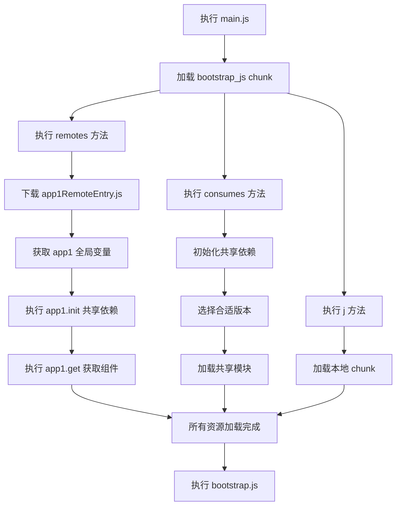

# Module Federation

## 背景

在跨项目复用组件代码或业务逻辑时,传统上主要有以下三种方式:

### 1. NPM 包方式

将组件代码封装为 npm 包并发布,各项目通过依赖管理工具引入。这是目前最广泛采用的做法,具有良好的版本管理和依赖追溯能力。

**优点:** 代码可维护性高,复用性强,版本管理规范

**缺点:** 更新效率低。一旦 npm 包发布新版本,所有依赖该包的应用都需要手动升级依赖、重新构建并部署,在多团队协作场景下尤其耗时

### 2. UMD + CDN 方式

将代码打包为 UMD 格式,通过 CDN 分发,应用运行时动态加载。

**优点:** 减少了应用的构建和部署频率

**缺点:** 存在依赖重复打包问题。例如,若组件 A 和组件 B 都依赖 lodash,在各自的 UMD 包中 lodash 会被重复打包,无法实现依赖共享,导致资源浪费

### 3. 复制粘贴

直接复制代码到各个项目中。

**优点:** 实施成本最低,无需额外配置

**缺点:** 维护成本极高,代码一致性难以保证

---

**核心问题:** 是否存在一种方案,能够在模块更新后,无需重新部署所有依赖项目,而是在运行时动态加载最新模块,同时还能实现依赖共享?

## 什么是 Module Federation

> 多个独立的构建可以组成一个应用程序,这些独立的构建之间不应该存在依赖关系,因此可以单独开发和部署它们。
>
> —— Webpack 官方文档

**Module Federation**(模块联邦)是 Webpack 5 引入的革命性特性,它允许多个独立构建的应用在运行时共享模块、依赖、页面甚至整个应用。

### 核心优势

1. **去中心化架构** - 无需中心应用,每个应用既可以作为宿主(Host)消费其他应用的模块,也可以作为远程应用(Remote)向外暴露模块
2. **独立部署** - 各应用可独立开发、构建和部署,模块更新后无需通知依赖方,实现真正的热更新
3. **依赖共享** - 运行时智能共享依赖,避免重复加载,优化资源利用和性能


### 核心概念

#### 1. Container(容器)

使用 `ModuleFederationPlugin` 构建的应用即为一个 Container。每个 Container 都可以:

- 加载其他 Container 的模块(作为 Host)
- 被其他 Container 加载(作为 Remote)

#### 2. Host & Remote(宿主与远程)

- **Host(宿主应用):** 消费者角色,动态加载并运行其他 Remote 应用的代码
- **Remote(远程应用):** 提供者角色,暴露模块(组件、函数、配置等)供 Host 使用

**注意:** 一个应用可以同时扮演 Host 和 Remote 角色

#### 3. Shared(共享依赖)

定义可在多个应用间共享的依赖包(如 `react`、`react-dom`、`lodash` 等),避免重复加载,优化性能。

## 案例解析

### 项目示例

> 示例项目地址: [github.com/zhaoky/micro](https://github.com/zhaoky/micro)

我们创建两个独立的 React 项目 `app1` 和 `app2`,每个项目都导出一个组件,并通过 Module Federation 相互引用对方的组件,实现双向依赖。：

#### app1 的 App.jsx

```jsx
import React from 'react';
import Button from './src/Button'; // 本地组件
import Logo from 'comp/Logo'; // 远程组件,来自 app2
import _ from 'lodash'; // 共享依赖

export default class App extends React.Component {
  render() {
    return (
      <div>
        <p>app1 lodash 版本号: {_.VERSION}</p>
        <Button />
        <Logo />
      </div>
    );
  }
}
```

#### app2 的 App.jsx

```jsx
import React from 'react';
import Button from 'comp/Button'; // 远程组件,来自 app1
import Logo from './src/Logo'; // 本地组件
import _ from 'lodash'; // 共享依赖

export default class App extends React.Component {
  render() {
    return (
      <div>
        <p>app2 lodash 版本号: {_.VERSION}</p>
        <Button type="warning" />
        <Logo />
      </div>
    );
  }
}
```

#### app1 的 webpack.config.js

```js
new ModuleFederationPlugin({
  name: 'app1', // 当前应用名称
  filename: 'app1RemoteEntry.js', // 远程入口文件名
  remotes: {
    comp: 'app2@http://localhost:8002/app2RemoteEntry.js', // 引用 app2 的远程模块
  },
  exposes: {
    './Button': './src/Button.jsx', // 暴露 Button 组件
  },
  shared: {
    lodash: { singleton: true }, // 共享 lodash,单例模式
  },
});
```

#### app2 的 webpack.config.js

```js
new ModuleFederationPlugin({
  name: 'app2', // 当前应用名称
  filename: 'app2RemoteEntry.js', // 远程入口文件名
  remotes: {
    comp: 'app1@http://localhost:8001/app1RemoteEntry.js', // 引用 app1 的远程模块
  },
  exposes: {
    './Logo': './src/Logo.jsx', // 暴露 Logo 组件
  },
  shared: {
    lodash: { singleton: true }, // 共享 lodash,单例模式
  },
});
```

#### 运行效果


从运行效果可以看出:

1. **动态加载:** app1 和 app2 通过异步下载对方的 RemoteEntry 入口文件来完成远程组件的导入
2. **双向依赖:** app1 成功引入了 app2 的 Logo 组件,app2 也成功引入了 app1 的 Button 组件
3. **依赖共享:** 两个应用共用同一份 lodash(来自 app1 的 8001 端口),因为 app1 的 lodash 版本更高,符合 `singleton: true` 的版本选择策略

以上演示了 Module Federation 的两大核心能力:**运行时动态加载**和**智能依赖共享**。

### 配置详解

#### 1. `name` - 应用名称

当前应用的唯一标识符。当应用作为 Remote 被其他应用引用时,需要使用此名称。

**示例:** 宿主应用配置 `'comp': 'app1@http://localhost:3001/app1RemoteEntry.js'`,其中 `app1` 就是远程应用的 `name`

#### 2. `filename` - 入口文件名

指定作为 Remote 时对外提供的入口文件名。构建后会生成对应的 `.js` 文件供其他应用加载。

**示例:** 设置 `filename: 'app1RemoteEntry.js'`,构建产物中会包含 `app1RemoteEntry.js` 文件

#### 3. `exposes` - 暴露模块

定义当前应用作为 Remote 时对外暴露的模块(组件、函数、配置等)。

**格式:** 对象,键为暴露路径,值为本地文件路径

```js
exposes: {
  './Button': './src/Button.jsx',      // 暴露 Button 组件
  './utils': './src/utils/index.js',   // 暴露工具函数
}
```

**使用:** 其他应用可通过 `import Button from 'comp/Button'` 引入

#### 4. `remotes` - 远程依赖

定义当前应用作为 Host 时需要引用的远程应用及其地址。

**格式:** 对象,键为自定义别名,值为远程应用地址(格式: `应用名@入口文件URL`)

```js
remotes: {
  'comp': 'app1@http://localhost:8001/app1RemoteEntry.js',
  'shared-lib': 'lib@https://cdn.example.com/libRemoteEntry.js',
}
```

#### 5. `shared` - 共享依赖

指定可在多个应用间共享的依赖包,避免重复加载。

**基础配置:**

```js
shared: ['react', 'react-dom', 'lodash']; // 简写形式
```

**高级配置:**

```js
shared: {
  lodash: {
    singleton: true,           // 单例模式,全局只加载一次
    requiredVersion: '^4.0.0', // 要求的版本范围
  },
  react: {
    singleton: true,
    eager: true,               // 立即加载,不异步
  },
}
```

**配置项说明:**

- **`singleton`:** 是否以单例模式共享。开启后,多个应用共用同一份依赖,优先使用版本号最高的
- **`requiredVersion`:** 指定依赖的版本要求。如果不满足,应用会加载自己的版本而非共享版本
- **`eager`:** 是否立即加载。默认为 `false`(异步加载)

**版本选择示例:**

假设:

- app1 的 lodash 版本为 `3.8.0`
- app2 的 lodash 版本为 `4.8.0`
- 两者都配置了 `singleton: true`

结果: 两个应用将共用 `4.8.0` 版本(版本更高)

但如果 app2 配置了 `requiredVersion: '2.0.0'`,由于版本不兼容,app2 将使用自己的 `4.8.0` 版本,不再共享。

### Runtime 源码浅析

> 本节深入分析 Module Federation 的运行时加载机制,帮助理解其内部实现原理。

#### 前置知识: Webpack 异步加载机制

```js
/* webpack/runtime/ensure chunk */
(() => {
  __webpack_require__.f = {};
  // This file contains only the entry chunk.
  // The chunk loading function for additional chunks
  __webpack_require__.e = (chunkId) => {
    return Promise.all(
      Object.keys(__webpack_require__.f).reduce((promises, key) => {
        __webpack_require__.f[key](chunkId, promises);
        return promises;
      }, []),
    );
  };
})();
```

`__webpack_require__.e` 方法会依次执行 `__webpack_require__.f` 对象中的三个方法:

1. **`remotes`** - 加载远程模块
2. **`consumes`** - 加载共享依赖
3. **`j`** - 加载本地 chunk

只有当这三个方法全部执行完成后,才会执行回调函数。

#### 加载流程分析

以 **app2 加载 app1 的远程组件 Button** 为例(app1 加载 app2 同理),编译后的 `bootstrap.js` 中有如下代码:：

```js
var comp_Button__WEBPACK_IMPORTED_MODULE_1__ = __webpack_require__(
  /*! comp/Button */ 'webpack/container/remote/comp/Button',
);
//...
var lodash__WEBPACK_IMPORTED_MODULE_3__ = __webpack_require__(
  /*! lodash */ 'webpack/sharing/consume/default/lodash/lodash',
);
```

- `webpack/container/remote/comp/Button` 对应 `import Button from 'comp/Button'` 的编译结果(远程模块)
- `webpack/sharing/consume/default/lodash/lodash` 对应共享依赖 lodash 的编译结果

这两个模块是何时被引入的? 回到主文件 `main.js`,可以看到加载 `bootstrap.js` 的代码:：

```js
Promise.all(
  /*! import() */ [
    __webpack_require__.e('vendors-node_modules_pnpm_react_18_2_0_node_modules_react_index_js'),
    __webpack_require__.e('vendors-node_modules_pnpm_react-dom_18_2_0_react_18_2_0_node_modules_react-dom_client_js'),
    __webpack_require__.e('bootstrap_js'),
  ],
).then(__webpack_require__.bind(__webpack_require__, /*! ./bootstrap.js */ './bootstrap.js'));
//...
```

可以看到,必须先加载完所有依赖文件,才会执行 `bootstrap.js` 中的代码。而要加载 `bootstrap_js`,需要依次执行以下 3 个方法:：

#### 1. remotes - 远程模块加载

```js
// remotes
(() => {
  var chunkMapping = {
    bootstrap_js: ['webpack/container/remote/comp/Button'],
  };
  var idToExternalAndNameMapping = {
    'webpack/container/remote/comp/Button': ['default', './Button', 'webpack/container/reference/comp'],
  };
  __webpack_require__.f.remotes = (chunkId, promises) => {
    if (__webpack_require__.o(chunkMapping, chunkId)) {
    chunkMapping[chunkId].forEach((id) => {
      var getScope = __webpack_require__.R;
      if(!getScope) getScope = [];
      var data = idToExternalAndNameMapping[id];
      if(getScope.indexOf(data) >= 0) return;
      getScope.push(data);
      if(data.p) return promises.push(data.p);
      var onError = (error) => {
        //...
       };
      var handleFunction = (fn, arg1, arg2, d, next, first) => {
        try {
          var promise = fn(arg1, arg2);
          if(promise && promise.then) {
            var p = promise.then((result) => (next(result, d)), onError);
            if(first) promises.push(data.p = p); else return p;
          } else {
            return next(promise, d, first);
          }
        } catch(error) {
          onError(error);
        }
      }
      var onExternal = (external, _, first) => (external ? handleFunction(__webpack_require__.I, data[0], 0, external, onInitialized, first) :
      var onInitialized = (_, external, first) => (handleFunction(external.get, data[1], getScope, 0, onFactory, first));
      var onFactory = (factory) => {
        data.p = 1;
        __webpack_require__.m[id] = (module) => {
          module.exports = factory();
        }
      };
      handleFunction(__webpack_require__, data[2], 0, 0, onExternal, 1);
    });
    }
  };
})();
```

`remotes` 方法是加载远程组件的核心,通过 `idToExternalAndNameMapping` 映射关系可以看出执行逻辑:

**第一步:** 执行 `handleFunction`,加载远程模块 `webpack/container/remote/comp/Button` 对应的本地引用模块 `webpack/container/reference/comp`）；

`webpack/container/reference/comp`:

```js
'use strict';
var __webpack_error__ = new Error();
module.exports = new Promise((resolve, reject) => {
  if (typeof app1 !== 'undefined') return resolve();
  __webpack_require__.l(
    'http://localhost:8001/app1RemoteEntry.js',
    (event) => {
      if (typeof app1 !== 'undefined') return resolve();
      //reject(__webpack_error__);
    },
    'app1',
  );
}).then(() => app1);
```

`__webpack_require__.l` 通过 JSONP 方式加载远程资源 `app1RemoteEntry.js`,加载完成后将其导出的全局变量 `app1` 返回,传递给 `onExternal` 方法的第一个参数 `external`。

**第二步:** 执行 `handleFunction(onExternal)`,调用 `__webpack_require__.I('default')` 初始化并注册共享模块:：

```js
(() => {
  __webpack_require__.S = {};
  var initPromises = {};
  var initTokens = {};
  __webpack_require__.I = (name, initScope) => {
    if (!initScope) initScope = [];
    var initToken = initTokens[name];
    if (!initToken) initToken = initTokens[name] = {};
    if (initScope.indexOf(initToken) >= 0) return;
    initScope.push(initToken);
    if (initPromises[name]) return initPromises[name];
    if (!__webpack_require__.o(__webpack_require__.S, name)) __webpack_require__.S[name] = {};
    var scope = __webpack_require__.S[name];
    var uniqueName = 'main-app';
    var register = (name, version, factory, eager) => {
      var versions = (scope[name] = scope[name] || {});
      var activeVersion = versions[version];
      if (
        !activeVersion ||
        (!activeVersion.loaded && (!eager != !activeVersion.eager ? eager : uniqueName > activeVersion.from))
      )
        versions[version] = { get: factory, from: uniqueName, eager: !!eager };
    };
    var initExternal = (id) => {
      try {
        var module = __webpack_require__(id);
        if (!module) return;
        var initFn = (module) => module && module.init && module.init(__webpack_require__.S[name], initScope);
        if (module.then) return promises.push(module.then(initFn, handleError));
        var initResult = initFn(module);
        if (initResult && initResult.then) return promises.push(initResult['catch'](handleError));
      } catch (err) {}
    };
    var promises = [];
    switch (name) {
      case 'default':
        {
          register('lodash', '3.8.0', () =>
            __webpack_require__
              .e('vendors-node_modules_pnpm_lodash_3_8_0_node_modules_lodash_index_js')
              .then(
                () => () =>
                  __webpack_require__(
                    /*! ../..node_modules/.pnpm/lodash@3.8.0/node_modules/lodash/index.js */ '../../node_modules/.pnpm/lodash@3.8.0/node_modules/lodash/index.js',
                  ),
              ),
          );
          initExternal('webpack/container/reference/comp');
        }
        break;
    }
    if (!promises.length) return (initPromises[name] = 1);
    return (initPromises[name] = Promise.all(promises).then(() => (initPromises[name] = 1)));
  };
})();
```

`__webpack_require__.I` 是共享模块的核心方法:

- **`register` 方法:** 注册当前应用的共享模块
- **`initExternal` 方法:** 加载远程应用的入口模块 `webpack/container/entry/app1`,获取其 `exports` 后执行其 `init` 方法

在 `init` 方法中,通过 `__webpack_require__.S` 对象实现共享:

1. app2 将自己的共享模块信息传递给 app1
2. app1 执行 `__webpack_require__.I` 注册自己的共享模块
3. 最终 `__webpack_require__.S` 包含了两个应用的所有共享模块信息


**第三步:** 执行 `handleFunction(onInitialized)`,调用 `external.get('./Button')` 加载远程模块 Button,加载完成后在 `onFactory` 中将该模块注册到自身的模块系统 `__webpack_require__.m` 中。）；

#### 2. consumes - 共享依赖加载

```js
//...
// consumes
(() => {
  var init = (fn) =>
    function (scopeName, a, b, c) {
      var promise = __webpack_require__.I(scopeName);
      if (promise && promise.then)
        return promise.then(fn.bind(fn, scopeName, __webpack_require__.S[scopeName], a, b, c));
      return fn(scopeName, __webpack_require__.S[scopeName], a, b, c);
    };
  var loadSingletonVersionCheckFallback = /*#__PURE__*/ init((scopeName, scope, key, version, fallback) => {
    if (!scope || !__webpack_require__.o(scope, key)) return fallback();
    return getSingletonVersion(scope, scopeName, key, version);
  });
  var moduleToHandlerMapping = {
    'webpack/sharing/consume/default/lodash/lodash': () =>
      loadSingletonVersionCheckFallback('default', 'lodash', [4, 3, 8, 0], () =>
        __webpack_require__
          .e('vendors-node_modules_pnpm_lodash_3_8_0_node_modules_lodash_index_js')
          .then(
            () => () =>
              __webpack_require__(/*! lodash */ '../../node_modules/.pnpm/lodash@3.8.0/node_modules/lodash/index.js'),
          ),
      ),
  };
  var chunkMapping = {
    bootstrap_js: ['webpack/sharing/consume/default/lodash/lodash'],
  };
  __webpack_require__.f.consumes = (chunkId, promises) => {
    if (__webpack_require__.o(chunkMapping, chunkId)) {
      chunkMapping[chunkId].forEach((id) => {
        if (__webpack_require__.o(installedModules, id)) return promises.push(installedModules[id]);
        if (!startedInstallModules[id]) {
          var onFactory = (factory) => {
            installedModules[id] = 0;
            __webpack_require__.m[id] = (module) => {
              delete __webpack_require__.c[id];
              module.exports = factory();
            };
          };
          startedInstallModules[id] = true;
          var onError = (error) => {
            delete installedModules[id];
            __webpack_require__.m[id] = (module) => {
              delete __webpack_require__.c[id];
              throw error;
            };
          };
          try {
            var promise = moduleToHandlerMapping[id]();
            if (promise.then) {
              promises.push((installedModules[id] = promise.then(onFactory)['catch'](onError)));
            } else onFactory(promise);
          } catch (e) {
            onError(e);
          }
        }
      });
    }
  };
})();
```

`consumes` 方法负责确定版本并加载共享模块:

1. 在 `loadSingletonVersionCheckFallback` 中,基于之前 `__webpack_require__.I` 收集的所有版本信息
2. 通过 `getSingletonVersion` 方法按照配置策略(如 `singleton`、`requiredVersion`)选择合适的版本
3. 调用 `register` 时传入的 `get` 方法(第三个参数)加载对应版本的模块
4. 通过 `onFactory` 将加载的模块注册到 `__webpack_require__.m` 中

最终,共享依赖模块被注册为 `webpack/sharing/consume/default/lodash/lodash`。

#### 3. j - 本地 Chunk 加载

```js
var installedChunks = {
  main: 0,
};

__webpack_require__.f.j = (chunkId, promises) => {
  // JSONP chunk loading for javascript
  var installedChunkData = __webpack_require__.o(installedChunks, chunkId) ? installedChunks[chunkId] : undefined;
  if (installedChunkData !== 0) {
    if (installedChunkData) {
      promises.push(installedChunkData[2]);
    } else {
      if (true) {
        var promise = new Promise(
          (resolve, reject) => (installedChunkData = installedChunks[chunkId] = [resolve, reject]),
        );
        promises.push((installedChunkData[2] = promise));
        var url = __webpack_require__.p + __webpack_require__.u(chunkId);
        var loadingEnded = (event) => {
          if (__webpack_require__.o(installedChunks, chunkId)) {
            installedChunkData = installedChunks[chunkId];
            if (installedChunkData !== 0) installedChunks[chunkId] = undefined;
            if (installedChunkData) {
              // installedChunkData[1](error);
            }
          }
        };
        __webpack_require__.l(url, loadingEnded, 'chunk-' + chunkId, chunkId);
      }
    }
  }
};
//...
var webpackJsonpCallback = (parentChunkLoadingFunction, data) => {
  var [chunkIds, moreModules, runtime] = data;
  var moduleId,
    chunkId,
    i = 0;
  if (chunkIds.some((id) => installedChunks[id] !== 0)) {
    for (moduleId in moreModules) {
      if (__webpack_require__.o(moreModules, moduleId)) {
        __webpack_require__.m[moduleId] = moreModules[moduleId];
      }
    }
    if (runtime) var result = runtime(__webpack_require__);
  }
  if (parentChunkLoadingFunction) parentChunkLoadingFunction(data);

  for (; i < chunkIds.length; i++) {
    chunkId = chunkIds[i];
    if (__webpack_require__.o(installedChunks, chunkId) && installedChunks[chunkId]) {
      installedChunks[chunkId][0]();
    }
    installedChunks[chunkId] = 0;
  }
};

var chunkLoadingGlobal = (self['webpackChunkapp1'] = self['webpackChunkapp1'] || []);
chunkLoadingGlobal.forEach(webpackJsonpCallback.bind(null, 0));
chunkLoadingGlobal.push = webpackJsonpCallback.bind(null, chunkLoadingGlobal.push.bind(chunkLoadingGlobal));
```

`installedChunks` 对象记录了所有 chunk 的加载状态:


Webpack 重写了 `self['webpackChunkapp1']` 数组的 `push` 方法,使其执行 `webpackJsonpCallback` 回调:：

```js
(self['webpackChunkapp1'] = self['webpackChunkapp1'] || []).push([
  ['vendors-node_modules_pnpm_lodash_4_8_0_node_modules_lodash_lodash_js'],
  {
    /***/ '../../node_modules/.pnpm/lodash@4.8.0/node_modules/lodash/lodash.js':
      /*!***************************************************************************!*\
  !*** ../../node_modules/.pnpm/lodash@4.8.0/node_modules/lodash/lodash.js ***!
  \***************************************************************************/
      /***/ function (module, exports, __webpack_require__) {
        //...
      },
  },
]);
```

在 `j` 方法中:

1. 执行 `__webpack_require__.l` 异步加载 chunk 文件
2. 当 chunk 加载成功时,触发 `webpackJsonpCallback`:
   - 将新模块添加到 `__webpack_require__.m` 模块列表
   - 执行 `installedChunks[chunkId][0]()` (即 Promise 的 resolve)
3. 当加载失败时,执行 `loadingEnded` 回调(即 Promise 的 reject)

当 `__webpack_require__.f` 中的 `remotes`、`consumes`、`j` 三个方法全部执行完成后,`__webpack_require__.e` 的 Promise 才会 resolve,随后执行回调函数,最终返回或执行对应模块。

#### 加载流程总结

以 app2 加载 app1 的远程组件为例,完整流程如下:



**各方法职责:**

- **`remotes`:** 加载远程模块

  1. 下载远程应用的入口文件 `remoteEntry.js`
  2. 获取全局变量(如 `app1`)
  3. 执行 `app1.init()` 初始化共享依赖
  4. 执行 `app1.get('./Button')` 获取具体组件
  5. 等待所有资源下载完成后执行 `bootstrap.js`

- **`consumes`:** 加载共享依赖

  1. 调用 `__webpack_require__.I` 初始化共享作用域
  2. 使用 `__webpack_require__.S` 对象存储各应用的共享依赖版本信息
  3. 根据配置规则(如 `singleton`、`requiredVersion`)从 `__webpack_require__.S` 选择合适版本
  4. `__webpack_require__.S` 是应用间共享依赖的桥梁

- **`j`:** 加载本地 chunk
  - 通过 `__webpack_require__.l` 异步加载应用自身的代码块；

## 应用场景

### 1. 跨项目组件共享

多个项目共享 UI 组件库、业务组件,无需发布 npm 包,支持热更新。

**适用场景:**

- 大型企业内部多个项目共享设计系统
- 微前端架构中的公共组件库

### 2. 公共依赖共享

多个应用共享 React、Vue、Lodash 等基础库,减少重复加载,优化性能。

**适用场景:**

- 同一页面加载多个微应用
- 降低整体资源体积

### 3. 微前端架构

实现去中心化的微前端方案,各应用独立开发部署,运行时动态组合。

**适用场景:**

- 多团队协作的大型项目
- 需要独立迭代的业务模块

### 4. 渐进式迁移

新老项目并存时,通过 Module Federation 实现代码共享,平滑过渡。

**适用场景:**

- 技术栈升级(如 Vue 2 → Vue 3)
- 项目重构期间的过渡方案

## 局限性

> **说明:** 沙箱隔离(JS/CSS 隔离)不属于 Module Federation 的职责范畴,需要配合其他方案实现。

### 1. 缺乏类型提示

远程模块缺少 TypeScript 类型定义,开发体验不佳。

**解决方案:**

- 使用 `@module-federation/typescript` 插件生成类型文件
- 手动维护类型声明文件

### 2. 版本管理复杂

运行时加载导致版本不可控,可能出现兼容性问题。

**解决方案:**

- 通过 `requiredVersion` 约束版本范围
- 建立版本管理规范和监控机制

### 3. 构建工具绑定

与 Webpack 5 强绑定,无法直接用于其他构建工具。

**解决方案:**

- Vite 项目可使用 `@originjs/vite-plugin-federation`
- Rspack 原生支持 Module Federation

### 4. 调试困难

运行时加载增加了调试复杂度,错误堆栈可能不清晰。

**解决方案:**

- 完善错误监控和日志系统
- 开发环境使用本地模块便于调试

## 总结

### 什么是微前端?

**微前端**是一种架构模式,允许多个团队独立开发、部署和发布功能模块,最终组合成一个完整的 Web 应用。它将微服务的理念应用到前端领域,解决了大型项目的团队协作和技术栈演进问题。

### 微前端的三种主流方案

#### 1. 基座(容器)模式

通过中心化的基座应用管理和加载子应用。

**代表方案:**

- **qiankun** - 基于 Single-SPA 的通用微前端方案
- **wujie** - 基于 Web Components + iframe 的方案
- **micro-app** - 基于 Web Components 的轻量方案

**特点:**

- ✅ 成熟稳定,生态完善
- ✅ 提供沙箱隔离、样式隔离等开箱即用的能力
- ❌ 需要中心化的基座应用
- ❌ 子应用需要适配改造

#### 2. 自组织模式

通过路由、Nginx 等方式将独立应用组合在一起。

**代表方案:**

- Nginx 路由分发
- iframe 嵌套

**特点:**

- ✅ 实现简单,应用完全独立
- ❌ 应用间通信困难
- ❌ 无法共享依赖,资源重复加载
- ❌ 用户体验差(如 iframe 的滚动、弹窗问题)

#### 3. 去中心(微模块)模式

基于模块联邦,应用间平等互联,无需中心基座。

**代表方案:**

- **Webpack Module Federation** - Webpack 5 原生支持
- **EMP** - 基于 Module Federation 的微前端框架
- **hel-micro** - 模块联邦的运行时实现
- **@originjs/vite-plugin-federation** - Vite 的 Module Federation 插件

**特点:**

- ✅ 去中心化,应用地位平等
- ✅ 运行时依赖共享,性能优秀
- ✅ 独立开发部署,支持热更新
- ❌ 不提供沙箱隔离(需配合其他方案)
- ❌ 版本管理需要额外规范

### Module Federation 的定位

**Module Federation(模块联邦)**不是一个具体的框架,而是一种**技术标准**,定义了模块如何在运行时跨应用共享。

**核心能力:**

- 支持模块独立开发与独立部署
- 在多个项目间实现运行时共享
- 智能的依赖版本管理

**主流实现:**

- Webpack 5 Module Federation Plugin(原生实现)
- @originjs/vite-plugin-federation(Vite 生态)
- Rspack Module Federation(Rspack 原生支持)
- hel-micro(运行时方案,不依赖构建工具)

---

**选型建议:**

- **需要完整的微前端解决方案(含沙箱隔离)** → qiankun / wujie
- **需要高性能的模块共享** → Module Federation
- **简单的应用组合** → Nginx + iframe
- **Vite 项目** → @originjs/vite-plugin-federation
- **追求极致性能和灵活性** → 自研方案(基于 Module Federation + 沙箱隔离)
