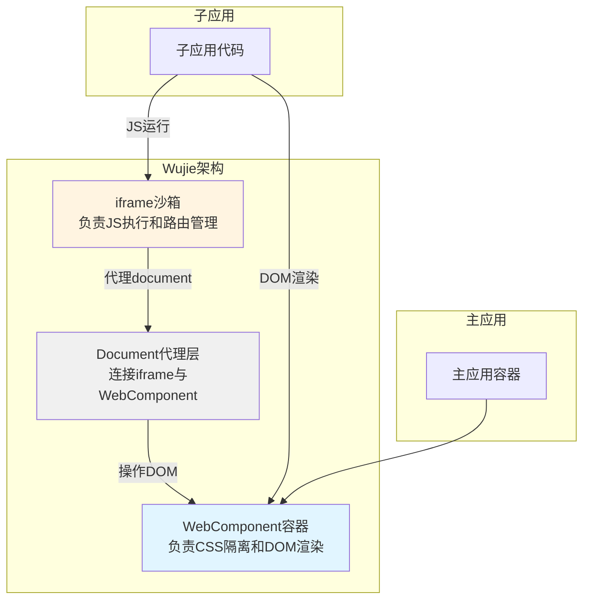
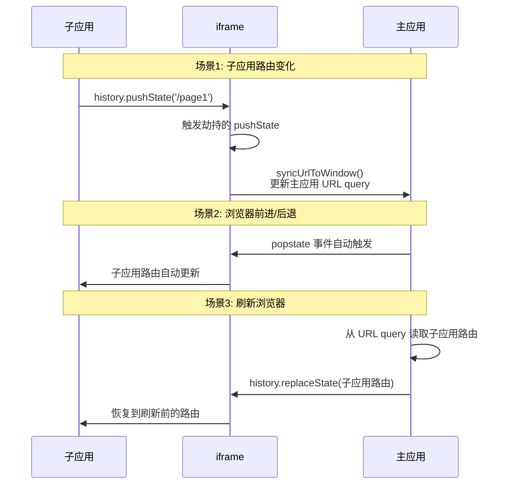
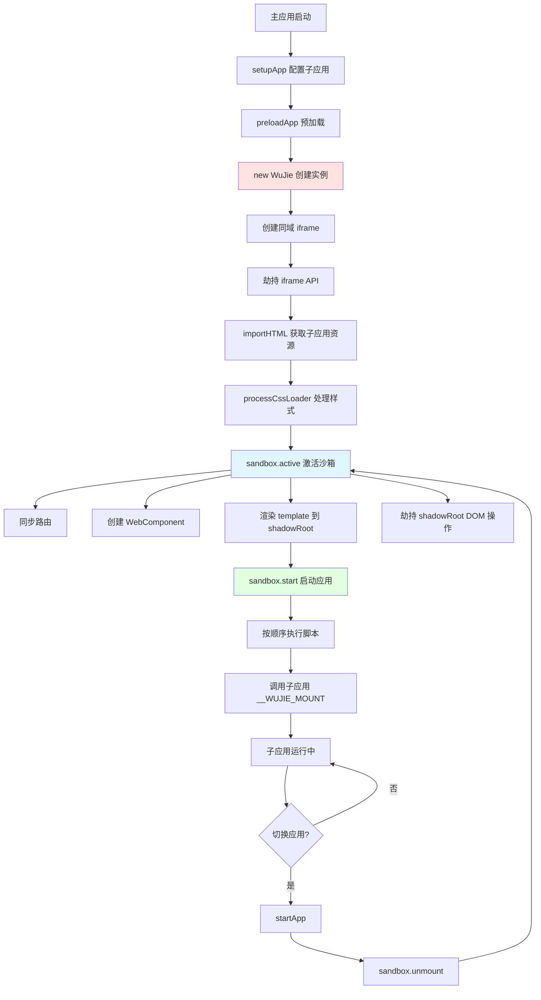
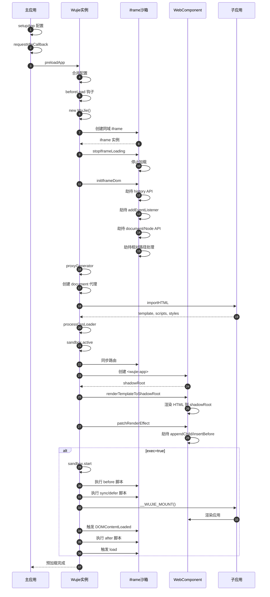
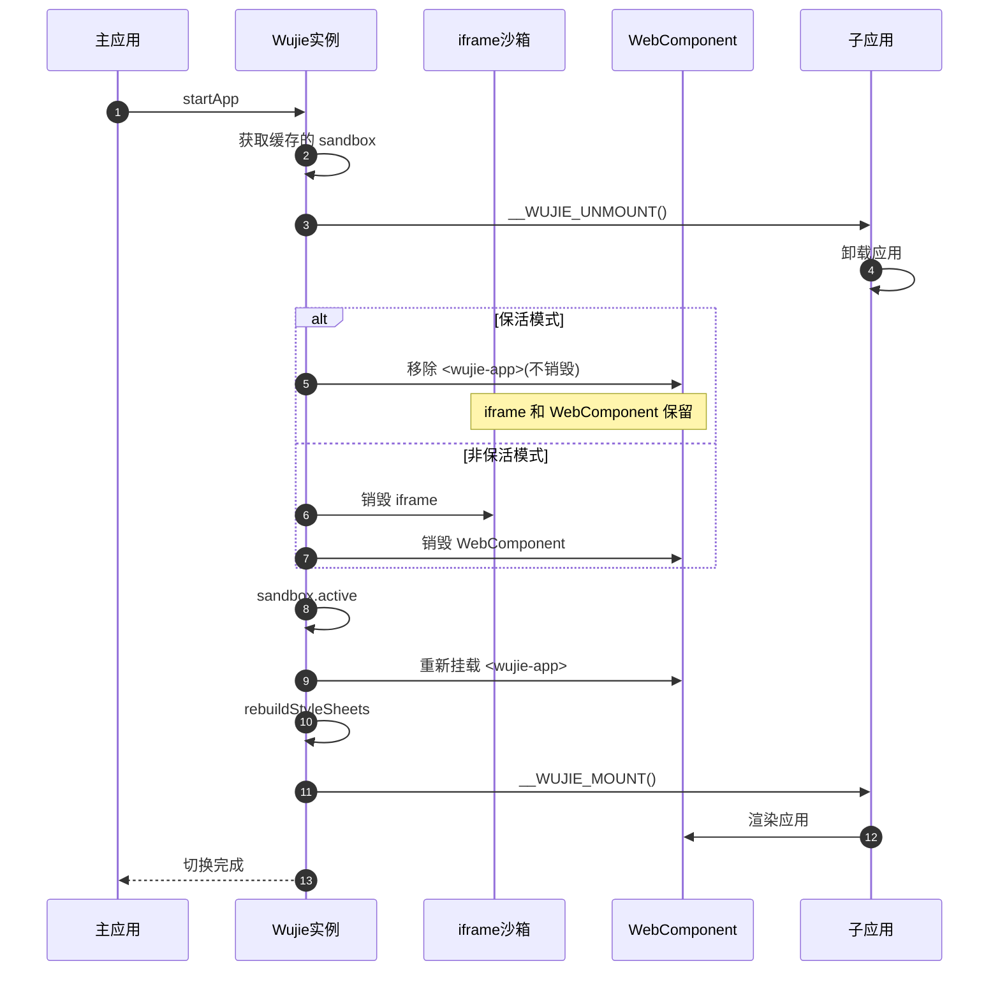

# Wujie 主流程源码深度解析

## 概述

### Wujie 是什么

Wujie(无界)是由腾讯开源的极致微前端框架,采用 **WebComponent 容器 + iframe 沙箱** 的创新架构,在保证原生隔离的前提下,完美解决了传统微前端方案在样式隔离、运行性能、子应用保活、多应用激活等方面的痛点。

### 核心设计理念

Wujie 的设计哲学可以概括为"**双沙箱 + 桥接**":



**关键创新点:**

1. **JS 在 iframe 中运行** - 获得完整的 `window`、`history`、`location` 等原生能力
2. **DOM 在 WebComponent 中渲染** - 实现样式的物理隔离
3. **通过 Proxy 桥接两者** - 让子应用感知不到这种分离

### 核心优势

| 特性              | 实现方式                    | 收益                         |
| ----------------- | --------------------------- | ---------------------------- |
| **原生 JS 隔离**  | iframe 天然沙箱             | 不污染主应用,无需清理副作用  |
| **原生 CSS 隔离** | WebComponent ShadowDOM      | 样式完全隔离,子应用无需改造  |
| **路由同步**      | 劫持 iframe history API     | 浏览器前进后退自动同步       |
| **子应用保活**    | 保留 iframe 和 WebComponent | 切换应用时状态不丢失         |
| **多应用激活**    | 组件化使用方式              | 一个页面可同时运行多个子应用 |
| **极致性能**      | 避免 with 语句              | 接近原生的执行性能           |

---

## 核心机制详解

### 1. JS 沙箱机制

#### iframe 沙箱的创建

Wujie 创建一个与**主应用同域**的 iframe 作为 JS 沙箱:

```javascript
// 简化示例
function iframeGenerator(wujie, attrs, mainHostPath, appHostPath) {
  const iframe = window.document.createElement('iframe');
  const attrStr = Object.keys(attrs)
    .map((key) => `${key}="${attrs[key]}"`)
    .join(' ');

  // 关键:创建同域iframe
  iframe.src = mainHostPath;
  iframe.setAttribute('style', 'display: none');

  window.document.body.appendChild(iframe);

  return iframe;
}
```

> [!IMPORTANT] > **为什么必须同域?** 同域 iframe 可以让主应用和子应用自由通信,同时 iframe 的 `history` 和主应用的 `history` 会共享同一个 [joint session history](https://html.spec.whatwg.org/multipage/history.html#joint-session-history),这是实现路由同步的基础。

#### Web API 劫持

创建 iframe 后,Wujie 会立即劫持其内部的关键 API:

**1. History API 劫持** (`patchIframeHistory`)

```javascript
// 劫持 pushState 和 replaceState
const rawPushState = iframeWindow.history.pushState;
iframeWindow.history.pushState = function (...args) {
  rawPushState.apply(this, args);
  // 同步子应用路由到主应用 query 参数
  syncUrlToWindow(iframeWindow);
  // 更新 base 标签
  updateBase(iframeWindow);
};
```

**2. 事件监听劫持** (`patchIframeEvents`)

```javascript
// 区分事件应该挂载到 iframe 还是 window
iframeWindow.addEventListener = function (type, handler, options) {
  // 如果是需要冒泡到 window 的事件(如 resize、scroll)
  if (needBubbleToWindow(type)) {
    window.addEventListener(type, handler, options);
  } else {
    // 普通事件挂载到 iframe
    rawAddEventListener.call(this, type, handler, options);
  }
};
```

**3. Document/Node API 劫持** (`patchDocumentEffect`, `patchNodeEffect`)

```javascript
// 劫持 appendChild、insertBefore 等方法
// 确保 DOM 操作作用于 WebComponent 而非 iframe
iframeWindow.Document.prototype.appendChild = function (node) {
  // 实际插入到 WebComponent 的 shadowRoot
  return shadowRoot.appendChild(node);
};
```

### 2. CSS 沙箱机制

#### WebComponent 容器

Wujie 定义了自定义元素 `<wujie-app>`:

```javascript
class WujieApp extends HTMLElement {
  constructor() {
    super();
    // 创建 ShadowDOM,实现样式隔离
    this.attachShadow({ mode: 'open' });
  }

  connectedCallback() {
    // 元素挂载到 DOM 时的回调
    // 初始化 shadowRoot
  }
}

// 注册自定义元素
window.customElements.define('wujie-app', WujieApp);
```

#### 样式隔离原理

WebComponent 的 ShadowDOM 提供了**物理级别**的样式隔离:

```html
<!-- 主应用 -->
<div class="container">
  <wujie-app>
    #shadow-root
    <!-- 子应用的样式只作用于这里 -->
    <style>
      .container {
        color: red;
      }
    </style>
    <div class="container">我是红色</div>
  </wujie-app>
</div>

<!-- 主应用的 .container 不受影响 -->
```

> [!TIP]
> 相比 qiankun 的样式隔离方案(动态添加/删除样式、CSS Modules、scoped CSS),WebComponent 的隔离是浏览器原生支持的,**无需任何运行时处理**,性能最优。

### 3. iframe 与 WebComponent 的桥接

这是 Wujie 最精妙的设计 - 通过 **Proxy 代理 iframe 的 document**,让其指向 WebComponent 的 shadowRoot:

```javascript
function proxyGenerator(iframe, shadowRoot) {
  const iframeWindow = iframe.contentWindow;

  // 代理 document 的查询方法
  const proxyDocument = new Proxy(iframeWindow.document, {
    get(target, prop) {
      // 将 document 的查询操作代理到 shadowRoot
      if (prop === 'querySelector') {
        return shadowRoot.querySelector.bind(shadowRoot);
      }
      if (prop === 'querySelectorAll') {
        return shadowRoot.querySelectorAll.bind(shadowRoot);
      }
      if (prop === 'getElementById') {
        return shadowRoot.getElementById.bind(shadowRoot);
      }
      if (prop === 'body') {
        return shadowRoot.querySelector('body');
      }
      if (prop === 'head') {
        return shadowRoot.querySelector('head');
      }
      // ... 其他查询方法

      return Reflect.get(target, prop);
    },
  });

  // 替换 iframe 的 document
  Object.defineProperty(iframeWindow, 'document', {
    get: () => proxyDocument,
  });
}
```

**效果:** 子应用在 iframe 中执行 `document.querySelector('.app')` 时,实际查询的是 WebComponent 的 shadowRoot!

### 4. 路由同步机制

#### 双向同步



#### 实现细节

```javascript
// 1. 子应用路由 -> 主应用 URL
function syncUrlToWindow(iframeWindow) {
  const url = iframeWindow.location.href;
  const mainUrl = new URL(window.location.href);

  // 将子应用路由存入主应用的 query 参数
  mainUrl.searchParams.set('子应用路由', url);

  // 更新主应用 URL(不刷新页面)
  window.history.replaceState(null, '', mainUrl.href);
}

// 2. 主应用 URL -> 子应用路由(刷新时恢复)
function syncUrlToIframe(iframeWindow) {
  const mainUrl = new URL(window.location.href);
  const subAppUrl = mainUrl.searchParams.get('子应用路由');

  if (subAppUrl) {
    // 恢复子应用路由
    iframeWindow.history.replaceState(null, '', subAppUrl);
  }
}
```

> [!NOTE]
> 由于 iframe 和主应用的 history 在同一个 browsing context,浏览器的前进/后退按钮会**自动**作用于子应用,无需额外处理!

### 5. 通信机制

Wujie 提供三种通信方式:

#### 方式一: Props 注入

```javascript
// 主应用
<WujieReact name="app1" url="//localhost:8001" props={{ userInfo, onLogout }} />;

// 子应用
const { userInfo, onLogout } = window.$wujie.props;
```

#### 方式二: window.parent

```javascript
// 子应用直接访问主应用(同域)
window.parent.mainAppMethod();
window.parent.globalState;
```

#### 方式三: EventBus(推荐)

```javascript
// 主应用
import { bus } from 'wujie';
bus.$on('event-from-sub', (data) => {
  console.log('收到子应用消息:', data);
});

// 子应用
window.$wujie.bus.$emit('event-from-sub', { msg: 'hello' });
```

---

## 主流程源码分析

### 整体流程概览



### 阶段一: 初始化配置

#### setupApp - 预配置子应用

```javascript
// 主应用 index.js
import { setupApp } from 'wujie';

setupApp({
  name: 'react16',
  url: '//localhost:8001',
  exec: true, // 是否立即执行
  alive: true, // 是否保活
  // 生命周期钩子
  beforeLoad: (appWindow) => console.log('加载前'),
  beforeMount: (appWindow) => console.log('挂载前'),
  afterMount: (appWindow) => console.log('挂载后'),
  // 其他配置...
});
```

**内部执行:**

```javascript
function setupApp(options) {
  const { name, ...config } = options;

  // 存入全局缓存 Map
  // 后续 preloadApp/startApp 会从这里读取配置
  idToSandboxCacheMap.set(name, {
    options: config,
    sandbox: null, // 此时还未创建 Wujie 实例
  });
}
```

### 阶段二: 预加载(preloadApp)

#### 执行时机

```javascript
// 主应用
import { preloadApp } from 'wujie';

// 通常在 requestIdleCallback 中执行
requestIdleCallback(() => {
  preloadApp({ name: 'react16' });
});
```

#### 完整流程

```javascript
async function preloadApp(options) {
  const { name } = options;

  // 1. 合并 setupApp 的配置
  const config = mergeConfig(options);

  // 2. 执行 beforeLoad 钩子
  await config.beforeLoad?.();

  // 3. 创建 Wujie 实例 ⭐
  const sandbox = new WuJie(config);

  // 4. 获取子应用 HTML
  const { template, getExternalScripts, getExternalStyleSheets } = await importHTML(config.url);

  // 5. 处理 CSS Loader
  const processedCSS = await processCssLoader(sandbox, getExternalStyleSheets, config.cssLoader);

  // 6. 激活沙箱 ⭐
  await sandbox.active({
    template,
    getExternalScripts,
    processedCSS,
  });

  // 7. 如果 exec=true,启动应用 ⭐
  if (config.exec) {
    await sandbox.start(getExternalScripts);
  }

  // 8. 更新缓存
  idToSandboxCacheMap.set(name, { sandbox, options: config });
}
```

### 阶段三: 创建 Wujie 实例

#### WuJie 构造函数

```javascript
class WuJie {
  constructor(options) {
    const { name, url, attrs, mainHostPath } = options;

    // 1. 解析子应用 URL
    const { urlElement, appHostPath, appRoutePath } = appRouteParse(url);
    this.urlElement = urlElement;
    this.appHostPath = appHostPath;
    this.appRoutePath = appRoutePath;

    // 2. 创建同域 iframe 【核心】
    this.iframe = iframeGenerator(this, attrs, mainHostPath, appHostPath, appRoutePath);

    // 3. 异步初始化 iframe DOM
    this.iframeReady = stopIframeLoading(this.iframe).then(() => {
      return initIframeDom(this.iframe, this);
    });

    // 4. 创建 Proxy 代理
    this.proxy = proxyGenerator(this.iframe, this);

    // 5. 更新缓存
    addSandboxCacheWithWujie(name, this);
  }
}
```

#### iframeGenerator - 创建 iframe

```javascript
function iframeGenerator(wujie, attrs, mainHostPath, appHostPath, appRoutePath) {
  const iframe = window.document.createElement('iframe');

  // 设置属性
  Object.keys(attrs).forEach((key) => {
    iframe.setAttribute(key, attrs[key]);
  });

  // 同域 iframe
  iframe.src = mainHostPath;
  iframe.style.display = 'none';

  // 挂载到 body
  window.document.body.appendChild(iframe);

  // 提前注入变量,防止死循环
  patchIframeVariable(iframe, wujie);

  return iframe;
}
```

#### stopIframeLoading - 停止 iframe 加载

```javascript
function stopIframeLoading(iframe) {
  return new Promise((resolve) => {
    // 轮询检查 iframe 是否已挂载
    function loop() {
      if (iframe.contentDocument !== window.document) {
        // iframe 已挂载,停止加载
        iframe.contentWindow.stop();
        resolve();
      } else {
        requestAnimationFrame(loop);
      }
    }
    loop();
  });
}
```

#### initIframeDom - 初始化 iframe DOM

这是 **Web API 劫持的核心环节**:

```javascript
function initIframeDom(iframe, wujie) {
  const iframeWindow = iframe.contentWindow;

  // 1. 初始化 base 标签(用于相对路径解析)
  initBase(iframeWindow, wujie.appHostPath);

  // 2. 劫持 history API ⭐
  patchIframeHistory(iframeWindow, wujie.appHostPath);

  // 3. 劫持事件监听 ⭐
  patchIframeEvents(iframeWindow);

  // 4. 同步子应用路由到主应用 ⭐
  syncIframeUrlToWindow(iframeWindow);

  // 5. 劫持 window 属性 ⭐
  patchWindowEffect(iframeWindow);

  // 6. 劫持 document 方法 ⭐
  patchDocumentEffect(iframeWindow);

  // 7. 劫持 Node 方法 ⭐
  patchNodeEffect(iframeWindow);

  // 8. 劫持相对路径处理 ⭐
  patchRelativeUrlEffect(iframeWindow, wujie.appHostPath);
}
```

> [!IMPORTANT] > **总结:** `new WuJie` 的核心任务是**创建同域 iframe 并立即劫持其 Web API**,为后续的沙箱运行做好准备。

### 阶段四: 激活沙箱(sandbox.active)

#### 激活沙箱执行时机

在 `preloadApp` 或 `startApp` 中调用。

#### 激活沙箱完整流程

```javascript
class WuJie {
  async active({ template, getExternalScripts, processedCSS }) {
    // 1. 等待 iframe 初始化完成
    await this.iframeReady;

    // 2. 处理自定义 fetch
    if (this.options.fetch) {
      this.iframe.contentWindow.fetch = this.options.fetch;
    }

    // 3. 同步路由
    syncUrlToIframe(this.iframe.contentWindow, this.appRoutePath);
    syncUrlToWindow(this.iframe.contentWindow);

    // 4. 创建 <wujie-app> 自定义元素
    const shadowRoot = createWujieWebComponent(this.id);
    this.shadowRoot = shadowRoot;

    // 5. 将 <wujie-app> 插入到指定容器
    // 如果是保活模式,插入到 iframe.contentDocument.body
    // 否则插入到用户指定的 el
    const container = this.alive ? this.iframe.contentDocument.body : this.el;
    renderElementToContainer(shadowRoot.host, container);

    // 6. 渲染 template 到 shadowRoot ⭐
    await renderTemplateToShadowRoot(shadowRoot, template, processedCSS, this);

    // 7. 劫持 shadowRoot 的 DOM 操作 ⭐
    patchRenderEffect(shadowRoot, this);

    // 8. 处理 CSS 规则
    patchCssRules(shadowRoot);
  }
}
```

#### renderTemplateToShadowRoot - 渲染模板

```javascript
async function renderTemplateToShadowRoot(shadowRoot, template, css, wujie) {
  // 1. 将 template 字符串转为 DOM 元素
  const html = renderTemplateToHtml(template, wujie);

  // 2. 处理 CSS Loader
  const processedHtml = await processCssLoaderForTemplate(
    html,
    css,
    wujie.options.cssBeforeLoader,
    wujie.options.cssAfterLoader,
  );

  // 3. 挂载到 shadowRoot
  shadowRoot.innerHTML = '';
  shadowRoot.appendChild(processedHtml);

  // 4. 插入一个占位 div
  const div = document.createElement('div');
  shadowRoot.appendChild(div);

  // 5. 修复 html 的 parentNode
  Object.defineProperty(processedHtml, 'parentNode', {
    get: () => null,
    configurable: true,
  });
}
```

#### renderTemplateToHtml - 模板转 DOM

```javascript
function renderTemplateToHtml(template, wujie) {
  const container = document.createElement('div');
  container.innerHTML = template;

  // 使用 TreeWalker 遍历所有节点
  const walker = document.createTreeWalker(container, NodeFilter.SHOW_ELEMENT);

  let node;
  while ((node = walker.nextNode())) {
    // 对每个元素执行修正
    patchElementEffect(node, wujie.iframe.contentWindow);

    // 修正 IMG、A、SOURCE 的相对路径为绝对路径
    fixElementCtrSrcOrHref(node, wujie.appHostPath);
  }

  return container.firstChild; // 返回 <html> 元素
}
```

#### patchRenderEffect - 劫持 shadowRoot DOM 操作

这是确保动态插入的 `<script>`、`<style>`、`<link>` 能正确处理的关键:

```javascript
function patchRenderEffect(shadowRoot, wujie) {
  const rawHeadAppendChild = shadowRoot.head.appendChild;
  const rawHeadInsertBefore = shadowRoot.head.insertBefore;

  // 劫持 head.appendChild
  shadowRoot.head.appendChild = function (node) {
    return rewriteAppendOrInsertChild('appendChild', rawHeadAppendChild, this, node, wujie);
  };

  // 劫持 head.insertBefore
  shadowRoot.head.insertBefore = function (node, refNode) {
    return rewriteAppendOrInsertChild('insertBefore', rawHeadInsertBefore, this, node, wujie, refNode);
  };

  // body 同理...
}

function rewriteAppendOrInsertChild(type, raw, parent, node, wujie, refNode) {
  // 特殊处理 SCRIPT
  if (node.tagName === 'SCRIPT') {
    return handleScriptElement(node, wujie);
  }

  // 特殊处理 STYLE
  if (node.tagName === 'STYLE') {
    return handleStyleElement(node, wujie);
  }

  // 特殊处理 LINK
  if (node.tagName === 'LINK') {
    return handleLinkElement(node, wujie);
  }

  // 其他元素正常插入
  return type === 'appendChild' ? raw.call(parent, node) : raw.call(parent, node, refNode);
}
```

> [!NOTE] > **总结:** `sandbox.active` 的核心任务是**创建 WebComponent 并渲染子应用的 HTML 模板**,同时劫持 shadowRoot 的 DOM 操作以特殊处理脚本和样式。

### 阶段五: 启动应用(sandbox.start)

#### 启动应用执行时机

在 `preloadApp(exec=true)` 或 `startApp` 中调用。

#### 脚本执行顺序

```javascript
class WuJie {
  async start(getExternalScripts) {
    // 获取所有脚本
    const scripts = await getExternalScripts();

    // 分类脚本
    const beforeScripts = []; // <script> 标签在 <body> 前
    const syncScripts = []; // 普通 <script>
    const deferScripts = []; // <script defer>
    const asyncScripts = []; // <script async>
    const afterScripts = []; // <script> 标签在 </body> 后

    scripts.forEach((script) => {
      // 根据位置和属性分类...
    });

    // 1. 执行 before 脚本
    await this.execQueue(beforeScripts);

    // 2. 执行 sync 和 defer 脚本
    await this.execQueue([...syncScripts, ...deferScripts]);

    // 3. 调用子应用的 mount 方法 ⭐
    await this.mount();

    // 4. 触发 DOMContentLoaded 事件
    this.iframe.contentWindow.dispatchEvent(new Event('DOMContentLoaded'));

    // 5. 执行 after 脚本
    await this.execQueue(afterScripts);

    // 6. 触发 load 事件
    this.iframe.contentWindow.dispatchEvent(new Event('load'));
  }

  async execQueue(scripts) {
    for (const script of scripts) {
      await insertScriptToIframe(script, this);
    }
  }
}
```

#### insertScriptToIframe - 插入脚本

```javascript
async function insertScriptToIframe(scriptResult, wujie) {
  const { src, content, module, crossorigin, crossoriginType } = scriptResult;
  const iframeWindow = wujie.iframe.contentWindow;

  if (content) {
    // 内联脚本:包裹后执行
    const script = iframeWindow.document.createElement('script');
    script.textContent = `
      ;(function(window, self, global, location) {
        ${content}
      }).bind(window.__WUJIE.proxy)(
        window.__WUJIE.proxy,
        window.__WUJIE.proxy,
        window.__WUJIE.proxy,
        window.__WUJIE.proxyLocation
      );
    `;
    wujie.shadowRoot.head.appendChild(script);
  } else {
    // 外部脚本:创建 <script src="...">
    const script = iframeWindow.document.createElement('script');
    script.src = src;
    if (module) script.type = 'module';
    if (crossorigin) script.crossOrigin = crossoriginType;

    wujie.shadowRoot.head.appendChild(script);
  }

  // 执行 afterExecScript 钩子
  await wujie.options.afterExecScript?.(scriptResult);
}
```

#### mount - 调用子应用挂载方法

```javascript
class WuJie {
  async mount() {
    // 1. beforeMount 钩子
    await this.options.beforeMount?.(this.iframe.contentWindow);

    // 2. 调用子应用的 __WUJIE_MOUNT 方法
    // 子应用需要暴露这个方法
    if (typeof this.iframe.contentWindow.__WUJIE_MOUNT === 'function') {
      await this.iframe.contentWindow.__WUJIE_MOUNT();
    }

    // 3. afterMount 钩子
    await this.options.afterMount?.(this.iframe.contentWindow);
  }
}
```

**子应用需要改造:**

```javascript
// 子应用入口文件(如 main.js)
let app = null;

// 导出 mount 和 unmount 方法
window.__WUJIE_MOUNT = () => {
  app = new Vue({
    router,
    store,
    render: (h) => h(App),
  }).$mount('#app');
};

window.__WUJIE_UNMOUNT = () => {
  app.$destroy();
  app = null;
};

// 如果不在 wujie 环境,直接挂载
if (!window.__POWERED_BY_WUJIE__) {
  window.__WUJIE_MOUNT();
}
```

> [!IMPORTANT] > **总结:** `sandbox.start` 按照正确的顺序执行子应用的脚本,并在合适的时机调用子应用的 `__WUJIE_MOUNT` 方法完成渲染。

### 阶段六: 应用切换(startApp)

#### 执行流程

```javascript
async function startApp(options) {
  const { name } = options;

  // 1. 获取缓存的 sandbox
  const { sandbox, options: cachedOptions } = idToSandboxCacheMap.get(name);

  // 2. 合并配置
  const config = mergeConfig(cachedOptions, options);

  // 3. 卸载当前子应用
  await sandbox.unmount();

  // 4. 重新激活沙箱
  await sandbox.active({
    template: sandbox.template,
    getExternalScripts: sandbox.getExternalScripts,
    processedCSS: sandbox.processedCSS,
  });

  // 5. 重建样式表
  sandbox.rebuildStyleSheets();

  // 6. beforeMount 钩子
  await config.beforeMount?.(sandbox.iframe.contentWindow);

  // 7. 调用子应用的 __WUJIE_MOUNT
  await sandbox.iframe.contentWindow.__WUJIE_MOUNT?.();

  // 8. afterMount 钩子
  await config.afterMount?.(sandbox.iframe.contentWindow);
}
```

#### unmount - 卸载应用

```javascript
class WuJie {
  async unmount() {
    // 1. beforeUnmount 钩子
    await this.options.beforeUnmount?.(this.iframe.contentWindow);

    // 2. 调用子应用的 __WUJIE_UNMOUNT
    await this.iframe.contentWindow.__WUJIE_UNMOUNT?.();

    // 3. 如果是保活模式,保留 iframe 和 WebComponent
    if (this.alive) {
      // 将 <wujie-app> 从容器中移除,但不销毁
      this.shadowRoot.host.remove();
    } else {
      // 非保活模式:销毁 iframe 和 WebComponent
      this.iframe.remove();
      this.shadowRoot.host.remove();
    }

    // 4. afterUnmount 钩子
    await this.options.afterUnmount?.(this.iframe.contentWindow);
  }
}
```

> [!TIP] > **保活模式的优势:** 切换应用时,iframe 和 WebComponent 都保留下来,子应用的状态(如 Vue 的 data、React 的 state)不会丢失。下次切换回来时,直接将 `<wujie-app>` 重新挂载即可,实现了类似 `<keep-alive>` 的效果。

---

## 完整执行流程图

### 预加载流程(preloadApp)



### 应用切换流程(startApp)



---

## 关键技术点总结

### 1. 为什么选择 iframe + WebComponent?

| 需求     | iframe 的贡献                          | WebComponent 的贡献           |
| -------- | -------------------------------------- | ----------------------------- |
| JS 隔离  | ✅ 天然的 window 沙箱                  | -                             |
| CSS 隔离 | ❌ iframe 内的样式无法作用于主应用 DOM | ✅ ShadowDOM 物理隔离         |
| DOM 渲染 | ❌ iframe 内的 DOM 无法与主应用融合    | ✅ 可以渲染在主应用的任意位置 |
| 路由管理 | ✅ 完整的 history/location API         | -                             |
| 性能     | ✅ 避免 with 语句,接近原生性能         | ✅ 浏览器原生支持             |

**结论:** iframe 负责 JS 执行和路由,WebComponent 负责 DOM 渲染和样式隔离,两者通过 Proxy 桥接,取长补短!

### 2. 同域 iframe 的关键作用

- **通信便利:** 主子应用可以通过 `window.parent` 自由通信
- **路由同步:** iframe 的 history 和主应用的 history 在同一个 browsing context,浏览器前进后退自动同步
- **性能优势:** 避免了跨域 iframe 的 postMessage 开销

### 3. Document 代理的精妙设计

通过代理 iframe 的 `document`,让子应用的 DOM 操作实际作用于 WebComponent 的 shadowRoot:

```javascript
// 子应用代码
document.querySelector('#app');
// 实际执行: shadowRoot.querySelector('#app')

document.body.appendChild(div);
// 实际执行: shadowRoot.querySelector('body').appendChild(div)
```

子应用**完全感知不到**自己运行在 iframe 中,无需任何改造!

### 4. 保活模式的实现

```javascript
// 切换应用时
if (alive) {
  // 只移除 DOM,不销毁实例
  wujieApp.remove();
  // iframe 和 WebComponent 都保留
} else {
  // 销毁所有资源
  iframe.remove();
  wujieApp.remove();
}

// 切换回来时
if (alive) {
  // 直接重新挂载
  container.appendChild(wujieApp);
  // 状态完全保留!
}
```

### 5. 性能优化手段

- **预加载:** 提前创建 iframe 和加载资源
- **预执行:** 提前执行脚本,切换时秒开
- **资源缓存:** template、scripts、styles 都会缓存
- **按需加载:** 支持懒加载子应用
- **共享依赖:** 可以配置 externals 共享公共库

---

## 与其他方案对比

| 特性       | Wujie                    | qiankun            | micro-app       | iframe              |
| ---------- | ------------------------ | ------------------ | --------------- | ------------------- |
| JS 隔离    | ✅ iframe 原生隔离       | ⚠️ Proxy 沙箱      | ⚠️ Proxy 沙箱   | ✅ 原生隔离         |
| CSS 隔离   | ✅ WebComponent 原生隔离 | ⚠️ 动态样式        | ✅ WebComponent | ✅ 原生隔离         |
| 路由同步   | ✅ 自动同步              | ⚠️ 需手动处理      | ⚠️ 需手动处理   | ❌ 难以同步         |
| 子应用保活 | ✅ 原生支持              | ⚠️ 需额外处理      | ✅ 原生支持     | ✅ 天然保活         |
| 多应用激活 | ✅ 支持                  | ❌ 不支持          | ✅ 支持         | ✅ 支持             |
| 性能       | ✅ 接近原生              | ⚠️ with 语句有损耗 | ✅ 较好         | ⚠️ 有一定开销       |
| 弹窗问题   | ✅ 自动处理              | ❌ 需手动处理      | ✅ 自动处理     | ❌ 弹窗在 iframe 内 |
| 适配成本   | ✅ 极低                  | ⚠️ 需改造          | ✅ 较低         | ❌ 体验差           |

---

## 总结

Wujie 通过 **iframe + WebComponent + Proxy** 的创新架构,实现了:

1. **原生级别的隔离** - JS 和 CSS 都是浏览器原生隔离,无需运行时处理
2. **极致的性能** - 避免 with 语句,执行性能接近原生
3. **完美的路由同步** - 利用 joint session history,浏览器前进后退自动同步
4. **强大的保活能力** - 切换应用时状态不丢失
5. **极低的适配成本** - 子应用几乎无需改造

这些特性使得 Wujie 成为 2025 年最值得关注的微前端框架之一,特别适合对隔离性、性能、用户体验要求较高的企业级应用。

**核心设计思想:** 让 iframe 和 WebComponent 各司其职,通过 Proxy 无缝桥接,既保留了 iframe 的隔离优势,又避免了其体验缺陷,堪称微前端架构的"最优解"。
