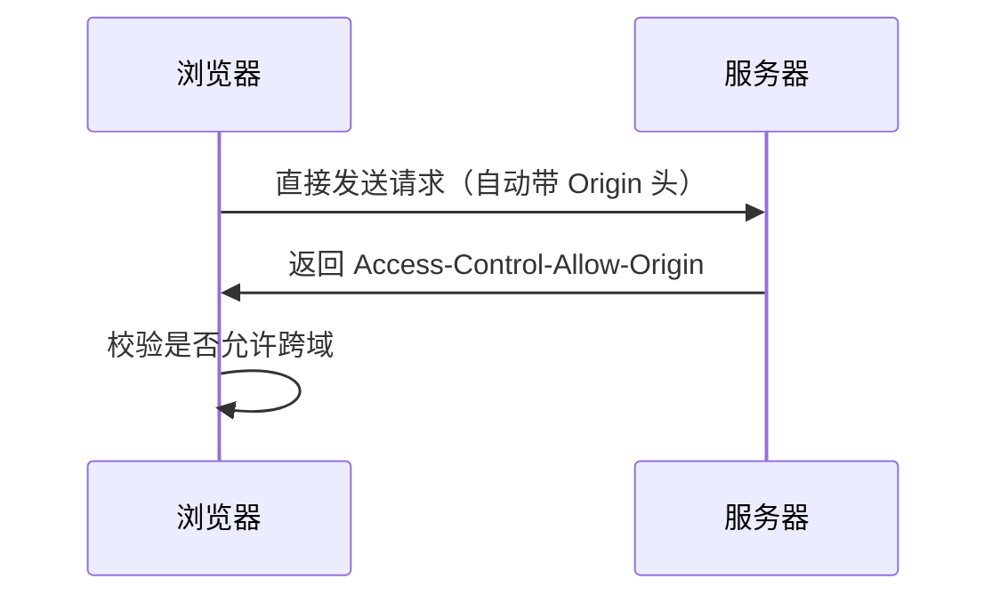
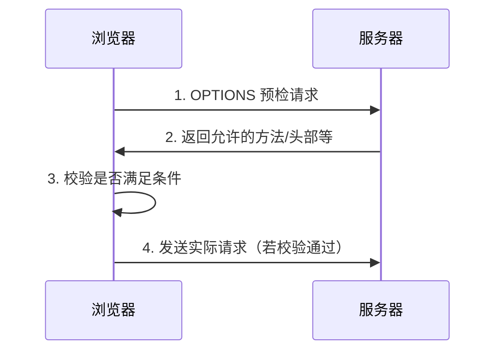

# Cookie 测试分析

## Cookie 的生命周期

### 会话期 Cookie

会话期 Cookie 会在当前会话结束时删除。浏览器自行定义"当前会话"的结束时间，部分浏览器在重启时会使用**会话恢复**功能，这可能导致会话 Cookie 无限延长。

### 持久性 Cookie

持久性 Cookie 在以下两种情况之一发生时被删除：

- 到达 `Expires` 属性指定的过期日期
- 超过 `Max-Age` 属性指定的有效期（单位：秒）

## 同源与跨站的区别

### 同源（Same-Origin）

同源策略要求**协议、域名和端口**三者完全相同。

示例：`https://example.com:443` 与 `https://example.com:443` 是同源

### 跨站（Cross-Site）

跨站的判定标准更宽松，由**可注册域名 + 协议**确定。即二级域名或端口不同也属于同一站点。

示例：

- `https://a.example.com` 与 `https://b.example.com` 是同站点
- `https://example.com:3000` 与 `https://example.com:8080` 是同站点

::: tip
Cookie 的 `SameSite` 属性指的就是"同站点"，而非"同源"。
:::

## Chrome 对 Cookie 的重要变更

- **Chrome 80**：将 Cookie 的 `SameSite` 属性默认值从 `None` 改为 `Lax`
- **2024 Q1**：Chrome 开始对 1% 的用户禁用第三方 Cookie（逐步推进中）

## 同源策略（Same-Origin Policy）

同源策略是浏览器的核心安全机制，限制了不同源之间的文档或脚本交互。

### 受同源策略影响的功能

1. **XMLHttpRequest / Fetch API**

   - 默认只能向同源服务器发起请求
   - 跨域请求需要通过 CORS（跨域资源共享）实现

2. **DOM 访问**

   - 不同源的文档无法访问彼此的 DOM 元素

3. **Cookie**

   - 浏览器为每个源独立存储 Cookie
   - 不同源之间无法直接访问彼此的 Cookie

4. **Storage API**

   - `localStorage` 和 `sessionStorage` 只能被同源脚本访问

5. **iframe 嵌入**

   - 嵌入的 iframe 无法访问父文档内容（除非同源）

6. **IndexedDB**

   - 只有同源脚本才能访问对应的数据库

7. **Service Workers**

   - 只能拦截和处理同源请求

8. **Web Workers**

   - 只能加载同源脚本

9. **跨窗口通信**
   - 虽然 `window.postMessage` 允许跨域通信，但需要验证消息来源

### 跨域解决方案

尽管同源策略提高了安全性，但实际开发中常需要跨域访问。常见解决方案：

- **CORS**（跨域资源共享）：最标准和推荐的方式
- **JSONP**：利用 `<script>` 标签不受跨域限制的特性（仅支持 GET）
- **代理服务器**：通过同源服务器转发请求

## CORS 详解

CORS 由**服务器**决定是否允许跨域请求。请求分为两类：

### 简单请求

#### 判定规则

同时满足以下所有条件：

1. **请求方法**：`GET`、`HEAD` 或 `POST`
2. **Content-Type**（仅针对 POST）：
   - `application/x-www-form-urlencoded`（表单提交，URL 编码）
   - `multipart/form-data`（文件上传）
   - `text/plain`（纯文本）
3. **请求头**：无自定义 Header

#### 请求流程



1. 浏览器直接发送请求，请求头自动携带 `Origin`（包含协议、域名、端口）
2. 服务器检查 `Access-Control-Allow-Origin` 配置：
   - 匹配请求来源或设置为 `*`：允许跨域
   - 不匹配：浏览器报错

#### Cookie 携带规则

| 服务端设置                                    | 客户端设置               | 结果                                        |
| --------------------------------------------- | ------------------------ | ------------------------------------------- |
| 未设置 `Access-Control-Allow-Credentials`     | `credentials: 'include'` | ❌ 跨域报错，但 Cookie 会携带且服务器能收到 |
| 设置 `Access-Control-Allow-Credentials: true` | `credentials: 'include'` | ✅ Cookie 正常携带                          |

### 非简单请求（预检请求）

不满足简单请求条件的都是非简单请求，如：

- 使用 `PUT`、`DELETE`、`PATCH` 等方法
- `Content-Type` 为 `application/json`
- 携带自定义请求头

#### 非简单请求流程



#### 预检请求（OPTIONS）

请求头包含：

- `Origin`：请求来源
- `Access-Control-Request-Method`：实际请求将使用的方法
- `Access-Control-Request-Headers`：实际请求将携带的自定义头
- **不包含 Cookie**

响应头：

- `Access-Control-Allow-Origin`：允许的来源
- `Access-Control-Allow-Methods`：允许的方法（默认 `GET`、`HEAD`、`POST`）
- `Access-Control-Allow-Headers`：允许的自定义头
- `Access-Control-Max-Age`：预检结果缓存时间
- `Access-Control-Allow-Credentials`：是否允许携带凭证

响应状态码通常为 `204 No Content`

#### 非简单请求的 Cookie 携带规则

必须**同时满足**以下条件才能携带 Cookie：

- 服务端设置 `Access-Control-Allow-Credentials: true`
- 客户端设置 `credentials: 'include'`

## Cookie 规则详解

### 5 条核心规则

1. **携带规则**
   客户端只能携带**请求 URL 所在域及其父域**的 Cookie

2. **读写规则**
   客户端 JavaScript 只能读写**当前页面 URL 所在域及其父域**的 Cookie

3. **非跨域资源请求**

   - ``、`<link>`、`<script>` 等标签发起的 GET 请求会携带对应域的 Cookie
   - 图片请求不受跨域限制（CORS）
   - Canvas 使用跨域图片时受限？（需设置 `crossorigin` 属性）

4. **服务端设置规则**
   服务器只能为**自己所在域或父域**设置 Cookie

   示例：`m.qq.com` 的服务器只能设置 `Domain` 为：

   - `.m.qq.com`（当前域）
   - `.qq.com`（父域）

5. **SameSite 默认行为**
   Chrome 80+ 默认 `SameSite=Lax`：
   - 跨站请求默认不携带 Cookie
   - 服务器的 `Set-Cookie` 在跨站场景下无效
   - 响应头会显示，但浏览器不会存储


## Cookie 在不同场景下的行为

### 同源场景

✅ 执行规则 1、规则 4

### 跨域（不同源）场景

#### 未设置 CORS

| 请求类型   | 行为                                                      |
| ---------- | --------------------------------------------------------- |
| 简单请求   | ❌ 浏览器报错<br>✅ 但仍执行规则 1、4、5（Cookie 会携带） |
| 非简单请求 | ❌ 直接报错，不发送实际请求                               |

#### 设置 CORS

| 服务端 Credentials | 客户端 credentials | 结果                                                                                  |
| ------------------ | ------------------ | ------------------------------------------------------------------------------------- |
| ❌ 未设置          | ✅ `include`       | ❌ 报错                                                                               |
| ✅ `true`          | ❌ 未设置          | ✅ 不报错<br>❌ 不携带 Cookie<br>❌ `Set-Cookie` 无效<br>⚠️ Chrome 开发者工具显示错误 |
| ✅ `true`          | ✅ `include`       | ✅ 正常工作<br>✅ 执行规则 1、4、5                                                    |

## Cookie 访问权限对照表

以 `m.qq.com` 为当前页面，测试对不同域的 Cookie 访问：

| 操作                             | .m.qq.com | .qq.com | .sub.m.qq.com | .n.qq.com | x.com |
| -------------------------------- | --------- | ------- | ------------- | --------- | ----- |
| **GET/POST 请求自动携带 Cookie** | ✅        | ❌      | ❌            | ❌        | ❌    |
| **服务器读写 Cookie**            | ✅        | ✅      | ❌            | ❌        | ❌    |
| **JavaScript 读写 Cookie**       | ✅        | ✅      | ❌            | ❌        | ❌    |
| **HTML 加载图片资源**            | ✅        | ✅      | ✅            | ✅        | ✅    |
| **加载图片时携带 Cookie**        | ✅        | ✅      | ✅            | ✅        | ✅    |
| **JavaScript 读取图片数据**      | ✅        | ✅      | ✅            | ✅        | ✅\*  |

\* 跨域图片需要设置 CORS 才能被 Canvas 读取像素数据

## 最佳实践建议

### 安全设置

1. **使用 SameSite 属性**

   ```http
   Set-Cookie: sessionid=xxx; SameSite=Strict; Secure; HttpOnly
   ```

2. **敏感 Cookie 设置 HttpOnly**
   防止 XSS 攻击窃取 Cookie

3. **HTTPS 环境使用 Secure 标志**
   确保 Cookie 只通过 HTTPS 传输

### CORS 配置

1. **避免使用通配符 `*`**
   明确指定允许的来源

2. **谨慎开启 Credentials**
   只在必要时允许携带凭证

3. **设置合理的 `Max-Age`**
   减少预检请求次数，提升性能

### 调试技巧

1. **Chrome DevTools**

   - Network 面板查看请求头/响应头
   - Application 面板查看 Cookie 存储
   - Console 查看 CORS 错误详情

2. **常见错误排查**
   - Cookie 未携带：检查 Domain、SameSite、CORS 配置
   - Set-Cookie 失效：检查 SameSite、跨站场景、Secure 标志

## 参考资料

- [MDN - HTTP Cookies](https://developer.mozilla.org/zh-CN/docs/Web/HTTP/Cookies)
- [MDN - 同源策略](https://developer.mozilla.org/zh-CN/docs/Web/Security/Same-origin_policy)
- [MDN - CORS](https://developer.mozilla.org/zh-CN/docs/Web/HTTP/CORS)
- [Chrome SameSite 更新说明](https://www.chromium.org/updates/same-site/)
